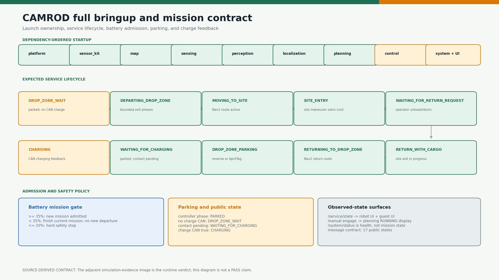
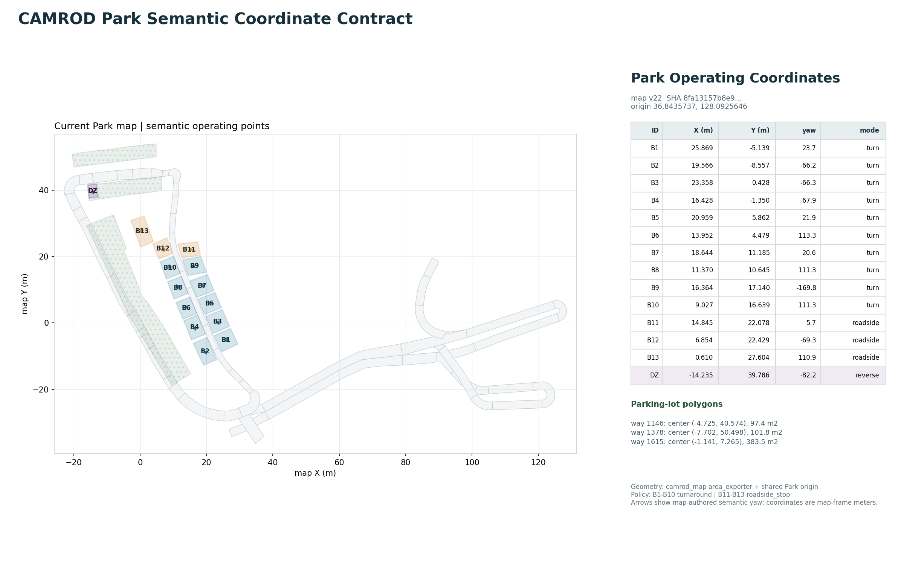
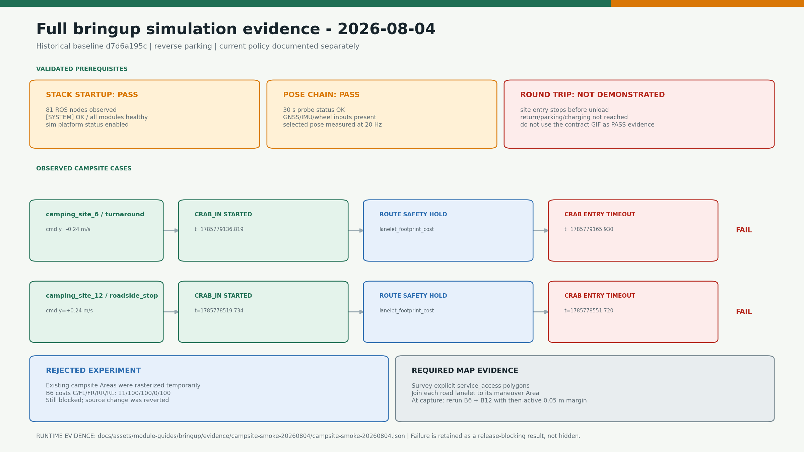
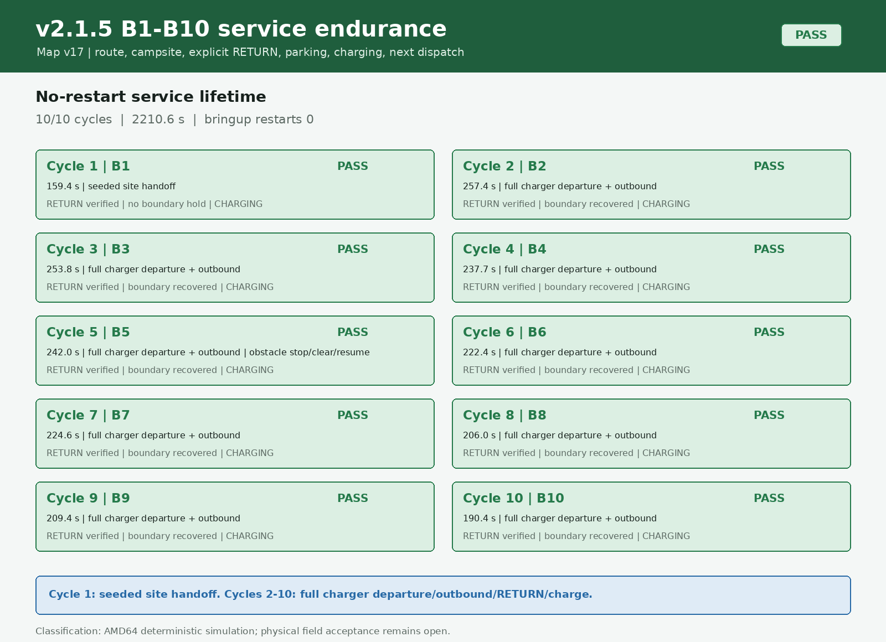
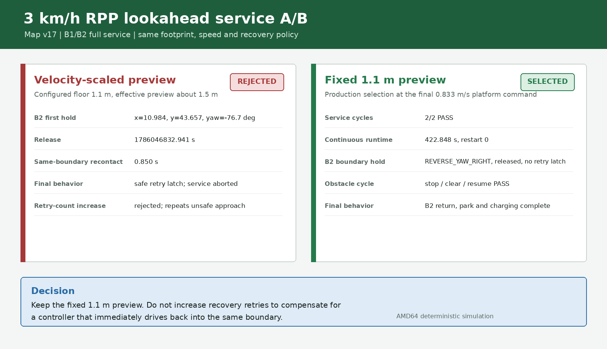

# CAMROD

<!-- HH_260806 - Use the fabrication-inclusive measured body as the active
hard-stop envelope and retain earlier reduced-boundary runs as historical evidence. -->
<!-- HH_260806 - Replace the GNSS center placeholder with the measured
left-antenna lever arm and heading-aware center correction. -->
<!-- HH_260807 - Add map-v17 repeated service, B2 recovery, and persistent-obstacle evidence. -->
<!-- HH_260807 - Add the final B1-B10 no-restart endurance result and fixed
1.1 m preview/route-snap return acceptance. -->
<!-- HH_260807 - Synchronize the v2.1.6 field contract: GNSS 5 Hz, localization
20 Hz, LiDAR 10 Hz, 2 km/h cruise, 10 cm boundary, and bounded recovery retries. -->
<!-- HH_260810 - Publish the v2.1.7 shared tapered/rounded boundary,
goal-independent UI readiness, reproducible package evidence, and tool layout. -->
<!-- HH_260810 - Re-export Park operating coordinates from the user-edited
map source and require settled yaw before campsite/drop-zone translation. -->
<!-- HH_260810 - Make the managed operator map the default manual-goal surface
and keep RViz as an explicit maintenance-only launch option. -->
<!-- HH_260818 - Record stationary longitudinal/parallel steering transitions,
axis-staged campsite exit, repeated bounded recovery, and class-only 2 m fusion stop. -->
<!-- HH_260818 - Rebind the unchanged Park operating coordinates to the
worak-test map-v22 identity without rewriting the user-authored OSM. -->
<!-- HH_260818 - Publish v2.1.8 with exact campsite crab, bounded repeated
recovery, semantic fusion/radar safety, and an opt-in tent occupancy guard. -->
<!-- HH_260818 - Separate normal Dual-Ackermann from intentional crab, use one
campsite anchor across restarts, and expose manual return/docking telemetry. -->
<!-- HH_260819 - Serialize both operator Return controls, validate B1-B13 full
site exit, and record the no-zero-turn roadside forward-loop policy. -->
<!-- HH_260819 - Move the replacement dual GNSS deployment to 10 Hz/100 ms,
DN05Y9E7, and 460800 baud; require physical RTCM and heading evidence. -->
<!-- HH_260825 - Publish v2.2.1 with current-lane campsite Return handoff,
stopped charger-departure dwell, and a wider route-clipped front radar gate. -->
<!-- HH_260904 - Publish v2.2.3 with authoritative radar-cost telemetry,
exact drop-zone parking-point correction, and B1-B13 service metrics. -->

ROS 2 Humble autonomous delivery robot stack for a Dual-Ackermann, crab, and
zero-turn Ranger platform. Current runtime baseline: **`v2.2.3`**.



## Actual Simulation Runtime


`SIM RUNTIME CAPTURE`: live `sim:=true rviz:=true` B6 graph showing the
lanelet map, robot, sensing layers, localization, and global/local planning
paths. This is not a generated diagram or a real-robot field claim.

## At A Glance

| Uses | Core function | Main outputs |
|---|---|---|
| ROS 2 Humble, Nav2, Lanelet2, robot_localization | Camping-site dispatch, navigation, local maneuver, parking, and charging lifecycle | `/service/state`, `/planning/state`, `/control/cmd_vel_ros`, `/system/status` |
| Vanjee LiDAR, 7 radars, dual GNSS, IMU, front/rear cameras | Sensor normalization, obstacle costs, localization, and perception | `/planning/cost_grid/inflation`, `/localization/pose`, `/perception/obstacles` |
| Robot UI and Guest UI | Mission commands, map-selected manual goals, lifecycle display, safety hold, and diagnostics | `/goal_pose`, `/ui/selected_destination`, `/planning/mission_key`, operation requests |

## Current Values

<!-- HH_260809 - Record the shared tapered-front, rounded-corner boundary
contract used by visualization, Nav2, and the final command safety gate. -->

| Item | Active value | Meaning |
|---|---:|---|
| Navigation frame | `robot_center_link` | Axle midpoint used by localization, planning, control, and platform |
| GNSS position reference | left antenna `(0,+0.45,0) m` | Fresh dual-GNSS yaw rotates the lever arm; a GNSS-anchored EKF yaw delta may bridge at most `0.5 s` without making GNSS yaw valid |
| GNSS receiver cadence | `10 Hz` (`100 ms` epoch) | The canonical YAML configures the rover on launch; moving-base RTCM/link/heading acceptance remains a separate physical test |
| Localization pose cadence | `20 Hz` | EKF predicts between GNSS corrections; this is not a claim that GNSS itself publishes at 20 Hz |
| Physical body boundary | `1.39160 x 1.07000 m` bounding extents | Tapered front (`0.12 m` side inset over `0.12 m` depth), six rounded corners (`R0.05 m`); cost-100 overlap stops ordinary motion |
| Planning boundary | `1.59160 x 1.27000 m` bounding extents | Exact `0.10 m` parallel offset of the body contour (`R0.15 m`); endpoint planning clearance remains mandatory for escape |
| Base platform dimensions | `1.19160 x 0.87000 m` | Chassis-only value retained separately from the fabrication-inclusive collision envelope |
| New mission SOC | `>= 35%` | New campsite departure is admitted |
| Hard safety stop | `<= 20%` | Final command output is stopped |
| Planner/controller | `LaneletRoute + RPP` | Full-bringup default |
| Planner load set | `LaneletRoute + SmacLattice` | Fallback constructs only for a width-gated obstacle replan |
| Controller load set | `RPP + RotationShim` | Mission tracking plus manual clicked-yaw handling |
| Straight cruise | `2.000 km/h` (`0.555556 m/s` final) | Raw RPP `1.111111 m/s` passes through the retained `0.5` command gate |
| Obstacle fallback hold | `20.0 s` | Safety stop is immediate; only planner preemption waits |
| Classified fusion stop | route-front `2.0 m`, detection age `<=0.50 s` | Only current YOLO-class-associated camera-LiDAR points stop the active path; unknown/raw LiDAR points do not |
| Active Lanelet map | `map_version=22`, SHA `8fa131...e59` | User-edited runtime OSM; named copies are user snapshots and are not auto-synchronized |
| RPP preview A/B | bringup velocity-scaled `1.5-3.5 m`; package fixed `1.2 m` | Deliberate `worak-test` field A/B divergence; do not treat package YAML as the deployed mirror yet |
| Recovery attempt | `0.10 m/s`, `0.10 rad/s`, `12 deg`, `0.40 m`, `10 s` | One projected crab/reverse/reverse-yaw stage |
| Recovery episode | up to `50` attempts, `1.50 m`, `90 s`, `0.5 s` retry pause | Fresh candidates are retried; the first attempt no longer creates a permanent hold |
| Recovery retry guard | `50 releases/contact region`, reset after `0.75 m` forward progress | At budget, same-direction Nav2 resume stays blocked; projected inward escape and all hard safety checks remain active |
| Normal/crab mode selection | `|linear.y| <= 0.02 m/s` stays Dual-Ackermann | Nav2 lateral residue cannot select parallel motion; campsite/recovery commands remain explicit crab |
| Campsite crab geometry | pure `linear.y`; translate only within `0.05 rad` of `+/-90 deg` | Longitudinal/parallel wheel-mode changes settle while stationary; exit removes lateral error before straight drift |
| Campsite return handoff | live lanelet projection `<=0.15 m` (latched), or completed lateral exit; stopped hold `1.20 s` | Return routing starts from the current lane position; crab-out never reverses longitudinally to the historical entry XY |
| Campsite service policy | B1-B10 `turnaround`; B11-B13 `roadside_stop` | B11-B13 cap lateral travel at `0.30 m`, skip every zero-turn, finish `CRAB_OUT`, then use a forward one-way return loop |
| Tent occupancy admission | guard default `false` | One bringup toggle enables UI/control pre-entry blocking; an already committed site maneuver is not interrupted |
| Campsite yaw completion | `0.8 s` continuously within tolerance and `<= 3 deg/s` | Crab/forward translation cannot begin from a single transient yaw sample |
| Drop-zone parking handoff | snapped lanelet point `<=0.05 m`, `0.5 s` position hold, then yaw `1.0 s` within tolerance and `<=3 deg/s` | Automatic parking reaches the mission-correlated perpendicular centerline projection before the 90-degree turn and straight reverse |
| Parking methods | `reverse`, `apriltag` | Exactly one final parking controller is selected |
| Final parking slowdown | reverse last `0.30 m`; AprilTag camera range `0.80 -> 0.40 m` | Linear ramp to `0.138889 m/s` raw; charging CAN immediately commands zero |
| LiDAR processing | raw/filtered target `10 Hz`; classified fusion raster default `ON` | `/sensing/cost_grid/lidar` is a legacy topic name for camera-LiDAR semantic points; direct raw-LiDAR cost remains `OFF` |
| Radar profile | FRONT1/2 + four side channels `ON`; REAR quarantined | FRONT1/2 retain body exclusions but stop candidates end at the absolute `0.300 m` sensor-face range; side cutoffs remain absolute `0.100 m`; UI `ECHO` is raw range while only post-filter `COST` can stop motion |
| Charging mission start | `7.0 s` stopped dwell | A campsite selection is queued while charging; manual, mission, and platform gates stay closed until one station `EXIT` is released |
| Operator renderer | WebKit | Fullscreen field default; Chromium and `auto` remain explicit alternatives |
| Operator telemetry | 12-second leased views; 4-11 subscriptions per active view | Seven views now include docking debug/tag/path/charging beside the six RViz replacement surfaces |
| Service evidence | B1-B13 completed-run averages plus latest/current run | One graph and table show distance, elapsed time, attempts, completion rate, and current values relative to completed averages |
| Operator Return | one `/ui/manual_return` authority; `0.50 s` preemption hold | Both visible Return controls cancel outbound Nav2, close motion authorization, then publish exactly one fresh drop-zone recall |
| RViz launch default | `OFF` | Normal operation uses the managed UI; `rviz:=true` remains an engineering override |
| ROS transport | component intra-process; physical-LiDAR SHM opt-in | DDS-SHM is scoped to the LiDAR driver group and never exported to the full graph |
| System health tools | `4` nodes in `system_core_container` | Stable aggregate/status chain; standalone fallback remains available |
| System checker topology | `24` checkers in `4` serialized containers | Fault domains remain separate; standalone fallback remains available |
| Nav2 process topology | planner/controller scoped container | Vendor smoother/behavior/BT/lifecycle executables stay standalone |

Configured values are not performance measurements. Package tables below mark
runtime evidence separately.

## Operator Telemetry


The original six actual `1600x1000` browser views had zero
document/workspace/text overflow. The seventh docking view was captured from
the production build with schema v3 and seven lazy subscriptions. View leases
reduce the former 32 always-on subscriptions to `6/11/4/7/9/7/7`;
a GNSS view reopened after proximity reported GNSS/IMU `10.01 Hz` and selected
pose `20.02 Hz` after one second. The AMD64 backend-only profile is bounded but
is not ARM64 acceptance: the production 8-core/16-GB Jetson still requires a
30-minute live-camera/tab-cycle resource and frame-pacing test.
The current full-graph A/B replaced permanent 10 Hz lease polling with an
event-driven ROS guard plus a 1 Hz abandoned-lease timer. On the same AMD64
45-process idle graph it changed total CPU `81.88 -> 80.78%` (one-core basis),
UI CPU `6.93 -> 6.53%`, and summed RSS `1955.6 -> 1938.7 MiB`; visible telemetry
remains 10 Hz. A separate live B6 outbound run requested Return after `2.019 m`:
output reached zero in `5.01 ms`, stayed zero through the `0.10-0.45 s` barrier,
emitted one recall at `0.508 s`, and produced a fresh `2.133 m` reverse path.
These figures are comparison evidence, not Jetson acceptance.


The administrator operator trajectory view now also provides the normal
`2D Goal Pose` workflow: select a map position, drag for yaw, review the exact
`map` coordinates, and confirm departure. The backend applies readiness,
service-owner, charging, and `>=35%` SOC gates before publishing `/goal_pose`.
RViz is therefore not started for normal simulation or field bringup.

## Current Boundary Visual

<!-- HH_260810 - Show the active source-derived contour and its rigid-body
motion separately from historical rectangular runtime evidence. -->


The PNG is generated from `camrod_sensor_kit/config/robot_params.yaml` and must
match both Nav2 footprints. The GIF shows rigid transforms around
`robot_center_link`; it is not a ROS collision/recovery or physical-drive PASS.
See the [source-derived record](docs/assets/module-guides/sensor-kit/test-results/tapered-rounded-boundary-20260810/README.md).

### Current Park Operating Coordinates



The [current map-derived record](docs/assets/module-guides/map/test-results/park-operating-points-20260810/README.md)
binds B1-B13, the drop zone, and three parking-lot Areas to active map v22 SHA
`8fa131...e59`. Runtime YAML mirrors use the exported coordinates while the
service policy remains B1-B10 `turnaround` and B11-B13 `roadside_stop`.

### Measured Road Simulation

<!-- HH_260810 - Show the same current contour on a measured ROS road run while
keeping physical-road acceptance explicitly out of scope. -->


The [historical map-v17 ROS simulation record](docs/assets/module-guides/control/test-results/tapered-rounded-boundary-road-sim-20260810/README.md)
contains 511 poses from a `29.700 s` B2 run. The physical body remained clear,
the planning contour reached cost 100, bounded `REVERSE_YAW_RIGHT` moved
`0.0972 m` with `-4.545 deg` yaw change, and the original route completed with
no second hold. This is not physical-road evidence.

## Latest Evidence

| Check | Result | Scope |
|---|---|---|
| v2.2.3 radar/docking/metrics hardening | **AMD64 BUILD/TEST PASS** | Side `0.10 m` cost authority separated from raw `0.43 m` echo; exact drop-zone point correction added; B1-B13 metrics rendered; native 144 results and Python 166 tests passed |
| v2.2.1 campsite/charging/radar handoff | **AMD64 ROS SIM PASS** | B8 handed off at `0.140 m` from live lanelet projection while old anchor remained `0.231 m` away; charging recall held `6.996 s`; FRONT1 `0.300 m` produced cost `95` |
| v2.2.1 selected build/tests | **BUILD PASS / BASELINE TEST DEBT** | Isolated Release build `5/5`; focused contracts `65/65`; full isolated run reports 6 failing bringup targets from inherited parking-mirror/test drift plus worktree/Pillow environment limits |
| Historical tapered/rounded B2 road run | **MEASURED ROS SIM PASS** | map-v17; physical cost-100 contact `NO`, planning contact `YES`; `REVERSE_YAW_RIGHT`; same route complete; field pending |
| Repeated campsite service | **AMD64 SIM PASS 10/10** | `2210.611 s`, restart `0`; cycle 1 seeded at B1 handoff, cycles 2-10 full charger departure/outbound/RETURN/parking/charging |
| 3 km/h RPP source-profile A/B | **FIXED 1.1 m SELECTED** | Scaled preview recontacted in `0.850 s`; fixed preview completed B1/B2 `2/2` in `422.848 s` without retry latch |
| Current B2 boundary recovery | **AMD64 SIM PASS 3/3** | `REVERSE_YAW_RIGHT`, real recovery motion before 1.5 s release, mission complete, no second hold/retry latch |
| Historical persistent obstacle, map-v17 3.0 m lane | **SAFE-HOLD PASS** | Immediate stop; one Smac path preflight found no safe path; no selector/ABORT loop; obstacle clear resumed the original mission |
| v2.1.8 final build/tests | **PASS** | Canonical wrapper rebuilt 48 packages; control CTest `2/2`, planning `10/10`, bringup `29/29`, and UI pytest `72/72` passed |
| Goal-independent initialization | **PASS** | No manual/UI goal; full graph reached `[SYSTEM] OK`, UI `ready=true`, `mission_phase=READY`, diagnostics errors `0`, then exited cleanly on SIGINT |
| Operator-map manual goal | **AMD64 SIM PASS** | Default launch started no RViz; confirmed UI goal published `/goal_pose`, drive-enable and engage, then produced manual `DRIVING` plus bounded global/local paths |
| Current map-v22 coordinate contract | **SOURCE-DERIVED PASS** | Active OSM SHA `8fa131...e59`; 55 lanelets, 14 areas, 1,652 nodes; B1-B13/drop-zone mirrors synchronized |
| Current normal route + B8 same-anchor entry/return | **AMD64 SIM PASS** | Normal Nav2 moved `3.73 m` with maximum `linear.y=0.000 m/s`; then `CRAB_IN -> ROTATE_180 -> UNLOAD_WAIT -> WAIT_RETURN -> ALIGN_RETRACE_YAW -> CRAB_OUT -> DONE`; localization `20.00 Hz`, wheel odometry `10 Hz` |
| Manual Return and docking workspace | **AMD64 API/UI/SIM PASS** | Both controls call one API; outbound motion is cancelled and held `0.50 s`, duplicate presses coalesce, site exit defers planning until `DONE`, and obsolete manual Parking ON/OFF was removed |
| Current B1-B13 campsite exit | **AMD64 SIM PASS 13/13** | B1-B10 completed seven turnaround phases; B11-B13 completed `CRAB_IN -> WAIT_RETURN -> CRAB_OUT -> DONE`, with no zero-turn and a `0.30 m` cap |
| B11 full Return and charging | **AMD64 SIM PASS** | UI Return selected a `155.73 m` forward one-way loop, then reached drop-zone alignment, reverse parking, `WAITING_FOR_CHARGING`, controller `PARKED`, and public `CHARGING` |
| Return/telemetry resource A/B | **AMD64 MEASURED PASS** | Total CPU -1.3%, UI CPU -5.8%, summed RSS -16.9 MiB; 10 Hz visible stream retained; ARM64 8-core/16-GB soak pending |
| Current B8 axis-separated return | **AMD64 SIM PASS** | Entry/exit paths published `2/2`; IN used 102 lateral samples, OUT used 89 lateral then 13 straight anchor-correction samples, with `0` mixed-axis samples; returned within `0.04 m` of the route anchor |
| Current repeated boundary recovery | **AMD64 SIM PARTIAL PASS** | The long B1 return replay released three consecutive lanelet contacts and resumed the route; the 180 s runner ended before the 80 m return/parking sequence completed |
| Current semantic obstacle contract | **UNIT/GATE-MATRIX PASS** | Empty/unknown classes rejected; classified fusion stopped forward but passed crab/reverse, and the synthetic radar matrix stopped all four directions; both full-graph rasters ran at `10 Hz`; physical fusion calibration and rear-radar acceptance remain pending |
| Boundary guard regression | **PASS** | Repository `colcon_build.sh` rebuilt 5 affected packages; 32/32 CTest targets passed; 334 aggregate xUnit records, 0 errors/failures, 8 cppcheck skips |
| Full stack startup/shutdown | **PASS** | Three fresh controlled runs reached Nav2 active and `[SYSTEM] OK`; every component and standalone process, including lifecycle manager and Robot/Guest UI, exited cleanly |
| Post-fix lifecycle shutdown | **AMD64 PASS 1/1** | No-goal graph READY/SYSTEM OK; parent-only SIGINT; 44/44 processes clean, failures/forced kills/descendants 0; raw log retained |
| amd64 runtime topology A/B | **SYSTEM CORE PASS; LIDAR TRADEOFF** | Core: 3 fewer processes, CPU -2.5 points, PSS -19.7 MiB, 3/3 controlled stop; LiDAR: CPU -17.5%, PSS +44.0 MiB, 10 Hz preserved |
| amd64 operator renderer A/B | **WEBKIT LIGHTER; PAGE-LOAD SPEED UNRESOLVED** | Chromium vs WebKit: PSS +327.3 MiB, CPU +1.44 points; system-OK mean -1.33 s is not browser first paint; both controlled-stop 3/3 |
| Localization pose chain | **PASS** | 10 Hz inputs produced 20 Hz selected pose; header-age p95 `1.83 ms` |
| Reference-frame A/B | **PASS for compared segment** | Cross-track RMS `0.0588 -> 0.0549 m`; yaw RMS `2.901 -> 2.713 deg` |
| Automatic boundary recovery | **v2.1.4 RELEASE-MAP SIM PASS, FAIL CLOSED** | Release map-v15 selected `REVERSE_YAW_RIGHT` at `0.05 rad/s` and `CRAB_LEFT`; rapid route recontact latched with final zero output |
| Earlier reduced-boundary policy | **AMD64 SIM PASS; HISTORICAL** | The `1.29160 x 0.87000 m` candidate produced normal-route, margin recovery, and physical-stop evidence retained for comparison; it is no longer the active body |
| Historical campsite sequencing | **HISTORICAL PASS** | Map-v16 B1-B10 completed round trips; its B11-B13 arrival-only limitation is retained as history and superseded by the current full-return result above |
| Guest/Robot UI contract | **PASS** | Dispatch, lifecycle, return, safety overlay, and operator stop observed |
| Physical radar disabled | **FIELD-PASS** | `600.063 s`; 5,976 clear grids; zero active/high-cost/stop evidence |
| Physical front camera/YOLO lifetime | **FIELD-PASS** | `300 s`; 2,750/2,750 JPEG decode; `9.167 Hz`; zero crash/restart |
| Physical rear camera rate | **FIELD-FAIL** | Raw `3.633 Hz` versus `10 Hz` target under field load |
| B1-B10 turnaround | **SIM PASS (10/10)** | All ten map-derived lateral entries (`1.79-5.31 m`) completed full round trips with maneuver-exclusive command ownership |
| B11-B13 roadside | **CURRENT AMD64 SIM PASS 3/3** | Each site used a `0.30 m` cap, accepted UI Return, completed `CRAB_OUT -> DONE`, skipped zero-turn, and selected the forward one-way loop |
| Physical Ranger/sensors/audio | **FIELD PENDING** | Jetson and real-robot measurements are still required |

### Package Technology Proof

<!-- HH_260810 - Summarize package claims by evidence class so simulation
presence is not confused with physical accuracy or field safety acceptance. -->


The matrix separates `MEASURED ROS SIM`, `MEASURED AMD64 SIM`, runtime capture,
source inventory, and field-pending claims for all 14 CAMROD packages. The map
width remains intentionally unchanged for the later site survey/update.




[Open the current B1-B13 phase GIF](docs/assets/module-guides/bringup/test-results/camping-site-full-return-20260819/campsite-phase-sequence.gif).




[Open the 10-cycle service GIF](docs/assets/module-guides/bringup/test-results/b1-b10-service-endurance-20260807/b1-b10-service-endurance.gif).




## Packages

| Package | Responsibility | Visual guide |
|---|---|---|
| [`camrod_bringup`](camrod_bringup/README.md) | Full-stack launch, defaults, simulation, and validation tools | Mission contract and measured smoke result |
| [`camrod_common/avg_msgs`](camrod_common/avg_msgs/README.md) | Generated shared messages and services | Interface inventory and dependency boundary |
| [`camrod_sensor_kit`](camrod_sensor_kit/README.md) | URDF, static TF, body geometry, and sensor mounts | Rear-axle/center comparison and side view |
| [`camrod_map`](camrod_map/README.md) | Lanelet2 map, semantic areas, and cost grids | Route mask and planning-grid values |
| [`camrod_sensing`](camrod_sensing/README.md) | Hardware acquisition, preprocessing, and cost fusion | Sensor matrix and ground-filter schematic |
| [`camrod_perception`](camrod_perception/README.md) | LiDAR obstacles, YOLO fusion, occupancy, and AprilTag | Field/simulation pipeline boundary |
| [`camrod_localization`](camrod_localization/README.md) | GNSS/IMU/wheel EKF and localization state | Pose generation and measured timing |
| [`camrod_planning`](camrod_planning/README.md) | Nav2, Lanelet routing, goal snapping, and mission state | Servers, selectors, and ownership handoffs |
| [`camrod_control`](camrod_control/README.md) | Final command gate, local maneuvers, parking, and recovery | Footprint safety and measured recovery |
| [`camrod_platform`](camrod_platform/README.md) | Ranger command/feedback and normalized platform status | Steering transition and CAN/BMS bridge |
| [`camrod_runtime`](camrod_runtime/README.md) | Scoped ROS component contexts and deterministic process teardown | Source cleanup order and measured AMD64 simulation shutdown |
| [`camrod_system`](camrod_system/README.md) | Diagnostics, graph readiness, and health summary | Severity and operator-state separation |
| [`camrod_ui`](camrod_ui/README.md) | Robot/Guest HTTP backends and browser interfaces | Shared mission/state contract |
| [`camrod_voice`](camrod_voice/README.md) | Event-to-audio policy and priority playback | Event and priority flow |

## Command Path

```text
Nav2 /control/nav2_cmd_vel_ros -----+
local maneuvers /control/cmd_vel_raw +--> cmd_vel_safety_gate
parking/recovery -------------------+        |
                                              +--> /control/cmd_vel
                                              +--> /control/cmd_vel_ros --> Ranger
```

The safety gate is the only final motion authority. Mission state
(`/service/state`), planner state (`/planning/state`), command authorization,
and health (`/system/status`) are separate contracts.

## Mission Lifecycle

```text
DROP_ZONE_WAIT -> DEPARTING_DROP_ZONE -> MOVING_TO_SITE -> SITE_ENTRY
-> UNLOAD_WAIT -> WAITING_FOR_RETURN_REQUEST -> RETURN_WITH_CARGO
-> RETURNING_TO_DROP_ZONE -> DROP_ZONE_PARKING
-> WAITING_FOR_CHARGING -> CHARGING
```

Parking-controller `PARKED` is an internal phase. Public state is `CHARGING`
when CAN charging feedback is true, `WAITING_FOR_CHARGING` while contact is
pending, and `DROP_ZONE_WAIT` when parked without charge feedback.

## Build And Run

```bash
cd ~/camrod_ws/src
./setup_camrod.sh       # first host setup or dependency refresh
./colcon_build.sh       # canonical Release build and install synchronization
source ../install/setup.bash

# Normal simulation: managed UI is the operator map and RViz stays off
ros2 launch camrod_bringup bringup.launch.py sim:=true

# Optional engineering visualization
ros2 launch camrod_bringup bringup.launch.py sim:=true rviz:=true

# Field profile on the configured Jetson/Ranger host
ros2 launch camrod_bringup bringup.launch.py
```

Do not tune physical CAN, camera, sensor-port, or Jetson performance parameters
from a workstation-only simulation result.

## Documentation

| Document | Purpose |
|---|---|
| [v2.2.3 release notes](docs/V2_2_3_RELEASE_NOTES.md) | Radar echo/cost semantics, Site 7 settle diagnosis, deterministic drop-zone parking approach, B1-B13 metrics, tests, and field limits |
| [v2.2.2 release notes](docs/V2_2_2_RELEASE_NOTES.md) | AprilTag 0.5-second safety stop with a 60-second stopped reacquisition window |
| [v2.2.1 release notes](docs/V2_2_1_RELEASE_NOTES.md) | Current-pose campsite Return, 7-second charging departure dwell, front radar range policy, tests, and field limits |
| [v2.2.1 measured safety handoff](docs/assets/module-guides/bringup/test-results/v2-2-1-safety-handoff-20260825/README.md) | B8 live lanelet projection, charging dwell, and FRONT1 0.30 m cost evidence |
| [Module Visual Guide](docs/MODULE_VISUAL_GUIDE.md) | Evidence classes, asset sources, regeneration, and interpretation |
| [Historical map-v17 tapered/rounded road simulation](docs/assets/module-guides/control/test-results/tapered-rounded-boundary-road-sim-20260810/README.md) | Raw map-v17 ROS timeline, exact current contour PNG/GIF, metrics, and hashes |
| [Current Park operating coordinates](docs/assets/module-guides/map/test-results/park-operating-points-20260810/README.md) | Active map-v22 B1-B13, drop-zone, parking-lot geometry, config mirrors, PNG, JSON, and hashes |
| [Runtime parameter reference](docs/RUNTIME_PARAMETER_REFERENCE.md) | Speed, distance, timeout, feature toggle, sensor, localization, parking, boundary, file precedence, and synchronization index |
| [Current B8 return/docking evidence](docs/assets/module-guides/bringup/test-results/b8-return-docking-20260819/README.md) | Same-anchor B8 JSON, PNG/GIF, active parameter summary, and evidence limits |
| [v2.1.8 release notes](docs/V2_1_8_RELEASE_NOTES.md) | Worak integration, exact crab, bounded recovery, semantic obstacle safety, occupancy toggle, build, and verification |
| [v2.1.7 release notes](docs/V2_1_7_RELEASE_NOTES.md) | Previous boundary, UI readiness, package evidence, and tool ownership baseline |
| [v2.1.6 release notes](docs/V2_1_6_RELEASE_NOTES.md) | Previous sensor cadence, motion/boundary policy, visualization, and field acceptance baseline |
| [v2.1.5 release notes](docs/V2_1_5_RELEASE_NOTES.md) | Previous baseline and its exact historical evidence |
| [v2.1.5 field handoff](camrod_bringup/docs/v2_1_5_field_handoff_20260808.md) | Other-PC start, TODO crosswalk, and physical test order |
| [v2.1.5 service evidence](docs/assets/module-guides/bringup/test-results/v2-1-5-service-validation-20260807/README.md) | Repeated service, obstacle, boundary JSON/log/PNG/GIF and limits |
| [B1-B10 endurance evidence](docs/assets/module-guides/bringup/test-results/b1-b10-service-endurance-20260807/README.md) | Ten-cycle lifecycle, route-snap return, path/UI shutdown logs, PNG/GIF and hashes |
| [RPP service A/B evidence](docs/assets/module-guides/planning/test-results/rpp-lookahead-service-ab-20260807/README.md) | Rejected scaled preview and selected fixed `1.1 m` source-profile run |
| [v2.1.4 release notes](docs/V2_1_4_RELEASE_NOTES.md) | Previous map, boundary, UI, and transport baseline |
| [v2.1.3 release notes](docs/V2_1_3_RELEASE_NOTES.md) | Released runtime scope and verification |
| [Robot-center migration](docs/V2_1_3_ROBOT_CENTER_MIGRATION.md) | Exact before/after geometry and A/B results |
| [Boundary recovery validation](docs/V2_1_3_BOUNDARY_RECOVERY_VALIDATION.md) | Crab/reverse timelines, GIFs, and limitations |
| [Runtime capture evidence](docs/assets/module-guides/bringup/evidence/runtime-capture-20260804/runtime-visual-capture-20260804.json) | Live screens, retry timestamps, zero output, and operator-stop result |
| [amd64 runtime A/B evidence](docs/assets/module-guides/runtime/evidence/amd64-runtime-topology-20260805/amd64-container-ab-20260805.json) | Per-run process/CPU/RSS/PSS/rate and controlled-stop samples |
| [Documentation changelog](docs/DOCS_CHANGELOG.md) | Post-release documentation-only updates |
| [`TODOLIST.txt`](TODOLIST.txt) | Remaining physical acceptance work |
