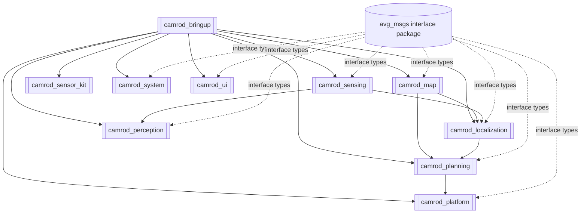
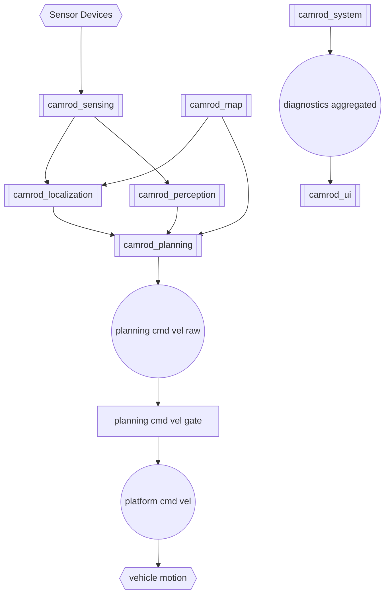

# CAMROD Workspace (`camrod_ws/src`)

Integrated ROS 2 Humble workspace for the CAMROD autonomous platform stack.

## 1) Workspace Architecture


Diagram legend: `[[...]]` package, `[(...)]` config or interface asset, `[ ... ]` node/process, `((...))` topic stream, `{{...}}` hardware source, dashed arrow = non-runtime dependency.

## 2) End-to-End Runtime Flow


## 3) Main Operational Scenario

**Base delivery loop:**
1. System starts; all modules launch with a configurable stagger gap.
2. Localization initializes using `camrod_map/config/map_info.yaml` as the single reference source.
3. State machine sends robot to `drop_zone` (startup goal).
4. Operator selects `camping_site_N` via UI → `/planning/state_machine/goal_key` published.
5. Nav2 generates global path; `/planning/cmd_vel` is gated by engage, e-stop, and cost-stop.
6. Robot arrives at camping site; waits `goal_reached_dwell_s` (default 600 s) or until return button.
7. Robot auto-returns or is sent back to `drop_zone`.

**Camping-site recall extension:**
8. Camping site publishes `/planning/state_machine/camping_site_recall` → state transitions to `RECALLED`.
9. Robot navigates to the site's nearest-lanelet coordinate for loading (mission_source: `recall:camping_site_N`).
10. After another dwell, robot auto-returns to `drop_zone` (mission_source: `auto_return`).

**GNSS outage handling:**
- GNSS loss → localization switches to `DR_ONLY`; robot continues on IMU + wheel odometry.
- GNSS recovery → `/localization/mode` transitions `DR_ONLY → NORMAL`; cmd_vel gate applies
  a `gnss_recovery_hold_s` (2.0 s) stop to let Nav2 and the costmap settle on the recovered pose.

Manual goal navigation through `/goal_pose` (RViz 2D Nav Goal) is also supported at any time.

## 4) Package Responsibilities
| Package | Role |
|---|---|
| `camrod_bringup` | top-level orchestration and cross-package argument/config wiring |
| `camrod_map` | lanelet map load, map cost grids, map markers, map reference source |
| `camrod_sensing` | camera/lidar/radar/imu/gnss pipelines + near-range cost grids |
| `camrod_localization` | GNSS/IMU/wheel fusion, localization state, map helper |
| `camrod_perception` | obstacle outputs from lidar-only and camera+lidar fusion |
| `camrod_planning` | Nav2 runtime, snapping, global/local path, cmd_vel gating, state machine |
| `camrod_platform` | final cmd_vel gate, robot visualization, sensor kit launch include |
| `camrod_sensor_kit` | URDF/xacro and TF backbone publication |
| `camrod_system` | module diagnostics checkers and diagnostics aggregation |
| `camrod_ui` | API bridge and lightweight UI backend |
| `camrod_common/avg_msgs` | shared ROS interfaces used across modules |

## 5) Build

### 5.1 Unified build (bootstrap + rosdep + external-aware colcon)
```bash
cd ~/camrod_ws
./src/build_camrod.sh --packages-up-to camrod_bringup
```

Equivalent execution from `src`:
```bash
cd ~/camrod_ws/src
./build_camrod.sh --packages-up-to camrod_bringup
```

### 5.2 Build-only mode (skip bootstrap/rosdep)
```bash
cd ~/camrod_ws
./src/build_camrod.sh --build-only --packages-up-to camrod_bringup
```

### 5.3 Bootstrap-only mode (clone/init missing externals)
```bash
cd ~/camrod_ws
./src/build_camrod.sh --bootstrap-only
./src/build_camrod.sh --bootstrap-only --update-externals
```

### 5.4 Source workspace
```bash
cd ~/camrod_ws
source install/setup.bash
```

## 6) Run

### 6.1 Full stack (recommended)
```bash
ros2 launch camrod_bringup bringup.launch.py
```

### 6.2 Simulation mode
```bash
ros2 launch camrod_bringup bringup.launch.py sim:=true rviz:=true
```

### 6.3 Real-data mode (no fake sensors)
```bash
ros2 launch camrod_bringup bringup.launch.py sim:=false
```

### 6.4 Override map path from bringup
```bash
ros2 launch camrod_bringup bringup.launch.py \
  map_path:=/home/hong/camrod_ws/src/lanelet2_maps.osm
```

### 6.5 Standalone module launches
```bash
ros2 launch camrod_map map.launch.py
ros2 launch camrod_sensing sensing.launch.py
ros2 launch camrod_localization localization.launch.py
ros2 launch camrod_planning planning.launch.py
ros2 launch camrod_platform platform.launch.py
ros2 launch camrod_system system.launch.py
```

## 7) Key Topics and Signals
| Topic | Purpose |
|---|---|
| `/planning/global_path` | global route from planner |
| `/planning/local_path` | local route for tracking |
| `/planning/cmd_vel_raw` | raw controller velocity (Nav2 output) |
| `/planning/cmd_vel` | gated velocity command (engage + estop + cost-stop + GNSS hold) |
| `/platform/cmd_vel` | final platform command to Ranger CAN driver |
| `/map/cost_grid/lanelet` | lanelet traversability cost grid |
| `/planning/cost_grid/inflation` | merged near-range cost grid (LiDAR + radar + lanelet) |
| `/localization/pose` | canonical fused pose (ESKF output) |
| `/localization/mode` | localization health: NORMAL / DEGRADED / DR_ONLY / INVALID |
| `/localization/initial_match_ok` | drop-zone match readiness used by planning startup gate |
| `/planning/state_machine/state` | current mission state (INIT / RUNNING / GOAL_REACHED / …) |
| `/planning/state_machine/mission_source` | why the current goal was sent (startup / recall:… / auto_return / …) |
| `/planning/state_machine/camping_site_recall` | camping site → robot recall trigger |
| `/system/diagnostics` | raw per-module diagnostics |
| `/system/diagnostics_agg` | aggregated diagnostics (consumed by UI) |

## 8) Shared Map Reference Rule
`camrod_map/config/map_info.yaml` is the shared reference source for map and localization alignment.

Main fields include:
- `map_path`
- `offset_lat`, `offset_lon`, `offset_alt`
- `offset_utm_easting`, `offset_utm_northing`, `offset_utm_alt`
- `yaw_offset_deg`
- `rotate_latlon_xy_by_yaw_offset`
- `world_frame_id`, `map_frame_id`

Launch-level overrides (for example `map_path:=...`) are still supported from `bringup.launch.py` and module launches.

## 9) RViz
Default operator-style RViz used in bringup:
- config: `camrod_map/rviz/camrod_operator.rviz`
- stylesheet: `camrod_map/rviz/operator_theme.qss`
