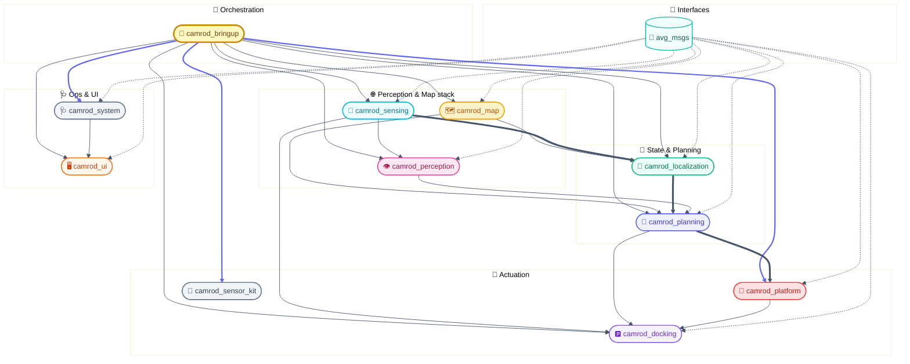
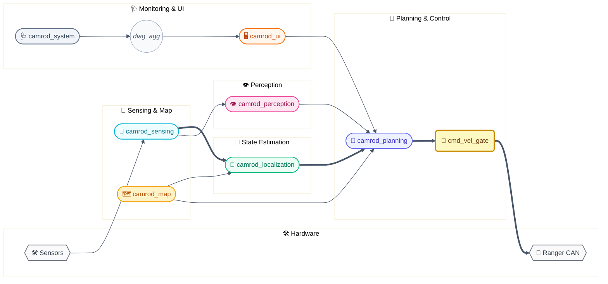

# CAMROD — Autonomous Camping Delivery Robot

ROS 2 Humble workspace for the CAMROD autonomous mobile platform.  
Built on the **Agilex Ranger** base, CAMROD navigates pre-mapped campground sites, delivers goods, and returns autonomously with GNSS/IMU/wheel localization and Lanelet2 lane-aware planning.

> Current release: **v2.0.1** (field UI, adaptive safety, and runtime-load tuning updated 2026-07-07)

---

## Documentation Map

| Package | Role | README |
|---------|------|--------|
| `camrod_bringup` | Top-level orchestrator | [README](camrod_bringup/README.md) |
| `camrod_map` | Lanelet2 map + cost grids + markers | [README](camrod_map/README.md) |
| `camrod_sensing` | Camera/LiDAR/radar/IMU/GNSS + near-range cost grids | [README](camrod_sensing/README.md) |
| `camrod_localization` | GNSS/IMU/wheel fusion (EKF default; ESKF optional) + map helper | [README](camrod_localization/README.md) |
| `camrod_perception` | LiDAR obstacles + optional YOLOv9 camera fusion | [README](camrod_perception/README.md) |
| `camrod_planning` | Nav2 runtime + cmd\_vel gating + state machine | [README](camrod_planning/README.md) |
| `camrod_parking` | Rule-based campsite crab maneuver + drop-zone reverse parking | [README](camrod_parking/README.md) |
| `camrod_docking` | AprilTag dock detection + opennav\_docking | [README](camrod_docking/README.md) |
| `camrod_platform` | Final cmd\_vel gate + robot visualization | [README](camrod_platform/README.md) |
| `camrod_sensor_kit` | URDF + static TF tree + RobotParams lib | [README](camrod_sensor_kit/README.md) |
| `camrod_system` | Diagnostic checkers + aggregator | [README](camrod_system/README.md) |
| `camrod_ui` | HTTP backend + operator web UI | [README](camrod_ui/README.md) |
| `avg_msgs` | Shared ROS 2 message/service interfaces | [README](camrod_common/avg_msgs/README.md) |

---

## Field Integration Reference

HH_260706 - This section is the operator-facing integration map. Use it first
when you need to know which package, node, topic, message, parameter, or network
setting owns a runtime behavior. Package READMEs still hold the deeper details.

### Runtime Entry Points

| Task | Command | What It Starts |
|---|---|---|
| Full robot bringup | `ros2 launch camrod_bringup bringup.launch.py sim:=false` | Map, sensing, localization, perception, planning, parking/docking, platform, system diagnostics, UI |
| Simulation bringup | `ros2 launch camrod_bringup bringup.launch.py sim:=true` | Fake sensors plus the same planning/UI/system graph where possible |
| UI only | `ros2 launch camrod_ui ui.launch.py ui_host:=0.0.0.0 ui_port:=8010` | FastAPI backend and installed React UI assets |
| Planning only | `ros2 launch camrod_planning planning.launch.py` | Nav2, goal snapping, local path, state machine, cmd_vel gate |
| Sensing only | `ros2 launch camrod_sensing sensing.launch.py` | GNSS/IMU/LiDAR/radar/camera preprocessing and sensor cost grids |

### Package-To-Behavior Map

| Behavior | Primary Package / Node | Key Inputs | Key Outputs | Notes |
|---|---|---|---|---|
| Operator UI site button | `camrod_ui` / `ui_backend_node` | HTTP `POST /ui/destination`, `camping_sites.yaml` | `/planning/mission_key`, `/goal_pose`, `/planning/mission_engage`, `/platform/drive_enable` | HH_260706 - HTTP destination applies immediately and ignores its own `/ui/selected_destination` echo to avoid duplicate dispatch |
| Manual engage | `camrod_ui` + `camrod_planning` / `planning_cmd_vel_gate_node.py` | `/planning/engage`, `/platform/drive_enable` | `/planning/engaged`, `/planning/cmd_vel` | `/planning/engage` is the command input; `/planning/engaged` is the gate state output |
| Lanelet route planning | `camrod_planning` / LaneletRoute planner + goal snapper | `/goal_pose`, Lanelet2 map, `/planning/lanelet_pose_ros` | `/planning/global_path`, `/planning/goal_pose_snapped_ros` | Global path should normally stay lanelet-centered; free-space fallback should be explicit/diagnostic |
| Local path following | `camrod_planning` / local path extractor + Nav2 controller | `/planning/global_path`, localization pose, costmaps | `/planning/local_path`, `/planning/cmd_vel_raw` | Local path updates frequently; global path should not change shape every tick |
| Final planning velocity gate | `camrod_planning` / `planning_cmd_vel_gate_node.py` | `/planning/cmd_vel_raw`, engage, e-stop, localization mode, `/planning/cost_grid/inflation` | `/planning/cmd_vel`, `/planning/engaged` | Applies engage, e-stop, GNSS recovery hold, stale-grid fail-closed, dynamic obstacle stop |
| Platform velocity gate | `camrod_platform` | `/planning/cmd_vel`, `/platform/drive_enable`, hardware status | `/platform/cmd_vel` | Last software gate before Ranger base |
| LiDAR obstacle cost | `camrod_sensing` / `lidar_cost_grid_node` | `/sensing/lidar/points_filtered`, height-gated `/sensing/lidar/filtered_cloud`, perception markers/clouds | `/sensing/cost_grid/lidar` | HH_260707 - 750C angle tables are loaded from the installed CSV directory; pre-ground-segmentation fallback points are z-gated |
| Radar obstacle cost | `camrod_sensing` / `radar_cost_grid_node` | `/sensing/radar/*/range` | `/sensing/cost_grid/radar` | Seven sensors: front1/front2/left1/left2/right1/right2/rear |
| Merged planning cost | `camrod_sensing` / `inflation_cost_grid_node` | lanelet, lidar, radar, global-path grids | `/planning/cost_grid/inflation` | Consumed by Nav2 local costmap and cmd_vel gate |
| Diagnostics / soft e-stop | `camrod_system` + `camrod_planning` state machine | checker topics, `/system/diagnostics_agg` | `/system/status`, `/planning/state_machine/estop` | Keep diagnostics readable; only motion-critical ERRORs should force planning stop |

### Critical Topic Contract

| Topic | Message | Direction | Owner | Purpose |
|---|---|---|---|---|
| `/planning/engage` | `std_msgs/Bool` | UI/operator -> planning | `camrod_ui` / external tools | Manual planning gate command |
| `/planning/mission_engage` | `std_msgs/Bool` | UI/state machine -> planning | `camrod_ui`, `camrod_planning` | Mission-owned movement latch for campsite/drop-zone flow |
| `/planning/engaged` | `std_msgs/Bool` | planning -> UI/system | `planning_cmd_vel_gate_node.py` | Effective planning gate state after engage/e-stop/holds |
| `/platform/drive_enable` | `std_msgs/Bool` | UI/planning -> platform | `camrod_ui` | Platform drive-enable latch; UI publishes it with engage actions |
| `/goal_pose` | `geometry_msgs/PoseStamped` | UI/RViz -> planning | `camrod_ui`, RViz | Raw operator or campsite site-center goal |
| `/planning/mission_key` | `avg_msgs/PlanningMissionKey` | UI -> state machine | `camrod_ui` | Semantic mission key such as `camping_site_1` |
| `/planning/global_path` | `nav_msgs/Path` | planning -> Nav2/RViz | `camrod_planning` | Lanelet/global route geometry |
| `/planning/local_path` | `nav_msgs/Path` | planning -> controller/RViz | `camrod_planning` | Short active path segment near robot |
| `/planning/cmd_vel_raw` | `geometry_msgs/Twist` | Nav2/parking -> gate | `camrod_planning`, `camrod_parking` | Ungated velocity request |
| `/planning/cmd_vel` | `geometry_msgs/Twist` | planning gate -> platform | `planning_cmd_vel_gate_node.py` | Safety-gated velocity |
| `/planning/cost_grid/inflation` | `nav_msgs/OccupancyGrid` | sensing -> planning | `camrod_sensing` | Merged obstacle/static cost used by local costmap and gate |
| `/sensing/cost_grid/lidar` | `nav_msgs/OccupancyGrid` | sensing -> fusion/planning | `camrod_sensing` | LiDAR and perception-object cost |
| `/sensing/cost_grid/radar` | `nav_msgs/OccupancyGrid` | sensing -> fusion/planning | `camrod_sensing` | Near-field radar cost |
| `/system/diagnostics_agg` | `diagnostic_msgs/DiagnosticArray` | system -> UI/state machine | `camrod_system` | Aggregated module health |

### Network And Environment

| Item | Current Default | Why It Exists |
|---|---|---|
| UI bind host | `api_ui_host: 0.0.0.0` in `camrod_bringup/config/bringup/launch_defaults.yaml` | Robot-IP UI access from an external tablet/laptop |
| UI port | `8010` | FastAPI backend and React static UI |
| UI security note | LAN-only, no public exposure | CORS allows operator commands; do not expose port 8010 to untrusted networks |
| Build wrapper | `./colcon_build.sh` | Runs required UI frontend build before `camrod_ui` colcon install and preserves repo-specific build paths |
| Runtime setup | `source /home/nvidia/camrod_ws/install/setup.bash` | Makes installed launch files, packages, and messages visible |
| GNSS serial convention | `/dev/ttyACM*` | GNSS receiver family; CH9344 ports are radar |
| Radar serial convention | `/dev/ttyCH9344USB0..6` | Seven SEN0592 channels; USB7 unused in the current profile |

### Safety And Tuning Parameters

| Parameter | Default | Owner | Meaning |
|---|---:|---|---|
| `cmd_vel_gate_body_near_dynamic_stop` | `true` | `planning_cmd_vel_gate_node.py` | Enables close side/rear dynamic obstacle stops during translation |
| `cmd_vel_gate_body_near_side_lookahead_m` | `1.20` | bringup/planning | Normal forward-driving `LEFT_NEAR`/`RIGHT_NEAR` distance |
| `cmd_vel_gate_body_near_rear_lookahead_m` | `0.80` | bringup/planning | Normal forward-driving `REAR_NEAR` distance |
| `cmd_vel_gate_body_near_maneuver_side_lookahead_m` | `1.20` | bringup/planning | Crab/reverse side guard distance for tight-space maneuvers |
| `cmd_vel_gate_body_near_maneuver_rear_lookahead_m` | `0.80` | bringup/planning | Crab/reverse rear guard distance for tight-space maneuvers |
| `cmd_vel_gate_cost_stop_latch_enable` | `true` | bringup/planning | Keeps dynamic stops latched until the corridor is continuously clear |
| `cmd_vel_gate_cost_stop_clear_required_s` | `2.0` | bringup/planning | Required clear time before releasing a latched dynamic stop |
| `cmd_vel_gate_cost_grid_stale_stop_enable` | `true` | bringup/planning | Fails closed when `/planning/cost_grid/inflation` is stale or missing |
| `cloud_min_z_m` / `cloud_max_z_m` | `-0.55` / `1.00` | `camrod_sensing` LiDAR cost grid | Filters height-gated fallback LiDAR points before cost projection |
| `perception_marker_min_radius_m` | `0.35` | `camrod_sensing` LiDAR cost grid | Keeps compact perception-object markers large enough to affect planning |
| `perception_marker_max_radius_m` | `0.75` | `camrod_sensing` LiDAR cost grid | Caps perception-object cost disk size |
| `perception_marker_radius_scale` | `0.35` | `camrod_sensing` LiDAR cost grid | Scales marker bbox size into compact cost radius |

### Runtime Load Controls

| Area | Current Control | Intent |
|---|---|---|
| Camera-LiDAR fusion queue | `sync_queue_size: 8` | HH_260707 - keep fusion real-time by dropping old backlog instead of processing stale frames |
| Fusion debug image | `debug_image_publish_rate_hz: 2.0`, `publish_debug_image_without_subscribers: false` | HH_260707 - skip image decode/draw/publish work unless someone is actually watching the debug image |
| LiDAR preprocessing | `qos_depth: 2`, optional `max_process_hz` | HH_260707 - avoid high-rate PointCloud2 backlog under CPU load |
| LiDAR/inflation cost grids | `rebuild_min_pose_delta_m`, `rebuild_min_yaw_delta_rad` | HH_260707 - reuse cached grids when inputs and pose are effectively unchanged |
| RViz-only markers | map marker throttle `0.50 s`, path visualizer subscriber gating | HH_260707 - keep RViz available while reducing marker construction and DDS traffic |
| Diagnostics final source | `system_diagnostic_node` reads filtered `/system/diagnostics_agg` | HH_260707 - honor aggregator ignore rules before operator-facing `/system/status` output |

### Naming Rules

| Name | Meaning |
|---|---|
| `mission_key` | Semantic target id, for example `camping_site_3` or `drop_zone` |
| `site_goal` | Raw operator/UI goal pose on `/goal_pose` |
| `route_goal` | Lanelet-snapped Nav2 goal pose, usually `/planning/goal_pose_snapped_ros` |
| `/planning/engage` | Command topic from UI/operator |
| `/planning/engaged` | Effective state published by the gate |
| `FRONT_PATH` | Dynamic obstacle check along active local path, not simply robot-body front |
| `LEFT_NEAR` / `RIGHT_NEAR` / `REAR_NEAR` | Short body-adjacent dynamic guards used by cmd_vel gate |

---

## Table of Contents

1. [System Overview](#1-system-overview)
2. [Hardware & Software Requirements](#2-hardware--software-requirements)
3. [Package Architecture](#3-package-architecture)
4. [Runtime Data Flow](#4-runtime-data-flow)
5. [External Dependencies](#5-external-dependencies)
6. [First Run Guide](#6-first-run-guide)
7. [Build](#7-build)
8. [Docker](#8-docker)
9. [Run](#9-run)
10. [Key Topics & Signals](#10-key-topics--signals)
11. [Planning Profiles](#11-planning-profiles)
12. [Operator UI](#12-operator-ui)
13. [Camping Sites Configuration](#13-camping-sites-configuration)
14. [Map Reference](#14-map-reference)
15. [Diagnostics](#15-diagnostics)
16. [Glossary](#16-glossary)
17. [Documentation Standards](#17-documentation-standards)
18. [Disabled / Optional Packages](#18-disabled--optional-packages)

---

## 1. System Overview

CAMROD is a supervised-autonomy delivery platform designed for controlled outdoor environments (campgrounds, parks, warehouses).

**Core capabilities:**
- Autonomous point-to-point navigation via pre-surveyed Lanelet2 maps
- Multi-sensor obstacle detection (LiDAR + camera + mmWave radar)
- GNSS/RTK localization with IMU + wheel dead-reckoning fallback
- AprilTag-based autonomous docking
- Web operator UI for site selection, diagnostics, and manual override
- Mission state machine: deliver → dwell → recall → return

---

## 2. Hardware & Software Requirements

| Component | Model / Notes |
|-----------|---------------|
| Mobile base | Agilex Ranger (4WD skid-steer, CAN bus) |
| GNSS | SparkFun ZED-F9P (single antenna, RTK via NTRIP) + ArduSimple simpleRTK2B Heading (dual antenna, moving-baseline heading) |
| IMU | Microstrain CV7 or GQ7 (9-axis; GQ7 has embedded GNSS) |
| LiDAR | Vanjee 3D LiDAR |
| Camera | Dual ECON ISX031 cameras: front compressed stream, rear raw AprilTag stream |
| Radar | SEN0592 near-range radar/ultrasonic sensors, 7-channel profile |
| Dock markers | AprilTag 36h11 family (autonomous docking) |
| Compute | Onboard Linux x86\_64 / ARM64, Ubuntu 22.04 + ROS 2 Humble |

**Software requirements:**

| Requirement | Version / Notes |
|-------------|----------------|
| OS | Ubuntu 22.04 LTS |
| ROS 2 | Humble Hawksbill |
| Nav2 | Humble release (included in `camrod_planning/external/`) |
| opennav\_docking | Included in `camrod_docking/external/` |
| apriltag\_ros | Included in `camrod_docking/external/` |
| robot\_localization | Included in `camrod_localization/external/` |
| Python | 3.10+ (FastAPI, uvicorn for camrod\_ui) |
| Node.js | 18+ (frontend build only) |
| Tested architectures | `amd64`, `arm64` (see Dockerfiles) |

---

## 3. Package Architecture

> Each package has a detailed README — see the [Documentation Map](#documentation-map) above.



> **Diagram legend**
> 📦 Package (stadium) · 🧩 ROS node (round-rect) · 📡 Topic (circle) · ⚙️ Config · 🛠️ Hardware · 📨 Interface
> Solid `-->` runtime dependency · `==>` critical path · `-.->` interface-only dependency
> Color = package/layer — see [docs/templates/DIAGRAM_PALETTE.md](docs/templates/DIAGRAM_PALETTE.md)

*Figure 1 — CAMROD workspace architecture. The `==>` chain (sensing → localization → planning → platform) is the safety-critical runtime path. Dashed arrows mark interface-only dependencies on `avg_msgs`.*

### Package Responsibilities

| Package | Role |
|---------|------|
| `camrod_bringup` | Top-level orchestrator; cross-package argument and config wiring |
| `camrod_map` | Lanelet2 map loading, lane cost grids, RViz markers |
| `camrod_sensing` | Camera / LiDAR / GNSS / IMU / radar drivers + near-range cost grids |
| `camrod_localization` | GNSS+IMU+wheel EKF fusion by default; optional ESKF backend; DR-mode fallback; drop-zone init |
| `camrod_perception` | LiDAR obstacle clustering, YOLOv9 camera detection, obstacle fusion |
| `camrod_planning` | Nav2 runtime, Lanelet2 goal/path snapping, cmd\_vel safety gate, mission state machine |
| `camrod_platform` | Final cmd\_vel gate, Ranger CAN bridge, URDF/TF publisher |
| `camrod_sensor_kit` | Robot URDF/xacro and static TF backbone |
| `camrod_system` | Per-module diagnostic checkers + aggregator (20+ checkers) |
| `camrod_ui` | FastAPI HTTP backend (port 8010) + React operator web UI |
| `camrod_docking` | AprilTag detection bridge + opennav\_docking integration |
| `camrod_common/avg_msgs` | Shared ROS 2 message/service/action definitions |

---

## 4. Runtime Data Flow



> **Diagram legend**
> `([...])` Package (stadium) · `(...)` ROS node (round-rect) · `((...))` Topic (circle) · `{{...}}` Hardware
> Solid `-->` runtime data flow · `==>` safety-critical path · `-.->` interface/config dependency
> Color = package/layer — see [docs/templates/DIAGRAM_PALETTE.md](docs/templates/DIAGRAM_PALETTE.md)

*Figure 2 — Runtime data flow. The `==>` chain (sensing → localization → planning → cmd\_vel\_gate → Ranger CAN) is the control-critical path. `cmd_vel_gate` is highlighted because it is the final safety interlock before wheel commands reach the vehicle.*

**Nominal mission loop:**

1. System starts; all modules launch with staggered delays.
2. Localization initializes from `camrod_map/config/map_info.yaml` (single map reference source).
3. State machine sends robot to `drop_zone` (startup goal).
4. Operator selects a camping site via UI → `/planning/mission_key` (`avg_msgs/PlanningMissionKey`) and raw `/goal_pose` are published.
5. Goal snapper converts the raw site pose into a lanelet route goal on `/planning/goal_pose_snapped_ros`.
6. Nav2 generates a LaneletRoute-first global path; the smoother runs through the BT for every planner option.
7. `planning_cmd_vel_gate_node` enforces manual/mission engage, e-stop, GNSS recovery hold, lanelet static safety, and live LiDAR/Radar cost stops.
8. At a camping site, `camrod_parking/site_maneuver` executes crab entry, 180-degree rotation, unload wait, crab exit, and return handoff.
9. Robot returns to `drop_zone`; final parking is handled by the selected rule-based parking or docking implementation.

**GNSS outage:**
- Localization switches to `DR_ONLY`; robot continues on IMU + wheel odometry.
- On GNSS recovery: 2 s `gnss_recovery_hold_s` stop lets Nav2 and costmap settle.

**Manual override:** `/goal_pose` (RViz 2D Nav Goal) works at any time.

---

## 5. External Dependencies

| Package group | Location | Purpose |
|---------------|----------|---------|
| `ublox` | `camrod_sensing/external/` | u-blox GNSS driver |
| `vanjee_lidar_sdk` | `camrod_sensing/external/` | Vanjee LiDAR driver |
| `ntrip_client` | `camrod_sensing/external/` | RTK correction client |
| `perception_pcl` | `camrod_sensing/external/` | PCL ↔ ROS 2 bridge |
| `robot_localization` | `camrod_localization/external/` | EKF / ESKF state estimator |
| `lanelet2` | `camrod_localization/external/` | Lanelet2 map library core |
| `yolov9mit` | `camrod_perception/external/` | YOLOv9 TensorRT inference library |
| `yolov9mit_ros` | `camrod_perception/external/` | YOLOv9 ROS 2 wrapper node |
| `vision_opencv` | `camrod_perception/external/` | cv\_bridge / image\_transport |
| `nav2_*` (10 pkgs) | `camrod_planning/external/` | Nav2 navigation stack |
| `ranger_ros2` | `camrod_platform/external/` | Agilex Ranger CAN driver |
| `ugv_sdk` | `camrod_platform/external/` | Agilex UGV CAN SDK |
| `opennav_docking` | `camrod_docking/external/` | Docking station manager |
| `apriltag_ros` | `camrod_docking/external/` | AprilTag marker detection |
| `lanelet2` | `camrod_map/external/` | Map utilities |

---

## 6. First Run Guide

Step-by-step from a fresh clone to a running simulation.

```bash
# 1. Clone and enter workspace
git clone https://github.com/hwanhonglee/CAMROD.git ~/camrod_ws/src
cd ~/camrod_ws/src

# 2. Bootstrap externals + install system deps
./setup_camrod.sh

# 3. Build (also rebuilds the camrod_ui robot frontend when in scope)
./colcon_build.sh --packages-up-to camrod_bringup

# 4. Source workspace
source ~/camrod_ws/install/setup.bash

# 5. Launch simulation with RViz
ros2 launch camrod_bringup bringup.launch.py sim:=true rviz:=true

# 6. Open operator UI
# http://127.0.0.1:8010

# 7. Send a goal via UI dropdown or RViz 2D Nav Goal
#    → select "B1" from the site picker
#    → or click the 2D Nav Goal button in RViz
```

---

## 7. Build

### 7.1 First-time setup (clone externals + rosdep)

```bash
cd ~/camrod_ws/src
./setup_camrod.sh
```

To update existing externals:

```bash
./setup_camrod.sh --update
```

### 7.2 Build (all packages)

```bash
cd ~/camrod_ws/src
./colcon_build.sh
```

Build a specific package and its dependencies:

```bash
./colcon_build.sh --packages-up-to camrod_bringup
```

Build only (skip rosdep / bootstrap):

```bash
./colcon_build.sh --packages-up-to camrod_bringup
```

Bootstrap only (no build):

```bash
./setup_camrod.sh
```

### 7.3 Source workspace

```bash
source ~/camrod_ws/install/setup.bash
```

---

## 8. Docker

Build and run CAMROD in a container.

```bash
# Build for amd64
docker build -f Dockerfile.camrod.amd64 -t camrod:amd64 .

# Build for arm64 (cross-compile or on ARM host)
docker build -f Dockerfile.camrod.arm64 -t camrod:arm64 .
```

<!-- TODO: verify exact docker run command with CAN, USB, and GPU device mounts -->

---

## 9. Run

### 7.1 Full stack

```bash
ros2 launch camrod_bringup bringup.launch.py
```

### 7.2 Simulation mode (fake sensors + RViz)

```bash
ros2 launch camrod_bringup bringup.launch.py sim:=true rviz:=true
```

### 7.3 Real hardware

```bash
ros2 launch camrod_bringup bringup.launch.py sim:=false
```

### 7.4 Override map

```bash
ros2 launch camrod_bringup bringup.launch.py \
  map_path:=/path/to/lanelet2_maps.osm
```

### 7.5 Individual module launches

```bash
ros2 launch camrod_map         map.launch.py
ros2 launch camrod_sensing     sensing.launch.py
ros2 launch camrod_localization localization.launch.py
ros2 launch camrod_perception  perception.launch.py
ros2 launch camrod_planning    planning.launch.py
ros2 launch camrod_platform    platform.launch.py
ros2 launch camrod_system      system.launch.py
ros2 launch camrod_ui          ui.launch.py
```

### 7.6 UI only

```bash
ros2 launch camrod_ui ui.launch.py ui_host:=0.0.0.0 ui_port:=8010
# Open http://<robot-ip>:8010
```

### 7.7 RViz

```bash
rviz2 -d ~/camrod_ws/src/camrod_map/rviz/camrod_operator.rviz \
  --stylesheet ~/camrod_ws/src/camrod_map/rviz/operator_theme.qss
```

---

## 10. Key Topics & Signals

| Topic | Type | Direction | Purpose |
|-------|------|-----------|---------|
| `/sensing/lidar/points_filtered` | `PointCloud2` | sensing → perception/planning | Processed LiDAR cloud |
| `/sensing/gnss/ublox_gps_node/fix` | `NavSatFix` | sensing → localization | GNSS position |
| `/sensing/gnss/navheading` | `Imu` | sensing → localization | Dual-antenna GNSS heading when enabled |
| `/sensing/imu/data` | `Imu` | sensing → localization | 9-axis inertial data |
| `/sensing/camera/econ_front/image_rect/compressed` | `CompressedImage` | sensing → perception / UI | Front camera stream |
| `/sensing/camera/econ_rear/image_raw` | `Image` | sensing → docking / diagnostics | Rear raw stream for AprilTag/docking |
| `/sensing/radar/front1/range` … `/sensing/radar/rear/range` | `Range` | sensing → radar cost grid | 7-channel near-field radar profile |
| `/localization/pose` | `PoseStamped` | localization → planning | Canonical fused localization pose |
| `/localization/mode` | `AvgLocalizationMode` | localization → planning gate | NORMAL / DEGRADED / DR\_ONLY / INVALID |
| `/localization/initial_match_ok` | `Bool` | localization → planning | Drop-zone match readiness |
| `/perception/obstacles` | `PointCloud2` | perception → LiDAR cost grid | Fused obstacle cloud merged into `/sensing/cost_grid/lidar` |
| `/perception/lidar/bboxes`, `/perception/camera_lidar/markers` | `MarkerArray` | perception → LiDAR cost grid | HH_260707 - marker obstacles use a 0.35-0.75 m radius window when fresh |
| `/planning/cost_grid/inflation` | `OccupancyGrid` | sensing/map → planning | Merged near-range cost grid |
| `/map/cost_grid/lanelet` | `OccupancyGrid` | map → sensing inflation | Lane traversability layer |
| `/planning/global_path` | `Path` | planning → RViz / diagnostics | Global Nav2 route |
| `/planning/local_path` | `Path` | planning → RViz / diagnostics / gate | Map-fixed slice of the active route |
| `/planning/cmd_vel_raw` | `Twist` | Nav2 controller → gate | Raw controller output |
| `/planning/cmd_vel` | `Twist` | gate → platform | Gated velocity (safe to send) |
| `/platform/drive_enable` | `Bool` | UI / CLI → platform gate | Operator platform safety arm; UI engage and camping-site buttons publish this together with planning engage |
| `/platform/cmd_vel` | `Twist` | platform gate → Ranger | Final vehicle command |
| `/platform/status/estop` | `Bool` | Ranger CAN → gates | Hardware emergency stop |
| `/planning/state_machine/estop` | `Bool` | planning state machine → planning gate | Mission/diagnostic soft e-stop; ORed with platform e-stop before `/planning/cmd_vel` |
| `/platform/status/odometry` | `Odometry` | Ranger CAN → localization | Wheel odometry |
| `/planning/engage` | `Bool` | UI / RViz manual → gate | Manual-goal engage latch |
| `/planning/mission_engage` | `Bool` | UI / mission state → gate | Camping/drop-zone mission engage latch |
| `/parking/site_maneuver/return` | `Bool` | UI return button → parking | Starts campsite crab/reverse exit after unload wait |
| `/planning/state_machine/state` | `avg_msgs/PlanningState` | state machine → parking/UI/system | INIT / RUNNING / GOAL_REACHED / RETURNING / … |
| `/planning/mission_key` | `avg_msgs/PlanningMissionKey` | UI → state machine | Named semantic selector, e.g. `camping_site_3` |
| `/planning/state_machine/mission_source` | `avg_msgs/PlanningMissionKey` | state machine → diagnostics/UI | `startup`, `mission_key:*`, `auto_return`, `recall:*` |
| `/goal_pose` | `PoseStamped` | UI / RViz → Nav2 | Manual 2D Nav Goal |
| `/ui/selected_destination` | `avg_msgs/UiDestinationCommand` | UI → backend | Operator site selection |
| `/system/diagnostics_agg` | `DiagnosticArray` | system → UI | Aggregated health status |

---

## 11. Planning Profiles

Nav2 planner × controller combinations are managed as standalone YAML overrides in:

```
camrod_planning/config/nav2_combo_profiles/
```

Each file encodes one `[planner]_[controller].yaml` pair (e.g. `smachybrid_graceful.yaml`) and overrides only the relevant Nav2 parameters on top of `nav2_base.yaml`.

**Available planners:** `navfn`, `smac2d`, `smachybrid`, `smaclattice`, `thetastar`  
**Available controllers:** `dwb`, `graceful`, `mppi`, `rotationshim`, `rpp`

Switch profile at launch:

```bash
ros2 launch camrod_planning planning.launch.py \
  nav2_combo_profile:=smachybrid_graceful
```

Key tuning parameters per controller:

| Controller | Key params |
|------------|-----------|
| Graceful | `v_linear_max`, `initial_rotation_min_angle`, `rotation_scaling_factor`, `allow_backward` |
| RotationShim | `angular_dist_threshold`, `max_angular_accel`, `rotate_to_goal_heading` |
| DWB | `sim_time`, `PathAlign.scale`, `GoalDist.scale`, `RotateToGoal.scale` |
| MPPI | `vx_max`, `prune_distance`, `temperature`, `gamma` |

---

## 12. Operator UI

The web UI runs at **http://\<robot-ip\>:8010** (default bind: `127.0.0.1:8010`).

**Features:**
- Camping site selection dropdown → dispatches goal to state machine
- System health dashboard (from `/system/diagnostics_agg`)
- Engage / stop button
- Real-time robot status (localization mode, planning state, battery)

**Backend architecture:**  
FastAPI (Python) in `camrod_ui/runtime/python/camrod_ui/ui_backend_node.py`  
React frontend built in `camrod_ui/camrod_ui_robot/assets/frontend/`

**Launch with external access:**

```bash
ros2 launch camrod_ui ui.launch.py ui_host:=0.0.0.0
```

**Rebuild frontend** (after editing `src/App.js`):

```bash
cd camrod_ui/camrod_ui_robot/assets/frontend
DISABLE_ESLINT_PLUGIN=true npm run build
```

---

## 13. Camping Sites Configuration

Site coordinates are defined in:

```
camrod_planning/config/camping_sites.yaml
```

Each entry maps a site key (e.g. `B1`) to a WGS84 lat/lon pose.  
The UI backend pre-loads this file and dispatches the corresponding `goal_pose` or `mission_key` when the operator selects a site.

Add a new site:

```yaml
B14:
  latitude: 37.123456
  longitude: 127.654321
  yaw_deg: 90.0
```

Then update `site_names` in `camrod_ui/launch/ui.launch.py`:

```python
'site_names': [f'B{i}' for i in range(1, 15)],
```

---

## 14. Map Reference

`camrod_map/config/map_info.yaml` is the **single source of truth** for coordinate frames.

Key fields:

```yaml
map_path:               # absolute path to .osm Lanelet2 file
offset_lat:             # WGS84 origin latitude
offset_lon:             # WGS84 origin longitude
offset_utm_easting:     # UTM easting offset
offset_utm_northing:    # UTM northing offset
yaw_offset_deg:         # map → world rotation
world_frame_id:         # typically "map"
map_frame_id:           # typically "map"
```

Override map path without editing the YAML:

```bash
ros2 launch camrod_bringup bringup.launch.py \
  map_path:=/data/maps/site_v2.osm
```

**GNSS RTK (NTRIP):** configured in `camrod_sensing/config/gnss/ntrip_client.yaml`.  
See `system_network_setting.md` for network / SIM card setup.

---

## 15. Diagnostics

The system health pipeline:

```
[per-module checker nodes]  →  /diagnostics
  ↓
diagnostics_aggregator  →  /system/diagnostics_agg
  ↓
camrod_ui dashboard
```

Checker categories: `hw`, `sensing` (GNSS, IMU, LiDAR, camera, radar, wheel), `localization` (pose, mode, GNSS, init, lanelet, source), `perception` (obstacles), `planning` (lifecycle, costmap, nav\_status, path), `map` (cost\_grid), `platform` (velocity\_converter).

View live diagnostics:

```bash
ros2 run rqt_robot_monitor rqt_robot_monitor
# or
ros2 topic echo /system/diagnostics_agg
```

---

## 16. Glossary

Key terms used across all CAMROD packages.

| Term | Definition |
|------|-----------|
| **drop zone** | Fixed startup/return waypoint where the robot begins and ends every mission |
| **camping site** | Named delivery destination (e.g. "B3") defined in `camping_sites.yaml` |
| **recall** | Operator-triggered return to a camping site for a second delivery or pickup |
| **engage** | Boolean signal (`/planning/engage`) that enables the cmd\_vel gate to pass velocity commands to the platform |
| **cost-stop** | Safety behavior: robot stops when the inflation cost grid exceeds a threshold along its path |
| **DR\_ONLY** | Dead-reckoning-only localization mode (GNSS lost, running on IMU + wheel odometry) |
| **mission source** | String tag attached to each Nav2 goal describing why it was sent (`startup`, `recall:B3`, `auto_return`, `manual`) |
| **inflation cost grid** | Merged occupancy grid combining LiDAR, radar, lanelet, and path-proximity cost layers |
| **lanelet** | A directed road segment with left/right boundaries in the Lanelet2 map format |
| **road snap** | Projection of a goal or path onto the nearest lanelet centerline |
| **dwell** | Wait period at a camping site before auto-return triggers (`goal_reached_dwell_s`) |
| **dock** | Charging/loading station identified by an AprilTag marker |
| **staging offset** | Pre-approach waypoint in front of the dock, used before final alignment |

---

## 17. Documentation Standards

- Style guide: [docs/templates/README_STYLE_GUIDE.md](docs/templates/README_STYLE_GUIDE.md)
- Package template: [docs/templates/PACKAGE_README_TEMPLATE.md](docs/templates/PACKAGE_README_TEMPLATE.md)
- Parameter naming: [PARAMETER_NAMING_STANDARD.md](PARAMETER_NAMING_STANDARD.md)
- Docs changelog: [docs/DOCS_CHANGELOG.md](docs/DOCS_CHANGELOG.md)

---

## 18. Disabled / Optional Packages

Located in `disable/` (marked with `COLCON_IGNORE` — not built by default):

| Package | Description |
|---------|-------------|
| `vio_bridge` | Visual-Inertial Odometry (ZED SDK / Orbbec SDK) |
| `kimera_vio_bridge` | Kimera VIO integration |
| `config_archive` | Archived configuration snapshots |

To enable VIO, install the required SDK and remove the `COLCON_IGNORE` file.

---

## Versioning

| Tag | Date | Summary |
|-----|------|---------|
| develop | 2026-07-07 | Runtime-load/DDS reduction on top of v2.0.1: smaller fusion queues, debug-image subscriber gating, LiDAR preprocessing backlog limits, cost-grid cached rebuild gating, RViz marker throttling, fake seven-radar sim heartbeat, right/rear guard reach update, and filtered diagnostics source for system status |
| v2.0.1 | 2026-07-06 | UI/IP and adaptive safety refinement: robot-IP UI bind default, immediate camping-site HTTP dispatch with duplicate echo suppression, clean `camrod_ui` rebuild/install handling, compact perception-object cost projection, near-body side/rear dynamic guards for right/rear radar stops, adaptive shorter crab/reverse guard distances, route-heading restart candidate filtering, synchronized LiDAR cost/ground-seg configs, and 55-assertion deterministic cmd_vel gate coverage |
| v2.0.0 | 2026-07-06 | Field safety/tuning baseline for outdoor validation: GNSS `/dev/ttyACM1` synchronization, 1 Hz GNSS diagnostic tolerance, dynamic LiDAR/Radar cost-stop latch, stale merged inflation-grid fail-closed gate, live sensor-cost preservation inside the ego-clear footprint, side-radar self-echo threshold tuning, WARN-safe campsite/drop-zone handoff, planning costmap diagnostic demotion, damped route-heading alignment for startup oscillation reduction, faster campsite crab entry, and 51-assertion deterministic cmd_vel gate coverage |
| v1.16 | 2026-07-02 | Field stabilization for map/planning/platform/system: local-first Lanelet2 visualization with cached full-map republish, map-fixed local path extraction with stale-marker clearing, obstacle-block monitor with status-only default, perception-to-cost-grid coupling, common Nav2 smoother frame override, LaneletRoute-first planning with grid fallbacks, planning soft-estop gating from `/planning/state_machine/estop`, LiDAR ground-filter load relief, radar 7-channel left/right mapping plus no-target heartbeat filtering, SocketCAN setup integration for Ranger, UI frontend build before colcon, expanded `avg_msgs` conversion coverage, diagnostics checker alignment, rear-camera CPU reduction, and automated sim validation runner with manual-goal, obstacle, campsite, and drop-zone parking coverage |
| v1.15 | 2026-06-23 | Obstacle replan monitor (LiDAR/Radar persistent blockage → Smac2D fallback), extended AvgAmrServiceState/PlanningScenario (SITE_ENTRY/UNLOAD_WAIT/RECALL_TO_SITE_ROAD/GUEST_LOADING_WAIT/RETURN_WITH_CARGO/DROP_ZONE_PARKING), UI site-access reservation/occupancy gate, planning_state_machine parking-phase mirror from /AMR_service_state, dynamic-only cost stop gate, lanelet route re-entry bypass, goal_snapper uncontained-snap override, map profile auto-selection, area_exporter polygon centroid + corners export |
| v1.14 | 2026-06-19 | Mission-key semantic planning (PlanningState/MissionKey/Scenario msgs), lanelet raw cost safety stop, local path reset on goal change, goal_snapper pose-jump reissue, lanelet_route_planner + engage_aware_progress_checker plugins, front camera V4L2 fallback + image_raw publisher (PR#14), Ranger BMS charging detection, planning_state_checker, sim diagnostics profile, parking_method bringup arg |
| v1.13 | 2026-06-11 | GNSS dual-antenna heading stabilization (simpleRTK2B Heading moving-baseline RELPOSNED fix) |
| v1.12 | 2026-06-04 | Dual antenna GNSS heading (simpleRTK2B Heading, moving-baseline RELPOSNED), ublox_gps-based single/dual GNSS launch, Python NTRIP with GGA feedback for VRS, removed old dGNSS fallback and COG heading fallback |
| v1.11 | 2026-05-28 | Dual econ camera (front GPU/VPI + rear CPU/GStreamer), unified IMU launch (imu_model), camrod_parking → camrod_docking, rear camera calibration, EKF log suppression, costmap start_current |
| v1.10 | 2026-05-21 | Camera sensing refactor (V4L2 publisher), YOLOv9 perception, UI symlink fix, nav2 combo profiles, planning parameter stabilization |
| v1.9 | 2026-05-13 | Planning stability, radar angle fix, Smac2D re-enable |
| v1.8 | 2026-05-08 | ESKF stability, GNSS COG auto-init, DR timeout, platform fixes |
| v1.7 | 2026-04-28 | Ranger platform bridge, DBC status aggregation, planning/system nodes |

## 2026-06-30 Runtime Update

> HH_260630 - Current field baseline after map visibility recovery, planning/local-path stabilization, radar remap, SocketCAN bringup, UI build integration, diagnostics/system checker synchronization, rear-camera runtime tuning, and sim validation runner integration.
> HH_260618 - Final parking is method-selected: `parking_method:=rule_based` uses `camrod_parking`, `parking_method:=docking` uses `camrod_docking`, and launch/system checks require exactly one method to be active.

### Current Mission Flow

1. Operator UI or RViz publishes a raw site goal on `/goal_pose` or `/planning/goal_pose`.
2. `camrod_planning/goal_snapper` converts that site-center goal to the lanelet route goal on `/planning/goal_pose_snapped` and `/planning/goal_pose_snapped_ros`; the latest clicked/UI goal immediately replaces older goals.
3. Nav2 defaults to the connected-lanelet `LaneletRoute` planner and keeps grid planners (`Smac2D`, `NavFn`, `ThetaStar`, etc.) as selectable diagnostics or recovery fallbacks.
4. `smoother_server` runs through the BT for every selected planner and uses `robot_base_link` for collision checks. HH_260629 - This prevents the Nav2 default `base_link` lookup failure while keeping smoothing common across LaneletRoute and grid fallback paths.
5. `local_path_extractor` publishes a `map`-fixed slice of `/planning/global_path`. HH_260702 - Invalid inputs and route changes publish an empty path once so previous local-path markers do not remain in RViz; controller-path modes remain available only as explicit diagnostics.
6. Nav2 drives to the lanelet-snap pose and `planning_state_machine` publishes `avg_msgs/PlanningState` on `/planning/state_machine/state`.
7. `planning_cmd_vel_gate_node` checks the raw `/map/cost_grid/lanelet` grid before the ego-cleared inflation grid. HH_260618 - Forward translation is blocked on lane-boundary/off-lane cost while in-place rotation remains allowed.
8. `camrod_parking/site_maneuver` starts for `camping_site_*`: while active, it commands `Twist.linear.y` on `/planning/cmd_vel_raw` for crab entry, rotates 180 degrees, waits for unload, then crab-exits back to the snap pose. HH_260618 - Parking nodes stay silent on `/planning/cmd_vel_raw` while idle so they do not race Nav2.
9. `site_maneuver` requests return through `/planning/state_machine/return_to_drop_zone`.
10. Nav2 returns to the drop-zone snap pose.
11. Final parking is mutually exclusive: `camrod_parking/drop_zone_parking` aligns the parked robot front yaw to the configured charging-station yaw, reverses with yaw/lateral feedback, and stops on `/platform/status/is_charging`; `camrod_docking` remains the AprilTag/opennav method when `parking_method:=docking`.
12. `camrod_system` validates module graph/runtime diagnostics and publishes `/system/status` plus `/system/msgs`.

### Field Notes

- HH_260629: `map_info.yaml` is synchronized between `camrod_map` and `camrod_bringup`; active map selection should be done by changing the map profile/offset there, not by editing RViz displays.
- HH_260629: Lanelet visualization publishes a lightweight full-map overview first, then local filtered markers near localization/GNSS pose, and republishes cached markers so RViz can recover after late subscription.
- HH_260629: Radar wiring is the seven-sensor profile. Left/right topics and TFs are aligned with the current harness, and SEN0592 no-target values near `65535 mm` are filtered instead of becoming obstacles.
- HH_260629: Ranger launch can bring up `can0` through `setup_can0.sh`; `setup_camrod.sh` installs the SocketCAN tools used for manual checks and service setup.
- HH_260629: `avg_msgs` now carries the internal CAMROD-facing message surface, with conversion helpers for standard ROS messages that still enter or leave the stack.
- HH_260630: `camrod_system` now documents and checks the graph-level node/topic manifest, per-domain diagnostics, sim diagnostics profile, and semantic `/system/status` outputs used by the UI.
- HH_260630: `sim:=true` now selects a sim graph manifest so fake-sensor runs do not require hardware GNSS/IMU/LiDAR/camera/Ranger nodes in `system_checker`.
- HH_260630: UI manual engage and camping-site buttons now publish `/platform/drive_enable` with the matching planning engage latch, so normal operation does not require a separate `/platform/set_enabled` service call.
- HH_260630: UI treats campsite `UNLOAD_WAIT` as arrival, shows the return button, and publishes `/parking/site_maneuver/return` before re-arming mission/platform gates for the return leg.
- HH_260630: Bringup and package config trees are synchronized for map/localization/planning/sensing/platform/perception/parking/system configs; bringup passes its synchronized system diagnostics root to `camrod_system`.
- HH_260630: `camrod_bringup/scripts/sim_validation_runner.py` validates the sim stack for topic Hz, radar direction topics, directional LiDAR/Radar cost-stop, manual goal navigation, and camping-site flow.
- HH_260630: `colcon test --packages-select camrod_planning` currently includes package-wide ament lint; failures from vendored `external/nav2_*` or existing style issues are lint-scope issues, not runtime planning failures.

## 2026-07-02 Avoidance Path and Perception Cost Update

> HH_260702 - Field update for dynamic avoidance path visibility and perception-to-cost-grid coupling.

- HH_260702: `/planning/local_path` now always follows the latest planner/global route slice instead of a stale controller debug path.
- HH_260702: Local-path extraction now clears stale `/planning/local_path` output on invalid input and route changes; map/perception/lidar/radar diagnostic errors remain visible in `/system/status` but no longer force planning `ERROR_STOP` by themselves.
- HH_260707: `lidar_cost_grid_node` now merges `/sensing/lidar/points_filtered`, height-gated `/sensing/lidar/filtered_cloud`, `/perception/obstacles`, `/perception/lidar/bboxes`, and `/perception/camera_lidar/markers` before publishing `/sensing/cost_grid/lidar`.
- HH_260702: `obstacle_replan_monitor` now reports active local-path blockage on `/planning/obstacle_replan/status` by default without preempting Nav2 or changing `/planning/global_path`; SmacLattice fallback preemption is available only when `preempt_enabled=true`.
- HH_260707: The LiDAR cost grid remains 180×180 at 0.10 m with 1.50 s input freshness. Perception markers are marked at cost 90 with a 0.35-0.75 m radius window, and fallback LiDAR cloud points must pass `cloud_min_z_m: -0.55`.
- HH_260702: Radar port order is synchronized to the current crossed LEFT/RIGHT field harness: FRONT1=USB0, FRONT2=USB1, LEFT1=USB4, LEFT2=USB5, RIGHT1=USB2, RIGHT2=USB3, REAR=USB6. Startup hardware register writes are opt-in to avoid false SEN0592 write timeout warnings; runtime polling and software range filtering remain active.
- HH_260702: Sim validation passed for baseline topic rates, all seven radar direction topics, front/left/right/rear LiDAR/Radar cost-stop, manual goal navigation, obstacle-block status without fallback route preemption, campsite crab/rotate/unload/crab-out, return-to-drop-zone, and drop-zone reverse parking to `PARKED`.
- HH_260702: Real full-stack tests with RViz/UI/voice/cameras/YOLO/docking enabled are intentionally treated as load probes. On the Jetson Orin field target that mode can saturate CPU/GPU and delay LiDAR/cost-grid/radar diagnostics; drive validation should use the lighter outdoor profile after the sim checks pass.

## 2026-07-03 Field Safety Patch

> HH_260703 - Outdoor validation patch for intermittent obstacle grids, GNSS port enumeration, and diagnostics-to-estop policy.

- HH_260708: ZED-F9P GNSS rover config is synchronized to `/dev/ttyACM0` in both `camrod_sensing` and `camrod_bringup`; GNSS port checks intentionally stay on `/dev/ttyACM*`, while CH9344 ports remain radar-only.
- HH_260703: GNSS sensor/localization diagnostics now accept a 1 Hz field-rate floor while preserving freshness, fix status, covariance, and jump checks. The ublox driver config still requests its normal receiver rate; diagnostics no longer create false `ERROR_STOP` from stable 1 Hz fixes.
- HH_260703: `planning_cmd_vel_gate_node` latches live LiDAR/Radar cost stops until the selected travel corridor stays clear for 2.0 s. This prevents obstacle stop/go flicker when a curb or vehicle intermittently drops out of the merged cost grid.
- HH_260703: The planning gate now fails closed when `/planning/cost_grid/inflation` is missing or stale for more than 1.0 s, so stale safety input cannot accidentally release `/planning/cmd_vel`.
- HH_260703: Radar and merged inflation cost grids preserve live LiDAR/Radar obstacle cells inside the ego-clear footprint while still masking static guide costs. Side radar self-echo filtering is reduced to 0.05 m while front/rear stay at 0.15 m, keeping valid right/left near-field detections available to the planning gate during crab motion.
- HH_260703: Planning state-machine auto-estop ignores raw Vanjee placeholder NaNs, camera FPS dips, costmap freshness dips, and selected non-motion diagnostics for state transitions. These remain visible in `/system/status`; filtered LiDAR/Radar cost grids and gate checks remain the motion safety authority.
- HH_260703: Planning costmap diagnostics are demoted to WARN for stale/rate failures, and fully unknown sparse cost-grid diagnostics are no longer ERROR by themselves. The gate-level stale inflation check is the immediate stop path.
- HH_260703: Deterministic gate logic now has 51 passing assertions, including right-crab radar stop, dynamic cost-stop latch, and stale merged-cost-grid fail-safe coverage.

## 2026-07-06 Field Tuning Patch

> HH_260706 - Outdoor tuning patch for startup route-heading oscillation and campsite crab duration.

- HH_260706: `planning_cmd_vel_gate_node` keeps the route-heading safety guard enabled, but uses a longer path tangent lookahead (`2.0 m`), lower angular gain (`0.8`), lower angular clamp (`0.35 rad/s`), and wider release threshold (`35 deg`). The intent is to stop the initial left-right over-correction seen when localization/cost-grid updates lag the pure-rotation command.
- HH_260706: Campsite crab lateral speed is raised from `0.18 m/s` to `0.24 m/s` in both `camrod_parking/config/parking.yaml` and the synchronized bringup parking config. Timeout prediction still uses `crab_timeout_speed_scale: 0.4`.
- HH_260706: `setup_camrod.sh`, `colcon_build.sh`, root/package READMEs, bringup defaults, package launch defaults, and node declaration defaults are kept synchronized so a normal wrapper build installs the same field-tuned values used by package-level launches.

## 2026-07-07 Runtime Load and DDS Update

> HH_260707 - Structural load reduction without removing sensing, planning, RViz, UI, voice, camera, YOLO, docking, or safety functions.

- HH_260707: `camrod_perception/obstacle_fusion_node` uses a smaller `message_filters` sync queue, skips debug image work unless there is a subscriber, rate-limits debug image output, and avoids full sorting of projected LiDAR points.
- HH_260707: `camrod_sensing/lidar_preprocessor_node` reuses PCL buffers, supports shallow QoS, and has an optional process-rate cap so PointCloud2 backlog does not grow when CPU is saturated.
- HH_260707: LiDAR and inflation cost-grid nodes cache the last grid and rebuild only when inputs or robot pose/yaw change enough to matter. Cached grids are republished with a fresh stamp when configured.
- HH_260707: RViz-only map/path markers are throttled or subscriber-gated. The planning path visualizer dropped from about 30% CPU to about 4-5% CPU in `rviz:=false` sim load sampling.
- HH_260707: Sim fake radar now publishes all seven range topics continuously, so direction diagnostics and cost-stop tests match the real radar topic contract.
- HH_260707: Right/rear near-body guard reach is synchronized to `1.20 m` side and `0.80 m` rear for both normal and crab/reverse maneuvers, matching the observed right/rear radar hit geometry.
- HH_260707: `system_diagnostic_node` consumes filtered `/system/diagnostics_agg`, so ignored raw diagnostics do not reappear as final `/system/status` errors.
- HH_260707: Sim validation passed baseline Hz, all seven radar directions, front/left/right/rear LiDAR/Radar/combined stop matrix, manual goal route following, stable `LaneletRoute` obstacle-block monitoring, campsite crab/rotate/wait/crab-out, return-to-drop-zone, and drop-zone reverse parking to `PARKED`.
- HH_260708: LaneletRoute map/routing graph creation now runs in the background during Nav2 bringup. Runtime verification on the indoor field host showed `planner_server` reached ACTIVE before the routing graph completed, then `LaneletRoutePlanner ready` appeared after the background graph build. First planning requests wait up to `async_initialization_plan_wait_timeout_s` if they arrive before readiness.

## 2026-07-01 Safety and Sensor Update

> HH_260701 - Current field baseline after planning soft-estop wiring, LiDAR load relief, radar no-target heartbeat handling, and GNSS/bringup config synchronization.

- HH_260701: `/planning/state_machine/estop` is now ORed with `/platform/status/estop` inside `planning_cmd_vel_gate_node`. A state-machine `ERROR_STOP` now closes `/planning/cmd_vel`, publishes `/planning/engaged=false`, and lets the platform gate block through the normal planning-engaged path.
- HH_260701: LiDAR ground segmentation uses `downsample_resolution: 0.10` in both `camrod_sensing` and `camrod_bringup` configs. The profiled target for `/sensing/lidar/points_filtered` is now a stable obstacle-only stream around 6 Hz under field load rather than forcing a 10 Hz checker threshold.
- HH_260702: LiDAR diagnostics ignore raw Vanjee NaN placeholders and use filtered freshness/rate plus near-zero filtered NaN as the motion-relevant health signal. Zero filtered obstacle points remain normal when the ROI is clear.
- HH_260701: SEN0592 radar drivers publish a no-target heartbeat above `max_range` when the sensor responds without a valid obstacle; diagnostics treat that as fresh/no-target data while cost-grid consumers ignore it.
- HH_260708: GNSS rover config is synchronized to `/dev/ttyACM0` for the current field harness; radar CH9344 USB ports remain reserved for SEN0592 channels.

### Setup and Build

```bash
cd /home/nvidia/camrod_ws/src
./setup_camrod.sh
./colcon_build.sh
source /home/nvidia/camrod_ws/install/setup.bash
```

`setup_camrod.sh` is idempotent: it keeps existing external repositories, installs explicit system dependencies including SocketCAN tools, skips Jetson-only docking packages on x86_64, and runs rosdep unless `--no-rosdep` is provided. `colcon_build.sh` builds source packages plus all `external/` package roots, runs `npm install` and `npm run build` for the robot UI before packaging `camrod_ui`, skips x86_64-only unavailable docking/voice pieces only when their system dependencies are unavailable, and keeps the local `camrod_parking` package in the normal source build graph.

### Smoke Tests

```bash
ros2 launch camrod_bringup bringup.launch.py sim:=true rviz:=false
ros2 topic echo /system/diagnostics --once   # check system_checker/final_parking
ros2 topic echo /parking/site_maneuver/status --once  # rule_based only
ros2 topic echo /parking/drop_zone/status --once       # rule_based only
ros2 topic echo /system/status --once

# Automated sim validation: manual goal + radar/lidar directional stop matrix
ros2 run camrod_bringup sim_validation_runner.py --ros-args \
  -p run_obstacle_replan:=true \
  -p report_file:=/tmp/camrod_sim_validation_manual.json

# Automated sim validation: camping-site route + crab/rotate/unload/return + drop-zone parking
ros2 run camrod_bringup sim_validation_runner.py --ros-args \
  -p skip_manual_goal:=true \
  -p run_camping:=true \
  -p camping_wait_drop_zone:=true \
  -p camping_timeout_s:=420.0 \
  -p report_file:=/tmp/camrod_sim_validation_camping_full.json
```
