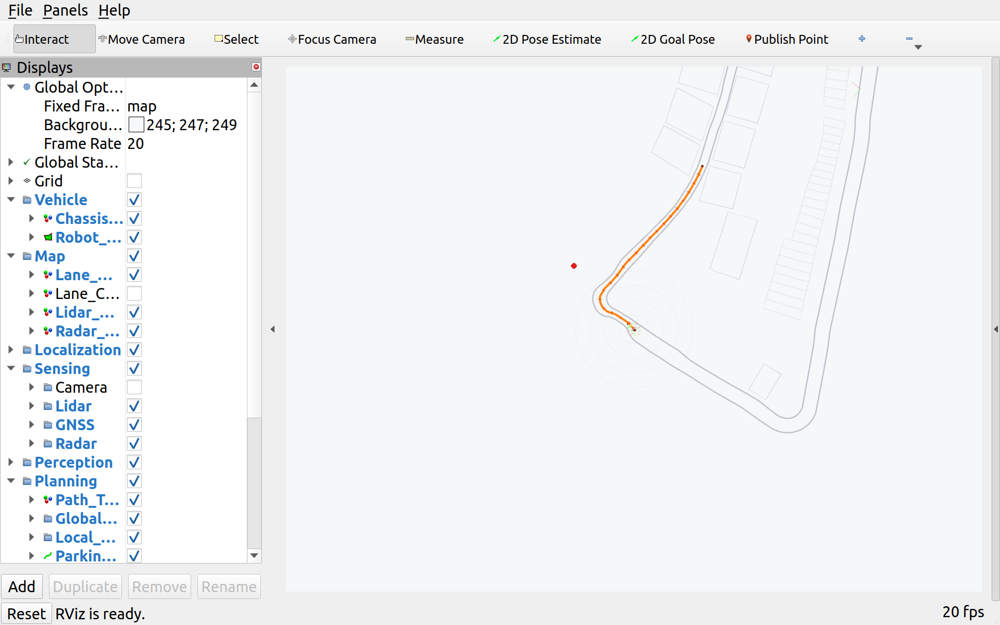
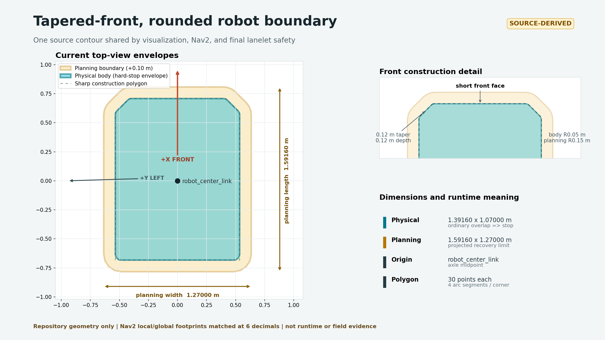
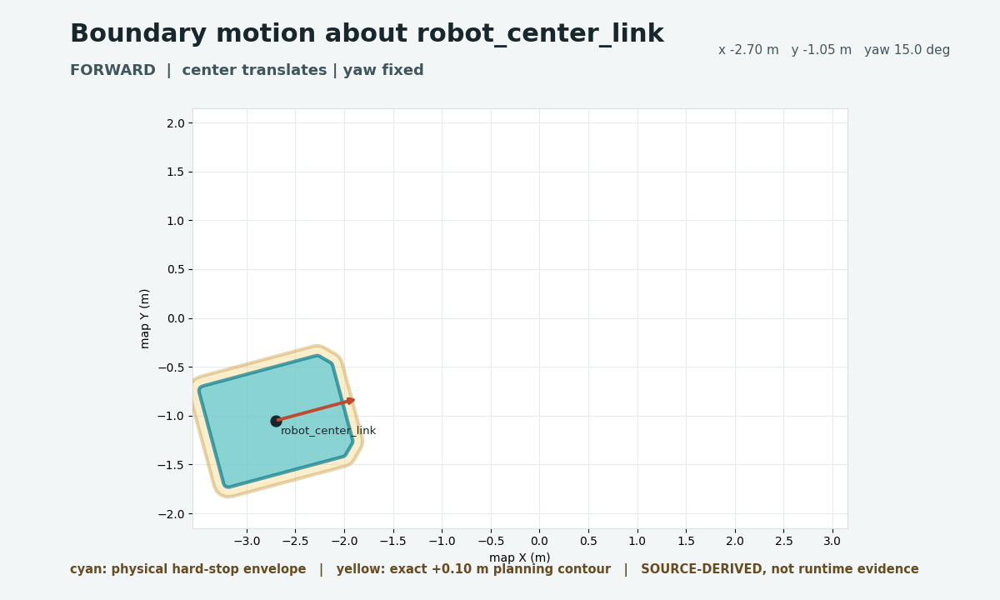
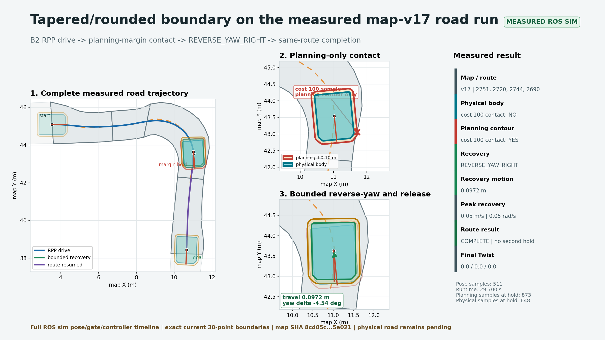
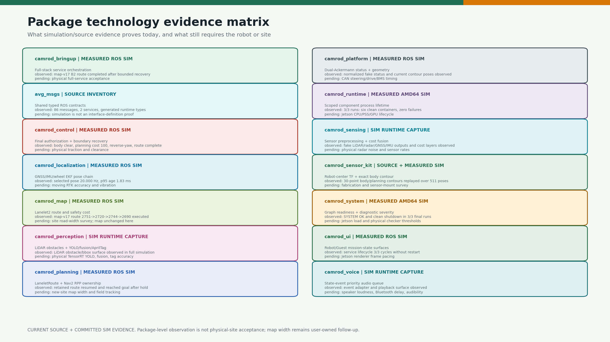
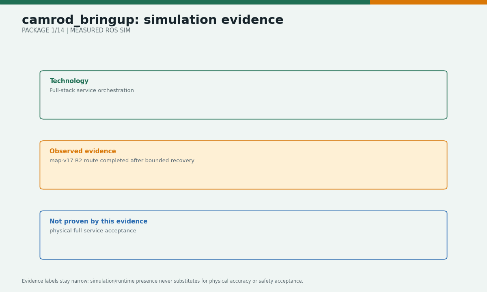
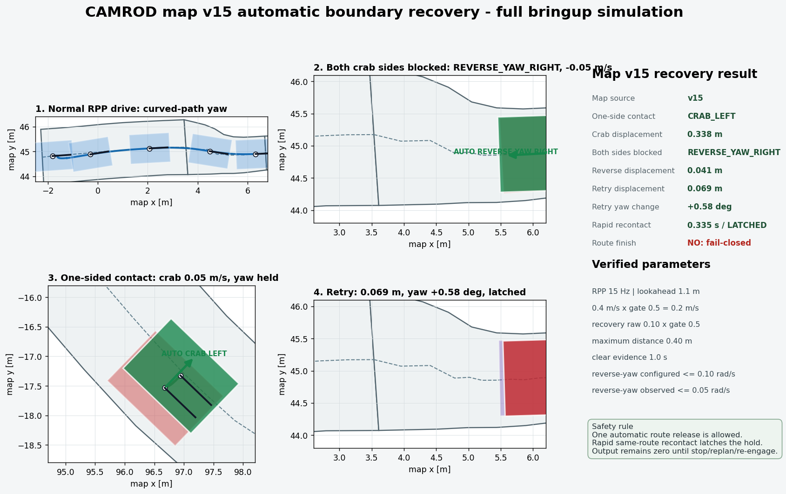
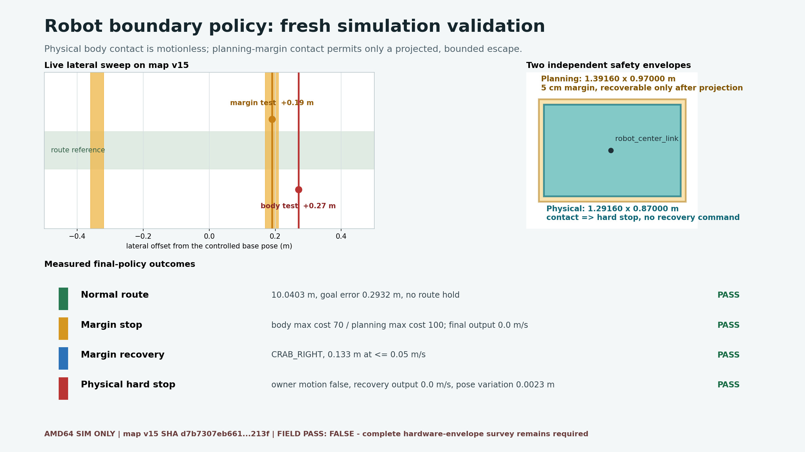
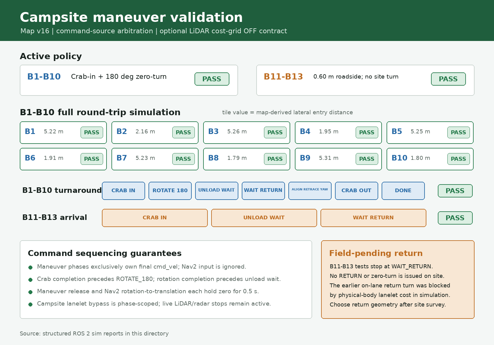
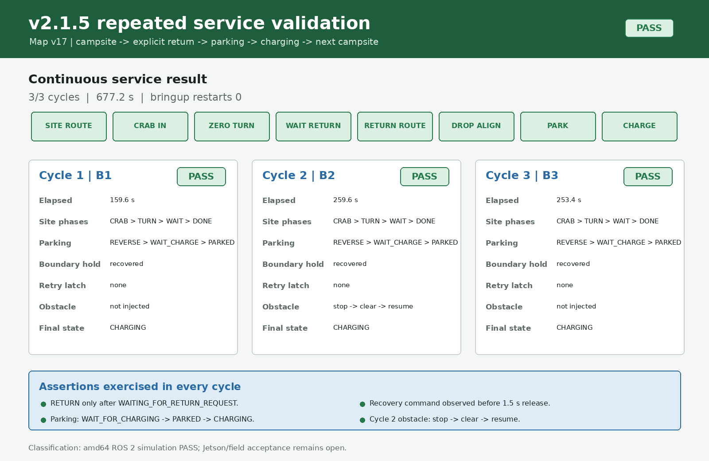

# CAMROD

<!-- HH_260806 - Use the fabrication-inclusive measured body as the active
hard-stop envelope and retain earlier reduced-boundary runs as historical evidence. -->
<!-- HH_260806 - Replace the GNSS center placeholder with the measured
left-antenna lever arm and heading-aware center correction. -->
<!-- HH_260807 - Add map-v17 repeated service, B2 recovery, and persistent-obstacle evidence. -->
<!-- HH_260807 - Add the final B1-B10 no-restart endurance result and fixed
1.1 m preview/route-snap return acceptance. -->
<!-- HH_260807 - Synchronize the v2.1.6 field contract: GNSS 5 Hz, localization
20 Hz, LiDAR 10 Hz, 2 km/h cruise, 10 cm boundary, and bounded recovery retries. -->
<!-- HH_260810 - Publish the v2.1.7 shared tapered/rounded boundary,
goal-independent UI readiness, reproducible package evidence, and tool layout. -->

ROS 2 Humble autonomous delivery robot stack for a Dual-Ackermann, crab, and
zero-turn Ranger platform. Current runtime baseline: **`v2.1.7`**.


## Actual Simulation Runtime



`SIM RUNTIME CAPTURE`: live `sim:=true rviz:=true` B6 graph showing the
lanelet map, robot, sensing layers, localization, and global/local planning
paths. This is not a generated diagram or a real-robot field claim.

## At A Glance

| Uses | Core function | Main outputs |
|---|---|---|
| ROS 2 Humble, Nav2, Lanelet2, robot_localization | Camping-site dispatch, navigation, local maneuver, parking, and charging lifecycle | `/service/state`, `/planning/state`, `/control/cmd_vel_ros`, `/system/status` |
| Vanjee LiDAR, 7 radars, dual GNSS, IMU, front/rear cameras | Sensor normalization, obstacle costs, localization, and perception | `/planning/cost_grid/inflation`, `/localization/pose`, `/perception/obstacles` |
| Robot UI and Guest UI | Mission commands, lifecycle display, safety hold, and diagnostics | `/ui/selected_destination`, `/planning/mission_key`, operation requests |

## Current Values

<!-- HH_260809 - Record the shared tapered-front, rounded-corner boundary
contract used by visualization, Nav2, and the final command safety gate. -->

| Item | Active value | Meaning |
|---|---:|---|
| Navigation frame | `robot_center_link` | Axle midpoint used by localization, planning, control, and platform |
| GNSS position reference | left antenna `(0,+0.45,0) m` | Fresh dual-GNSS yaw rotates the lever arm; a GNSS-anchored EKF yaw delta may bridge at most 3 s without making GNSS yaw valid |
| GNSS receiver cadence | `5 Hz` (`200 ms` epoch) | Rover is configured on launch; moving-base epoch/link acceptance remains a physical test |
| Localization pose cadence | `20 Hz` | EKF predicts between GNSS corrections; this is not a claim that GNSS itself publishes at 20 Hz |
| Physical body boundary | `1.39160 x 1.07000 m` bounding extents | Tapered front (`0.12 m` side inset over `0.12 m` depth), six rounded corners (`R0.05 m`); cost-100 overlap stops ordinary motion |
| Planning boundary | `1.59160 x 1.27000 m` bounding extents | Exact `0.10 m` parallel offset of the body contour (`R0.15 m`); endpoint planning clearance remains mandatory for escape |
| Base platform dimensions | `1.19160 x 0.87000 m` | Chassis-only value retained separately from the fabrication-inclusive collision envelope |
| New mission SOC | `>= 35%` | New campsite departure is admitted |
| Hard safety stop | `<= 20%` | Final command output is stopped |
| Planner/controller | `LaneletRoute + RPP` | Full-bringup default |
| Planner load set | `LaneletRoute + SmacLattice` | Fallback constructs only for a width-gated obstacle replan |
| Controller load set | `RPP + RotationShim` | Mission tracking plus manual clicked-yaw handling |
| Straight cruise | `2.000 km/h` (`0.555556 m/s` final) | Raw RPP `1.111111 m/s` passes through the retained `0.5` command gate |
| Obstacle fallback hold | `20.0 s` | Safety stop is immediate; only planner preemption waits |
| Active Lanelet map | `map_version=17`, SHA `8cd05c...5e021` | User-edited active OSM and named copy are byte-identical; SHA is a synchronization fingerprint, not a geometry lock |
| RPP preview | UI mission `1.1 m`; manual RotationShim `2.0 m` | Both fixed; manual profile uses the longer field anti-oscillation preview |
| Recovery limit | `0.10 m/s`, `0.10 rad/s`, `12 deg`, `0.40 m`, `10 s` | Projected staged crab/reverse/reverse-yaw envelope |
| Recovery retry guard | `12 releases`, `5 s` | At budget, same-direction Nav2 resume stays blocked; separately projected inward escape remains eligible |
| Parking methods | `reverse`, `apriltag` | Exactly one final parking controller is selected |
| LiDAR processing | raw/filtered target `10 Hz`; cost grid default `OFF` | Physical cloud processing remains required; only the optional raster node/topic and its graph entry are disabled |
| Radar visualization | seven real `/range_ros` streams | `radar_status_gui.py` observes physical publishers and never starts a dummy publisher |
| Operator renderer | WebKit | Fullscreen field default; Chromium and `auto` remain explicit alternatives |
| ROS transport | component intra-process; physical-LiDAR SHM opt-in | DDS-SHM is scoped to the LiDAR driver group and never exported to the full graph |
| System health tools | `4` nodes in `system_core_container` | Stable aggregate/status chain; standalone fallback remains available |
| System checker topology | `24` checkers in `4` serialized containers | Fault domains remain separate; standalone fallback remains available |
| Nav2 process topology | planner/controller scoped container | Vendor smoother/behavior/BT/lifecycle executables stay standalone |

Configured values are not performance measurements. Package tables below mark
runtime evidence separately.

## Current Boundary Visual

<!-- HH_260810 - Show the active source-derived contour and its rigid-body
motion separately from historical rectangular runtime evidence. -->





The PNG is generated from `camrod_sensor_kit/config/robot_params.yaml` and must
match both Nav2 footprints. The GIF shows rigid transforms around
`robot_center_link`; it is not a ROS collision/recovery or physical-drive PASS.
See the [source-derived record](docs/assets/test_result/tapered-rounded-boundary-20260810/README.md).

### Measured Road Simulation

<!-- HH_260810 - Show the same current contour on a measured ROS road run while
keeping physical-road acceptance explicitly out of scope. -->




The [measured ROS simulation record](docs/assets/test_result/tapered-rounded-boundary-road-sim-20260810/README.md)
contains 511 poses from a `29.700 s` B2 run. The physical body remained clear,
the planning contour reached cost 100, bounded `REVERSE_YAW_RIGHT` moved
`0.0972 m` with `-4.545 deg` yaw change, and the original route completed with
no second hold. This is not physical-road evidence.

## Latest Evidence

| Check | Result | Scope |
|---|---|---|
| Current tapered/rounded B2 road run | **MEASURED ROS SIM PASS** | map-v17; physical cost-100 contact `NO`, planning contact `YES`; `REVERSE_YAW_RIGHT`; same route complete; field pending |
| Repeated campsite service | **AMD64 SIM PASS 10/10** | `2210.611 s`, restart `0`; cycle 1 seeded at B1 handoff, cycles 2-10 full charger departure/outbound/RETURN/parking/charging |
| 3 km/h RPP source-profile A/B | **FIXED 1.1 m SELECTED** | Scaled preview recontacted in `0.850 s`; fixed preview completed B1/B2 `2/2` in `422.848 s` without retry latch |
| Current B2 boundary recovery | **AMD64 SIM PASS 3/3** | `REVERSE_YAW_RIGHT`, real recovery motion before 1.5 s release, mission complete, no second hold/retry latch |
| Persistent obstacle, map-v17 3.0 m lane | **SAFE-HOLD PASS** | Immediate stop; one Smac path preflight found no safe path; no selector/ABORT loop; obstacle clear resumed the original mission |
| v2.1.7 affected-package build/tests | **PASS** | Canonical wrapper rebuilt 7 packages; 42 registered CTest targets passed with 0 errors/failures; direct UI 32/32 |
| Goal-independent initialization | **PASS** | No manual/UI goal; full graph reached `[SYSTEM] OK`, UI `ready=true`, `mission_phase=READY`, diagnostics errors `0`, then exited cleanly on SIGINT |
| Current map-v17 contract | **PASS** | Active/copy OSM SHA synchronized; 55 lanelets, 14 areas, 1,652 nodes |
| Boundary guard regression | **PASS** | Repository `colcon_build.sh` rebuilt 5 affected packages; 32/32 CTest targets passed; 334 aggregate xUnit records, 0 errors/failures, 8 cppcheck skips |
| Full stack startup/shutdown | **PASS** | Final topology reached Nav2 active and `[SYSTEM] OK`; all 6 component containers exited cleanly in 3/3 runs plus one default-argument run |
| amd64 runtime topology A/B | **SYSTEM CORE PASS; LIDAR TRADEOFF** | Core: 3 fewer processes, CPU -2.5 points, PSS -19.7 MiB, 3/3 controlled stop; LiDAR: CPU -17.5%, PSS +44.0 MiB, 10 Hz preserved |
| amd64 operator renderer A/B | **WEBKIT LIGHTER; PAGE-LOAD SPEED UNRESOLVED** | Chromium vs WebKit: PSS +327.3 MiB, CPU +1.44 points; system-OK mean -1.33 s is not browser first paint; both controlled-stop 3/3 |
| Localization pose chain | **PASS** | 10 Hz inputs produced 20 Hz selected pose; header-age p95 `1.83 ms` |
| Reference-frame A/B | **PASS for compared segment** | Cross-track RMS `0.0588 -> 0.0549 m`; yaw RMS `2.901 -> 2.713 deg` |
| Automatic boundary recovery | **v2.1.4 RELEASE-MAP SIM PASS, FAIL CLOSED** | Release map-v15 selected `REVERSE_YAW_RIGHT` at `0.05 rad/s` and `CRAB_LEFT`; rapid route recontact latched with final zero output |
| Earlier reduced-boundary policy | **AMD64 SIM PASS; HISTORICAL** | The `1.29160 x 0.87000 m` candidate produced normal-route, margin recovery, and physical-stop evidence retained for comparison; it is no longer the active body |
| Historical campsite sequencing | **PASS; B11-B13 RETURN FIELD-PENDING** | Map-v16 B1-B10 all completed crab, zero-turn, wait, explicit return, and crab-out; B11-B13 reached roadside `WAIT_RETURN` without any on-site turn |
| Guest/Robot UI contract | **PASS** | Dispatch, lifecycle, return, safety overlay, and operator stop observed |
| Physical radar disabled | **FIELD-PASS** | `600.063 s`; 5,976 clear grids; zero active/high-cost/stop evidence |
| Physical front camera/YOLO lifetime | **FIELD-PASS** | `300 s`; 2,750/2,750 JPEG decode; `9.167 Hz`; zero crash/restart |
| Physical rear camera rate | **FIELD-FAIL** | Raw `3.633 Hz` versus `10 Hz` target under field load |
| B1-B10 turnaround | **SIM PASS (10/10)** | All ten map-derived lateral entries (`1.79-5.31 m`) completed full round trips with maneuver-exclusive command ownership |
| B11-B13 roadside | **ARRIVAL SIM PASS; RETURN UNRESOLVED** | Each site stopped at `WAIT_RETURN` after a capped `0.60 m` crab; no RETURN was issued |
| Physical Ranger/sensors/audio | **FIELD PENDING** | Jetson and real-robot measurements are still required |

### Package Technology Proof

<!-- HH_260810 - Summarize package claims by evidence class so simulation
presence is not confused with physical accuracy or field safety acceptance. -->





The matrix separates `MEASURED ROS SIM`, `MEASURED AMD64 SIM`, runtime capture,
source inventory, and field-pending claims for all 14 CAMROD packages. The map
width remains intentionally unchanged for the later site survey/update.











[Open the 10-cycle service GIF](docs/assets/test_result/b1-b10-service-endurance-20260807/b1-b10-service-endurance.gif).


## Packages

| Package | Responsibility | Visual guide |
|---|---|---|
| [`camrod_bringup`](camrod_bringup/README.md) | Full-stack launch, defaults, simulation, and validation tools | Mission contract and measured smoke result |
| [`camrod_common/avg_msgs`](camrod_common/avg_msgs/README.md) | Generated shared messages and services | Interface inventory and dependency boundary |
| [`camrod_sensor_kit`](camrod_sensor_kit/README.md) | URDF, static TF, body geometry, and sensor mounts | Rear-axle/center comparison and side view |
| [`camrod_map`](camrod_map/README.md) | Lanelet2 map, semantic areas, and cost grids | Route mask and planning-grid values |
| [`camrod_sensing`](camrod_sensing/README.md) | Hardware acquisition, preprocessing, and cost fusion | Sensor matrix and ground-filter schematic |
| [`camrod_perception`](camrod_perception/README.md) | LiDAR obstacles, YOLO fusion, occupancy, and AprilTag | Field/simulation pipeline boundary |
| [`camrod_localization`](camrod_localization/README.md) | GNSS/IMU/wheel EKF and localization state | Pose generation and measured timing |
| [`camrod_planning`](camrod_planning/README.md) | Nav2, Lanelet routing, goal snapping, and mission state | Servers, selectors, and ownership handoffs |
| [`camrod_control`](camrod_control/README.md) | Final command gate, local maneuvers, parking, and recovery | Footprint safety and measured recovery |
| [`camrod_platform`](camrod_platform/README.md) | Ranger command/feedback and normalized platform status | Steering transition and CAN/BMS bridge |
| [`camrod_runtime`](camrod_runtime/README.md) | Scoped ROS component contexts and deterministic process teardown | Source cleanup order and measured AMD64 simulation shutdown |
| [`camrod_system`](camrod_system/README.md) | Diagnostics, graph readiness, and health summary | Severity and operator-state separation |
| [`camrod_ui`](camrod_ui/README.md) | Robot/Guest HTTP backends and browser interfaces | Shared mission/state contract |
| [`camrod_voice`](camrod_voice/README.md) | Event-to-audio policy and priority playback | Event and priority flow |

## Command Path

```text
Nav2 /control/nav2_cmd_vel_ros -----+
local maneuvers /control/cmd_vel_raw +--> cmd_vel_safety_gate
parking/recovery -------------------+        |
                                              +--> /control/cmd_vel
                                              +--> /control/cmd_vel_ros --> Ranger
```

The safety gate is the only final motion authority. Mission state
(`/service/state`), planner state (`/planning/state`), command authorization,
and health (`/system/status`) are separate contracts.

## Mission Lifecycle

```text
DROP_ZONE_WAIT -> DEPARTING_DROP_ZONE -> MOVING_TO_SITE -> SITE_ENTRY
-> UNLOAD_WAIT -> WAITING_FOR_RETURN_REQUEST -> RETURN_WITH_CARGO
-> RETURNING_TO_DROP_ZONE -> DROP_ZONE_PARKING
-> WAITING_FOR_CHARGING -> CHARGING
```

Parking-controller `PARKED` is an internal phase. Public state is `CHARGING`
when CAN charging feedback is true, `WAITING_FOR_CHARGING` while contact is
pending, and `DROP_ZONE_WAIT` when parked without charge feedback.

## Build And Run

```bash
cd ~/camrod_ws/src
./setup_camrod.sh       # first host setup or dependency refresh
./colcon_build.sh       # canonical Release build and install synchronization
source ../install/setup.bash

# Simulation with the operator RViz profile
ros2 launch camrod_bringup bringup.launch.py sim:=true rviz:=true

# Field profile on the configured Jetson/Ranger host
ros2 launch camrod_bringup bringup.launch.py
```

Do not tune physical CAN, camera, sensor-port, or Jetson performance parameters
from a workstation-only simulation result.

## Documentation

| Document | Purpose |
|---|---|
| [Module Visual Guide](docs/MODULE_VISUAL_GUIDE.md) | Evidence classes, asset sources, regeneration, and interpretation |
| [Current tapered/rounded road simulation](docs/assets/test_result/tapered-rounded-boundary-road-sim-20260810/README.md) | Raw map-v17 ROS timeline, exact current contour PNG/GIF, metrics, and hashes |
| [v2.1.7 release notes](docs/V2_1_7_RELEASE_NOTES.md) | Current boundary, UI readiness, package evidence, tool ownership, build, and verification |
| [v2.1.6 release notes](docs/V2_1_6_RELEASE_NOTES.md) | Previous sensor cadence, motion/boundary policy, visualization, and field acceptance baseline |
| [v2.1.5 release notes](docs/V2_1_5_RELEASE_NOTES.md) | Previous baseline and its exact historical evidence |
| [v2.1.5 field handoff](camrod_bringup/docs/v2_1_5_field_handoff_20260808.md) | Other-PC start, TODO crosswalk, and physical test order |
| [v2.1.5 service evidence](docs/assets/test_result/v2-1-5-service-validation-20260807/README.md) | Repeated service, obstacle, boundary JSON/log/PNG/GIF and limits |
| [B1-B10 endurance evidence](docs/assets/test_result/b1-b10-service-endurance-20260807/README.md) | Ten-cycle lifecycle, route-snap return, path/UI shutdown logs, PNG/GIF and hashes |
| [RPP service A/B evidence](docs/assets/test_result/rpp-lookahead-service-ab-20260807/README.md) | Rejected scaled preview and selected fixed `1.1 m` source-profile run |
| [v2.1.4 release notes](docs/V2_1_4_RELEASE_NOTES.md) | Previous map, boundary, UI, and transport baseline |
| [v2.1.3 release notes](docs/V2_1_3_RELEASE_NOTES.md) | Released runtime scope and verification |
| [Robot-center migration](docs/V2_1_3_ROBOT_CENTER_MIGRATION.md) | Exact before/after geometry and A/B results |
| [Boundary recovery validation](docs/V2_1_3_BOUNDARY_RECOVERY_VALIDATION.md) | Crab/reverse timelines, GIFs, and limitations |
| [Runtime capture evidence](docs/evidence/module-guides/bringup/runtime-visual-capture-20260804.json) | Live screens, retry timestamps, zero output, and operator-stop result |
| [amd64 runtime A/B evidence](docs/evidence/v2.1.5/runtime-topology/amd64-container-ab-20260805.json) | Per-run process/CPU/RSS/PSS/rate and controlled-stop samples |
| [Documentation changelog](docs/DOCS_CHANGELOG.md) | Post-release documentation-only updates |
| [`TODOLIST.txt`](TODOLIST.txt) | Remaining physical acceptance work |
