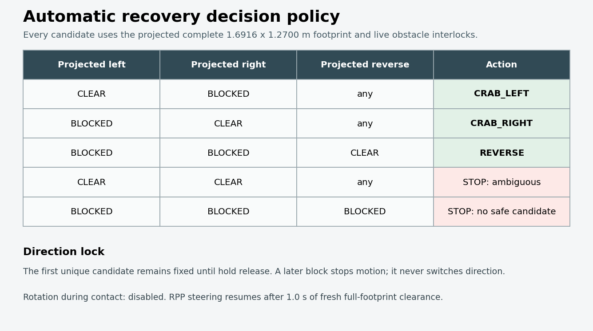

# CAMROD

<!-- HH_260720 - Document the consolidated parking and command-gate package boundaries. -->

<!-- HH_260723 - Promote the localization, routing, perception, and campsite-occupancy field release. -->

<!-- HH_260724 - Promote the battery-aware campsite mission and charging-release policy. -->

<!-- HH_260727 - Promote the source-aware goal, full-footprint, and runtime-tuning release. -->

<!-- HH_260728 - Promote the bounded radar self-return and forward-side-guard release. -->

<!-- HH_260729 - Promote the fail-visible disabled-sensor and radar/camera hardening release. -->

<!-- HH_260730 - Promote the measured field-readiness and state-contract release. -->

<!-- HH_260802 - Promote the synchronized boundary/RPP/field-evidence checkpoint. -->

Current release baseline: `v2.1.2` ([release notes](docs/V2_1_2_RELEASE_NOTES.md)).

CAMROD is a ROS 2 Humble autonomous mobile robot stack. Route planning, local
vehicle maneuvers, reverse parking, and hardware command authorization are
separate runtime responsibilities.

The v2.0.8 field profile retains the v2.0.7 battery-aware campsite admission
and charging-departure policy: critical SOC at or below 20% hard-stops command
output, and new campsite missions require at least 35% SOC. If SOC falls below
35% during an active campsite mission, the robot finishes the current site
phase and waits for the normal user return request before moving back to the
drop zone.

It also adds dynamic Ranger steering-transition tuning, complete-footprint
map-boundary enforcement, source-specific RViz/UI goal policies, a lightweight
operator WebKit window, and measured UI/status load reductions. Existing
one-way Lanelet routing, campsite return, camera-LiDAR fusion, and
occupied-campsite protections remain in force.

The v2.0.9 delta replaces broad one-sided radar ignore floors with measured
narrow notches and a bounded, disengaged startup calibration. Each channel now
gets its full calibration interval from its own first valid sample, so a
late-starting port is not silently finalized with zero samples. A
transient-local manual-or-mission authorization state also prevents a restarted
radar node from learning while driving or while a cost stop is latched. Farther
side returns remain obstacles. The final tagged profile uses a 0.60 m
normal-forward raw side probe, superseding the initial 0.75 m profile, while
crab and reverse retain the 1.20 m maneuver envelope. Sensor
diagnostics also retain the logical location, TF frame, mount pose, and live
measurement through the final `[SYSTEM]` summary. The v2.0.8 battery, UI,
planning, full-footprint boundary, and hardware-port policies are otherwise
unchanged.

<!-- HH_260728 - Record the final v2.0.9 field-safety follow-up in the tagged release. -->
The final `v2.0.9` field-safety follow-up retains the radar source, original
corridor/path/rotation probe, and fresh-grid evidence that triggered a dynamic
obstacle stop. A stop-induced zero or changed-direction command can no longer
clear that latch; release requires 2 seconds of fresh clear evidence followed
by the configured 1-second hold. The final normal-forward raw side probe
is 0.60 m from the canonical robot base frame; crab/reverse retains 1.20 m. With the radar
grid's 0.30 m obstacle radius, a side hit near base-centred `|y|=1.0 m` stays
clear during forward travel while a closer hit near `|y|=0.8 m` blocks.
The disk diagnostic WARN threshold is 90% (ERROR remains 95%).

<!-- HH_260729 - Summarize the v2.1.0 disabled-hardware, radar, and camera boundary changes. -->
The v2.1.0 delta adds explicit, low-rate dummy contracts for deliberately
disabled camera, GNSS, IMU, LiDAR, radar, and Ranger hardware. A fresh
`dummy_active` heartbeat makes diagnostics report the exact component and
location as `DUMMY DATA / WARN`; it never reports dummy input as healthy
hardware. The placeholders are fail-safe: GNSS remains `NO_FIX`, LiDAR is an
empty cloud, radar publishes no-target ranges, and Ranger feedback remains
ESTOP/non-drivable. Simulation keeps these auxiliary publishers off because its
fake-sensor publisher already owns the same schemas.

Radar now uses a narrow-angle, near-field physical profile with verified
register readback, named fixed-return intervals, and disabled automatic startup
learning in the driving profile. Fresh global or per-channel radar dummy
markers independently block cost painting, so `enable_radar:=false` cannot
become a LEFT2 or other radar obstacle. Accepted live hits publish diagnostic
channel/frame/range/map-point evidence without changing occupancy-grid stop
authority.

The camera/YOLO launch path resolves component ownership before entering the
scoped sensing include, preventing the real front camera from being accompanied
by a front dummy. Dummy JPEG generation is decode-tested, and malformed
compressed input is rejected and logged inside the YOLO callback instead of
terminating the shared component container. The v2.0.9 complete-footprint
lanelet guard, retained dynamic-obstacle latch, and 90/95% disk thresholds
remain in force.

<!-- HH_260730 - Summarize the v2.1.1 field-readiness release. -->
The v2.1.1 delta packages the post-v2.1.0 remediation for
`TODOLIST.txt` items 11-13. A route-boundary stop now reports
`ROUTE_SAFETY_HOLD`, preserves the violating command direction, permits only a
bounded opposite-direction escape whose projected full footprint is clear, and
keeps all live obstacle checks active. If Nav2 aborted during that hold,
`goal_snapper` can reissue the exact retained goal after the gate is continuously
enabled; unrelated failures and operator cancel do not trigger automatic
restart. Ranger translational speed is also reduced while commanded steering
still differs from the rate-limited wheel angle. See
[post-v2.1.0 TODO remediation](docs/V2_1_0_TODO_REMEDIATION.md).

It also removes a localization selector callback-order delay, aligns the real
EKF and controller at 15 Hz, gives manual and UI navigation the same RPP
path-tracking profile while retaining manual final-yaw handling, and increases
lookahead to reduce straight-line steering oscillation. UI and voice now share
an explicit initialization/readiness/mission-state contract. Planning display
and obstacle-monitor work is coalesced to their useful output rates, and field
recording captures GNSS, wheel, EKF, controller, gate, radar evidence, and
platform feedback on one timeline. Radar stop thresholds and fixed-return
bands are unchanged in v2.1.1; LEFT2/RIGHT2 require the recorded clear-area
field comparison in `TODOLIST.txt`.

No post-fix full real-robot drive acceptance was performed while packaging this
source/configuration baseline. Completed implementation, diagnosis, unit-test,
and indoor/sim evidence is separated in [`DONE.txt`](DONE.txt). Only the
remaining radar clear-area, camera-rate, lanelet-footprint, off-road/reverse
recovery, lateral-control latency, goal/path/cmd_vel, CPU, planning, voice,
OpenCV ABI, and port field checks remain in
[`TODOLIST.txt`](TODOLIST.txt).

<!-- HH_260802 - Summarize the v2.1.2 control and measurement checkpoint. -->
The v2.1.2 delta removes Ranger parallel-motion
history/sign errors, stops the production EKF from treating wheel `wz=0` as a
near-perfect crab-yaw measurement, publishes per-wheel steering evidence, and
admits a projected pure-crab recovery candidate for side boundary contact.
The tagged gate did not synthesize recovery motion. GNSS antenna lever-arm and
real crab-yaw acceptance remain explicit field work in `TODOLIST.txt`.

<!-- HH_260803 - Record the axle-midpoint navigation/control frame migration. -->
The runtime base is now `robot_center_link`, located at the midpoint of the
0.886 m front/rear axle spacing. The previous `robot_base_link` remains a fixed
rear-axle compatibility child at X `-0.443 m`; sensors, odometry, EKF, Nav2,
cost grids, control, parking, diagnostics, UI/voice readiness, and simulation
use the center frame. Sensor X values were converted with
`new_x = old_x - 0.443 m`, while physical mounts, Y/Z/RPY, chassis dimensions,
the 0.10 m planning margin, and safety thresholds remain unchanged. The full
before/after ledger and field checks are in
[`docs/ROBOT_CENTER_LINK_MIGRATION.md`](docs/ROBOT_CENTER_LINK_MIGRATION.md).

It also moves rear monitoring JPEG encoding off the raw camera publication
thread, publishes structured controller-to-wheel transition evidence, and
synchronizes direct and manual RPP low-speed preview at `1.1 m`. Full-bringup
straight/S-curve trials selected that value as a simulation balance between
tracking error and steering variation; they did not reproduce the physical
sine-wave motion, so real-wheel acceptance remains open. The complete planning
boundary still permits soft cost 98 and stops at off-lane cost 100, including
crab/reverse maneuver phases.

<!-- HH_260804 - Summarize the post-v2.1.2 automatic recovery and UI parity delta. -->
The current post-v2.1.2 work adds one bounded
`route_safety_recovery_controller` as the automatic command owner. A unique
safe lateral projection selects pure crab away from contact; when both lateral
projections are blocked and reverse is clear, it selects reverse. Ambiguous,
blocked, stale, canceled, or interlock-failing cases remain stopped. Recovery
is limited to 0.10 m/s raw command, 0.40 m, and 10 seconds, with zero angular
velocity until continuous route-clear evidence releases the retained RPP goal.

Guest UI now shares the Robot UI backend's destination and return contract,
normalizes platform SOC, enforces the 35% new-mission threshold, displays every
service phase including `OPERATOR_STOPPED`, and overlays an actual command-gate
route hold without replacing normal service progress with a generic warning.
The implementation, measured simulation values, visual evidence, and remaining
map/field limits are in
[the 2026-08-03 recovery report](docs/AUTOMATIC_BOUNDARY_RECOVERY_SIM_20260803.md).



<!-- HH_260731 - Link the first physical no-motion acceptance checkpoint. -->
The 2026-07-31 physical stationary checkpoint passed the 600-second
radar-disabled dummy/cost barrier and the 300-second physical front-camera/YOLO
lifetime test. It also measured the active physical body
(`1.49160 × 1.07000 m`) and its 0.10 m-per-side planning boundary
(`1.69160 × 1.27000 m`). Rear-camera FPS, seven-channel physical radar
separation, RTK Fixed stability, production-only CPU, and all driving tests
remain open. See
[the 2026-07-31 field validation](camrod_bringup/docs/v2_1_1_field_validation_20260731.md),
[`DONE.txt`](DONE.txt), and [`TODOLIST.txt`](TODOLIST.txt).

<!-- HH_260724 - Clarify operator-visible manual driving and stop/cancel state. -->
Manual ENGAGE without a campsite selection is shown as `Manual driving` in the
robot UI. Operator stop/cancel clears active site buttons, cancels Nav2 and local
maneuver owners, closes engage gates, and publishes
`/service/state=OPERATOR_STOPPED`. During campsite entry, Nav2 cancel/ABORTED
events are expected because the local campsite maneuver owns motion; they no
longer raise a system warning while `/service/state` is in the site maneuver
handoff.

## Package Responsibilities

| Package | Responsibility |
|---|---|
| `camrod_planning` | Lanelet/Nav2 route planning, mission state, goal snapping, path progress |
| `camrod_control` | Command safety gate, campsite/drop-zone maneuvers, reverse and AprilTag parking controllers |
| `camrod_platform` | Ranger CAN/status bridge, driver integration, lights and visualization |
| `camrod_localization` | Sensor adapters, robot_localization EKF, pose selection and monitoring |
| `camrod_map` | Lanelet map loading, semantic areas, cost grids and RViz configuration |
| `camrod_sensing` | GNSS, IMU, LiDAR, radar and camera pipelines |
| `camrod_perception` | General obstacle detection and fused obstacle outputs |
| `camrod_system` | Runtime graph checks and diagnostics aggregation |
| `camrod_ui` | Operator UI and mission requests |
| `camrod_voice` | Voice-event adaptation and playback |
| `camrod_bringup` | Full-stack launch/config orchestration and simulation validation |

## Velocity Command Path

```text
Nav2 / camping_site_maneuver_controller / drop_zone_maneuver_controller / parking controller
                              |
                              v
                    /control/cmd_vel_raw
                              |
                              v
             /control/cmd_vel_safety_gate
                              |
                              v
                       /control/cmd_vel
                              |
                              v
         explicit standard ROS conversion boundary
                              |
                              v
                    /control/cmd_vel_ros
                              |
                              v
                     Ranger /cmd_vel input
```

The control gate owns engage, operator arm, e-stop, command timeout,
localization recovery, cost-grid, platform CAN state, charging, and critical
battery checks. Ranger consumes the gate's explicit standard ROS output
directly; no second platform gate or `/platform/cmd_vel` alias exists.

## Mission Sequence

1. Planning drives to the selected campsite lanelet snap pose.
2. `camping_site_maneuver_controller` performs crab entry. Normal campsites
   then perform a 180-degree zero-turn.
3. A return request preserves the post-turn heading, crab-retraces the campsite
   entry lane, and hands route ownership back to planning after the exit pose is
   reached.
<!-- HH_260721 - Describe the same-lane campsite retrace without implying a second physical 180-degree turn. -->
<!-- HH_260721 - Keep inaccessible B12/B13 on the map-authored roadside service sequence. -->
   B12 and B13 are exceptions: both use the B11-side roadside service pose,
   skip `ROTATE_180` and `ALIGN_RETRACE_YAW`, then crab out with the opposite
   body-frame direction because their heading never changed.
4. Planning returns to the drop-zone lanelet snap pose.
5. `drop_zone_maneuver_controller` aligns the body for the configured reverse axis.
6. The selected controller under `camrod_control/parking` performs only final parking.

With `parking_method:=reverse`, `reverse_parking_controller` commands the low-speed reverse
approach and reports `PARKED`. With `parking_method:=apriltag`, the current node
uses the AprilTag detector/controller interface under perception and control.

## Charging Departure

Charging state comes from Ranger/BMS feedback inside the generated
`AvgPlatformStatus` message on `/platform/status`. While charging, the safety gate normally blocks
motion and reports `CHARGING`. A concrete `camping_site_*` mission request opens
a bounded departure window, allowing the active control/planning command path to move away
from the charger. If charging feedback does not clear before the
window expires, command output closes again.

<!-- HH_260721 - Document the drop-zone departure handoff required before a new route. -->
When a campsite is selected while the robot is parked or charging at the drop
zone, the UI publishes the campsite mission key first, then waits for
`EXIT_STRAIGHT -> ALIGN_EXIT_YAW` from the drop-zone controller. The campsite
`/planning/site_goal_pose_ros` is published only after
`/control/drop_zone/exit_complete=true`.

## Build And Run

```bash
cd /home/hong/camrod_ws
./src/colcon_build.sh
source install/setup.bash
# HH_260721 - Ordinary simulation feeds raw Ranger/BMS feedback through the platform bridge.
ros2 launch camrod_bringup bringup.launch.py \
  sim:=true rviz:=false parking_method:=reverse

# HH_260721 - Use the dedicated status publisher only for the charging-recall validator below.
ros2 launch camrod_bringup bringup.launch.py \
  sim:=true rviz:=false parking_method:=reverse \
  sim_platform_status_enable:=true
```

<!-- HH_260721 - Keep real-hardware startup from depending on an interactive launch-time sudo prompt. -->
For the default real-hardware launch, `can0` must already exist. Install the
boot-time setup once with
`sudo /home/hong/camrod_ws/src/camrod_platform/scripts/install_can0_service.sh`;
see `camrod_platform/README.md` for verification steps.

<!-- HH_260727 - Record the current real-hardware dual-GNSS port and correction defaults. -->
The default hardware GNSS route requires two logical ports. The stable FTDI
path `/dev/serial/by-id/usb-FTDI_FT230X_Basic_UART_DN03DF8V-if00-port0`
feeds NTRIP to the Lite moving base independently of its `/dev/ttyUSB*`
assignment, while
`/dev/ttyACM0` reads NAV-PVT and NAV-RELPOSNED from the heading rover. Full
bringup applies this route without extra GNSS arguments. Both ports are owned
by node-specific sections in the selected `zed_f9p_rover.yaml`; see
[camrod_sensing/README.md](camrod_sensing/README.md) and
[camrod_bringup/README.md](camrod_bringup/README.md) for wiring, acceptance
flags, and recovery steps.

Full simulation validation:

<!-- HH_260721 - Keep the validation runner's fake BMS publisher paired with the gate subscription above. -->
`simulate_platform_status:=true` requires the bringup launch option
`sim_platform_status_enable:=true` shown above.

```bash
ros2 run camrod_bringup sim_validation_runner.py --ros-args \
  -p quick:=true \
  -p run_gate_matrix:=false \
  -p skip_manual_goal:=true \
  -p run_camping:=true \
  -p camping_mission_key:=camping_site_12 \
  -p camping_wait_drop_zone:=true \
  -p camping_timeout_s:=600.0 \
  -p simulate_platform_status:=true \
  -p run_low_battery_finish_then_return:=true \
  -p run_charging_recall:=true \
  -p charging_recall_via_ui:=true \
  -p run_charging_recall_battery_gate:=true \
  -p charging_recall_mission_key:=camping_site_12 \
  -p report_file:=/tmp/camrod_v207_b12_battery_policy.json
```

Package details are documented in each package README.
