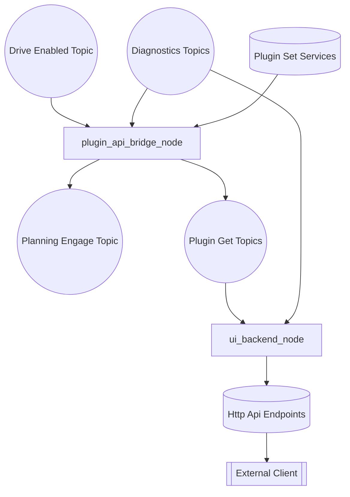
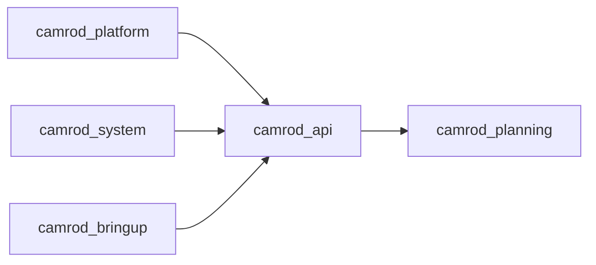

# camrod_api

## Role
`camrod_api` exposes ROS-friendly control/state endpoints for external UI or plugin clients.

## Package Diagram


Diagram legend: `[node/process]`, `((topic stream))`, `[(config or interface)]`, `[[external package or client]]`.

## Node Data Flow
| Node | Main Inputs | Main Outputs |
|---|---|---|
| `plugin_api_bridge_node.py` | `/platform/drive_enabled`, `/diagnostics`, service calls to `/api/plugin/set/*` | `/planning/engage`, `/api/plugin/get/engage`, `/api/plugin/get/ready`, `/api/plugin/get/operation_mode`, `/api/plugin/get/module_states`, `/api/plugin/get/ready_message` |
| `ui_backend_node.py` | `/api/plugin/get/*`, `/diagnostics_agg`, HTTP requests | HTTP responses (`/api/state`, `/api/engage`, `/api/operation_mode/*`) and service client calls to `/api/plugin/set/*` |

## Inter-Package Connections


## Topic Summary
### Input Topics
| Input Topic | Purpose |
|---|---|
| `/platform/drive_enabled` | Current drive-enabled state from platform gate |
| `/diagnostics` | Module diagnostics used for API readiness/state sync |
| `/diagnostics_agg` | Aggregated diagnostics used by UI readiness reporting |

### Output Topics
| Output Topic | Purpose |
|---|---|
| `/planning/engage` | Engage command forwarded to planning gate |
| `/api/plugin/get/engage` | Plugin-facing engage state |
| `/api/plugin/get/ready` | Plugin-facing readiness state |
| `/api/plugin/get/operation_mode` | Plugin-facing operation mode |
| `/api/plugin/get/module_states` | Plugin-facing module state summary |
| `/api/plugin/get/ready_message` | Plugin-facing readiness detail message |

### Service and HTTP Interfaces
| Interface | Purpose |
|---|---|
| `/api/plugin/set/*` (services) | External control path (engage/mode) |
| `/api/*` (HTTP) | UI/API access for web client |

## Practical Usage
```bash
ros2 launch camrod_api api.launch.py
```

Common overrides:
```bash
ros2 launch camrod_api api.launch.py enable_ui_backend:=false
ros2 launch camrod_api api.launch.py ui_host:=0.0.0.0 ui_port:=8010
ros2 launch camrod_api api.launch.py frontend_dir:=/absolute/path/to/frontend/build
```

## Config / Parameters
- Launch-only parameters are declared in `launch/api.launch.py`.
- Shared topic/service names are centralized in `_plugin_api_topics()` to keep bridge/UI consistent.
