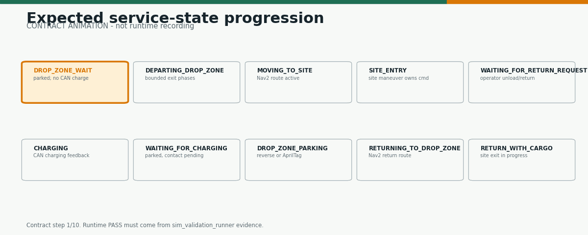
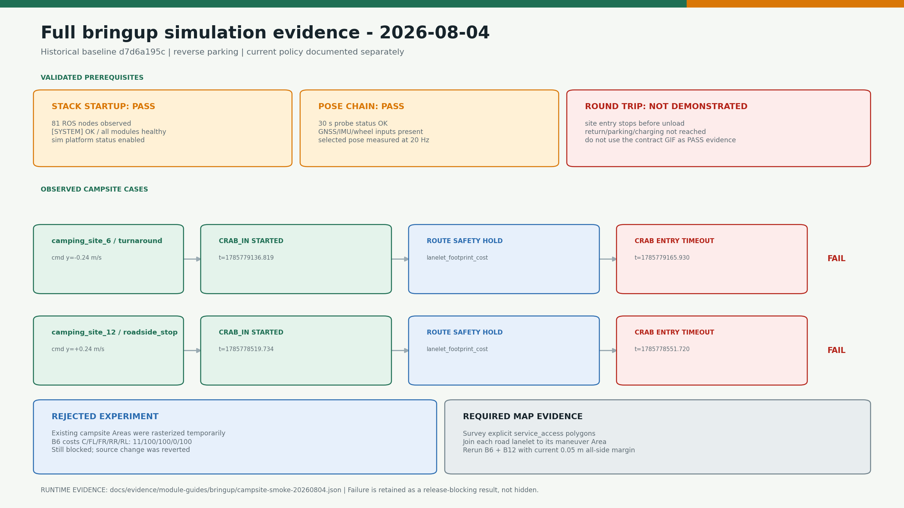
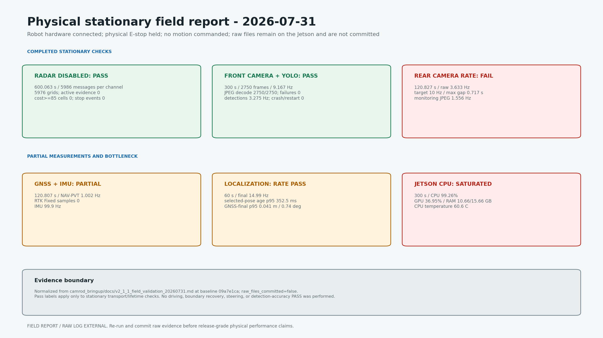

# camrod_bringup

<!-- HH_260804 - Keep the launch package readable by pairing the intended
contract with the latest measured verdict and compact launch tables. -->

Dependency-ordered full-stack launch, canonical configuration mirrors,
simulation profiles, and validation tools.


## At A Glance

| Uses | Function | Outputs |
|---|---|---|
| ROS 2 launch, package-owned YAML, bringup mirrors | Starts platform through UI in dependency order | One complete ROS graph with selected hardware/simulation profile |
| Fake sensor/platform publishers | Exercises message, state, planner, control, and UI contracts | Deterministic simulation topics and normalized platform feedback |
| Probe and field-test scripts | Captures timing, payload, recovery, and mission evidence | JSON, rosbag, logs, PNG/GIF derived reports |

## Expected And Measured

The animation is a **contract**, not a runtime recording.



The latest full-bringup runtime result is shown separately.



| Check | Result | Measured value |
|---|---|---:|
| Stack startup | PASS | 81 nodes; `[SYSTEM] OK` |
| Pose chain | PASS | 30 s probe; 20 Hz selected pose |
| B6 turnaround | FAIL CLOSED | `CRAB_IN -> lanelet_footprint_cost -> timeout` |
| B12 roadside stop | FAIL CLOSED | `CRAB_IN -> lanelet_footprint_cost -> timeout` |
| Complete round trip | NOT DEMONSTRATED | Return, parking, and charging were not reached |

The failed cases retain the `0.10 m` planning margin and complete-footprint
gate. Surveyed `service_access` geometry is required; the safety footprint must
not be reduced to make the smoke test pass.

## Physical Stationary Report



The 2026-07-31 report records real hardware with physical E-stop held and no
motion. Its referenced raw files remain on the Jetson and were not committed;
the image therefore labels this as a field report, not self-contained raw
evidence.

## Launches

| Launch | Purpose | Default profile |
|---|---|---|
| `bringup.launch.py` | Physical Jetson/Ranger stack | Hardware drivers enabled by launch defaults |
| `bringup_sim.launch.py` | Full deterministic simulation | Fake sensors and raw Ranger/BMS boundaries |
| `bringup_minimal.launch.py` | Reduced diagnostics/debug graph | Explicit module selection |
| `rviz.launch.py` | CAMROD visualization | Shared RViz config |

```bash
source ~/camrod_ws/install/setup.bash

ros2 launch camrod_bringup bringup_sim.launch.py
ros2 launch camrod_bringup bringup.launch.py
```

## Startup Order

| Order | Package group | Required before next group |
|---:|---|---|
| 1 | platform, sensor kit | Robot frame and platform contracts |
| 2 | map | Lanelet map and static planning grid |
| 3 | sensing, perception | Sensor streams, dynamic costs, detections |
| 4 | localization | Selected `robot_center_link` pose |
| 5 | planning | Nav2 lifecycle and route servers |
| 6 | control | Final gate, maneuver, recovery, and parking owner |
| 7 | system, UI, voice | Health and operator surfaces |

## Canonical Configuration

| Path | Scope |
|---|---|
| `config/bringup/launch_defaults.yaml` | Feature selection and package parameter-file routing |
| `config/{package}/` | Synchronized deployment mirrors of package-owned YAML |
| `config/simulation/` | Fake sensor/platform inputs and simulation-only values |
| `config/system/diagnostics/{default,sim}/` | Field and simulation checker profiles |

Package-owned configuration remains the design source. Bringup mirrors are
deployment copies and are covered by synchronization tests.

## Validation Tools

| Tool | Measures |
|---|---|
| `pose_latency_probe.py` | Topic rate, age, and pose-chain continuity |
| `camera_payload_probe.py` | Physical payload decode, dimensions, and rate |
| `sim_validation_runner.py` | Mission/state scenarios and assertions |
| `field_test_tool.sh snapshot` | Nodes, topics, parameters, diagnostics, and platform state |
| `field_test_tool.sh record-recovery` | Boundary hold, candidate, owner command, and pose timeline |
| `render_module_readme_assets.py` | Reproducible source/evidence diagrams |

```bash
python3 camrod_bringup/scripts/render_module_readme_assets.py
pytest -q camrod_bringup/test/test_module_readme_assets.py
```

## Evidence

| Type | Location |
|---|---|
| Normalized module evidence | `docs/evidence/module-guides/` |
| Preserved raw bringup logs | `docs/evidence/module-guides/bringup/raw/` |
| Released v2.1.3 evidence | `docs/evidence/v2.1.3/` |
| Interpretation and capture rules | [`docs/MODULE_VISUAL_GUIDE.md`](../docs/MODULE_VISUAL_GUIDE.md) |
