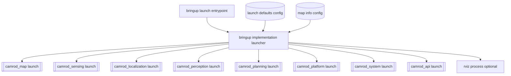
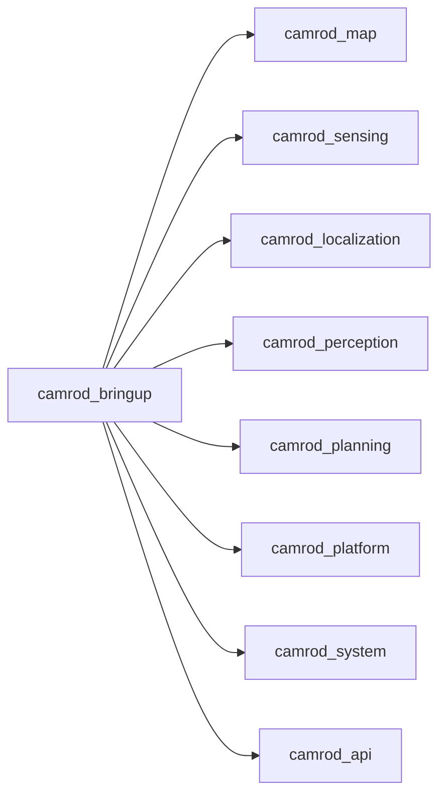

# camrod_bringup

## Role
`camrod_bringup` is the top orchestrator that starts package-level top launches in order, applies shared defaults, and passes shared map/origin/config overrides.

## Package Diagram


Diagram legend: `[node/process]`, `((topic stream))`, `[(config or interface)]`, `[[external package or launch]]`.

## Node / Process Data Flow
| Process | Main Inputs | Main Outputs |
|---|---|---|
| `bringup.launch.py` | user launch args | delegates to `_bringup_impl.py` |
| `_bringup_impl.py` | `config/bringup/launch_defaults.yaml`, `camrod_map/config/map_info.yaml`, CLI overrides | includes package top launches with unified arguments |
| `fake_sensor_publisher.py` (sim mode) | `map_path`, `origin_*`, optional `/platform/cmd_vel` | fake `/sensing/gnss/ublox_gps_node/fix`, `/sensing/imu/data`, `/platform/wheel/odometry`, `/perception/obstacles` |
| `rviz2` (optional) | all runtime topics + `camrod_operator.rviz` | operator visualization |

## Inter-Package Connections


## Topic / Argument Summary
| Type | Name | Purpose |
|---|---|---|
| Shared arg | `map_path`, `origin_lat`, `origin_lon`, `origin_alt` | common map reference passed to map/localization/planning/sim |
| Shared arg | `module_launch_gap_sec` | staged sequential package startup gap |
| Shared arg | `sim` | enables fake sensor flow |
| Shared arg | `rviz` | enables RViz startup |
| Runtime topic (sim) | `/platform/cmd_vel` | fake motion driver input in sim |
| Runtime topic (sim out) | `/sensing/gnss/ublox_gps_node/fix`, `/sensing/imu/data`, `/platform/wheel/odometry`, `/perception/obstacles` | fake sensor outputs |

## Practical Usage
```bash
ros2 launch camrod_bringup bringup.launch.py
```

Typical modes:
```bash
ros2 launch camrod_bringup bringup.launch.py sim:=true rviz:=true
ros2 launch camrod_bringup bringup.launch.py sim:=false module_launch_gap_sec:=1.0
ros2 launch camrod_bringup bringup.launch.py map_path:=/absolute/path/lanelet2_maps.osm
```

## Config Files
- `config/bringup/launch_defaults.yaml`: global defaults
- `config/bringup/cleanup_patterns.yaml`: pre-launch cleanup patterns
- package-level configs under `config/<package>/*` are passed to each module launch when overridden
