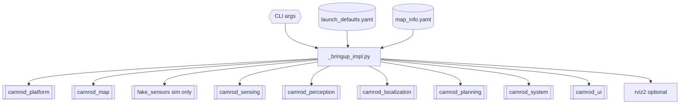
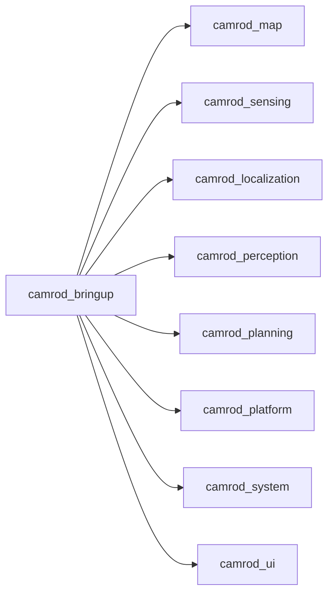

# camrod_bringup

## Role
Top-level launch orchestrator for the CAMROD stack. Reads `config/bringup/launch_defaults.yaml` and `camrod_map/config/map_info.yaml` to resolve shared parameters (map path, WGS84 origin, module gaps), then starts all package-level launches in order with a configurable stagger gap. Provides a single control point for enabling/disabling any module and overriding any parameter without editing package-internal configs.

## Package Diagram


Diagram legend: `[[module launch]]`, `[(config file)]`, `{{external input}}`.

## Module Launch Order

Modules start with `module_launch_gap_s` (default 1.0 s) stagger between each:

| Order | Module | Launch file |
|---|---|---|
| 1 | camrod_platform | `platform.launch.py` |
| 2 | camrod_map | `map.launch.py` |
| 3 | (sim) fake_sensors | `fake_sensors.launch.py` — only when `sim:=true` |
| 4 | camrod_sensing | `sensing.launch.py` |
| 5 | camrod_perception | `perception.launch.py` |
| 6 | camrod_localization | `localization.launch.py` |
| 7 | camrod_planning | `planning.launch.py` |
| 8 | camrod_system | `system.launch.py` |
| 9 | camrod_ui | `ui.launch.py` |

## Inter-Package Connections


## Launch

```bash
# Real robot bringup
ros2 launch camrod_bringup bringup.launch.py

# Simulation mode with RViz
ros2 launch camrod_bringup bringup.launch.py sim:=true rviz:=true

# Override map
ros2 launch camrod_bringup bringup.launch.py \
  map_path:=/absolute/path/lanelet2_maps.osm

# Reduce module stagger for fast machines
ros2 launch camrod_bringup bringup.launch.py \
  module_launch_gap_s:=0.5

# GNSS outage → DR mode → recovery integration test (sim)
ros2 launch camrod_bringup gnss_dr_test.launch.py
```

### gnss_dr_test.launch.py

Full-stack simulation test that verifies the GNSS DR fallback scenario end-to-end:

1. Starts `bringup.launch.py` in `sim:=true` mode (no hardware drivers).
2. Launches `gnss_dr_test_node` after a 1 s delay to allow stack startup.
3. Test node sends a camping-site goal, engages planning, then monitors:
   - Normal driving phase
   - GNSS failure → `DR_ONLY` mode (dead reckoning on IMU + wheel)
   - GNSS recovery → `NORMAL` mode with `gnss_recovery_hold_s` cmd_vel pause
   - Resumed driving after hold
4. Prints a `PASS / FAIL` summary for each phase check.

GNSS failure timing is controlled by `config/sim/fake_sensors.yaml`:

| Parameter | Description |
|---|---|
| `gnss_failure_after_s` | Seconds from fake-sensor start when GNSS stops |
| `gnss_recovery_after_s` | Seconds from fake-sensor start when GNSS resumes |

Key launch arguments:

| Argument | Default | Description |
|---|---|---|
| `sim` | `false` | Simulation mode (fake sensors) |
| `rviz` | `true` | Launch RViz operator view |
| `module_launch_gap_s` | `1.0` | Stagger delay between module starts [s] |
| `clean_before_launch` | `true` | Kill stale processes before starting |
| `clean_on_shutdown` | `true` | Cleanup pass on Ctrl+C |
| `map_path` | `""` | Lanelet2 .osm override (all modules) |
| `origin_lat/lon/alt` | (from map_info.yaml) | WGS84 map origin override |
| `use_eskf` | `true` | ESKF state estimator (false = EKF) |
| `enable_nav2_lifecycle_retry` | `true` | Recover Nav2 lifecycle on startup race |
| `require_localization_ready` | `false` | Gate Nav2 on drop zone match |
| `enable_state_machine` | `false` | Planning mission state machine |
| `enable_progress` | `true` | Remaining distance/time/completion% publisher |
| `cmd_vel_gate_cost_stop_enable` | `true` | Cost-based obstacle stop |
| `cmd_vel_gate_speed_dependent_lookahead` | `true` | Physics-based braking distance |
| `enable_yaw_alignment_zone` | `false` | Heading alignment enforcement at named map zones |
| `yaw_alignment_zones_file` | `""` | Manual zone YAML path |
| `enable_plugin_api` | `true` | Plugin API bridge node |
| `enable_api_ui` | `true` | HTTP UI backend |
| `api_ui_host` | `127.0.0.1` | UI bind address |
| `api_ui_port` | `8010` | UI bind port |
| `ranger_driver_enable` | `false` | Ranger CAN driver (real hardware) |
| `diagnostics_profile` | `default` | System diagnostics config profile |

## Config Files

| File | Purpose |
|---|---|
| `config/bringup/launch_defaults.yaml` | Single source of truth: all module defaults (runtime, localization, planning, sensing, platform, perception, system, namespaces, topics, map) |
| `config/bringup/cleanup_patterns.yaml` | 125+ process kill patterns run before launch and on shutdown |
| `config/map/map_info.yaml` | Bringup-level map origin override (mirrors camrod_map/config/map_info.yaml) |
| `config/localization/filter/eskf.yaml` | ESKF parameter overrides for bringup |
| `config/localization/filter/monitor.yaml` | Monitor overrides for bringup |
| `config/localization/source/input_adapter.yaml` | Adapter overrides for bringup |
| `config/planning/nav2_base.yaml` | Nav2 base parameter overrides |
| `config/planning/nav2_vehicle.yaml` | Vehicle footprint/dynamics overrides |
| `config/sensing/sensing_params.yaml` | Sensing parameter overrides |
| `config/sensing/lidar/cost_grid.yaml` | LiDAR cost grid overrides |
| `config/sensing/radar/cost_grid.yaml` | Radar cost grid overrides |
| `config/sensing/inflation_cost_grid.yaml` | Merged cost grid overrides |
| `config/sensing/gnss/zed_f9p_rover.yaml` | u-blox ZED-F9P GNSS driver |
| `config/sensing/imu/microstrain_cv7.yaml` | Microstrain CV7 IMU |
| `config/sensing/imu/microstrain_gq7.yaml` | Microstrain GQ7 IMU |
| `config/platform/ranger_params.yaml` | Ranger CAN driver overrides |
| `config/sensor_kit/robot_params.yaml` | Robot geometry overrides |
| `config/system/diagnostics/default/` | Full diagnostics config profile (mirrors camrod_system) |
| `config/sim/fake_sensors.yaml` | Fake sensor publisher parameters (sim mode) |
| `config/planning/camping_sites.yaml` | Camping-site goal positions; sites 1–12 include `recall_x/y/z/yaw_deg` for road-snap navigation on recall; site 13 uses site 12's road snap for both normal and recall navigation |
| `config/map/drop_zones.yaml` | Drop zone positions (exported from lanelet2 map, used for localization initialization and state machine startup goal) |

### Config Override Sentinel

All param file arguments default to `__module_default__`, meaning the package-internal config is used. To override a specific package's config from bringup, set the corresponding `*_param_file` argument to an absolute path:

```bash
ros2 launch camrod_bringup bringup.launch.py \
  filter_eskf_param_file:=/path/to/custom_eskf.yaml
```
