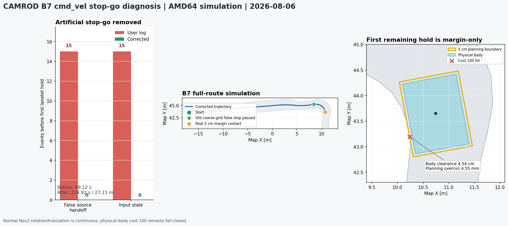

# camrod_bringup

<!-- HH_260805 - Synchronize scoped component shutdown, LiDAR-only SHM, and
the optional-grid diagnostic contract. -->
<!-- HH_260806 - Add map-v16 campsite sequencing, measured body geometry, and
arrival-only validation for constrained roadside sites. -->
<!-- HH_260806 - Record the B7 clear-road stop-go regression and independent lanelet safety grid. -->
<!-- HH_260806 - Record the B8 RPP curve-tracking and lookahead comparison. -->
<!-- HH_260806 - Record the 3 km/h active speed profile and bounded localization smoke result. -->
<!-- HH_260807 - Record map-v17 repeated service and safe persistent-obstacle handling. -->

Dependency-ordered full-stack launch, canonical configuration mirrors,
simulation profiles, and validation tools.


## Actual Simulation Runtime


`SIM RUNTIME CAPTURE`: actual RViz output from
`bringup.launch.py sim:=true rviz:=true`, not the contract renderer and not a
physical drive. The orange path is the dispatched B6 route.

## At A Glance

| Uses | Function | Outputs |
|---|---|---|
| ROS 2 launch, package-owned YAML, bringup mirrors | Starts platform through UI in dependency order | One complete ROS graph with selected hardware/simulation profile |
| Fake sensor/platform publishers | Exercises message, state, planner, control, and UI contracts | Deterministic simulation topics and normalized platform feedback |
| Probe and field-test scripts | Captures timing, payload, recovery, and mission evidence | JSON, rosbag, logs, PNG/GIF derived reports |

## Expected And Measured

The animation is a **contract**, not a runtime recording.


The latest full-bringup runtime result is shown separately.


| Check | Result | Measured value |
|---|---|---:|
| Stack startup | PASS | Fresh isolated map-v17 graph reached `[SYSTEM] OK` |
| B1 -> B2 -> B3 continuous service | PASS (3/3) | 677.237 s, zero restart; full site/RETURN/drop-zone/parking/charging/next-site lifecycle |
| Charger departure | PASS | B2/B3 left CHARGING through `DEPARTING_CHARGER`; stale charge contact did not close drive authorization |
| B2 current-map boundary recovery | PASS (3/3) | `REVERSE_YAW_RIGHT`, mission complete, 1.5 s clear proof, no second hold or retry latch |
| Persistent obstacle on 3.0 m lane | SAFE-HOLD PASS | One no-path preflight, no selector/ABORT loop, original mission resumed after clear |
| Pose chain | PASS | 30 s probe; 20 Hz selected pose |
| B1-B10 site maneuver round trip | PASS (10/10) | Every map-derived entry (`1.79-5.31 m`) completed crab, 180-degree turn, explicit RETURN, crab-out, and `DONE` |
| B11-B13 roadside arrival | PASS | Capped `0.60 m` crab, unload wait, `WAIT_RETURN`; no zero-turn or RETURN issued |
| B11-B13 return | FIELD-PENDING | Earlier on-lane alignment attempt was safely blocked by `lanelet_physical_body_cost` |
| B7 clear-road command continuity | PASS | `224.92 s`, `27.1492 m`; Nav2 handoff `0`, post-start stale `0`, input/output `14.983/14.996 Hz` |
| B8 RPP curve tracking | PASS | `59.931 m`, `GOAL_REACHED`; raw R/T switches `403 -> 0`; one recovered planning-margin contact |
| B8 lookahead `1.2 m` comparison | REJECTED | first margin release then recontact in `0.999 s`; retry latched and route did not complete |
| 3 km/h command and pose smoke | PASS (AMD64 SIM) | `11.74 m`; final max `3.000001 km/h`; pose `20.024 Hz`; max step `6.485 cm`; `>20 cm` jumps `0` |
| Rapid route recontact | PASS, FAIL CLOSED | One release; map v14 recontacted in 0.276 s (v13: 0.267/0.372 s), then latched with zero output |
| Map-v14 recovery rerun | PASS, FAIL CLOSED | route 0.366 s latch; reverse 0.0721 m; crab-left 0.3321 m; final commands zero |
| v2.1.4 release-map staged recovery | PASS, FAIL CLOSED | release SHA `e0b50f...e36d`; reverse-yaw max 0.05 rad/s; route recontact 0.335 s; crab-left 0.3378 m; final commands zero |
| Reduced-boundary route/margin/body run | PASS, HISTORICAL | `1.29160 x 0.87000 m` candidate evidence retained; it is not the active body geometry |
| Operator stop | PASS | `POST /ui/stop` returned HTTP 200; local owners and Nav2 canceled; state 16 published |
| Drop-zone parking/charging continuation | PASS (AMD64 SIM) | All three continuous-service cycles reached `WAITING_FOR_CHARGING -> CHARGING` |

The 2026-08-04 captures are historical map-v14 evidence, the staged map-v15
records are bound to the v2.1.4 release SHA, and the campsite policy media are
bound to map-v16. The current synchronized OSM pair is `map_version=17`, SHA
`8cd05c...5e021`; older results are intentionally not relabeled as current.
The active fabrication-inclusive
physical body is `1.39160 x 1.07000 m`, and the planning boundary is
`1.49160 x 1.17000 m` with `0.05 m` on every side. Physical-body cost 100 is an unrecoverable hard stop;
only margin-only contact can request a separately projected bounded escape.
The current map-v17 continuous-service result separately covers complete
drop-zone parking, charging feedback, and departure to the next campsite.



The [B7 regression record](../docs/assets/test_result/cmd-vel-stop-go-20260806/README.md)
also records the later real planning-margin contact; the full route is not
misreported as a completed campsite mission.


The [3 km/h structured record](../docs/assets/test_result/three-kph-localization-20260806/README.md)
keeps the active maneuver ratios, raw/final command trace, fusion inputs, bag
hash, and the explicit limitation that fake 10 Hz GNSS does not validate the
physical 1 Hz dual-GNSS path.


[Open the campsite sequencing GIF](../docs/assets/test_result/camping-site-sequencing-20260806/campsite-phase-sequence.gif).


[Open the continuous-service GIF](../docs/assets/test_result/v2-1-5-service-validation-20260807/repeated-service-timeline.gif).


[Open the map-v14 recovery GIF](../docs/assets/module-guides/control/map-v14-boundary-recovery.gif).


[Open the map-v15 recovery GIF](../docs/assets/module-guides/control/map-v15-boundary-recovery.gif).

## Physical Stationary Report


The 2026-07-31 report records real hardware with physical E-stop held and no
motion. Its referenced raw files remain on the Jetson and were not committed;
the image therefore labels this as a field report, not self-contained raw
evidence.

## Launches

| Launch | Purpose | Default profile |
|---|---|---|
| `bringup.launch.py` | Physical Jetson/Ranger stack | Hardware drivers enabled by defaults |
| `bringup.launch.py sim:=true` | Full deterministic simulation | Fake sensors and raw Ranger/BMS boundaries |
| `bringup.launch.py sim:=true rviz:=true` | Simulation plus operator visualization | Shared CAMROD RViz config |

The physical operator window is a fullscreen Chromium kiosk by default. It
waits for backend readiness and uses an isolated profile, GPU rasterization,
zero-copy compositor, and disabled background throttling. WebKit remains
available with `operator_ui_window_engine:=webkit`; `auto` tries Chromium and
then WebKit. The launch-level `operator_ui_window_fullscreen:=false` override is
available for maintenance, and headless runs should set
`enable_operator_ui_window:=false`. Actual Jetson GPU use, frame pacing, and CPU
reduction remain field measurements.

Normal Ctrl+C shutdown lets ROS launch stop its own children. The optional
post-shutdown cleanup is disabled by default to avoid racing component and HTTP
server teardown; `clean_before_launch` still removes stale processes before the
next run.

```bash
source ~/camrod_ws/install/setup.bash

ros2 launch camrod_bringup bringup.launch.py sim:=true rviz:=true
ros2 launch camrod_bringup bringup.launch.py
```

## Startup Order

| Order | Package group | Required before next group |
|---:|---|---|
| 1 | platform, sensor kit | Robot frame and platform contracts |
| 2 | map | Lanelet map and static planning grid |
| 3 | sensing, perception | Sensor streams, dynamic costs, detections |
| 4 | localization | Selected `robot_center_link` pose |
| 5 | planning | Nav2 lifecycle and route servers |
| 6 | control | Final gate, maneuver, recovery, and parking owner |
| 7 | system, UI, voice | Composed checker fault domains, health summary, and operator surfaces |

## Process And Transport Topology

| Scope | Production default | Opt-out / fallback |
|---|---|---|
| Camera -> YOLO | Existing component container with ROS intra-process | Separate package debug launches |
| Rear camera -> rectify -> AprilTag | One ROS intra-process container when physical rear camera, parking, and `parking_method:=apriltag` are active | `use_rear_camera_apriltag_container:=false` restores the three standalone owners |
| LiDAR preprocessing -> ground segmentation | `lidar_processing_container` with ROS intra-process | `use_lidar_processing_container:=false` |
| LiDAR cost grid | Not loaded; node/topic omitted from diagnostics | `enable_lidar_cost_grid:=true` loads it in the LiDAR container with DDS transport for transient-local QoS |
| Nav2 lifecycle servers | Planner/controller in `nav2_container`; vendor smoother/behavior/BT/lifecycle standalone | `use_nav2_container:=false` restores standalone planner/controller |
| System aggregate/status chain | Four nodes in serialized `system_core_container` | `use_system_tools_container:=false` restores standalone tools |
| Low-rate diagnostics | 24 checkers in four serialized fault-domain containers | `use_checker_components:=false` restores 24 standalone checker processes |
| Inter-process DDS | Host RMW; global SHM never applied | `enable_dds_shared_memory:=true` enables CycloneDDS/iceoryx only for a physical LiDAR driver group |

When explicitly enabled, RouDi starts only for non-simulation physical LiDAR.
The CycloneDDS environment is scoped to that launch group, so camera, Nav2,
system, UI, and the rest of the graph cannot consume iceoryx endpoints. This
removes the former full-graph capacity failure while keeping SHM default OFF
until the physical LiDAR path is measured on Jetson.

ROS 2 Humble retained checker entity/guard-condition references after context
shutdown and could unload RMW code while CycloneDDS `tev`/`recv` threads still
ran. `camrod_runtime` now owns one explicit context, detaches components,
retains plugin code through cleanup, and bypasses only the unsafe DSO static
destructor phase after explicit teardown. Four checker groups, system core,
and the Nav2 planner/controller container then reached `[SYSTEM] OK` and clean
exit in 3/3 final amd64 runs; one no-topology-override run also passed.
Standalone fallbacks remain available. Jetson resource and ten-cycle mission,
cancel, restart, camera, and physical-rate acceptance remain in `TODOLIST.txt`.

## Canonical Configuration

| Path | Scope |
|---|---|
| `config/bringup/launch_defaults.yaml` | Feature selection and package parameter-file routing |
| `config/middleware/cyclonedds_shm.xml` | Default-off CycloneDDS shared-memory profile scoped to the physical LiDAR driver group |
| `config/middleware/iceoryx_roudi.toml` | RouDi pools through 8 MiB chunks for image/cloud traffic |
| `config/{package}/` | Synchronized deployment mirrors of package-owned YAML |
| `config/planning/nav2_planner_profiles/production.yaml` | Loads only `LaneletRoute` plus width-gated `SmacLattice` |
| `config/planning/nav2_controller_profiles/production.yaml` | Loads only mission `RPP` plus manual-goal `RotationShim` |
| `config/simulation/` | Fake sensor/platform inputs and simulation-only values |
| `config/system/diagnostics/{default,sim}/` | Field and simulation checker profiles |

Package-owned configuration remains the design source. Bringup mirrors are
deployment copies and are covered by synchronization tests.

## Validation Tools

| Tool | Measures |
|---|---|
| `pose_latency_probe.py` | Topic rate, age, and pose-chain continuity |
| `camera_payload_probe.py` | Physical payload decode, dimensions, and rate |
| `sim_validation_runner.py` | Mission/state scenarios and assertions |
| `field_test_tool.sh snapshot` | Nodes, topics, parameters, diagnostics, and platform state |
| `field_test_tool.sh record-recovery` | Boundary hold, candidate, owner command, and pose timeline |
| `render_module_readme_assets.py` | Reproducible source/evidence diagrams |
| `automatic_route_recovery_probe.py` | Production gate/controller crab, reverse, retry, latch, and final command timeline |
| `render_automatic_recovery_results.py` | Map-version-checked PNG/GIF from the three recovery timelines |
| `render_robot_boundary_validation.py` | Consolidated normal-route, margin, and physical-body simulation PNG |
| `render_camping_site_sequence_results.py` | Structured B1-B10 turnaround and B11-B13 roadside-arrival PNG/GIF |
| `render_v2_1_5_service_results.py` | Repeated-service, obstacle, and B2 recovery JSON -> PNG/GIF |

```bash
python3 camrod_bringup/scripts/render_module_readme_assets.py
pytest -q camrod_bringup/test/test_module_readme_assets.py
```

## Evidence

| Type | Location |
|---|---|
| Normalized module evidence | `docs/evidence/module-guides/` |
| Concise runtime excerpt | `docs/evidence/module-guides/bringup/raw/runtime-visual-capture-20260804.log` |
| Live runtime screen metadata | [`runtime-visual-capture-20260804.json`](../docs/evidence/module-guides/bringup/runtime-visual-capture-20260804.json) |
| Released v2.1.3 evidence | `docs/evidence/v2.1.3/` |
| Map-v14 recovery rerun | [`map-v14-boundary-recovery/`](../docs/evidence/v2.1.3/map-v14-boundary-recovery/) |
| Map-v15 staged recovery | [`map-v15-boundary-recovery/`](../docs/evidence/v2.1.4/map-v15-boundary-recovery/) |
| Current boundary runtime tests | [`robot-boundary-adjustment-20260806/`](../docs/assets/test_result/robot-boundary-adjustment-20260806/) |
| Current campsite sequencing tests | [`camping-site-sequencing-20260806/`](../docs/assets/test_result/camping-site-sequencing-20260806/) |
| Current RPP curve-tracking tests | [`rpp-curve-tracking-20260806/`](../docs/assets/test_result/rpp-curve-tracking-20260806/) |
| Current 3 km/h command/localization smoke | [`three-kph-localization-20260806/`](../docs/assets/test_result/three-kph-localization-20260806/) |
| Current map-v17 service/safety acceptance | [`v2-1-5-service-validation-20260807/`](../docs/assets/test_result/v2-1-5-service-validation-20260807/) |
| Interpretation and capture rules | [`docs/MODULE_VISUAL_GUIDE.md`](../docs/MODULE_VISUAL_GUIDE.md) |
