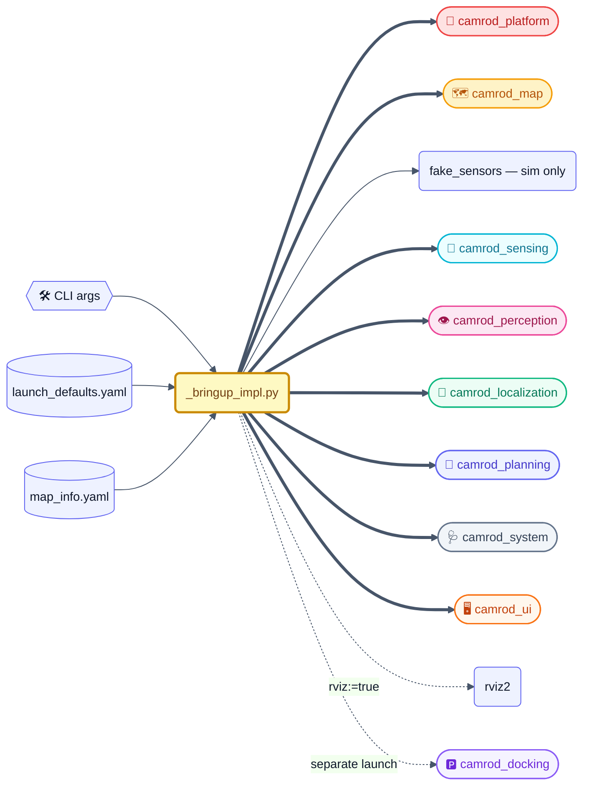
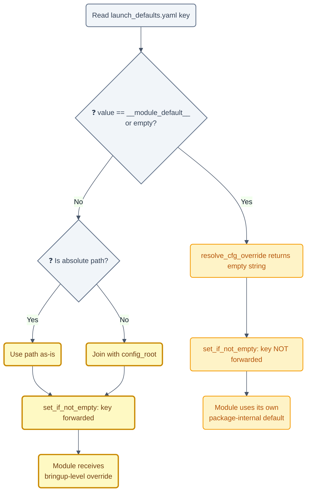

# 🚀 camrod_bringup — Top-level orchestrator

## 1. 📋 Summary

`camrod_bringup` is the single top-level launch orchestrator for the CAMROD stack. Its only job is to read two YAML files — `config/bringup/launch_defaults.yaml` and `camrod_map/config/map_info.yaml` — resolve all shared parameters (map path, WGS84 origin, module-level config overrides), and then start every package-level launch file in a deterministic, staggered sequence.

**What it does:**
- Resolves map origin (LLH + UTM), map path, and per-module param file overrides from `launch_defaults.yaml`.
- Kills stale processes before starting (configurable `clean_before_launch`).
- Launches all modules with a configurable inter-module stagger (`module_launch_gap_s`).
- Exposes every tunable value as a CLI argument — no package-internal file needs to be edited for common deployments.

**What it does NOT do:**
- It does not implement any runtime logic (no ROS nodes of its own in the normal launch path).
- It does not publish topics, subscribe to sensors, or perform any robot control.
- It does not own parameter semantics: each module's launch file remains the authority on its own defaults; bringup only supplies overrides when explicitly configured.

---

## 2. ⚡ Quick Start

```bash
# Real robot bringup (default: EKF localization, RViz on, all hardware drivers)
ros2 launch camrod_bringup bringup.launch.py

# Simulation with RViz (fake sensors, no hardware drivers)
ros2 launch camrod_bringup bringup.launch.py sim:=true rviz:=true

# Disable a single module — example: skip GNSS driver
ros2 launch camrod_bringup bringup.launch.py enable_gnss:=false

# Override a module's param file from the CLI
ros2 launch camrod_bringup bringup.launch.py \
  filter_ekf_param_file:=/absolute/path/to/custom_ekf.yaml

# Override the lanelet2 map
ros2 launch camrod_bringup bringup.launch.py \
  map_path:=/absolute/path/to/lanelet2_maps.osm

# Use the current Park validation map/profile
ros2 launch camrod_bringup bringup.launch.py sim:=true \
  map_path:="/home/hong/camrod_ws/src/lanelet2_maps_(copy_park).osm"

# Full-stack GNSS DR fallback integration test (sim)
ros2 launch camrod_bringup gnss_dr_test.launch.py

# Automated sim validation after bringup is running
ros2 run camrod_bringup sim_validation_runner.py --ros-args \
  -p run_obstacle_replan:=true \
  -p report_file:=/tmp/camrod_sim_validation_manual.json

# Camping-site route + site maneuver + drop-zone reverse parking validation
ros2 run camrod_bringup sim_validation_runner.py --ros-args \
  -p skip_manual_goal:=true \
  -p run_camping:=true \
  -p camping_wait_drop_zone:=true \
  -p camping_timeout_s:=420.0 \
  -p report_file:=/tmp/camrod_sim_validation_camping_full.json
```

> HH_260622 - `map_info.yaml` now defaults to the `copy_park` validation map. `_bringup_impl.py` also infers `map_profile` from `map_profile` or the OSM filename and loads matching `drop_zones (<profile>).yaml` / `camping_sites (<profile>).yaml` when those files exist.
> HH_260630 - When `sim:=true`, bringup selects `camrod_system/config/system_checker_sim.yaml` in addition to the `diagnostics/sim` profile. Fake-sensor runs therefore check the simulated public topic graph without requiring real GNSS/IMU/LiDAR/camera/Ranger driver nodes.
> HH_260630 - UI manual engage and camping-site destination buttons publish `/platform/drive_enable` together with the relevant planning engage latch. `/platform/set_enabled` remains a CLI/debug fallback, not the normal operator path.
> HH_260630 - Package config trees are synchronized into `camrod_bringup/config`; bringup passes `config/system/diagnostics` to `camrod_system` so the synchronized system checker profiles are actually used.
> HH_260702 - Latest sim validation passed baseline rates, all radar directions, LiDAR/Radar directional cost-stop, manual goal navigation, status-only obstacle blockage, campsite maneuver, return-to-drop-zone, and drop-zone reverse parking. Full real-sensor bringup with RViz/UI/voice/cameras/YOLO/docking enabled is a load probe; use the lighter field profile for drive validation.
> HH_260703 - Field patch adds GNSS `/dev/ttyACM1` config sync, cost-stop latch, stale inflation-grid fail-closed behavior, live LiDAR/Radar cost preservation inside the ego-clear footprint, side-radar self-echo threshold tuning for crab safety, and diagnostics policy that keeps non-motion camera/raw-LiDAR/costmap issues visible without forcing every transient into planning `ERROR_STOP`.
> HH_260706 - Field tuning keeps route-heading safety enabled with slower angular correction and raises campsite crab speed to reduce startup oscillation and long campsite entry time.
> HH_260706 - Bringup binds the operator UI to `0.0.0.0:8010` by default so the web UI is reachable through the robot IP; standalone `camrod_ui` launch can still override `ui_host`.
> HH_260706 - Field safety tuning adds short near-body side/rear dynamic guards in `planning_cmd_vel_gate` and reduces perception-marker cost radius so detected vehicles do not create oversized circular cost disks.
> HH_260706 - v2.0.1 keeps `camrod_bringup/config/sensing/*` synchronized with package-level sensing configs for GNSS, LiDAR cost grid, and ground segmentation.

---

## 3. 🗺️ System Position



> **Diagram legend** 🧩 ROS node · ⚙️ Config · 🛠️ Hardware · ==> critical · -.-> optional/conditional

`bringup.launch.py` is a thin wrapper that hot-loads `_bringup_impl.py` at runtime so YAML edits apply immediately without rebuilding.

*Figure 1 — CAMROD stack system position. `camrod_bringup` is the single entry point that orchestrates every downstream package.*

---

## 4. ⏱️ Launch Sequence

```mermaid
%%{init: {'theme': 'base', 'themeVariables': {'fontFamily': 'ui-sans-serif, system-ui, sans-serif', 'fontSize': '14px', 'primaryColor': '#EEF2FF', 'primaryTextColor': '#0F172A', 'primaryBorderColor': '#6366F1', 'lineColor': '#475569'}, 'flowchart': {'curve': 'basis', 'htmlLabels': true, 'padding': 12}}}%%
graph TD
  classDef sensing      fill:#ECFEFF,stroke:#06B6D4,stroke-width:1.5px,color:#0E7490;
  classDef localization fill:#ECFDF5,stroke:#10B981,stroke-width:1.5px,color:#047857;
  classDef mapping      fill:#FEF3C7,stroke:#F59E0B,stroke-width:1.5px,color:#B45309;
  classDef perception   fill:#FCE7F3,stroke:#EC4899,stroke-width:1.5px,color:#9D174D;
  classDef planning     fill:#EEF2FF,stroke:#6366F1,stroke-width:1.5px,color:#4338CA;
  classDef platform     fill:#FEE2E2,stroke:#EF4444,stroke-width:1.5px,color:#B91C1C;
  classDef docking      fill:#F5F3FF,stroke:#8B5CF6,stroke-width:1.5px,color:#6D28D9;
  classDef system       fill:#F1F5F9,stroke:#64748B,stroke-width:1.5px,color:#334155;
  classDef ui           fill:#FFF7ED,stroke:#F97316,stroke-width:1.5px,color:#C2410C;
  classDef highlight    fill:#FEF9C3,stroke:#CA8A04,stroke-width:2.5px,color:#713F12;

  LAUNCH(ros2 launch bringup.launch.py) ==> CFG
  CFG(Config resolution\nlaunch_defaults + map_info) ==> CLEAN
  CLEAN(Cleanup\nclean_before_launch pkill) ==> S0

  S0(["🤖 Slot 0 · camrod_platform\nTF + /platform/status/*"]) ==>|+ module_launch_gap_s| S1
  S1([🗺️ Slot 1 · camrod_map\nlanelet2 map load]) ==>|+ module_launch_gap_s| S2
  S2([🔬 Slot 2 · fake_sensors\nsim only]) ==>|+ module_launch_gap_s| S3
  S3([🎯 Slot 3 · camrod_sensing\nhardware drivers + cost grids]) ==>|+ module_launch_gap_s| S4
  S4([👁️ Slot 4 · camrod_perception\nLiDAR + YOLO obstacles]) ==>|+ module_launch_gap_s| S5
  S5([📍 Slot 5 · camrod_localization\nGNSS + IMU + wheel fusion]) ==>|+ module_launch_gap_s| S6
  S6([🧭 Slot 6 · camrod_planning\nNav2 stack]) ==>|+ module_launch_gap_s| S7
  S7([🩺 Slot 7 · camrod_system\ndiagnostics validators]) ==>|+ module_launch_gap_s| S8
  S8([🖥️ Slot 8 · camrod_ui\nHTTP API + plugin bridge])

  class S0 platform
  class S1 mapping
  class S2 sensing
  class S3 sensing
  class S4 perception
  class S5 localization
  class S6 planning
  class S7 system
  class S8 ui
```



> ⚠️ **`module_launch_gap_s` too short can cause lifecycle failures.** On ARM targets or slow storage, values below `0.8 s` may cause Nav2 lifecycle manager to log `ERROR: Failed to get state for node`. Use `1.5` or `2.0` on constrained hardware. See Troubleshooting §11.

> 📌 **HH_260618:** Final parking is method-selected. `parking_method:=rule_based` launches `camrod_parking`; `parking_method:=docking` launches `camrod_docking`. Launch conditions prevent both from running, and `camrod_system` reports ERROR if neither method is healthy.

*Figure 2 — Staggered module launch sequence. Each slot starts at `N × module_launch_gap_s` seconds after cleanup exits. The final parking slot is mutually exclusive: rule-based parking or AprilTag/opennav docking.*

---

## 5. ⚙️ Runtime Architecture

`_bringup_impl.py` executes in four stages at launch time:

1. **Config resolution** — reads `launch_defaults.yaml` and `map_info.yaml` to build default values for every `DeclareLaunchArgument`.
2. **Cleanup** — when `clean_before_launch:=true`, runs `config/bringup/cleanup_patterns.yaml` (125+ kill patterns) synchronously via `bash pkill` before any module starts.
3. **Staggered module launch** — wraps each module `IncludeLaunchDescription` in a `TimerAction` with period `idx * module_launch_gap_s`. Modules start only after the cleanup process exits.
4. **Shutdown cleanup** — when `clean_on_shutdown:=true`, re-runs the same kill patterns on `OnShutdown` to prevent zombie nodes.

No bringup-owned ROS nodes run at steady state. RViz is the only direct node launched by bringup (conditionally).

---

## 6. 🔌 Interface Contract

### Inputs to bringup

| Source | Type | Role |
|---|---|---|
| CLI `name:=value` args | Launch arguments | Runtime overrides for any declared parameter |
| `config/bringup/launch_defaults.yaml` | YAML | Default values for all launch arguments; single place to change persistent defaults |
| `camrod_map/config/map_info.yaml` | YAML | WGS84 / UTM map origin; map file path |

### Outputs of bringup

Bringup itself produces no ROS topics. Its outputs are the launched subprocess trees of the modules listed in the Module Launch Order table.

---

## 7. 📦 Module Launch Order

Modules start with `module_launch_gap_s` (default `1.0 s`) stagger. The timer index starts at 0 and increments by 1 per slot, so actual start time for slot `N` is `N × module_launch_gap_s` seconds after cleanup exits.

| Order | Module | Launch file | Why this order |
|---|---|---|---|
| 0 | camrod_platform | `platform.launch.py` | Must publish `/platform/status/*` and TF before any consumer node starts |
| 1 | camrod_map | `map.launch.py` | All planners and localizers need the lanelet2 map loaded before subscription |
| 2 | (sim) fake_sensors | `fake_sensors.launch.py` | Sim-only: must inject synthetic GNSS/IMU/wheel before sensing/localization tries to subscribe |
| 3 | camrod_sensing | `sensing.launch.py` | Hardware drivers and cost-grid nodes; depends on TF from platform |
| 4 | camrod_perception | `perception.launch.py` | Processes sensing output (LiDAR obstacles, YOLO); depends on sensing topics being present |
| 5 | camrod_localization | `localization.launch.py` | Fuses GNSS + IMU + wheel; depends on sensing and platform topics |
| 6 | camrod_planning | `planning.launch.py` | Nav2 stack; depends on map, localization pose, and cost grids |
| 7 | camrod_system | `system.launch.py` | Diagnostics validators; monitors all modules after they are up |
| 8 | camrod_ui | `ui.launch.py` | HTTP API and plugin bridge; last because it depends on all other module services |

> 📌 **HH_260618:** `camrod_docking` is launched by `bringup.launch.py` only when `parking_method:=docking`. This keeps marker-based docking separate from rule-based `camrod_parking`.

---

## 8. 🔑 Key Behaviors

### Module Stagger Gap

**Trigger:** `module_launch_gap_s` is set (default `1.0`).

**Internal logic:** `_bringup_impl.py` wraps each module `IncludeLaunchDescription` in `TimerAction(period=idx * module_launch_gap_s)`. All timers are grouped inside a single `GroupAction` that is itself delayed by 1 s after the cleanup process exits.

**Output effect:** Module `N` starts at wall time `≈ 1 + N × module_launch_gap_s` seconds after launch command.

**Operator-visible symptom:** On fast machines with SSD, `module_launch_gap_s:=0.5` is sufficient. On ARM targets or slow storage, values below `0.8` may cause lifecycle race conditions in Nav2.

**Related params:** `module_launch_gap_s`

**Related topics:** None (pre-topic).

---

### `__module_default__` Sentinel

**Trigger:** Any `*_param_file` key in `launch_defaults.yaml` has value `__module_default__`.

**Internal logic:**



> **Diagram legend** 🧩 ROS node · ⚙️ Config · {❓} Decision · Yellow = package-default path · Gold = bringup-override path

**Output effect:** When a key resolves to empty, bringup does NOT pass the argument to the module launch. The module then uses its own `DeclareLaunchArgument` default — typically a path inside the module's `config/` directory. This ensures bringup overrides are strictly opt-in; a new field added to a module is not accidentally nulled by bringup.

**Operator-visible symptom:** `ros2 launch camrod_bringup bringup.launch.py filter_ekf_param_file:=/tmp/test.yaml` overrides EKF params. Omitting the argument (or leaving it as `__module_default__` in YAML) silently uses the module default.

**Related params:** All `*_param_file` and `*_yaml` keys in `launch_defaults.yaml`.

*Figure 3 — `__module_default__` sentinel resolution. Blank/sentinel values keep module-internal defaults; explicit paths are forwarded as overrides.*

---

### Param Override Mechanism

**Trigger:** Operator sets a `*_param_file` CLI argument to an absolute path.

**Internal logic:** `resolve_cfg_override` strips `__module_default__` sentinel. `set_if_not_empty` forwards non-empty strings as launch arguments to the target module. EKF is the default backend; ESKF-specific sim overrides are applied only when `filter_type:=eskf`.

**Output effect:** The target module receives the override path and loads it instead of its internal default.

**Operator-visible symptom:** YAML changes in the override file apply on the next `ros2 launch` without rebuilding any package. Source-tree config root is preferred over install-tree config root automatically.

**Related params:** Any `*_param_file` key, `config_root`, `launch_defaults_file`, `CAMROD_CONFIG_ROOT` env var.

---

## 9. 🚀 Launch Arguments

### bringup.launch.py arguments

| Argument | Default | Description |
|---|---|---|
| `sim` | `false` | Simulation mode (fake sensors, no hardware drivers) |
| `rviz` | `true` | Launch RViz2 operator view |
| `module_launch_gap_s` | `1.0` | Stagger delay between module starts [s] |
| `clean_before_launch` | `true` | Kill stale processes before starting |
| `clean_on_shutdown` | `true` | Cleanup pass on Ctrl+C |
| `map_path` | *(auto-discovered)* | Lanelet2 `.osm` override path |
| `origin_lat` / `origin_lon` / `origin_alt` | *(from map_info.yaml)* | WGS84 map origin override |
| `utm_origin_easting` / `utm_origin_northing` | *(from map_info.yaml)* | UTM map origin override |
| `filter_type` | `ekf` | Explicit filter selector: `ekf` \| `eskf` |
| `enable_nav2_lifecycle_retry` | `true` | Recover Nav2 lifecycle on startup race |
| `require_localization_ready` | `false` | Gate Nav2 startup on localization readiness |
| `enable_state_machine` | `false` | Enable planning mission state machine |
| `enable_progress` | `true` | Remaining distance/time/completion% publisher |
| `nav2_selected_planner` | `LaneletRoute` | HH_260619 - default lanelet-centerline global route planner; `SmacLattice` remains available for free-space diagnostics |
| `bt_navigator.use_start_pose_override` | `true` | HH_260619 - planner start override supplies snapped start XY with current yaw; it is not the primary fix for centerline routing |
| `planning_cmd_vel_gate_cost_stop_enable` | `true` | Cost-based obstacle stop in planning gate |
| `planning_cmd_vel_gate_cost_stop_latch_enable` | `true` | HH_260703 - Latch live LiDAR/Radar cost stops until the corridor is continuously clear |
| `planning_cmd_vel_gate_cost_stop_clear_required_s` | `2.0` | HH_260703 - Required continuous clear window before releasing a latched dynamic stop |
| `planning_cmd_vel_gate_cost_grid_stale_stop_enable` | `true` | HH_260703 - Fail closed when merged inflation grid is stale or missing |
| `planning_cmd_vel_gate_cost_grid_stale_timeout_s` | `1.0` | HH_260703 - Maximum age for `/planning/cost_grid/inflation` before zeroing cmd_vel |
| `planning_cmd_vel_gate_route_heading_lookahead_m` | `2.0` | HH_260706 - Longer path tangent sample smooths startup alignment when pose/cost updates lag |
| `planning_cmd_vel_gate_route_heading_error_exit_deg` | `35.0` | HH_260706 - Release route-heading alignment before delayed pose feedback causes overshoot |
| `planning_cmd_vel_gate_route_heading_angular_kp` | `0.8` | HH_260706 - Lower angular gain for startup yaw damping |
| `planning_cmd_vel_gate_route_heading_max_angular_z` | `0.35` | HH_260706 - Lower angular clamp for less left-right correction chatter |
| `planning_cmd_vel_gate_lanelet_safety_enable` | `true` | HH_260618 - raw `/map/cost_grid/lanelet` hard stop before inflation ego-clear |
| `planning_cmd_vel_gate_lanelet_safety_check_reverse` | `false` | Keep reverse parking under mission-specific parking control |
| `planning_cmd_vel_gate_lanelet_safety_check_lateral` | `false` | Keep campsite crab motion under mission-specific site control |
| `planning_cmd_vel_gate_lateral_cmd_bypass_static_cost_stop` | `true` | HH_260618 - site-crab lateral cmd_vel may cross static lanelet/global-path front/side/rear cost; LiDAR/Radar source cost still stops |
| `planning_cmd_vel_gate_speed_dependent_lookahead` | `true` | Physics-based braking distance lookahead |
| `planning_cmd_vel_gate_cost_width_m` | `1.27` | HH_260623 - measured body width plus 0.10 m margin per side |
| `planning_cmd_vel_gate_front_lookahead_min_m` | `1.30137` | HH_260623 - measured front body extent plus 0.10 m margin |
| `planning_cmd_vel_gate_body_near_dynamic_stop` | `true` | HH_260706 - keep short side/rear dynamic stops active during forward path-following |
| `planning_cmd_vel_gate_body_near_side_lookahead_m` | `0.75` | HH_260706 - near-body side stop distance |
| `planning_cmd_vel_gate_body_near_rear_lookahead_m` | `0.55` | HH_260706 - near-body rear stop distance |
| `planning_cmd_vel_gate_body_near_maneuver_side_lookahead_m` | `0.55` | HH_260706 - reduced side stop distance for crab/reverse maneuvers |
| `planning_cmd_vel_gate_body_near_maneuver_rear_lookahead_m` | `0.45` | HH_260706 - reduced rear stop distance for crab/reverse maneuvers |
| `planning_cmd_vel_gate_side_corridor_width_m` | `1.69160` | HH_260623 - measured body length plus 0.10 m front/rear margin |
| `planning_cmd_vel_gate_rear_corridor_width_m` | `1.27` | HH_260623 - measured body width plus 0.10 m margin per side |
| `enable_yaw_alignment_zone` → `planning_cmd_vel_gate_yaw_alignment_enable` | `false` | Heading alignment at named map zones |
| `enable_plugin_api` | `true` | Plugin API bridge node |
| `enable_api_ui` | `true` | HTTP UI backend |
| `api_ui_host` | `0.0.0.0` | HH_260706 - UI bind address for robot-IP access |
| `api_ui_port` | `8010` | UI bind port |
| `platform_type` | `ranger` | Platform type selector: `ranger` \| `rmp401` |
| `platform_ranger_driver_enable` | `true` | Enable Ranger base CAN node |
| `platform_ranger_bridge_enable` | `true` | Enable `ranger_platform_bridge_node` (`/platform/status/*` normalizer) |
| `platform_sensor_kit_bridge_enable` | `true` | Enable sensor-kit TF/description bridge in platform launch |
| `diagnostics_profile` | `default` | System diagnostics config profile |
| `enable_gnss` | `false` | Enable GNSS driver stack |
| `enable_radar` | `false` | Enable serial radar driver |
| `enable_lidar_driver` | `false` | Enable LiDAR driver |
| `enable_camera` | `true` | Enable camera publisher stack |
| `enable_imu` | `true` | Enable IMU driver |

### gnss_dr_test.launch.py

Full-stack simulation test for the GNSS DR fallback scenario:

1. Starts `bringup.launch.py` with `sim:=true`.
2. Launches `gnss_dr_test_node` after 1 s.
3. Test node sends a camping-site goal, engages planning, then monitors:
   - Normal driving phase
   - GNSS failure → `DR_ONLY` mode
   - GNSS recovery → `NORMAL` mode with `gnss_recovery_hold_s` cmd_vel pause
   - Resumed driving after hold
4. Prints `PASS / FAIL` summary for each phase check.

GNSS failure timing is controlled by `config/sim/fake_sensors.yaml`:

| Parameter | Description |
|---|---|
| `gnss_failure_after_s` | Seconds from startup when GNSS NavSatFix stops |
| `gnss_recovery_after_s` | Seconds from startup when GNSS resumes |

### sim_validation_runner.py

`scripts/sim_validation_runner.py` is the current top-level deterministic sim
smoke test. Launch `bringup.launch.py sim:=true rviz:=false` first, then run the
runner as a separate process.

| Check | What it verifies |
|---|---|
| `baseline_hz` | `/localization/pose`, `/planning/lanelet_pose_ros`, `/sensing/imu/data`, `/sensing/lidar/points_filtered`, `/platform/status/wheel_odometry`, `/sensing/cost_grid/lidar`, `/sensing/cost_grid/radar`, `/planning/cost_grid/inflation` publish at expected sim rates |
| `radar_direction_hz` | All seven radar range topics publish: front1, front2, left1, left2, right1, right2, rear |
| `directional_cost_stop` | Front/left/right/rear fake obstacles from LiDAR, radar, and combined sources force `/planning/cmd_vel` to zero |
| `manual_goal_nav` | A manual route goal produces global/local paths, nonzero cmd_vel, movement, and Nav2 success |
| `obstacle_replan` | HH_260702 - A larger fake route obstacle makes `obstacle_replan_monitor` report `BLOCKED` while keeping the default lanelet global route stable |
| `camping_site_smoke` | UI-equivalent camping-site mission reaches the route goal, enters site maneuver, performs crab/rotate/unload/crab-out phases, and requests return; with `camping_wait_drop_zone=true`, also waits for drop-zone reverse parking to reach `PARKED` |

Useful parameters:

| Parameter | Default | Description |
|---|---|---|
| `report_file` | `/tmp/camrod_sim_validation.json` | JSON result path |
| `skip_manual_goal` | `false` | Skip the manual goal navigation check |
| `run_obstacle_replan` | `false` | HH_260702 - Enable route-blocked stable-route monitor validation |
| `obstacle_replan_goal_distance_m` | `12.0` | Forward route distance used for the replan test goal |
| `obstacle_replan_obstacle_offset_m` | `2.0` | Obstacle distance from the robot for the replan trigger |
| `obstacle_replan_cluster_radius_m` | `0.65` | Larger fake obstacle radius used only for the replan trigger |
| `run_camping` | `false` | Enable camping-site flow validation |
| `manual_goal_distance_m` | `4.0` | Forward distance used for the generated manual goal |
| `manual_goal_timeout_s` | `45.0` | Manual goal timeout |
| `camping_timeout_s` | `120.0` | Camping-site flow timeout |
| `camping_wait_drop_zone` | `false` | Keep the camping check running after campsite `DONE` until drop-zone parking reaches `PARKED` |

HH_260701 - Latest sim validation evidence:

| Result | Evidence |
|---|---|
| PASS | `baseline_hz`: localization 20 Hz, wheel odom 20 Hz, LiDAR/radar cost grids 10 Hz, inflation 6 Hz |
| PASS | `radar_direction_hz`: all seven radar topics published at about 10 Hz |
| PASS | `directional_cost_stop`: front/left/right/rear LiDAR, radar, and combined fake obstacles all forced `planning_cmd_max=0.0` |
| PASS | `obstacle_replan`: route obstacle produced `BLOCKED` / `BLOCKED_HOLD` without selecting a fallback planner |
| Needs investigation | `manual_goal_nav`: global/local paths and Nav2 success were observed, but `/planning/cmd_vel` stayed at 0.0 and simulated movement was only about 0.02 m |
| Needs investigation | full `camping_site_smoke`: campsite phases reached `ALIGN_RETURN_YAW`, `CRAB_OUT`, and `DONE`, but the automated full roundtrip did not observe final drop-zone `PARKED` before the planner stack became unstable |

Use this runner as a regression harness, not as a claim that every outdoor
driving scenario is fully validated. A field run still needs localization
alignment, lanelet cost placement, and platform gate checks before enabling
real vehicle motion.

---

## 10. ⚙️ Config Files

### Bringup / Runtime

| File | Purpose |
|---|---|
| `config/bringup/launch_defaults.yaml` | Single source of truth: default values for every launch argument, grouped by module |
| `config/bringup/cleanup_patterns.yaml` | 125+ process kill patterns for `clean_before_launch` and `clean_on_shutdown` |

### Localization

| File | Purpose |
|---|---|
| `config/localization/filter/ekf.yaml` | EKF parameter overrides used by the default localization backend |
| `config/localization/filter/eskf.yaml` | Optional ESKF parameter overrides for explicit `filter_type:=eskf` runs |
| `config/localization/filter/eskf_sim.yaml` | Optional ESKF sim-mode overrides for explicit `filter_type:=eskf` runs |
| `config/localization/filter/monitor.yaml` | Localization monitor overrides |
| `config/localization/filter/pose_selector.yaml` | Pose selector overrides |
| `config/localization/source/input_adapter.yaml` | Input adapter overrides |

### Planning

<details>
<summary>Planning config files (expand)</summary>

| File | Purpose |
|---|---|
| `config/planning/nav2_base.yaml` | Nav2 base parameter overrides |
| `config/planning/nav2_vehicle.yaml` | Vehicle footprint and dynamics overrides |
| `config/planning/nav2_lanelet_overlay.yaml` | Lanelet2 costmap layer overlay params |
| `config/planning/nav2_behavior.yaml` | Nav2 behavior server + BT plugin list; HH_260619 - includes `nav2_goal_updated_controller_bt_node` for per-goal global route locking |
| `config/planning/nav2_combo_profiles/` | Planner/controller pair-specific tuning profiles |
| `config/planning/camping_sites.yaml` | Camping-site goal positions; sites 1–12 include `recall_x/y/z/yaw_deg` for road-snap navigation; site 13 uses site 12's road snap |
| `config/planning/planning_state_machine.yaml` | State machine timing and keypoint overrides |
| `config/planning/path_cost_grids.yaml` | Path cost-grid node overrides |
| `config/planning/goal_snapper.yaml` | Goal snapper overrides; HH_260619 - active goal is reissued after a >1.5 m pose jump so Nav2 replans from manual/RViz teleported pose |
| `config/planning/centerline_snapper.yaml` | Centerline snapper overrides |
| `config/planning/goal_replanner.yaml` | Goal replanner overrides |
| `config/planning/obstacle_replan_monitor.yaml` | HH_260702 - persistent LiDAR/Radar route-block monitor; reports dynamic blockage by default, with SmacLattice NavigateToPose preemption available only when `preempt_enabled` is explicitly enabled |
| `config/planning/local_path_extractor.yaml` | Local path extractor overrides; HH_260619 - `/planning/global_path` is fixed per goal while `/planning/local_path` is the live unsmoothed forward slice |
| `planning/enable_path_visualization` | `true`; HH_260619 - publishes `/planning/path_markers` from `/planning/global_path` + `/planning/local_path` so RViz matches the route source used by local path and path-cost grids |
| `config/planning/yaw_alignment_zones.yaml` | Manual yaw-alignment zone definitions |

</details>

### Sensing

<details>
<summary>Sensing config files (expand)</summary>

| File | Purpose |
|---|---|
| `config/sensing/camera/camera_params.yaml` | Dual econ camera params (front/rear enable flags, intrinsics, device paths) |
| `config/sensing/lidar/cost_grid.yaml` | LiDAR cost-grid overrides |
| `config/sensing/radar/cost_grid.yaml` | Radar cost-grid overrides |
| `config/sensing/inflation_cost_grid.yaml` | Merged inflation cost-grid overrides |
| `config/sensing/gnss/zed_f9p_rover.yaml` | u-blox ZED-F9P GNSS driver params; HH_260703 - current field device `/dev/ttyACM1` |
| `config/sensing/gnss/ntrip_client.yaml` | NTRIP client params |
| `config/sensing/imu/microstrain_cv7.yaml` | Microstrain CV7 IMU driver params |
| `config/sensing/imu/microstrain_gq7.yaml` | Microstrain GQ7 IMU driver params |

</details>

### Platform

| File | Purpose |
|---|---|
| `config/bringup/ranger_params.yaml` | Ranger CAN driver overrides applied via `platform/ranger_params_file` |
| `config/bringup/robot_visualization.yaml` | Robot visualization node overrides applied via `platform/robot_visualization_param_file` |
| `config/bringup/vehicle_params.yaml` | Vehicle kinematics reference (read-only reference; not passed as a launch override) |

### Sensor Kit

| File | Purpose |
|---|---|
| `config/sensor_kit/robot_params.yaml` | Robot geometry (TF mount offsets) passed to `camrod_platform` and `camrod_sensor_kit` |

### System / Sim / Map

| File | Purpose |
|---|---|
| `config/system/diagnostics/default/` | Full diagnostics config profile with bringup deployment overrides |
| `config/sim/fake_sensors.yaml` | Fake sensor publisher parameters: speed, lanelet selection, GNSS failure timing, sim obstacle |
| `config/map/map_info.yaml` | Bringup-level map origin/profile override |
| `config/map/drop_zones.yaml` | Drop zone positions (from lanelet2 map; used by state machine and localization init) |

HH_260623 - Removed the old config mirror sync helper because bringup configs
are deployment overrides, not byte-for-byte package config mirrors.

---

## 11. ✅ Validation

After `ros2 launch camrod_bringup bringup.launch.py`:

```bash
# Verify all expected nodes are up
ros2 node list | grep -E "localization|planning|platform|sensing|perception|map|system|ui"

# Confirm map origin was loaded
ros2 param get /map/lanelet2_map reference_lat

# Check planning is ready
ros2 topic echo /planning/cmd_vel --once

# Check localization mode
ros2 topic echo /localization/mode --once

# Sim mode: confirm fake sensor is publishing
ros2 topic echo /sensing/gnss/pose --once

# Confirm RViz launched (if rviz:=true)
ros2 node list | grep rviz2

# Deterministic sim validation runner (run after sim bringup)
ros2 run camrod_bringup sim_validation_runner.py --ros-args \
  -p run_obstacle_replan:=true \
  -p report_file:=/tmp/camrod_sim_validation_manual.json

ros2 run camrod_bringup sim_validation_runner.py --ros-args \
  -p skip_manual_goal:=true \
  -p run_camping:=true \
  -p camping_wait_drop_zone:=true \
  -p camping_timeout_s:=420.0 \
  -p report_file:=/tmp/camrod_sim_validation_camping_full.json
```

---

## 12. 🔧 Troubleshooting

### A module did not start

1. Check the terminal for Python tracebacks in `_bringup_impl.py`.
2. Run `ros2 node list` and compare against the expected set.
3. If the module launched but crashed, check `ros2 topic echo` on its primary output topic.
4. Increase `module_launch_gap_s` (try `2.0`) to rule out startup races.
5. Check that the module's package is built: `ros2 pkg list | grep camrod_<module>`.

### Override param file ignored

1. Confirm the argument name matches exactly what `_bringup_impl.py` declares (e.g. `filter_eskf_param_file`, not `eskf_param_file`).
2. Verify the path is absolute. Relative paths are resolved against `config_root`, which may not be where you expect.
3. Check that the value in `launch_defaults.yaml` is not `__module_default__` when you intended a persistent override (edit the file or pass the arg on CLI).
4. If using `CAMROD_CONFIG_ROOT` env var, confirm it points to the source tree, not the install tree.

### RViz shows empty world

1. Confirm `camrod_map` started: `ros2 node list | grep lanelet2_map`.
2. Check `ros2 topic echo /map/markers --once` — if empty, the map file path is wrong.
3. Verify `map_path` resolves to an existing `.osm` file: `ros2 launch camrod_bringup bringup.launch.py --show-args | grep map_path`.
4. If map loaded but RViz still shows nothing: check TF (`ros2 run tf2_tools view_frames`) for a broken `map` frame.

### `module_launch_gap_s` too short

> ⚠️ **Symptom:** Nav2 lifecycle manager logs `ERROR: Failed to get state for node`, or localization EKF reports missing input immediately after startup.

**Fix:** Increase `module_launch_gap_s` to `1.5` or `2.0`:
```bash
ros2 launch camrod_bringup bringup.launch.py module_launch_gap_s:=1.5
```

### Stale processes block restart

**Symptom:** After Ctrl+C, a new `ros2 launch` fails with "address already in use" or duplicate node names.

**Fix:** `clean_before_launch:=true` (default) should handle this automatically via `cleanup_patterns.yaml`. If it does not:
```bash
# Manual cleanup
pkill -f "ros2|camrod|nav2|rviz2" ; sleep 2
# Then re-launch
ros2 launch camrod_bringup bringup.launch.py
```
If the issue recurs, check `config/bringup/cleanup_patterns.yaml` and add the missing process pattern.

---

## 13. 📚 Related Docs

| Document | Location |
|---|---|
| Monorepo overview | `../README.md` |
| Parameter naming standard | `../PARAMETER_NAMING_STANDARD.md` |
| camrod_platform | `../camrod_platform/README.md` |
| camrod_map | `../camrod_map/README.md` |
| camrod_sensing | `../camrod_sensing/README.md` |
| camrod_perception | `../camrod_perception/README.md` |
| camrod_localization | `../camrod_localization/README.md` |
| camrod_planning | `../camrod_planning/README.md` |
| camrod_system | `../camrod_system/README.md` |
| camrod_ui | `../camrod_ui/README.md` |
| camrod_docking | `../camrod_docking/README.md` |
| camrod_sensor_kit | `../camrod_sensor_kit/README.md` |

## 2026-06-17 Runtime Update

> HH_260617 - Bringup now owns the full module sequence including `camrod_parking`.
> HH_260623 - Bringup selects exactly one final parking method with `parking_method`; the old `parking_backend` launch argument was removed.

### Current Launch Order

`platform → map → fake_sensors(sim) → sensing → perception → localization → planning → final_parking_method(rule_based|docking) → voice(optional) → system → ui`

`bringup.launch.py` resolves the rule-based parking config through `parking/param_file` only when `parking_method` is `rule_based` or `parking`. Docking uses `camrod_docking` config files and does not consume `camrod_parking` topics or parameters.

### Parking Launch Arguments

| Argument | Default | Meaning |
|---|---:|---|
| `parking_method` | `rule_based` | Final parking method: `rule_based` or `docking` |
| `enable_parking` | `true` | Allow `camrod_parking/parking.launch.py` when `parking_method=rule_based` |
| `enable_site_maneuver` | `true` | Enable campsite crab/180-degree maneuver node |
| `enable_drop_zone_parking` | `true` | Enable reverse parking controller |
| `parking_param_file` | `parking/parking.yaml` | Bringup-level parking parameters |
| `parking_namespace` | `parking` | Namespace for parking nodes and status topics |
| `enable_docking` | `true` | Allow `camrod_docking/docking.launch.py` when `parking_method=docking` |

Both parking controllers publish to `/planning/cmd_vel_raw` only while active, so the existing planning cmd_vel gate and platform cmd_vel gate remain in the motion command path without idle zero-Twist competition with Nav2.

HH_260618 - Rule-based campsite parking uses the raw `/goal_pose` site center and `/planning/goal_pose_snapped` lanelet entry pose as a pair. Auto-start reports ERROR if that pair is unavailable, and the default flow stays inside the campsite after unload until `/parking/site_maneuver/return` or `return_service` requests crab-out.

HH_260622 - Rule-based parking publishes RViz validation paths on `/parking/site_maneuver/reverse_path` and `/parking/drop_zone/reverse_path`. Drop-zone parking aligns vehicle body yaw to the configured station/goal yaw and reverses only; the 180-degree body rotation phase is campsite-only.

HH_260622 - Rule-based campsite parking defaults to `site_entry_mode: crab`: lanelet-snap arrival keeps the body yaw fixed, uses wheel-crab lateral motion into the raw site center, rotates 180 degrees only inside the campsite, then crab-outs on return. Reverse site entry remains available only by explicitly setting `site_entry_mode: reverse`.

HH_260618 - `parking/parking.yaml` sets `crab_timeout_speed_scale: 0.4` to match the effective low-speed simulator/platform motion. This keeps the campsite crab timeout based on the velocity that actually reaches the simulator/platform, not only the raw parking command.

HH_260619 - `parking/parking.yaml` also sets `reverse_return_timeout_margin_s: 45.0` so campsite reverse-out can finish its curved return path without being stopped by the shorter reverse-in timeout estimate.

HH_260619 - Campsite reverse-out completion is axis-progress based, not only exact point-distance based. This avoids false timeout when the robot crosses the lanelet snap point while yaw/lateral feedback is still converging.

HH_260623 - Auto return-to-drop-zone no longer sends the station-center pose directly to Nav2. `planning_state_machine` publishes raw auto goals on `/planning/auto_goal_raw`, `goal_snapper` snaps them to `/planning/goal_pose_snapped_ros`, and the preserved `drop_zone` mission key lets `drop_zone_parking` start after Nav2 reaches the lanelet route goal. HH_260624 - The selected raw station pose is additionally published on `/planning/drop_zone_goal_raw`, and campsite 180-degree rotation direction is configured by lanelet-side site index lists in `parking/parking.yaml`.

HH_260618 - Normal Nav2 forward driving now uses raw lanelet safety in `planning_cmd_vel_gate_node`; reverse parking and lateral campsite crab commands are excluded from that generic lanelet stop by default and must be bounded by their mission-specific parking/site controllers.

HH_260618 - Campsite crab additionally bypasses static front/side/rear cost-stop caused by lanelet/global-path cost while preserving dynamic LiDAR/Radar source stops. This prevents the robot from timing out at the lanelet snap pose when the intended mission is lateral entry into an off-lane camping site.

HH_260618 - Bringup planning configs load `camrod_planning::EngageAwareProgressChecker`. A route can be planned before operator engage, but Nav2 progress timeout is paused until `/planning/engaged=true`; this prevents pre-engage `FollowPath` aborts during UI/RViz inspection.
