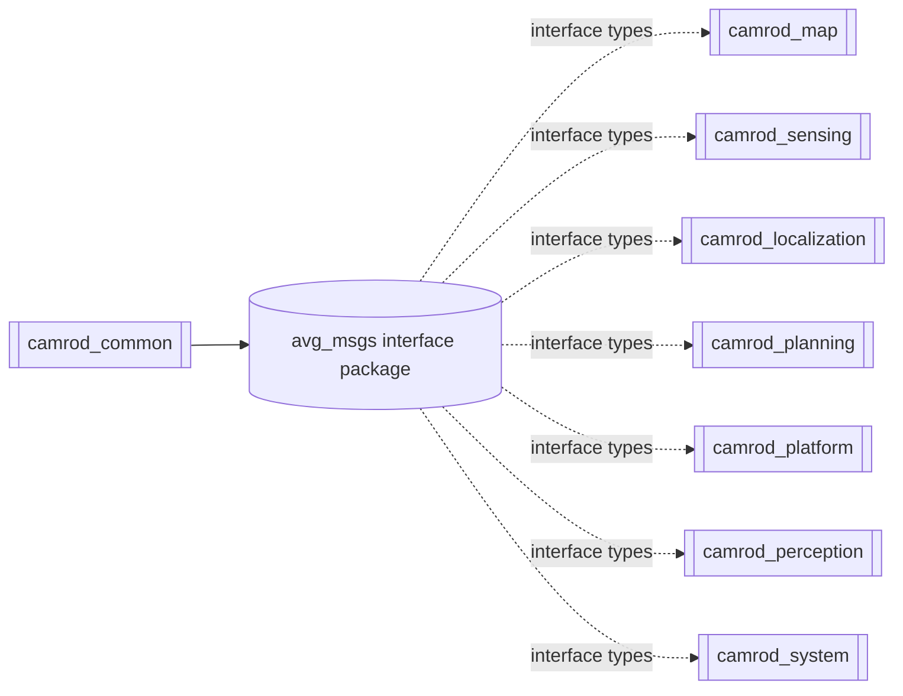

# camrod_common

## Role
`camrod_common` stores shared resources used across multiple CAMROD packages.
Current primary shared package: `avg_msgs`.

## Package Diagram


Diagram legend: `[node/process]`, `((topic stream))`, `[(config or interface)]`, `[[external package or launch]]`.

## Node Data Flow
`camrod_common` itself has no runtime node.

| Item | Input | Output |
|---|---|---|
| `avg_msgs` interface package | `.msg/.srv` definitions | generated C++/Python ROS interfaces |

## Inter-Package Connections
- Any package that publishes/subscribes `avg_msgs/*` depends on `avg_msgs` at build/runtime.

## Topic Summary
- No direct topics in `camrod_common` root.
- Topics are produced/consumed by dependent packages using message types from `avg_msgs`.

## Practical Usage
```bash
cd ~/camrod_ws
colcon build --packages-select avg_msgs
source install/setup.bash
```
