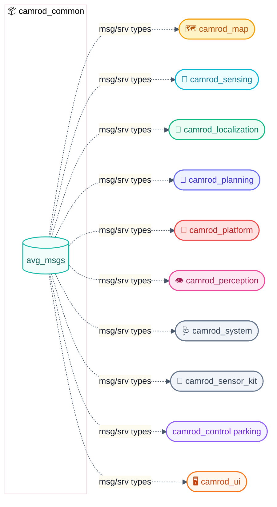

# 📦 camrod_common — Shared interfaces

**camrod_common** — Shared resource container for the CAMROD stack. Hosts `avg_msgs`, the custom ROS 2 interface package that provides all message and service definitions used across every other CAMROD package. Has no runtime nodes.

---

## 📋 Summary

| | |
|---|---|
| **Contents** | `avg_msgs` (ROS 2 msg/srv definitions) |
| **Runtime nodes** | None |
| **Upstream** | — |
| **Downstream** | All `camrod_*` packages (build-time dependency) |

**Non-goals:** No runtime behavior. Does not publish topics, subscribe to sensors, or perform any robot control. `avg_msgs` is the only package inside `camrod_common`.

---

## 🗺️ System Position



> Dashed arrows = compile-time dependency only. No runtime data flows from `avg_msgs`.

---

## 📨 avg_msgs Interface Types

### Messages

| Message | Description |
|---|---|
<!-- HH_260720 - The parking detector publishes one controller-ready semantic pose. -->
| `AvgAprilTagPose` | AprilTag parking target pose, id, age, and detection validity |
| `AvgGnssPose` | GNSS-derived position and orientation |
| `AvgLocalizationStatus` | Localization module health (mode, confidence, sensor flags, innovation) |
| `AvgPerceptionMsgs` | Perception module status payload |
| `AvgPlatformStatus` | Platform hardware status (cmd_vel, drive_enabled, estop) |
| `AvgRobotInfo` | Robot identity metadata |
| `AvgSensingImu` | IMU data wrapper |
| `AvgSensingLidar` | LiDAR point cloud wrapper |
| `AvgSensorPose` | Sensor mount transformation |

### Services

Located in `avg_msgs/srv/`. Used by planning state machine and UI goal dispatch.

See [avg_msgs/README.md](avg_msgs/README.md) for the full interface catalog and dependency matrix.

---

## 🚀 Build

```bash
# Build avg_msgs alone (required before other packages)
colcon build --packages-select avg_msgs
source install/setup.bash

# Then build the full workspace
colcon build
```

---

## 📝 Notes

- `camrod_common` itself contains no nodes, launch files, or config files.
- All packages in the workspace declare `avg_msgs` as a build and runtime dependency.
- Adding new shared message types: place `.msg` or `.srv` files in `avg_msgs/msg/` or `avg_msgs/srv/`, then register them in `avg_msgs/CMakeLists.txt` under `rosidl_generate_interfaces`.

---

## 🔗 Related Docs

- [../README.md](../README.md) — CAMROD monorepo overview
- [avg_msgs/README.md](avg_msgs/README.md) — Full interface catalog and dependency matrix
- [../PARAMETER_NAMING_STANDARD.md](../PARAMETER_NAMING_STANDARD.md) — Canonical parameter naming conventions

## 2026-06-17 Runtime Update

> HH_260617: `avg_msgs` is the common contract for planning, system, platform, UI, voice, and parking integration.

<!-- HH_260720 - Semantic interfaces are concrete generated contracts, including control parking. -->
Current semantic mission interfaces include `PlanningState`,
`PlanningScenario`, `PlanningMissionKey`, `PlanningRecallRequest`, and
`UiDestinationCommand`. `ModuleState` is used by `camrod_control` status topics,
`camrod_system`, and package-level validators.

## 2026-07-02 Runtime Update

> HH_260702: `avg_msgs` is the canonical in-repo interface boundary; legacy aliases should not be added to new code.

New CAMROD packages should import message and service definitions directly from `avg_msgs`. External ROS messages such as `sensor_msgs`, `nav_msgs`, and `geometry_msgs` remain valid at hardware/ROS integration boundaries, but package-to-package CAMROD state should use the explicit `avg_msgs` contracts documented in `avg_msgs/README.md`.

Use the workspace wrapper for dependency-order-safe rebuilds:

```bash
./colcon_build.sh --packages-select avg_msgs camrod_system camrod_planning camrod_ui
```
