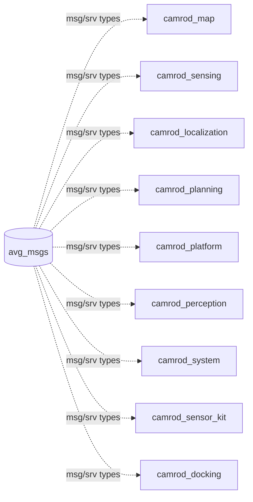

# camrod_common

## Role
Shared resource container for the CAMROD stack. Currently hosts `avg_msgs`, the custom ROS 2 interface package that provides message and service definitions used by every other CAMROD package. Has no runtime nodes.

## Package Diagram


## avg_msgs Interface Types

### Messages

| Message | Description |
|---|---|
| `AvgAprilTagDetection` | Single AprilTag detection (id, family, pose) |
| `AvgAprilTagDetectionArray` | Array of AprilTag detections |
| `AvgAprilTagPose` | AprilTag pose in reference frame |
| `AvgGnssPose` | GNSS-derived position and orientation |
| `AvgLocalizationStatus` | Localization module health (mode, confidence, sensor flags, innovation) |
| `AvgPerceptionMsgs` | Perception module status payload |
| `AvgPlatformStatus` | Platform hardware status (cmd_vel, drive_enabled, estop) |
| `AvgRobotInfo` | Robot identity metadata |
| `AvgSensingImu` | IMU data wrapper |
| `AvgSensingLidar` | LiDAR point cloud wrapper |
| `AvgSensorPose` | Sensor mount transformation |

### Services

Located in `avg_msgs/srv/`. Used by planning state machine and UI goal dispatch.

## Build

```bash
# Build avg_msgs alone (required before other packages)
colcon build --packages-select avg_msgs
source install/setup.bash

# Then build the full workspace
colcon build
```

## Notes

- `camrod_common` itself contains no nodes, launch files, or config files.
- All packages in the workspace declare `avg_msgs` as a build and runtime dependency.
- Adding new shared message types: place `.msg` or `.srv` files in `avg_msgs/msg/` or `avg_msgs/srv/`, then add them to `avg_msgs/CMakeLists.txt` under `rosidl_generate_interfaces`.
