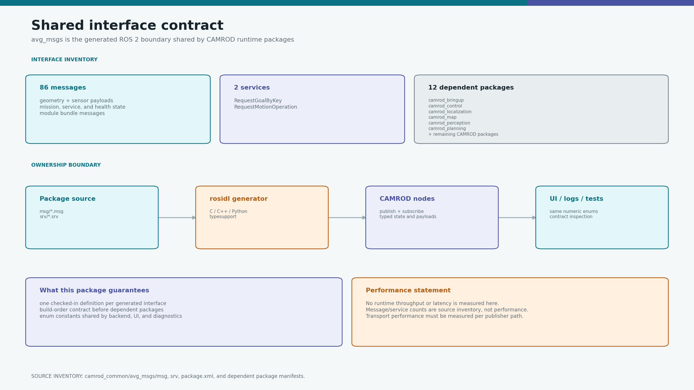
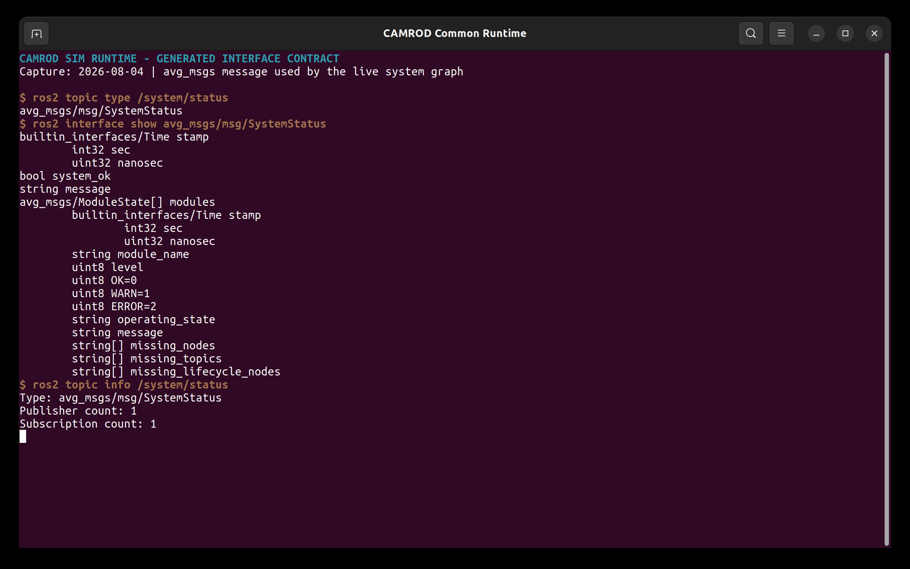

# avg_msgs

<!-- HH_260804 - Present the interface catalog by operational family instead
of repeating every generated type and dependency diagram. -->

Generated ROS 2 messages and services shared by the CAMROD runtime.



## Actual Simulation Runtime



`SIM RUNTIME CAPTURE`: `ros2 interface show` and `ros2 topic info` against the
running graph verify the generated `SystemStatus` contract used at runtime.

## At A Glance

| Uses | Function | Consumers |
|---|---|---|
| `rosidl_default_generators` | Builds typed sensor, geometry, mission, health, and UI contracts | All CAMROD runtime packages |
| Numeric message constants | Defines stable cross-language state IDs | Planning, control, system, UI, and voice |
| ROS-compatible boundary types | Keeps generated CAMROD messages separate from hardware/Nav2 ROS boundaries | Adapters and bridge nodes |

## Inventory

| Family | Representative interfaces | Purpose |
|---|---|---|
| Geometry | `AvgPose*`, `AvgTwist*`, `AvgOdometry`, `AvgPath` | Internal pose, motion, and route payloads |
| Sensors | `AvgImu`, `AvgNavSatFix`, `AvgRange`, `AvgPointCloud2`, `AvgImage` | Normalized sensing contracts |
| Perception | `AvgDetection2D*`, `AvgBoundingBox2D`, `CampsiteOccupancy` | Detection and campsite occupancy |
| Planning/control | `PlanningState`, `PlanningMissionKey`, `MotionOperation`, `RouteLaneletIds` | Mission, route, and operation commands |
| Service/UI | `AvgServiceState`, `UiDestinationCommand`, `PlanningRecallRequest` | User-visible lifecycle and dispatch |
| Platform/system | `AvgPlatformStatus`, `ModuleState`, `SystemStatus` | CAN/BMS state and diagnostics |
| Voice | `AudioRequest`, `VoiceState` | Event key, priority, and playback state |
| Services | `RequestGoalByKey`, `RequestMotionOperation` | Typed request/response boundaries |

Source inventory: **86 messages, 2 services**. Use `ros2 interface list` for
the complete generated catalog rather than maintaining a second handwritten
86-row list.

## Key State Contracts

| Interface | Key values |
|---|---|
| `AvgServiceState` | Drop-zone wait/departure, site travel/entry/wait, return, parking, charging, operator stop |
| `PlanningState` | Planner lifecycle including running, goal reached, recovery, error, and operator stop |
| `ModuleState` | `OK`, `WARN`, `ERROR` plus operating-state detail |
| `AudioRequest` | key, priority `0..3`, and interrupt flag |

Mission state, planner state, command-gate state, and system health are separate
interfaces. A normal service phase such as `SITE_ENTRY` or `CHARGING` is not a
diagnostic warning.

## Versioning Rules

| Change | Rule |
|---|---|
| Add field or constant | Update all publishers, consumers, tests, and docs in one change |
| Rename/remove field | Treat as a breaking interface change |
| Add enum value | Append without renumbering released values |
| ROS boundary conversion | Perform explicitly in the owning adapter; do not reinterpret raw bytes |

## Build And Validate

```bash
cd ~/camrod_ws
colcon build --packages-select avg_msgs --symlink-install
source install/setup.bash

ros2 interface list | rg '^avg_msgs/'
ros2 interface show avg_msgs/msg/AvgPlatformStatus
ros2 interface show avg_msgs/msg/AvgServiceState
ros2 interface show avg_msgs/srv/RequestMotionOperation
```

Interface counts and dependency links are source inventory, not a latency or
throughput benchmark.
