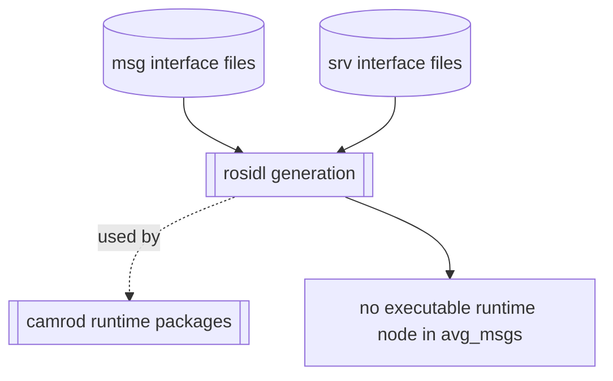
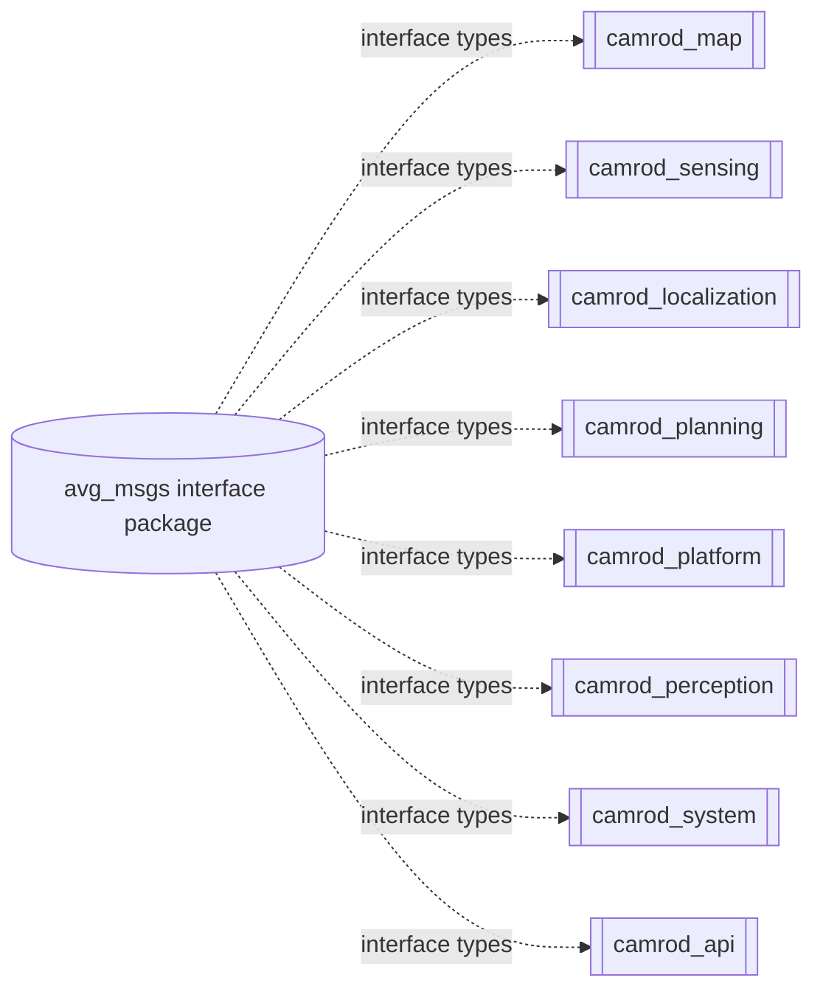

# avg_msgs

## Role
`avg_msgs` is the shared ROS 2 interface package for CAMROD modules.

## Package Diagram


Diagram legend: `[node/process]`, `((topic stream))`, `[(config or interface)]`, `[[external package or launch]]`, dashed arrow = dependency only.

## Runtime Node/Data Flow
`avg_msgs` has no executable node.

| Item | Input | Output |
|---|---|---|
| Message definitions (`msg/`) | interface schema files | generated message classes |
| Service definitions (`srv/`) | interface schema files | generated service classes |

## Inter-Package Connections


## Typical Interface Groups
| Group | Examples | Typical Use |
|---|---|---|
| Module status payloads | `AvgMapMsgs`, `AvgPlanningMsgs`, `AvgLocalizationMsgs`, `AvgSystemMsgs` | module-level health/state reporting |
| Unified transport aliases | `PoseStamped`, `Odometry`, `OccupancyGrid`, `MarkerArray` | consistent message use across custom nodes |
| Planning/system helpers | `ModuleState`, `AvgLocalizationStatusStream`, `RequestGoalByKey.srv` | state machines, diagnostics, service control |

## Practical Usage
```bash
cd ~/camrod_ws
colcon build --packages-select avg_msgs
source install/setup.bash
```

C++ dependency:
```cmake
find_package(avg_msgs REQUIRED)
ament_target_dependencies(your_target avg_msgs)
```

Python dependency (`package.xml`):
```xml
<depend>avg_msgs</depend>
```
