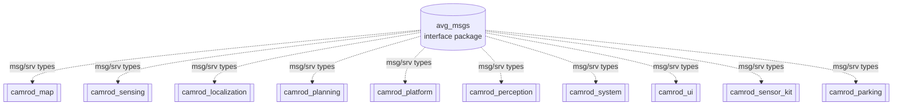
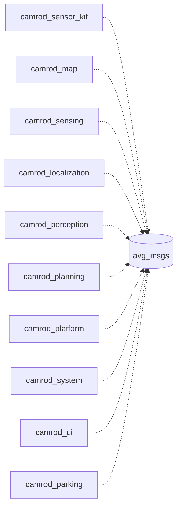

# avg_msgs

## 1. Title

**avg_msgs** — Shared ROS 2 message, service, and action definitions for all CAMROD packages.

---

## 2. Summary

`avg_msgs` is an interface-only package. It defines the message (`.msg`) and service (`.srv`) types shared across the entire CAMROD monorepo. It has no executable node, no launch file, and no runtime behavior. Its sole purpose is to provide stable, versioned interface types that all `camrod_*` packages depend on at build time and link against at runtime.

**Non-goals:**
- No executable node, no topics of its own, no launch file.
- Does not implement any business logic.

---

## 3. Quick Start

```bash
# Build (must be built before any dependent package)
cd ~/camrod_ws
colcon build --packages-select avg_msgs
source install/setup.bash

# Verify a message type is available
ros2 interface show avg_msgs/msg/ModuleState
ros2 interface show avg_msgs/srv/RequestGoalByKey
```

**C++ dependency:**
```cmake
# In CMakeLists.txt of a dependent package
find_package(avg_msgs REQUIRED)
ament_target_dependencies(your_target avg_msgs)
```

**Python dependency** (`package.xml`):
```xml
<depend>avg_msgs</depend>
```

**C++ include:**
```cpp
#include "avg_msgs/msg/module_state.hpp"
#include "avg_msgs/msg/avg_localization_msgs.hpp"
#include "avg_msgs/srv/request_goal_by_key.hpp"
```

---

## 4. System Position

### Context Diagram



### Who Depends on avg_msgs



Legend: dashed arrow = compile-time / install-time dependency only. No runtime data flows from or to `avg_msgs`.

---

## 5. Interface Versioning Policy

| Change type | Classification | Required action |
|---|---|---|
| Add a new field to an existing `.msg` | Non-breaking (ROS 2 IDL adds padding) | Bump minor version in `package.xml`; re-build all consumers |
| Rename or remove a field | **Breaking** | Change message name or create a new message; update all producers and consumers before merging |
| Add a new `.msg` or `.srv` file | Non-breaking | No consumer changes required |
| Change a field type | **Breaking** | Same as rename |
| Change a service request/response schema | **Breaking** | Create a new service name |

**Communication channel for breaking changes:** notify all CAMROD package maintainers via the project issue tracker before merging. Breaking changes to `avg_msgs` require a coordinated rebuild of the full workspace (`colcon build`).

---

## 6. Message Catalog

### Messages (`msg/`)

| Name | Kind | Fields summary | Producer | Consumers |
|---|---|---|---|---|
| `ModuleState` | msg | `stamp`, `module_name`, `level` (OK=0/WARN=1/ERROR=2), `message`, `missing_nodes[]`, `missing_topics[]`, `missing_lifecycle_nodes[]` | camrod_system checkers | camrod_system aggregator, camrod_ui |
| `SystemStatus` | msg | `stamp`, `system_ok`, `message`, `ModuleState[] modules` | camrod_system | camrod_ui, camrod_bringup |
| `AvgBringupMsgs` | msg | `stamp`, `ModuleState state`, sim/rviz/ESKF flags, map_path, origin lat/lon/alt, per-module `*_ready` booleans | camrod_bringup | all packages monitoring bringup state |
| `AvgSystemMsgs` | msg | `stamp`, `ModuleState state`, `SystemStatus system_status`, `active_modules[]`, `status_count` | camrod_system | camrod_ui, camrod_bringup |
| `AvgSensingMsgs` | msg | `stamp`, `ModuleState state`, sub-messages: `AvgSensingLidar`, `AvgSensingCamera`, `AvgSensingImu`, `AvgSensingGnss`, `AvgSensingRadar` | camrod_sensing | camrod_platform, camrod_bringup |
| `AvgSensingLidar` | msg | `PointCloud2 points_filtered`, `OccupancyGrid near_cost_grid` | camrod_sensing | camrod_platform |
| `AvgSensingCamera` | msg | `Image image`, `CameraInfo camera_info` | camrod_sensing | camrod_perception |
| `AvgSensingImu` | msg | `Imu imu_data`, `TwistWithCovarianceStamped platform_twist_cov` | camrod_sensing | camrod_localization |
| `AvgSensingGnss` | msg | `NavSatFix navsatfix`, `PoseWithCovarianceStamped pose_with_covariance` | camrod_sensing | camrod_localization |
| `AvgSensingRadar` | msg | `Range front/right1/right2/left1/left2/rear`, `OccupancyGrid near_cost_grid` | camrod_sensing | camrod_platform, camrod_map |
| `AvgLocalizationMsgs` | msg | `stamp`, `ModuleState state`, pose/odom/twist/mode/status fields, GNSS and wheel update flags and innovation norms | camrod_localization | camrod_platform, camrod_planning, camrod_bringup |
| `AvgLocalizationMode` | msg | `value` (NORMAL=0/DEGRADED=1/DR_ONLY=2/INVALID=3), `label` | camrod_localization | camrod_system, camrod_planning |
| `AvgLocalizationStatus` | msg | `header`, `AvgLocalizationMode mode`, `confidence`, `gnss_ok/imu_ok/wheel_ok`, innovation norms | camrod_localization | camrod_system |
| `AvgLocalizationStatusStream` | msg | `header`, gnss/wheel innovation norms and update accepted flags, `covariance_trace` | camrod_localization | camrod_system |
| `AvgGnssPose` | msg | `header`, `Pose pose` (map frame), `float64[36] covariance`, `fix_type`, `num_satellites`, `hdop`, `vdop` | camrod_sensing | camrod_localization |
| `AvgMapMsgs` | msg | `stamp`, `ModuleState state`, lanelet/planning cost grids, lanelet/lidar/radar/inflation marker arrays | camrod_map | camrod_planning, camrod_platform, camrod_bringup |
| `AvgPerceptionMsgs` | msg | `stamp`, `ModuleState state`, `PointCloud2 obstacles`, `CameraInfo`, `Detection2DArray detections` | camrod_perception | camrod_planning, camrod_system |
| `AvgPlanningMsgs` | msg | `stamp`, `ModuleState state`, goal/lanelet poses, nav action status, global/local paths, costmaps, path cost markers | camrod_planning | camrod_platform, camrod_bringup |
| `AvgPlatformMsgs` | msg | `stamp`, `ModuleState state`, `AvgRobotInfo`, robot markers, planning boundary, localization pose | camrod_platform | camrod_bringup |
| `AvgPlatformStatus` | msg | `stamp`, `header`, `ModuleState state`, odometry, velocity/wheel twist, estop, vehicle_state, control_mode, error_code, battery_voltage, motor RPM/speed/angle arrays | camrod_platform | camrod_system |
| `AvgSensorKitMsgs` | msg | `stamp`, `ModuleState state`, frame IDs, `tf_static_ready/tf_ready`, child frame lists | camrod_sensor_kit | camrod_system, camrod_bringup |
| `AvgRobotInfo` | msg | `AvgRobotSpecifications`, plus `AvgSensorPose` for imu/gnss/lidar/camera | camrod_sensor_kit, camrod_platform | camrod_platform, camrod_bringup |
| `AvgRobotSpecifications` | msg | `wheelbase`, `track_width`, `length`, `width`, `height`, `wheel_radius`, `encoder_resolution`, `drive_type` | camrod_sensor_kit | camrod_platform |
| `AvgSensorPose` | msg | `x`, `y`, `z`, `roll`, `pitch`, `yaw` (float64) | camrod_sensor_kit | camrod_platform, camrod_sensing |
| `AvgTrackingError` | msg | `stamp`, `frame_id`; local and global `lateral_deviation`, `heading_error`, `distance_to_path` (with valid flags); active path source and active deviations | camrod_planning | camrod_platform, monitoring tools |
| `AvgAprilTagDetectionArray` | msg | `header`, `AvgAprilTagDetection[] detections` | camrod_perception | camrod_parking, camrod_localization |
| `AvgAprilTagDetection` | msg | `family`, `id`, `hamming`, `goodness`, `decision_margin`, `centre/corners` (AvgAprilTagPoint), `float64[9] homography` | camrod_perception | camrod_parking |
| `AvgAprilTagPose` | msg | `header`, `family`, `id`, `tag_frame`, `PoseStamped pose` | camrod_perception | camrod_parking |
| `AvgAprilTagPoint` | msg | `x`, `y` (float64) | (sub-message) | (sub-message) |

### Services (`srv/`)

| Name | Kind | Request fields | Response fields | Producer (server) | Consumers (client) |
|---|---|---|---|---|---|
| `RequestGoalByKey` | srv | `string key` | `bool accepted`, `string message`, `geometry_msgs/PoseStamped goal_pose` | camrod_planning | camrod_ui, camrod_parking |

---

## 7. Dependency Matrix

| Interface | camrod_sensor_kit | camrod_map | camrod_sensing | camrod_localization | camrod_perception | camrod_planning | camrod_platform | camrod_system | camrod_ui | camrod_parking |
|---|---|---|---|---|---|---|---|---|---|---|
| `ModuleState` | P | P | P | P | P | P | P | P+C | C | P |
| `SystemStatus` | — | — | — | — | — | — | — | P | C | — |
| `AvgBringupMsgs` | — | — | — | — | — | — | — | — | — | — |
| `AvgSystemMsgs` | — | — | — | — | — | — | — | P | C | — |
| `AvgSensingMsgs` | — | — | P | C | — | — | C | C | — | — |
| `AvgLocalizationMsgs` | — | — | — | P | — | C | C | C | — | — |
| `AvgLocalizationMode` | — | — | — | P | — | C | — | C | — | — |
| `AvgLocalizationStatus` | — | — | — | P | — | — | — | C | — | — |
| `AvgLocalizationStatusStream` | — | — | — | P | — | — | — | C | — | — |
| `AvgGnssPose` | — | — | P | C | — | — | — | — | — | — |
| `AvgMapMsgs` | — | P | — | — | — | C | C | C | — | — |
| `AvgPerceptionMsgs` | — | — | — | — | P | C | — | C | — | — |
| `AvgPlanningMsgs` | — | — | — | — | — | P | C | C | — | — |
| `AvgPlatformMsgs` | — | — | — | — | — | — | P | C | — | — |
| `AvgPlatformStatus` | — | — | — | — | — | — | P | C | — | — |
| `AvgSensorKitMsgs` | P | — | — | — | — | — | — | C | — | — |
| `AvgRobotInfo` | P | — | — | — | — | — | C | — | — | — |
| `AvgRobotSpecifications` | P | — | — | — | — | — | C | — | — | — |
| `AvgSensorPose` | P | — | C | — | — | — | C | — | — | — |
| `AvgTrackingError` | — | — | — | — | — | P | C | — | — | — |
| `AvgAprilTagDetectionArray` | — | — | — | — | P | — | — | — | — | C |
| `AvgAprilTagDetection` | — | — | — | — | P | — | — | — | — | C |
| `AvgAprilTagPose` | — | — | — | — | P | — | — | — | — | C |
| `RequestGoalByKey` (srv) | — | — | — | — | — | P | — | — | C | C |

Legend: P = producer (publisher / server), C = consumer (subscriber / client), P+C = both, — = not used.

---

## 8. Key Behaviors

`avg_msgs` has no runtime behavior. Its presence in the build graph affects:

**Build order:** `colcon` automatically resolves `avg_msgs` as a build dependency before any `camrod_*` package. If `avg_msgs` is not built, all dependent packages fail at the `find_package` step.

**ABI stability:** Changing a `.msg` field type or name regenerates C++ headers and Python bindings. All packages using the changed message must be recompiled. If a running node uses a stale `.msg` binary, it will crash with a type mismatch at runtime.

---

## 9. Build

```bash
# Build avg_msgs first (or let colcon resolve the order automatically)
cd ~/camrod_ws
colcon build --packages-select avg_msgs
source install/setup.bash

# Build all packages that depend on avg_msgs
colcon build --packages-up-to camrod_sensing camrod_planning
source install/setup.bash
```

**CMakeLists.txt snippet for a dependent package:**
```cmake
find_package(avg_msgs REQUIRED)

add_executable(my_node src/my_node.cpp)
ament_target_dependencies(my_node rclcpp avg_msgs)
```

**package.xml for a dependent package:**
```xml
<depend>avg_msgs</depend>
```

---

## 10. Validation

```bash
# List all available avg_msgs interfaces
ros2 interface list | grep avg_msgs

# Inspect a specific message definition
ros2 interface show avg_msgs/msg/ModuleState
ros2 interface show avg_msgs/msg/AvgLocalizationMsgs
ros2 interface show avg_msgs/srv/RequestGoalByKey

# Confirm the package is sourced
ros2 pkg list | grep avg_msgs
```

---

## 11. Troubleshooting

**Symbol not found at build** (`avg_msgs/msg/foo.hpp: No such file or directory`)
- `avg_msgs` was not built or not sourced. Run:
  ```bash
  colcon build --packages-select avg_msgs
  source install/setup.bash
  ```
- Confirm `find_package(avg_msgs REQUIRED)` is in the dependent package's `CMakeLists.txt`.

**Python import fails** (`ModuleNotFoundError: No module named 'avg_msgs'`)
- Same root cause as above. Run `colcon build --packages-select avg_msgs` and re-source.
- Verify: `python3 -c "from avg_msgs.msg import ModuleState; print('ok')"`.

**ABI mismatch after editing `.msg`**
- Editing a `.msg` file invalidates all compiled binaries that use it.
- Run a full rebuild: `colcon build` (all packages) or at minimum `colcon build --packages-up-to <affected_package>`.
- Clean build artifacts if the mismatch persists: `rm -rf build/avg_msgs install/avg_msgs`.
- If a node crashes with `rcutils_logging` type errors or `rmw` deserialization failures, stale binaries are the likely cause.

---

## Related Docs

- [`../../README.md`](../../README.md) — Top-level CAMROD workspace overview
- [`../../camrod_sensor_kit/README.md`](../../camrod_sensor_kit/README.md)
- [`../../camrod_sensing/README.md`](../../camrod_sensing/README.md)
- [`../../camrod_localization/README.md`](../../camrod_localization/README.md)
- [`../../camrod_perception/README.md`](../../camrod_perception/README.md)
- [`../../camrod_map/README.md`](../../camrod_map/README.md)
- [`../../camrod_planning/README.md`](../../camrod_planning/README.md)
- [`../../camrod_platform/README.md`](../../camrod_platform/README.md)
- [`../../camrod_system/README.md`](../../camrod_system/README.md)
- [`../../camrod_ui/README.md`](../../camrod_ui/README.md)
- [`../../camrod_parking/README.md`](../../camrod_parking/README.md)
- [`../../PARAMETER_NAMING_STANDARD.md`](../../PARAMETER_NAMING_STANDARD.md) — canonical parameter naming conventions
