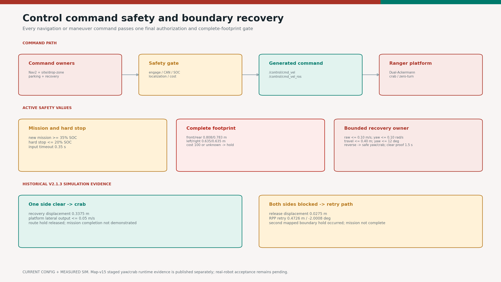
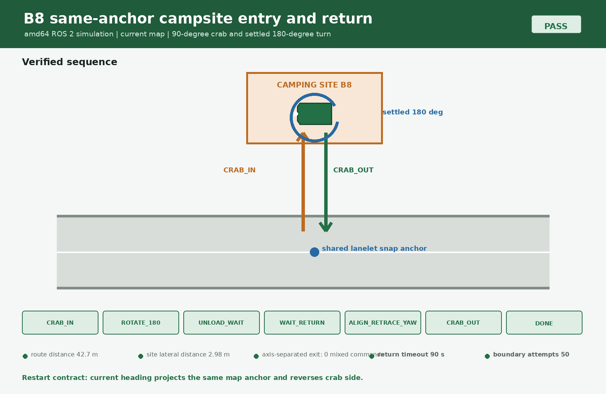
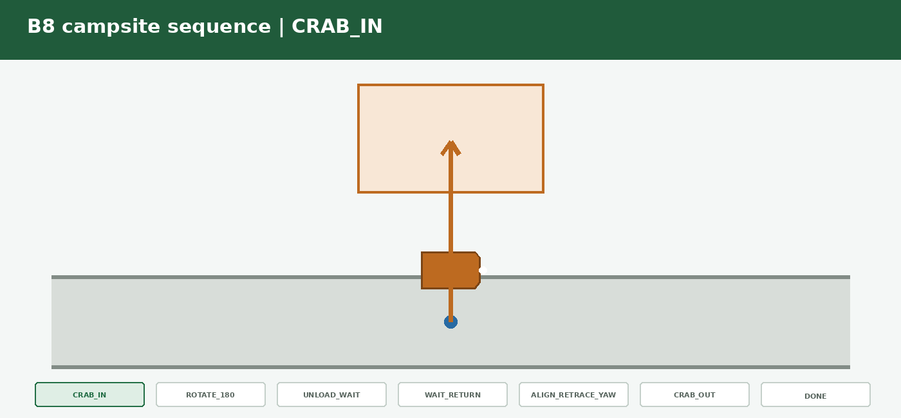
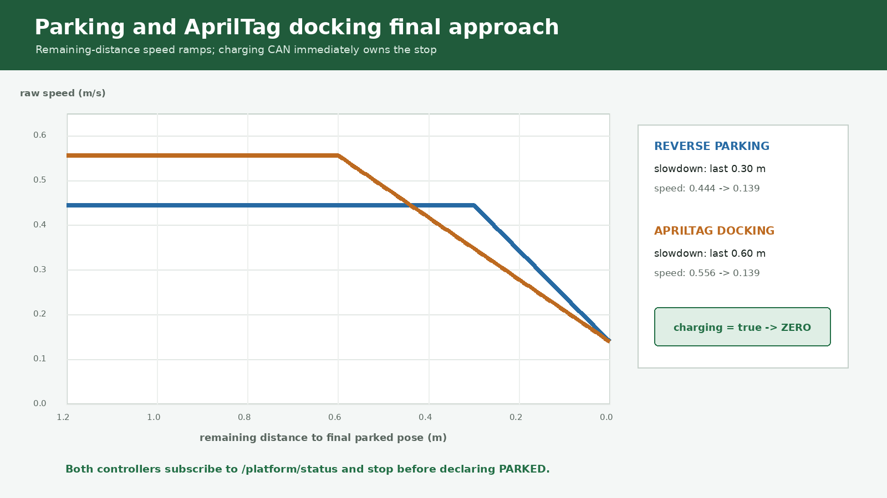
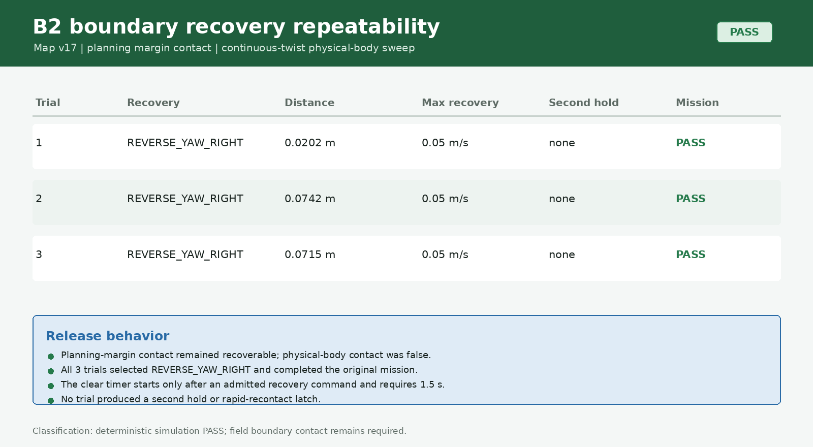

# camrod_control

<!-- HH_260805 - Document adaptive reverse/yaw/crab recovery while preserving
the measured-body stop and historical translation-only evidence labels. -->
<!-- HH_260806 - Activate the fabrication-inclusive measured body, preserve the
10 cm planning margin, and serialize Nav2/campsite command ownership. -->
<!-- HH_260806 - Remove artificial Nav2 rotation/translation handoffs and use a
high-resolution local lanelet raster for final command safety. -->
<!-- HH_260806 - Preserve maneuver ratios under the 3 km/h production cruise profile. -->
<!-- HH_260807 - Require observed recovery motion before the 1.5 s clear release. -->
<!-- HH_260807 - Evaluate route safety with the final scaled command and record
the fixed-preview service A/B. -->
<!-- HH_260807 - Reduce the production cruise to 2 km/h while preserving maneuver ratios. -->
<!-- HH_260818 - Document same-anchor campsite return, heading-aware restart,
normal/crab separation, parking slowdown, and charging-first stop behavior. -->
<!-- HH_260819 - Document complete B11-B13 crab-out, no-zero-turn roadside
return, and the source-selected forward loop. -->
<!-- HH_260824 - Move the current AprilTag translation latch to the operator
requested 0.40 m camera range and expose the exact runtime trigger. -->
<!-- HH_260825 - Finish campsite exit at a fresh live lanelet projection and
retain exact-entry XY only as a stale-projection recovery fallback. -->

Native C++ motion owners for the final command gate, campsite/drop-zone local
maneuvers, parking, and bounded map-boundary recovery.



## Actual Simulation Runtime

| Boundary and route in RViz | Gate state, zero output, and event times |
|---|---|
|  |  |

`SIM RUNTIME CAPTURE`: with map v14, after one automatic release the same B6
boundary was recontacted in `0.276 s`; the gate latched `ROUTE_SAFETY_HOLD`, stopped issuing
recovery candidates, and published an all-zero final command.


`SIM BROWSER CAPTURE`: the live UI reads the gate reason, maneuver owners,
service state, radar evidence, and obstacle-replan status without publishing a
motion command.

## At A Glance

| Uses | Function | Main output |
|---|---|---|
| Nav2 command, local maneuver commands, parking, and recovery | Selects one raw command owner | `/control/cmd_vel_raw` |
| SOC, CAN, localization, LiDAR/radar/map costs | Applies the final motion authorization policy | `/control/cmd_vel`, `/control/cmd_vel_ros` |
| Physical body, planning margin, and projected candidates | Hard-stops ordinary contact; permits only bounded monotonic inward escape | Gate/candidate/controller status |

## Active Safety Values

<!-- HH_260809 - Tie hard-stop and planning-margin checks to the same
tapered-front rounded geometry published by camrod_platform. -->

| Policy | Value | Result |
|---|---:|---|
| New campsite mission | `SOC >= 35%` | Departure admitted |
| Confirmed-tent occupancy | guard default `false` | Optional UI/control pre-entry block; never interrupts an already committed site maneuver |
| Critical battery | `SOC <= 20%` | Hard command stop |
| Command timeout | `0.35 s` | Stale command becomes zero |
| Physical body | front/rear `0.70837/0.68323 m` | Fabrication-inclusive `1.39160 m` hard-stop length; only projected monotonic inward escape on cost 100 |
| Physical body | left/right `0.53505/0.53495 m` | Fabrication-inclusive `1.07000 m` hard-stop width |
| Boundary contour | taper/depth `0.12/0.12 m`, physical `R0.05 m` | Short front face, sloped shoulders, rounded six-corner hard-stop polygon |
| Planning footprint | front/rear `0.80837/0.78323 m` | Body plus `0.10 m` X margin |
| Planning footprint | left/right `0.63505/0.63495 m` | Body plus `0.10 m` Y margin |
| Planning contour | exact `0.10 m` offset, `R0.15 m` | Published polygon and pre-topic fallback use identical geometry |
| Planning polygon frame | `robot_center_link` | Gate consumes local points directly; map-pose callback timing cannot shift the collision envelope |
| Planning-margin stop | cost `100` or unknown | `lanelet_footprint_cost`; ordinary command remains zero |
| Soft lane edge | cost `98` | Traversable planning bias, not the hard body stop |
| Lanelet safety raster | `600 x 600 @ 0.05 m` | Independent `30 m` local grid; avoids the Nav2 grid's `0.125 m` half-cell dilation |
| Dynamic cost stop | threshold `85` | Independent radar plus classified camera-LiDAR fusion hold |
| Route-clear proof | `1.5 s` after admitted recovery motion | Releases retained route hold |
| Automatic release budget | `50` per contact region | Allows repeated projected recovery/final-yaw fitting without an unbounded loop |
| Regional reset | `0.75 m` signed forward progress | Passing the original contact starts a new budget; oscillation around it does not |
| Pose-free fallback window | `5.0 s` | Used only for historical/malformed contact decisions without a valid map pose |
| Recovery proof probe | `0.25 m` | Projected complete footprint must be clear |
| Recovery attempt | `0.10 m/s`, `0.40 m`, `10 s` | Maximum raw speed, net travel, and duration per projected attempt |
| Recovery episode | `50` attempts, `1.50 m`, `90 s` | `0.5 s` zero-command pause before each fresh candidate; first limit no longer latches permanently |
| Contact recovery yaw | `0.10 rad/s`, `12 deg` | Bounded reverse-yaw only after projected full-footprint proof |
| Maneuver release hold | `0.5 s` | Final output remains zero before Nav2 may resume |
| Normal Nav2 rotation/translation | Continuous owner | RotationShim/RPP mode changes do not create an artificial zero handoff |
| Normal/crab selector | lateral deadband `0.02 m/s` | Normal Nav2 remains Dual-Ackermann; only intentional lateral commands select crab |


<!-- HH_260810 - Keep contour transform documentation separate from the gate's
measured boundary-contact and automatic-recovery evidence below. -->
Both envelopes follow `robot_center_link` rigidly during forward, curved, crab,
and zero-turn motion. Candidate collision checks and actual release decisions
remain runtime control behavior; see the [source-derived geometry record](../docs/assets/module-guides/sensor-kit/test-results/tapered-rounded-boundary-20260810/README.md).

## Active Linear-Speed Profile

The final command gate applies `speed_scale=0.5`. The table reports limits at
the platform output after that gate; ordinary operational linear speeds retain
their previous ratio to the current `2.0 km/h` cruise reference.

| Operation | Cruise ratio | Final limit |
|---|---:|---:|
| RPP cruise | `100%` | `2.000 km/h` |
| RPP curvature floor | `30%` | `0.600 km/h` |
| RPP final approach | `25%` | `0.500 km/h` |
| Campsite crab | `60%` | `1.200 km/h` |
| Campsite reverse / drop-zone exit / reverse parking | `40%` | `0.800 km/h` |
| AprilTag approach | `50%` | `1.000 km/h` |
| AprilTag low-speed approach | `12.5%` | `0.250 km/h` before the `0.40 m` stop |
| Optional yaw-zone approach 1 / 2 | `62.5% / 50%` | `1.250 / 1.000 km/h` |
| Zero-turn / gross yaw alignment | `0%` | `0 km/h` |
| Route-boundary recovery safety exception | `9%` | `0.180 km/h` |

Boundary recovery is intentionally not proportionally increased: each attempt
retains raw `0.10 m/s`, `0.40 m`, `10 s`, and `12 deg` limits. An episode may
retry up to 50 times but still stops at `1.50 m` or `90 s`; every candidate is
rechecked by the final gate. Angular-speed limits are unchanged. The previous 3 km/h raw/final
values and AMD64 command trace remain as historical evidence in the
[3 km/h test record](../docs/assets/module-guides/localization/test-results/three-kph-localization-20260806/README.md).

## Runtime Owners

| Node | Responsibility |
|---|---|
| `cmd_vel_safety_gate` | Final engage, platform, battery, localization, timeout, obstacle, and lanelet authorization |
| `route_safety_recovery_controller` | Executes fresh projected crab/reverse/reverse-yaw attempts within per-attempt and whole-episode limits |
| `camping_site_maneuver_controller` | Site entry, arrival turnaround, unload wait, explicit return, and exit |
| `drop_zone_maneuver_controller` | Charger/drop-zone exit, route yaw alignment, and parking handoff |
| `reverse_parking_controller` | Yaw-aware reverse travel and charging wait |
| `apriltag_parking_controller` | Rear-camera tag approach, latched yaw alignment, stopped charging wait, and charging completion |

## Command Path

```text
/control/nav2_cmd_vel_ros -----------+
/control/cmd_vel_raw ----------------+--> cmd_vel_safety_gate
                                          |--> /control/cmd_vel
                                          +--> /control/cmd_vel_ros --> Ranger
```

`/control/planning_engaged` reports manual-or-mission authorization.
`/control/command_enabled` can still be false during a safety, CAN, charging,
localization, or battery hold.

## Mission Maneuvers

| Site mode | Phase order |
|---|---|
| Active B1-B10 turnaround | `ALIGN_ENTRY_YAW -> CRAB_IN -> ROTATE_180 -> UNLOAD_WAIT -> WAIT_RETURN -> ALIGN_RETRACE_YAW -> CRAB_OUT` |
| Active B11-B13 roadside | `ALIGN_ENTRY_YAW ->` `0.30 m`-capped `CRAB_IN -> UNLOAD_WAIT -> WAIT_RETURN -> CRAB_OUT -> DONE`; no zero-turn |
| Guest recall B1-B13 | route to lanelet snap -> site-side `0.30 m` roadside wait -> explicit Return -> lateral road exit -> drop-zone route; occupied-site delivery guard remains active for non-guest missions |
| B11-B13 return | Preserve arrival heading, reach a fresh lanelet projection laterally, then request a forward one-way loop |
| Drop-zone departure | optional charging `7.0 s` stopped dwell -> `EXIT_STRAIGHT -> ALIGN_EXIT_YAW -> route release` |
| Return parking | route arrival -> exact snapped lanelet point -> 90-degree body alignment -> selected parking controller |

Drop-zone departure captures one fresh, same-frame lanelet pose at `EXIT`
start and holds that XY/yaw target for the whole maneuver. Production requires
the stamped lanelet target (`require_lanelet_exit_target=true`, fixed fallback
disabled), accepts only `0.3-8.0 m` targets ahead with at most `1.0 m` lateral
offset, and finishes translation within `0.20 m` before settling captured yaw.
The UI withholds the campsite mission key and Nav2 goal until
`exit_complete=true`. While CAN still reports charging, only a stamped, healthy
drop-zone status with exact `EXIT_STRAIGHT` or `ALIGN_EXIT_YAW` operating state
opens the charging reason for at most `2.0 s`; SOC, E-stop, platform freshness,
fault and obstacle reasons remain authoritative.

<!-- HH_260904 - Explain the deterministic pre-parking correction and the
stationary Site 7 alignment that can otherwise look like another turn. -->
After automatic Return reports route arrival, `POSITION_PARKING_POINT` uses
the original `/planning/goal_pose_snapped` centerline projection to remove
Nav2's remaining goal-tolerance error. It accepts at most `0.75 m` correction,
commands at most `0.20 m/s` raw (`0.10 m/s` after the final gate), settles
inside `0.05 m` for `0.5 s`, and only then enters `ALIGN_PARKING_YAW` before
straight reverse parking or AprilTag docking. Missing, stale-mission, wrong-
frame, non-finite, or out-of-envelope targets fail closed for automatic
parking. Radar/fusion obstacle checks remain active throughout this phase.

For B1-B10, including Site 7, `ALIGN_RETRACE_YAW` after `ROTATE_180` is also a
required handoff. If yaw is already within `4 deg`, the robot commands zero
while proving the configured `0.8 s` low-yaw-rate settle; status now reports
`action=stationary_settle`. It reports `action=corrective_turn` only when an
actual residual-yaw correction is commanded.





<!-- HH_260807 - Explain the route-snap return anchor that prevents a narrow
lane handoff from inheriting Nav2's early goal-reached pose. -->
For automatic B1-B13 service, `/planning/goal_pose_snapped` remains the map
anchor for `CRAB_IN`, crab-side selection, restart correlation, and the
stale-live-projection fallback. The controller first runs
mandatory `ALIGN_ENTRY_YAW` against that lanelet's authored tangent, then uses
the same tangent and signed anchor/site projection to select the crab side.
Invalid pose/goal geometry or failure to align within `15 s` stops with zero
command. This removes the former mismatch between Nav2's early handoff pose and
the return target and prevents the live arrival yaw from choosing the adjacent
bay. A B1-B10 reboot within `0.60 m` of the authored site restores
`WAIT_RETURN`. B11-B13 instead match signed progress toward the requested
`0.30 m` roadside target with the existing `0.15 m` lateral and `0.60 m`
forward bounds. Every restart/adopt still requires a fresh finite lanelet
anchor or a route goal correlated to it; these paths retain the live-heading
fallback so a post-turn robot chooses the opposite return side.

<!-- HH_260825 - Current-pose routing removes unnecessary longitudinal retrace. -->
`CRAB_OUT` now observes the fresh `/planning/lanelet_pose_ros` projection. At
`<=0.15 m`, it publishes zero for `1.20 s`, then emits
`done_live_lanelet`; LaneletRoute builds the Return from the current vehicle XY.
Longitudinal separation from the historical entry snap is intentionally ignored.
If the projection is missing, stale, non-finite, or in another frame, the
existing axis-separated exact-anchor sequence remains the deterministic
fallback and still requires `return_position_tolerance_m=0.04`.


The [v2.2.1 measured run](../docs/assets/module-guides/bringup/test-results/v2-2-1-safety-handoff-20260825/README.md)
finished B8 at `0.140 m` from the live projection while the original anchor was
still `0.231 m` away, then planned the reverse-shortest Return from current XY.
The older `0.03-0.04 m` anchor results below remain valid evidence for the
fallback sequencer, not the normal v2.2.1 handoff target.

The final B1-B10 endurance kept every route-snap handoff within `0.03-0.04 m`.
B2-B10 also completed nine planning-margin recoveries with observed recovery
motion, release, continued service, and zero retry latch.

The [current map-v22 crab/fusion safety record](../docs/assets/module-guides/control/test-results/worak-crab-fusion-safety-20260818/README.md)
keeps the fresh B1 entry/exit PASS, final directional gate matrix PASS, and the
180-second full-return timeout as separate raw JSON results.

The [current B8 same-anchor result](../docs/assets/module-guides/bringup/test-results/b8-return-docking-20260819/README.md)
completed all seven campsite phases under the current graph. The source-derived
restart test also verifies that adding 180 degrees to the body heading reverses
the body-frame crab sign while preserving the same map coordinates.


The [control/service evidence](../docs/assets/module-guides/bringup/test-results/b1-b10-service-endurance-20260807/README.md)
separates measured planning-margin recovery from the then-active no-motion
physical-body policy. The current monotonic-overlap/swept-clearance rule for a
virtual body-boundary contact remains physical field work.

The low-battery latch does not auto-return while people may be unloading. If
SOC falls below 35% during a campsite mission, the current site phase finishes
and the normal user return request remains required.

## Parking And Charging State



The profile image above is retained as historical `2026-08-19` evidence. The
current source and runtime contract below uses the updated `0.40 m` stop.

| Condition | Controller phase | Public `/service/state` |
|---|---|---|
| Final pose not reached | active parking phase | `DROP_ZONE_PARKING` |
| Tag missing before the `0.40 m` latch | `WAITING_FOR_TAG`, zero command for up to `60 s` | `DROP_ZONE_PARKING` |
| Tag range `<= 0.40 m`; yaw correcting | `FINAL_YAW_ALIGNMENT` | `DROP_ZONE_PARKING` |
| Yaw settled; CAN charge absent | `WAITING_FOR_CHARGING` | `WAITING_FOR_CHARGING` |
| Parking complete; CAN charge true | `PARKED` | `CHARGING` |
| Parked; no active charge feedback | `PARKED` | `DROP_ZONE_WAIT` |
| New allowed mission while charging | departure override | `DEPARTING_CHARGER` |

Reverse parking linearly slows over the final `0.30 m`. AprilTag docking uses
the same camera-frame 3D `Tag distance` shown in the UI: it ramps from `0.80 m`
to `0.40 m`, then latches translation off. The controller performs heading-only
`FINAL_YAW_ALIGNMENT`, proves `0.8 s` of settled yaw, and publishes
`WAITING_FOR_CHARGING` while continuing zero commands. Approach curvature is
limited to a minimum `0.85 m` radius so Ranger keeps combined reverse and
Dual-Ackermann steering instead of silently selecting spinning mode. A true
charging contact commands zero from any active phase before the controller
reports `PARKED`. Dynamic rotation obstacle protection remains enabled.
The status message reports `configured_stop_tag_m`, `stop_reason`, and the exact
`stop_trigger_tag_m`, so later Tag updates cannot obscure why translation ended.
Before the `0.40 m` translation latch, a Tag sample older than `0.5 s` holds
zero. A fresh valid target can resume within the `60 s` `WAITING_FOR_TAG`
window; expiration enters `ERROR` and requires a new parking START.

## Campsite Sequencing Evidence


All B1-B10 sites completed the full turnaround/return sequence. B11-B13 used
the `0.30 m` roadside cap, accepted Return, reached a live lanelet projection
with pure lateral `CRAB_OUT`, reached `DONE`, and never entered a rotation phase.
The `done_roadside_forward` source selects the legal forward one-way loop
instead of attempting a physical-body-blocked zero-turn in the narrow lane.
The final gate ignores Nav2 commands while a campsite phase owns motion, then
enforces a stationary handoff. Static road-lanelet cost is bypassed only for
configured campsite motion; live obstacle checks remain active, and ordinary
physical-body/planning-footprint checks resume at `DONE`. The [structured result](../docs/assets/module-guides/bringup/test-results/camping-site-full-return-20260819/README.md)
also records a complete B11 return, drop-zone parking, and charging cycle.

## Boundary Evidence

<!-- HH_260810 - Put the current tapered/rounded contour on its measured ROS
gate/recovery timeline instead of relying on older rectangular illustrations. -->


In this [current measured ROS simulation](../docs/assets/module-guides/control/test-results/tapered-rounded-boundary-road-sim-20260810/README.md),
the physical body sampled 648 clear cells with maximum cost `0`, while the
873-cell planning contour reached cost `100`. The gate held ordinary output,
issued bounded `REVERSE_YAW_RIGHT` at no more than `0.05 m/s` and `0.05 rad/s`,
released after `0.0972 m` of observed motion, and completed the retained route.
There was no second hold or retry latch; physical-road behavior is unverified.



On map v17, three identical B2 recontact trials selected
`REVERSE_YAW_RIGHT`, completed the original mission, and produced no second
hold or rapid-recontact latch. Recovery displacement was `0.0202`, `0.0742`,
and `0.0715 m`; maximum recovery output was `0.05 m/s`. The clear timer starts
only after `recovery_motion_observed=true`, and every continuous yaw arc is
checked against the physical body before its endpoint planning margin.


The later [source-profile A/B](../docs/assets/module-guides/planning/test-results/rpp-lookahead-service-ab-20260807/README.md)
showed why increasing the retry count is not a control fix. A velocity-scaled
preview of about `1.5 m` re-entered the same boundary after `0.850 s`; fixed
`1.1 m` completed B1/B2 without a retry latch. The gate now projects, proves
recovery motion, logs, and publishes the same final speed-scaled command. At
the active cruise this means it evaluates `0.555556 m/s`, not the unscaled
`1.111111 m/s` controller request.

| First complete-footprint stop | Narrow-route risk map |
|---|---|
|  |  |

| Earlier manual probe | Current automatic owner |
|---|---|
|  |  |


| v2.1.4 release-map staged recovery | Current decision policy |
|---|---|
|  |  |


| Historical map-v14 measured rerun | Historical translation-only decision policy |
|---|---|
|  |  |


<!-- HH_260806 - Link the current-map live retry and physical-clearance diagnosis. -->
### Current-map live diagnosis (2026-08-06)

| Margin-only first stop | Ten-release behavior | Body-only diagnostic |
|---|---|---|
|  |  |  |

The [full test record](../docs/assets/module-guides/control/test-results/route-boundary-recovery-20260806/README.md)
uses the earlier `1.49160 x 1.07000 m` body and separates a margin-only first
stop from a downstream physical-body map contact. Raising the release limit
from `1` to `10` repeated the same reverse/re-entry behavior and selected no
crab, so retry count alone is not a valid fix. The
[boundary adjustment replay](../docs/assets/module-guides/control/test-results/robot-boundary-adjustment-20260806/README.md)
preserves that replay and adds fresh full-bringup tests of the final two-layer
policy. These controlled route tests do not replace the separate campsite
`GOAL_REACHED -> CRAB_IN` mission validation.


| Simulation case | Measured result | Verdict |
|---|---:|---|
| One lateral side clear | Crab displacement `0.3375 m`; output `<= 0.05 m/s` | Hold released; mission not complete |
| Both sides blocked, reverse selected | Release displacement `0.0327 m` in static case | Bounded reverse works |
| Same-goal RPP retry | `0.4726 m`, yaw `-2.0008 deg` | Normal yaw resumed after release |
| Later map boundary | Second hold observed | Map corridor remains limiting |
| Live B6 retry containment | map v14 `0.276 s` (v13 `0.267/0.372 s`); final Twist all zero | Retry loop stopped; operator action required |
| Map-v14 route probe | reverse `0.0703 m`, retry `0.0661 m` / yaw `-0.1235 deg`, recontact `0.366 s` | Retry latched; final Twist all zero |
| Map-v14 static/crab probes | reverse `0.0721 m`; crab-left `0.3321 m` | Both bounded motions released the first hold |
| Map-v15 route probe | `REVERSE_YAW_RIGHT`, recovery `0.0582 m`, max yaw `0.05 rad/s`, recontact `0.335 s` | Retry latched; final Twist all zero |
| Map-v15 static probe | `REVERSE_YAW_RIGHT`, recovery `0.0405 m`, max yaw `0.05 rad/s`, recontact `0.400 s` | Retry latched; final Twist all zero |
| Map-v15 one-side probe | `CRAB_LEFT`, `0.3378 m`, max lateral `0.05 m/s` | First hold released without recontact; mission incomplete |
| Reduced-boundary normal route (historical) | `10.0403 m`, goal error `0.2932 m`, no route hold | Controlled route completed; final Twist zero |
| Reduced-boundary margin-only contact (historical) | body max `70`, planning max `100`; ordinary output `0.0 m/s` | Hold enforced without body contact |
| Reduced-boundary margin recovery (historical) | `CRAB_RIGHT`, `0.133 m`, max lateral `0.05 m/s` | Both envelopes clear at release; final Twist zero |
| Reduced-boundary physical-body contact (historical) | body max `100`; owner motion false; recovery output `0.0 m/s` | Hold retained; no automatic escape |
| B7 clear-road stop-go regression | `224.92 s`, `27.1492 m`; handoff `0`, stale `0` | Artificial rotation/translation stop cycle removed |
| RPP right-oversteer regression | raw rotation/translation switches `403 -> 0`; B8 `59.931 m` and `GOAL_REACHED` | Continuous curve tracking selected at `1.1 m` |
| 3 km/h preview A/B | scaled preview about `1.5 m`: recontact `0.850 s`; fixed `1.1 m`: B1/B2 `2/2`, restart `0` | Fixed profile selected; retry-count increase rejected |
| B1-B10 service endurance | route-snap error `0.03-0.04 m`; B2-B10 recovery hold/motion/release `9/9/9`; retry latch `0` | 10/10 service cycles completed without restart |

The map-v14 PNG/GIF remains historical translation-only evidence. The map-v15
PNG/GIF is a v2.1.4 release-map full-simulation run of the active selector; its
OSM SHA is `e0b50f...e36d`, not the historical map-v17 SHA `8cd05c...5e021`. It
reevaluates all five projected commands on every hold update: left/right crab, straight
reverse, and left/right reverse-yaw. A unique safe crab moves away from the
contact. Otherwise straight reverse creates room; it may transition to the
unique safe yaw arc, or to the original RPP turn sign when both arcs are clear.
Each stage must keep the complete projected footprint, fresh lanelet grid/pose,
and dynamic obstacle checks clear. A blocked active crab can use straight
reverse to reposition, then be reevaluated.

The [B7 stop-go regression](../docs/assets/module-guides/control/test-results/cmd-vel-stop-go-20260806/README.md)
separates the corrected clear-road command stream from a later real 5 cm
planning-margin contact. It does not claim that the complete B7 route is clear.

The [RPP curve-tracking comparison](../docs/assets/module-guides/planning/test-results/rpp-curve-tracking-20260806/README.md)
separates gross start alignment from ordinary steering. The gate performs one
zero-linear alignment for a large initial yaw error; it no longer receives
repeated pure-rotation requests at every 2-degree path bend.

After a maximum `12 deg` heading correction, the owner removes angular velocity
and continues only a separately checked reverse translation. The total
`0.40 m`/`10 s` budget is not reset during a stage transition. Up to 50 route
releases are permitted in one contact region. The counter resets only after
`0.75 m` signed forward progress past the original contact; elapsed time alone
does not reset a pose-aware episode. Reaching that budget blocks another
same-direction Nav2 resume, but does not suppress an inward
escape candidate whose contact overlap decreases monotonically and whose swept
physical body plus endpoint planning footprint are clear. Dynamic obstacles
and platform interlocks remain fail-closed. Older map-v15 retry/body cases in
the evidence table retain their measured zero-output outcomes; the current
physical-robot recovery policy remains field-pending.

## Configuration

| File | Owns |
|---|---|
| `config/cmd_vel_safety_gate.yaml` | Authorization, battery, timeout, dynamic cost, footprint, and recovery-candidate policy |
| `config/control.yaml` | Campsite, drop-zone, and recovery-owner motion values |
| `config/parking.yaml` | Reverse and AprilTag parking values |
| `config/yaw_alignment_zones.yaml` | Optional map yaw-lock zones; disabled by default |

See the [runtime parameter reference](../docs/RUNTIME_PARAMETER_REFERENCE.md)
for active raw/final speeds, distances, timeouts, launch precedence, and the
bringup mirror that must change with each package file.

## Run And Validate

```bash
ros2 launch camrod_control cmd_vel_safety_gate.launch.py
ros2 launch camrod_control maneuvers.launch.py
ros2 launch camrod_control parking.launch.py parking_method:=reverse

ros2 topic echo /control/cmd_vel_safety_gate/status
ros2 topic echo /control/route_safety_recovery/candidate
ros2 topic echo /control/route_safety_recovery_controller/status
```

Detailed timelines and reproduction commands are in the
[boundary recovery validation](../docs/V2_1_3_BOUNDARY_RECOVERY_VALIDATION.md)
and the [v2.1.4 release-map evidence directory](../docs/assets/module-guides/control/evidence/map-v15-boundary-recovery/).
