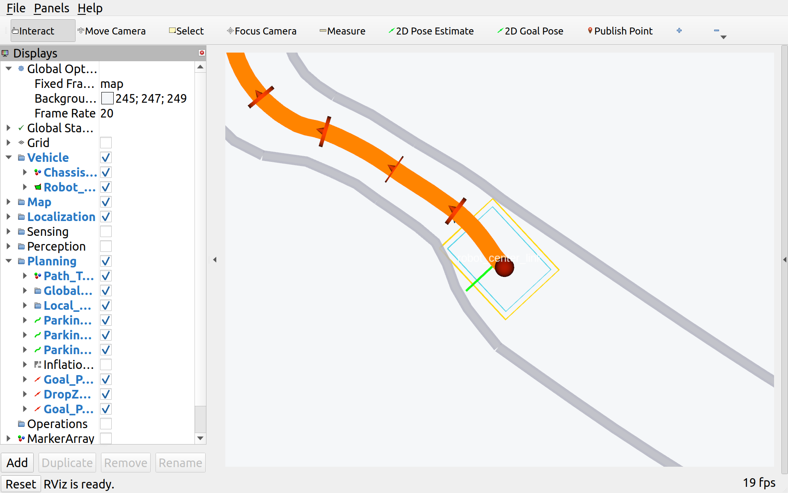
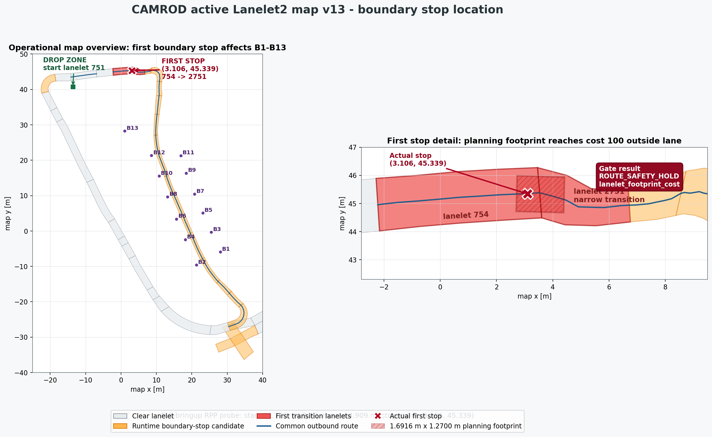
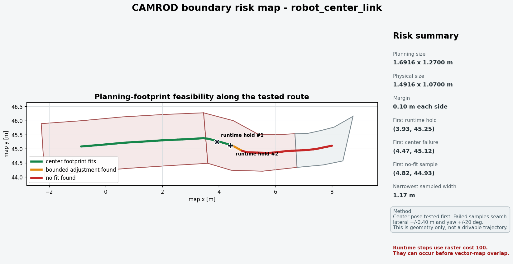
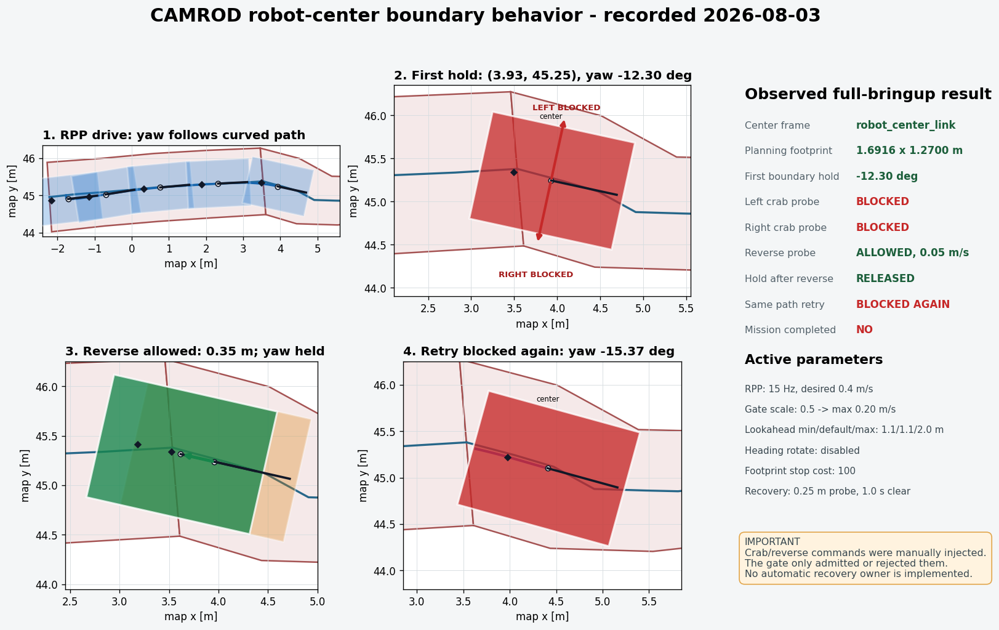
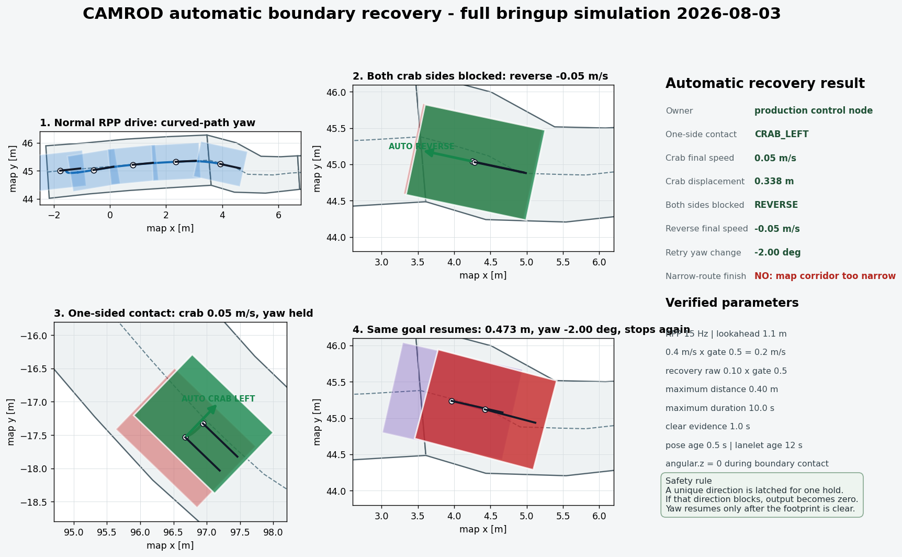
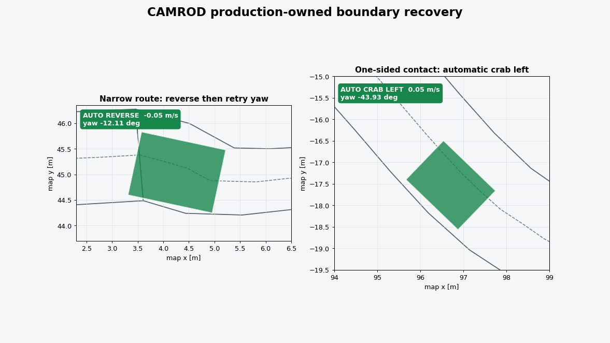
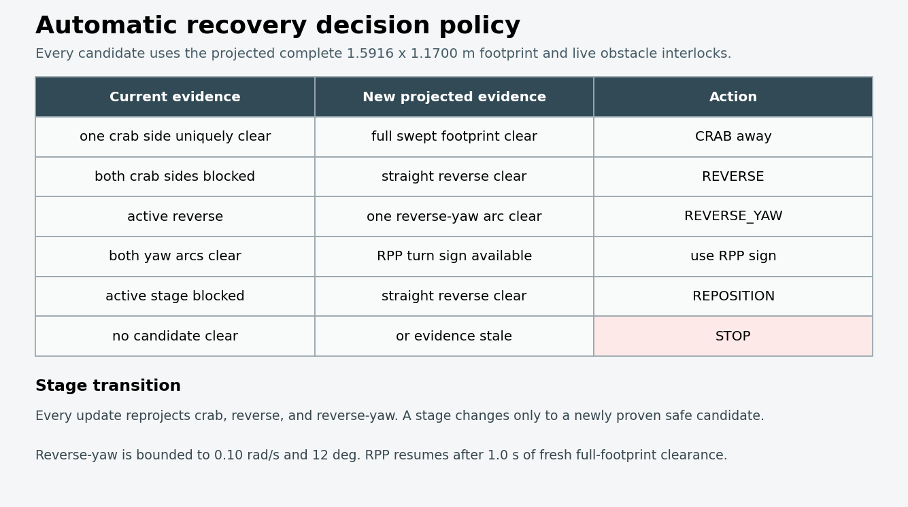
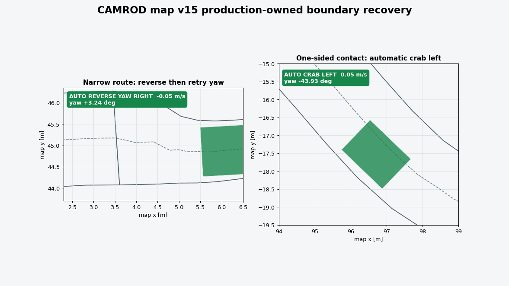
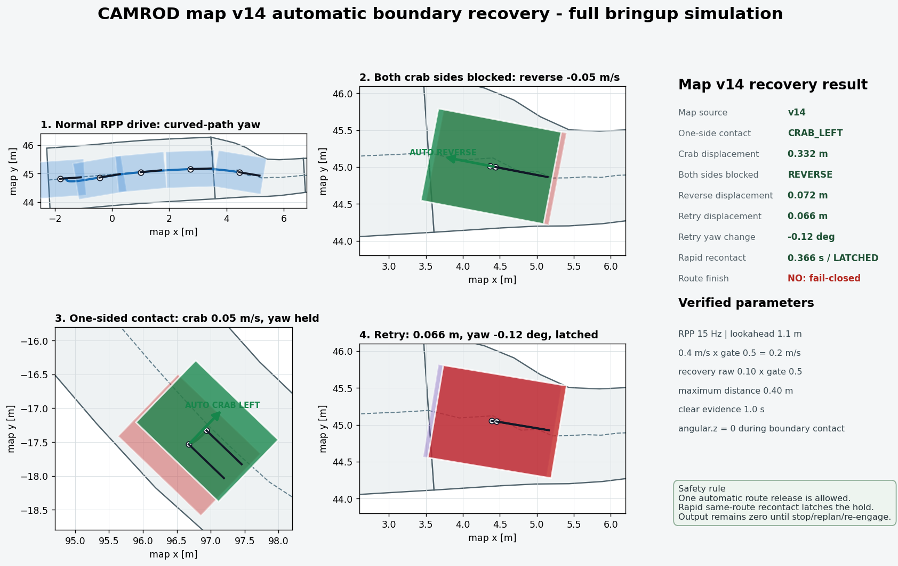
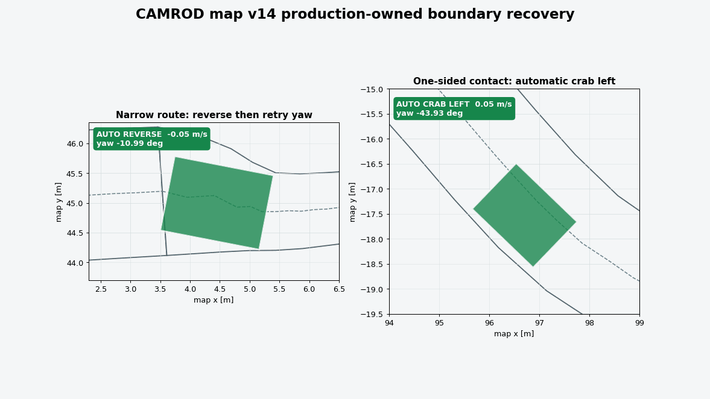

# camrod_control

<!-- HH_260805 - Document adaptive reverse/yaw/crab recovery while preserving
the measured-body stop and historical translation-only evidence labels. -->

Native C++ motion owners for the final command gate, campsite/drop-zone local
maneuvers, parking, and bounded map-boundary recovery.


## Actual Simulation Runtime

| Boundary and route in RViz | Gate state, zero output, and event times |
|---|---|
|  |  |

`SIM RUNTIME CAPTURE`: with map v14, after one automatic release the same B6
boundary was recontacted in `0.276 s`; the gate latched `ROUTE_SAFETY_HOLD`, stopped issuing
recovery candidates, and published an all-zero final command.

## At A Glance

| Uses | Function | Main output |
|---|---|---|
| Nav2 command, local maneuver commands, parking, and recovery | Selects one raw command owner | `/control/cmd_vel_raw` |
| SOC, CAN, localization, LiDAR/radar/map costs | Applies the final motion authorization policy | `/control/cmd_vel`, `/control/cmd_vel_ros` |
| Complete robot footprint and projected candidates | Stops at map contact and permits only bounded escape | Gate/candidate/controller status |

## Active Safety Values

| Policy | Value | Result |
|---|---:|---|
| New campsite mission | `SOC >= 35%` | Departure admitted |
| Critical battery | `SOC <= 20%` | Hard command stop |
| Command timeout | `0.35 s` | Stale command becomes zero |
| Planning footprint | front/rear `0.80837/0.78323 m` | X extents including `0.05 m` margin |
| Planning footprint | left/right `0.58505/0.58495 m` | Y extents including `0.05 m` margin |
| Full-footprint stop | cost `100` or unknown | `ROUTE_SAFETY_HOLD` |
| Soft lane edge | cost `98` | Traversable planning bias, not the hard body stop |
| Dynamic cost stop | threshold `85` | LiDAR/radar/merged hazard hold |
| Route-clear proof | `1.0 s` | Releases retained route hold |
| Automatic release budget | `1` | Allows one bounded Nav2 resume attempt |
| Rapid recontact window | `5.0 s` | Same-route recontact latches until operator stop/replan |
| Recovery proof probe | `0.25 m` | Projected complete footprint must be clear |
| Recovery owner | `0.10 m/s`, `0.40 m`, `10 s` | Maximum raw speed, total travel, duration |
| Contact recovery yaw | `0.10 rad/s`, `12 deg` | Bounded reverse-yaw only after projected full-footprint proof |

## Runtime Owners

| Node | Responsibility |
|---|---|
| `cmd_vel_safety_gate` | Final engage, platform, battery, localization, timeout, obstacle, and lanelet authorization |
| `route_safety_recovery_controller` | Executes projected crab/reverse/reverse-yaw stages within one shared speed/distance/yaw/time budget |
| `camping_site_maneuver_controller` | Site entry, arrival turnaround, unload wait, explicit return, and exit |
| `drop_zone_maneuver_controller` | Charger/drop-zone exit, route yaw alignment, and parking handoff |
| `reverse_parking_controller` | Yaw-aware reverse travel and charging wait |
| `apriltag_parking_controller` | Rear-camera tag approach, insertion, retry, and charging completion |

## Command Path

```text
/control/nav2_cmd_vel_ros -----------+
/control/cmd_vel_raw ----------------+--> cmd_vel_safety_gate
                                          |--> /control/cmd_vel
                                          +--> /control/cmd_vel_ros --> Ranger
```

`/control/planning_engaged` reports manual-or-mission authorization.
`/control/command_enabled` can still be false during a safety, CAN, charging,
localization, or battery hold.

## Mission Maneuvers

| Site mode | Phase order |
|---|---|
| Active B1-B13 turnaround | `CRAB_IN -> ROTATE_180 -> UNLOAD_WAIT -> WAIT_RETURN -> ALIGN_RETRACE_YAW -> CRAB_OUT` |
| Optional roadside policy | Supported by the controller but not selected by the active campsite configuration |
| Drop-zone departure | `EXIT_STRAIGHT -> ALIGN_EXIT_YAW -> route release` |
| Return parking | route arrival -> body alignment -> selected parking controller |

The low-battery latch does not auto-return while people may be unloading. If
SOC falls below 35% during a campsite mission, the current site phase finishes
and the normal user return request remains required.

## Parking And Charging State

| Condition | Controller phase | Public `/service/state` |
|---|---|---|
| Final pose not reached | active parking phase | `DROP_ZONE_PARKING` |
| Contact pose reached; CAN charge absent | `WAIT_FOR_CHARGING` | `WAITING_FOR_CHARGING` |
| Parking complete; CAN charge true | `PARKED` | `CHARGING` |
| Parked; no active charge feedback | `PARKED` | `DROP_ZONE_WAIT` |
| New allowed mission while charging | departure override | `DEPARTING_CHARGER` |

The reverse controller defaults to `complete_without_charging: false` and a
`20 s` charging wait. `CHARGING` therefore takes precedence on the public state
surface while the internal controller remains `PARKED`.

## Boundary Evidence

| First complete-footprint stop | Narrow-route risk map |
|---|---|
|  |  |

| Earlier manual probe | Current automatic owner |
|---|---|
|  |  |



| Current map-v15 staged recovery | Current decision policy |
|---|---|
|  |  |



| Historical map-v14 measured rerun | Historical translation-only decision policy |
|---|---|
|  |  |



| Simulation case | Measured result | Verdict |
|---|---:|---|
| One lateral side clear | Crab displacement `0.3375 m`; output `<= 0.05 m/s` | Hold released; mission not complete |
| Both sides blocked, reverse selected | Release displacement `0.0327 m` in static case | Bounded reverse works |
| Same-goal RPP retry | `0.4726 m`, yaw `-2.0008 deg` | Normal yaw resumed after release |
| Later map boundary | Second hold observed | Map corridor remains limiting |
| Live B6 retry containment | map v14 `0.276 s` (v13 `0.267/0.372 s`); final Twist all zero | Retry loop stopped; operator action required |
| Map-v14 route probe | reverse `0.0703 m`, retry `0.0661 m` / yaw `-0.1235 deg`, recontact `0.366 s` | Retry latched; final Twist all zero |
| Map-v14 static/crab probes | reverse `0.0721 m`; crab-left `0.3321 m` | Both bounded motions released the first hold |
| Map-v15 route probe | `REVERSE_YAW_RIGHT`, recovery `0.0582 m`, max yaw `0.05 rad/s`, recontact `0.335 s` | Retry latched; final Twist all zero |
| Map-v15 static probe | `REVERSE_YAW_RIGHT`, recovery `0.0405 m`, max yaw `0.05 rad/s`, recontact `0.400 s` | Retry latched; final Twist all zero |
| Map-v15 one-side probe | `CRAB_LEFT`, `0.3378 m`, max lateral `0.05 m/s` | First hold released without recontact; mission incomplete |

The map-v14 PNG/GIF remains historical translation-only evidence. The map-v15
PNG/GIF is a current full-simulation dynamic run of the active selector, which reevaluates all
five projected commands on every hold update: left/right crab, straight
reverse, and left/right reverse-yaw. A unique safe crab moves away from the
contact. Otherwise straight reverse creates room; it may transition to the
unique safe yaw arc, or to the original RPP turn sign when both arcs are clear.
Each stage must keep the complete projected footprint, fresh lanelet grid/pose,
and dynamic obstacle checks clear. A blocked active crab can use straight
reverse to reposition, then be reevaluated.

After a maximum `12 deg` heading correction, the owner removes angular velocity
and continues only a separately checked reverse translation. The total
`0.40 m`/`10 s` budget is not reset during a stage transition. Only one route
release is permitted; same-route recontact within 5 seconds latches zero output
until stop/replan/re-engage. The staged selector and swept projection are unit
validated and exercised dynamically on map v15. Both route retry cases remained
fail-closed rather than completing a mission; physical recovery remains pending.

## Configuration

| File | Owns |
|---|---|
| `config/cmd_vel_safety_gate.yaml` | Authorization, battery, timeout, dynamic cost, footprint, and recovery-candidate policy |
| `config/control.yaml` | Campsite, drop-zone, and recovery-owner motion values |
| `config/parking.yaml` | Reverse and AprilTag parking values |
| `config/yaw_alignment_zones.yaml` | Optional map yaw-lock zones; disabled by default |

## Run And Validate

```bash
ros2 launch camrod_control cmd_vel_safety_gate.launch.py
ros2 launch camrod_control maneuvers.launch.py
ros2 launch camrod_control parking.launch.py parking_method:=reverse

ros2 topic echo /control/cmd_vel_safety_gate/status
ros2 topic echo /control/route_safety_recovery/candidate
ros2 topic echo /control/route_safety_recovery_controller/status
```

Detailed timelines and reproduction commands are in the
[boundary recovery validation](../docs/V2_1_3_BOUNDARY_RECOVERY_VALIDATION.md)
and the [map-v15 evidence directory](../docs/evidence/v2.1.4/map-v15-boundary-recovery/).
