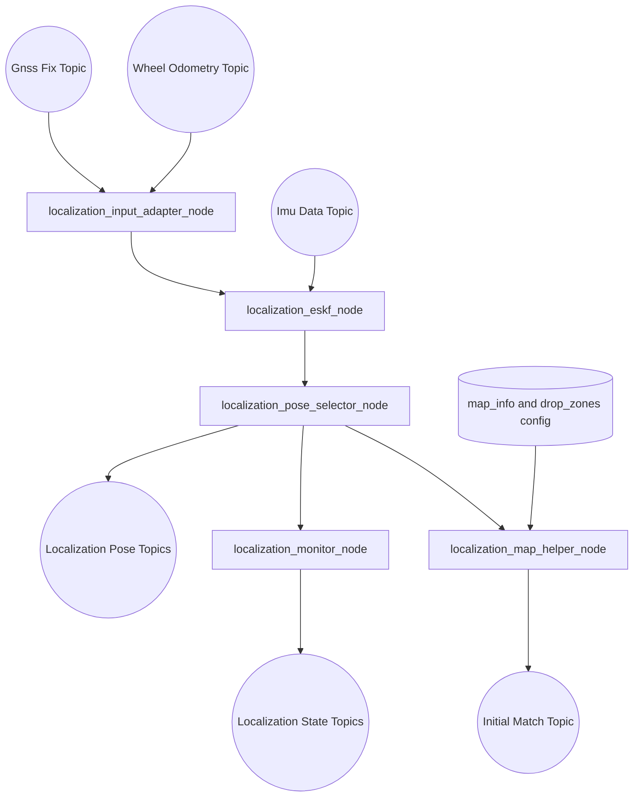
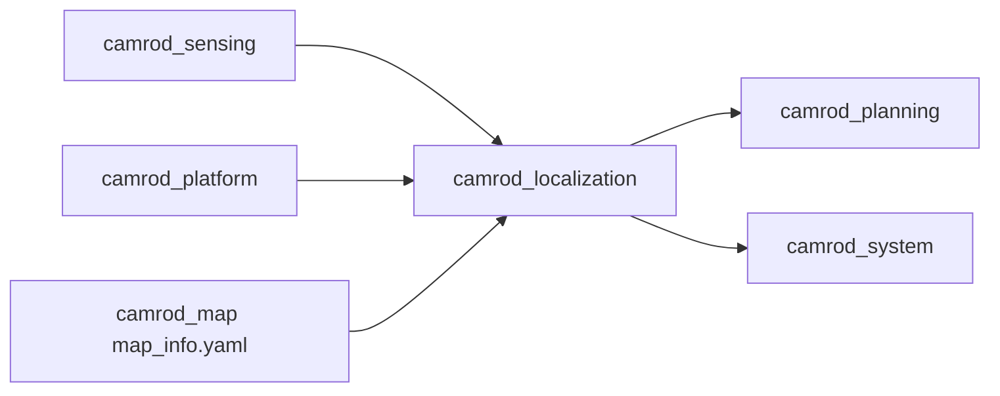

# camrod_localization

## Role
`camrod_localization` converts sensing/platform inputs into stable localization outputs and readiness/state signals.

## Package Diagram


Diagram legend: `[node/process]`, `((topic stream))`, `[(config or interface)]`, `[[external package or launch]]`.

## Node Data Flow
| Node | Main Inputs | Main Outputs |
|---|---|---|
| `localization_input_adapter_node` | `/sensing/gnss/ublox_gps_node/fix`, wheel inputs (`/platform/status/wheel` or odom variants) | `/sensing/gnss/pose`, `/sensing/gnss/pose_with_covariance`, `/platform/wheel/odometry`, `/platform/wheel/nav_odometry` |
| `localization_eskf_node` | `/sensing/imu/data`, `/sensing/gnss/pose_with_covariance`, `/platform/wheel/odometry` | `/localization/pose`, `/localization/pose_with_covariance`, `/localization/odometry/filtered`, `/localization/twist`, `/localization/eskf/status` |
| `localization_pose_selector_node` | primary/fallback pose+odom + `/localization/mode` | selected `/localization/pose`, `/localization/pose_with_covariance`, `/localization/odometry/filtered`, `/localization/pose_source` |
| `localization_monitor_node` | `/localization/eskf/status`, GNSS/IMU/wheel topics | `/localization/mode`, `/localization/status`, `/localization/confidence`, `/localization/state`, `/localization/state/degraded` |
| `localization_map_helper_node` | `/localization/pose`, `/localization/pose_with_covariance`, `map_info.yaml`, `drop_zones.yaml` | `/localization/lanelet_pose`, `/localization/initialpose3d`, `/localization/initial_match_ok`, `/localization/initial_match_id`, `/localization/initial_match_distance` |

## Inter-Package Connections


## Topic Summary
### Input Topics
| Input Topic | Purpose |
|---|---|
| `/sensing/gnss/ublox_gps_node/fix` | GNSS raw position source |
| `/sensing/imu/data` | IMU source for filter |
| `/platform/wheel/odometry` | Wheel odometry source |

### Output Topics
| Output Topic | Purpose |
|---|---|
| `/localization/pose` | Canonical pose for planning/platform |
| `/localization/pose_with_covariance` | Covariance-aware pose |
| `/localization/odometry/filtered` | Fused odometry |
| `/localization/initial_match_ok` | Initialization readiness used by planning lifecycle gate |

## Practical Usage
```bash
ros2 launch camrod_localization localization.launch.py
```

Examples:
```bash
ros2 launch camrod_localization localization.launch.py map_path:=/absolute/path/lanelet2_maps.osm
```

## Config Files
- `config/source/input_adapter.yaml`
- `config/filter/eskf.yaml`
- `config/filter/pose_selector.yaml`
- `config/filter/monitor.yaml`
- `config/reference/map_helper.yaml`
- Shared reference source: `camrod_map/config/map_info.yaml`
