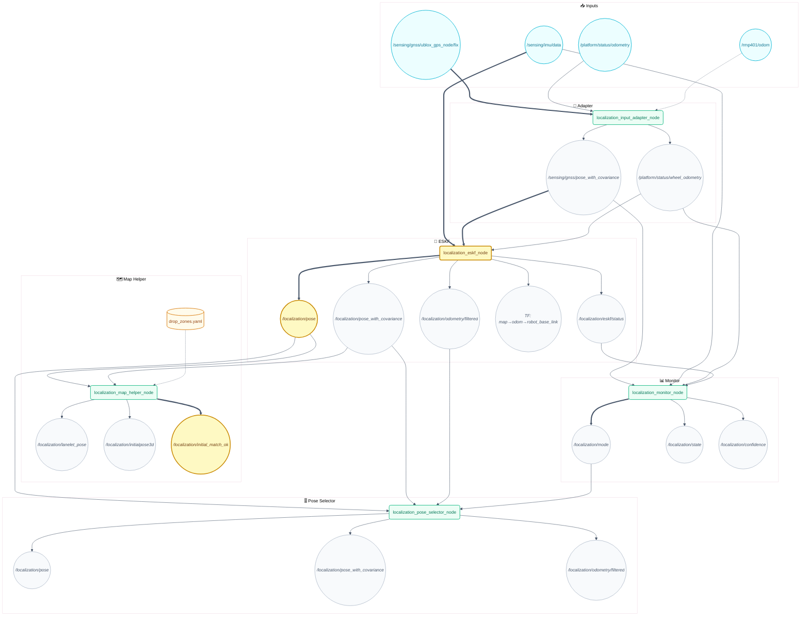
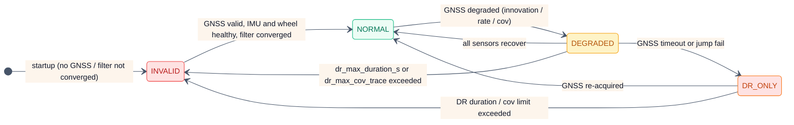
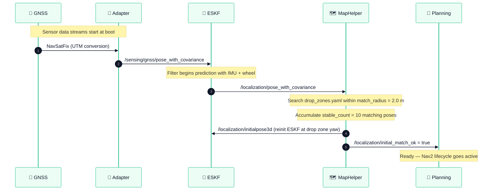

# 📍 camrod_localization — GNSS/IMU/wheel fusion (EKF default) & localization state

## 1. 📋 Summary

`camrod_localization` is the state estimation pipeline for the CAMROD robot. The default runtime backend is EKF (`filter_type:=ekf`); the custom ESKF backend remains available only for explicit `filter_type:=eskf` experiments. The pipeline fuses GNSS (NavSatFix), IMU, and wheel odometry into a consistent `map`-frame pose. A map helper node snaps poses to the Lanelet2 centerline and matches the robot to a configured drop zone at startup for automatic pose initialization.

| | |
|---|---|
| **Upstream dependencies** | `camrod_sensing`, `camrod_platform`, `camrod_map` |
| **Downstream consumers** | `camrod_planning`, `camrod_platform`, `camrod_system` |

---

## 2. 🚀 Quick Start

```bash
# Full localization stack (EKF + adapter + monitor + map helper)
ros2 launch camrod_localization localization.launch.py

# With explicit EKF config override
ros2 launch camrod_localization localization.launch.py \
  filter_ekf_param_file:=/path/to/ekf.yaml

# Without map helper (no Lanelet2 map available)
ros2 launch camrod_localization localization.launch.py \
  enable_map_helper:=false

# Override Lanelet2 map path (for drop zone matching)
ros2 launch camrod_localization localization.launch.py \
  map_path:=/absolute/path/lanelet2_maps.osm

# Monitor localization mode
ros2 topic echo /localization/mode
ros2 topic echo /localization/confidence
ros2 topic echo /localization/initial_match_ok
```

---

## 🧭 System Position


> **Diagram legend**
> 🧩 ROS node · 📡 Topic · ⚙️ Config · 🛠️ Hardware · 📦 External · 🔔 Service/Action
> Solid → runtime · ==> critical path · -.-> optional

*Figure 1 — camrod_localization system context: sensor inputs from upstream, the localization package, and downstream pose consumers.*

---

## 🏗️ Runtime Architecture



*Figure 2 — Runtime node graph. Critical path: sensing ==> ESKF ==> `/localization/pose`; map helper publishes `/localization/initial_match_ok` to unblock Nav2.*

### Node Summary

| Node | Key Inputs | Key Outputs | Notable Params |
|---|---|---|---|
| `localization_input_adapter_node` | `/sensing/gnss/ublox_gps_node/fix`, `/platform/status/odometry`, `/rmp401/odom` | `/sensing/gnss/pose_with_covariance`, `/platform/status/wheel_odometry` | `gnss_covariance_floor_xy`: 1e-6 m², `wheel_primary_timeout_s`: 0.7 s, `max_position_jump_m`: 8.0 m |
| `localization_eskf_node` | `/sensing/imu/data`, `/sensing/gnss/pose_with_covariance`, `/platform/status/wheel_odometry` | `/localization/pose`, `/localization/pose_with_covariance`, `/localization/odometry/filtered`, TF, `/localization/eskf/status` | `nhc_mode`: enabled, `zupt_mode`: enabled, `gnss_gate_mahalanobis`: 64.0, `gyro_noise`: 0.015 rad/s, `gnss_position_noise`: 4.0 m, `reinit_distance_threshold`: 3.0 m |
| `localization_monitor_node` | `/sensing/gnss/pose_with_covariance`, `/sensing/imu/data`, `/platform/status/wheel_odometry`, `/localization/eskf/status` | `/localization/mode`, `/localization/state`, `/localization/confidence` | `gnss_timeout_s`: 4.0, `imu_timeout_s`: 1.0, `wheel_timeout_s`: 1.0, `gnss_cov_trace_fail`: 1.0, `gnss_min_hz`: 0.8, `dr_max_duration_s`: 30.0 |
| `localization_map_helper_node` | `/localization/pose`, `/localization/pose_with_covariance`, Lanelet2 map, `drop_zones.yaml` | `/localization/lanelet_pose`, `/localization/initialpose3d`, `/localization/initial_match_ok` | `max_search_radius`: 30 m, `lateral_stddev`: 0.3, `match_radius`: 2.0 m, `stable_count`: 10 |
| `localization_pose_selector_node` | `/localization/primary/pose_with_covariance`, `/localization/fallback/*`, `/localization/mode` | `/localization/pose`, `/localization/pose_with_covariance`, `/localization/odometry/filtered` | `primary_timeout_s`: 0.5 s, `fallback_on_mode_at_or_above`: 3 (INVALID) |

---

## 🔌 Interface Contract

### Inputs

| Topic | Type | Required | Producer | Rate | Meaning |
|---|---|---|---|---|---|
| `/sensing/imu/data` | `sensor_msgs/Imu` | Yes | camrod_sensing | ~100 Hz | IMU acceleration and gyroscope; drives ESKF prediction step |
| `/sensing/gnss/ublox_gps_node/fix` | `sensor_msgs/NavSatFix` | Yes | camrod_sensing | ~1 Hz | Raw GNSS fix; converted to map-frame PoseWithCovarianceStamped by adapter |
| `/platform/status/odometry` | `nav_msgs/Odometry` | Yes | camrod_platform | ~20 Hz | Primary wheel odometry; speed + yaw-rate for ESKF correction |
| `/rmp401/odom` | `nav_msgs/Odometry` | No | camrod_platform | ~20 Hz | Fallback wheel odometry; used when primary stream is stale for > 0.7 s |

### Outputs

| Topic | Type | Consumer | Rate | Meaning |
|---|---|---|---|---|
| `/localization/pose` | `geometry_msgs/PoseStamped` | camrod_planning, camrod_platform | ~50 Hz | Map-frame robot pose (ESKF fused) |
| `/localization/pose_with_covariance` | `geometry_msgs/PoseWithCovarianceStamped` | camrod_planning (Nav2 costmap) | ~50 Hz | Map-frame pose with covariance |
| `/localization/odometry/filtered` | `nav_msgs/Odometry` | camrod_planning (Nav2, cmd_vel_gate) | ~50 Hz | Filtered odometry with velocity |
| `/localization/mode` | `AvgLocalizationMode` | camrod_planning, camrod_system | ~5 Hz | NORMAL=0 / DEGRADED=1 / DR_ONLY=2 / INVALID=3 |
| `/localization/initial_match_ok` | `std_msgs/Bool` | camrod_system, camrod_planning | on change | `true` once robot has matched a drop zone and ESKF is initialized |
| `/localization/confidence` | `std_msgs/Float32` | camrod_system | ~5 Hz | Filter confidence score [0–1] |
| `/localization/state` | `std_msgs/Bool` | camrod_system | ~5 Hz | Overall localization health flag |
| `/localization/lanelet_pose` | `geometry_msgs/PoseStamped` | camrod_planning | ~20 Hz | Pose projected onto nearest Lanelet2 centerline |
| `/localization/initialpose3d` | `geometry_msgs/PoseWithCovarianceStamped` | camrod_planning (Nav2 initialpose) | once | Drop-zone-matched initial pose published once at startup |
| `/localization/eskf/status` | (ESKF diagnostics) | localization_monitor_node | ~5 Hz | Internal filter status (innovation, covariance trace) |
| TF `map→odom→robot_base_link` | `tf2_msgs/TFMessage` | all packages | ~50 Hz | Authoritative transform tree published by ESKF node |

---

## ⚙️ Localization Modes

### 6.1 Mode State Diagram



*Figure 3 — Localization mode FSM. Green = fully healthy, yellow = degraded, orange = dead-reckoning, red = invalid.*

| Mode | Value | Description |
|---|---|---|
| `NORMAL` | 0 | GNSS + IMU + wheel all healthy; filter converged |
| `DEGRADED` | 1 | One or more sensors degraded but filter still tracking |
| `DR_ONLY` | 2 | GNSS fails any health gate (freshness, covariance, jump, rate, or filter acceptance) while wheel remains healthy; dead-reckoning on IMU + wheel |
| `INVALID` | 3 | Insufficient data or filter diverged; pose unreliable |

### 6.2 ESKF Update Sources

| Source | Update Type | Gating |
|---|---|---|
| GNSS pose (x, y) | Position correction | Mahalanobis 64.0 (auto-profile: normal=64, unstable=400) |
| Wheel speed + yaw-rate | Velocity + heading rate | Mahalanobis 9.0 |
| NHC | Lateral body velocity ≈ 0 | Mahalanobis 9.0 |
| ZUPT | Zero velocity at standstill | Mahalanobis 36.0 |
| GNSS COG heading | Yaw update at speed ≥ 0.8 m/s | Mahalanobis 9.0 (optional; disabled by default) |

---

## 🔑 Key Behaviors

### 7.1 GNSS Loss

**Trigger:** GNSS pose/covariance is older than `gnss_timeout_s` (4.0 s), XY covariance trace exceeds `gnss_cov_trace_fail` (1.0), rate falls below `gnss_min_hz` (0.8 Hz), a per-sample jump exceeds `gnss_jump_fail_m` (1.0 m), or an enabled filter-status stream rejects the GNSS update.

**Internal logic:** The monitor transitions mode from NORMAL → DEGRADED → DR_ONLY. The ESKF continues prediction using IMU and wheel odometry (NHC + ZUPT active). If DR continues beyond `dr_max_duration_s` (30 s) or covariance trace exceeds `dr_max_cov_trace` (200.0), mode becomes INVALID. The cmd_vel gate in camrod_planning imposes a 2 s hold when GNSS recovers (DR_ONLY → NORMAL).

> ⚠️ **Warning** `/localization/mode` changes to `DR_ONLY`; planning gate blocks motion 2 s on re-acquisition.

**Operator-visible symptom:** Pose drifts slowly; no immediate stop unless DR timeout triggers INVALID. After recovery, brief 2 s pause.

> 🔧 **Debug hint** Related params: `gnss_timeout_s`, `dr_max_duration_s`, `dr_max_cov_trace`, `max_position_jump_m`, `reinit_on_gnss_reject`, `reinit_distance_threshold`

**Related topics:** `/localization/mode`, `/sensing/gnss/pose_with_covariance`, `/localization/eskf/status`

> HH_260716 - A live `/fix` topic is only transport evidence. `DR_ONLY` can still be correct when `covariance[0] + covariance[7] > 1.0`; check the covariance topic and monitor parameters before changing the map origin or declaring GNSS lost.

---

### 7.2 IMU Stream Loss

**Trigger:** `/sensing/imu/data` stops arriving for longer than `imu_timeout_s` (default 1.0 s).

**Internal logic:** The ESKF prediction step stalls. Monitor transitions mode to DEGRADED or INVALID depending on remaining sensor health. Without IMU prediction, the filter cannot maintain continuous odom-frame integration.

> ⚠️ **Warning** `/localization/mode` transitions to DEGRADED; TF output may become stale.

**Operator-visible symptom:** Pose update rate drops; Nav2 may log TF extrapolation warnings.

> 🔧 **Debug hint** Related params: `imu_timeout_s`, `max_imu_dt` (0.5 s clamp), `gyro_noise`, `accel_noise`

**Related topics:** `/sensing/imu/data`, `/localization/mode`, TF `map→odom→robot_base_link`

---

### 7.3 Wheel Odometry Loss

**Trigger:** `/platform/status/odometry` stops arriving for longer than `wheel_primary_timeout_s` (default 0.7 s).

**Internal logic:** The adapter switches to the fallback source `/rmp401/odom`. If the fallback also times out, the wheel correction update is suspended. The ESKF continues with IMU prediction only; NHC still provides lateral constraint but speed becomes uncertain. Monitor transitions mode to DEGRADED.

> ⚠️ **Warning** `/localization/mode` may move to DEGRADED; wheel-speed and yaw-rate updates cease.

**Operator-visible symptom:** Heading drift increases, especially in DR_ONLY mode where wheel yaw-rate is the primary heading reference.

> 🔧 **Debug hint** Related params: `wheel_primary_timeout_s`, `wheel_fallback_input_topic`, `wheel_speed_noise`, `wheel_yaw_rate_noise`, `wheel_yaw_rate_mode`

**Related topics:** `/platform/status/odometry`, `/rmp401/odom`, `/platform/status/wheel_odometry`, `/localization/mode`

---

### 7.4 Drop Zone Match Failure

**Trigger:** `localization_map_helper_node` cannot find any drop zone entry from `drop_zones.yaml` within `match_radius` (default 2.0 m) of the robot's initial GNSS pose.

**Internal logic:** The node waits for `stable_count` (10) consecutive poses within `match_radius` before publishing the initialpose. If no match is found, `/localization/initial_match_ok` remains `false`. Planning waits for this signal if `require_localization_ready: true` is set.

> ⚠️ **Warning** `/localization/initial_match_ok` stays `false`; Nav2 does not auto-start if `require_localization_ready` is active.

**Operator-visible symptom:** Robot does not start navigating; `ros2 topic echo /localization/initial_match_ok` returns `false`. Nav2 lifecycle stays in `inactive` if `require_localization_ready` is set.

> 🔧 **Debug hint** Related params: `match_radius`, `stable_count`, `drop_zone_yaw_source`, `drop_zone_center_mode`, `publish_once`

**Related topics:** `/localization/initial_match_ok`, `/localization/initialpose3d`, `/localization/initial_match_id`, `/localization/initial_match_distance`

---

## 🗓️ Drop Zone Initialization Sequence



*Figure 4 — Drop zone initialization sequence. ESKF is re-initialized at the matched drop zone yaw before Nav2 is unblocked.*

---

## 🚀 Launch

```bash
# Full localization stack
ros2 launch camrod_localization localization.launch.py

# With explicit ESKF config override
ros2 launch camrod_localization localization.launch.py \
  filter_eskf_param_file:=/path/to/eskf.yaml

# Without map helper (no Lanelet2 map available)
ros2 launch camrod_localization localization.launch.py \
  enable_map_helper:=false

# Override Lanelet2 map and drop zone file
ros2 launch camrod_localization localization.launch.py \
  map_path:=/absolute/path/lanelet2_maps.osm \
  drop_zones_yaml:=/absolute/path/drop_zones.yaml
```

Key launch arguments:

| Argument | Default | Description |
|---|---|---|
| `enable_adapter` | `true` | GNSS/wheel input adapter |
| `enable_filter` | `true` | Localization state estimator (EKF/ESKF) |
| `enable_monitor` | `true` | Sensor health and mode monitor |
| `enable_map_helper` | `true` | Lanelet centerline snapper + drop zone matcher |
| `filter_type` | `ekf` | Explicit filter selector: `ekf` or `eskf` |
| `wheel_input_topic` | `/platform/status/odometry` | Primary wheel odometry topic |
| `wheel_fallback_input_topic` | `/rmp401/odom` | Fallback wheel odometry topic |
| `wheel_primary_timeout_s` | `0.7` | Timeout before fallback switch [s] |
| `map_path` | `""` (resolved from `map_info.yaml`) | Lanelet2 `.osm` path for map helper |
| `drop_zones_yaml` | `config/drop_zones.yaml` | Drop zone definitions for initialization |
| `filter_eskf_param_file` | `config/filter/eskf.yaml` | ESKF noise and gate parameters |
| `monitor_param_file` | `config/filter/monitor.yaml` | Sensor timeout and mode decision thresholds |

---

## 🛠️ Config

| File | Purpose |
|---|---|
| `config/source/input_adapter.yaml` | GNSS NavSatFix → PoseWithCovariance conversion, wheel topic bridging, covariance floors (`gnss_covariance_floor_xy`: 1e-6 m²), position jump rejection (`max_position_jump_m`: 8.0 m) |
| `config/filter/eskf.yaml` | ESKF noise params (`gyro_noise`: 0.015 rad/s, `gnss_position_noise`: 4.0 m), Mahalanobis gates, NHC/ZUPT, IMU sign corrections, GNSS auto-profile switching, stop detection (`stop_speed_threshold`: 0.10 m/s) |
| `config/filter/ekf.yaml` | robot_localization EKF parameters (used when `filter_type:=ekf`). Node log level set to WARN in `filter.launch.py` — suppress verbose INFO (e.g. `set_pose` request logs emitted on every GNSS-reattach) |
| `config/filter/monitor.yaml` | Sensor timeouts (`gnss_timeout_s`: 4.0, `imu_timeout_s`: 1.0, `wheel_timeout_s`: 1.0), GNSS health gates (`gnss_cov_trace_fail`: 1.0, `gnss_jump_fail_m`: 1.0, `gnss_min_hz`: 0.8), recovery debounce (1.5 s), and DR timeout (`dr_max_duration_s`: 30.0) |
| `config/filter/pose_selector.yaml` | Primary/fallback source topology, `fallback_on_mode_at_or_above`: 3 (INVALID), `primary_timeout_s`: 0.5 s |
| `config/reference/map_helper.yaml` | Centerline snapper covariance (`lateral_stddev`: 0.3), drop zone match radius 2.0 m, `stable_count`: 10, `drop_zone_yaw_source`: zone |
| `config/drop_zones.yaml` | Drop zone definitions (id, x, y, z, yaw_deg in map frame) used for initial pose matching |

---

## ✅ Validation

```bash
# Monitor localization mode (should reach NORMAL quickly after GNSS lock)
ros2 topic echo /localization/mode

# Verify filter output rate (~50 Hz)
ros2 topic hz /localization/pose

# Check initial match state
ros2 topic echo /localization/initial_match_ok

# Inspect ESKF internal status (innovation, covariance trace)
ros2 topic echo /localization/eskf/status

# Check confidence score
ros2 topic echo /localization/confidence

# Verify TF tree is complete
ros2 run tf2_tools view_frames
```

---

## 🚑 Troubleshooting

### Pose drifts after GNSS recovery

1. Check if the GNSS recovery hold in `camrod_planning` has expired: `ros2 topic echo /localization/mode` — if mode is NORMAL, the hold should clear within 2 s.
2. Verify ESKF reinitialization: `ros2 topic echo /localization/eskf/status` — check if `reinit_on_gnss_reject` triggered during the DR period.
3. Increase `gnss_profile_switch_accept_count` (default 8) to require more consecutive good measurements before switching back to normal GNSS profile.
4. Inspect GNSS covariance: `ros2 topic echo /sensing/gnss/pose_with_covariance` — large covariance diagonal after recovery indicates RTK re-convergence is still in progress.

---

### Robot starts in wrong drop zone

1. Verify `config/drop_zones.yaml` coordinates match the actual deployment map origin.
2. Check `match_radius` (default 2.0 m) — if GNSS error at startup exceeds 2 m, the match will fail; increase `match_radius` temporarily.
3. Check `stable_count` (default 10) — if GNSS fix is unstable, the stable sequence may match a wrong zone transiently; increasing `stable_count` reduces false matches.
4. Monitor `/localization/initial_match_id` and `/localization/initial_match_distance` to see which zone was matched and at what distance.

---

### Mode stuck at INVALID

1. Check all three sensor streams: `ros2 topic hz /sensing/imu/data`, `ros2 topic hz /sensing/gnss/ublox_gps_node/fix`, `ros2 topic hz /platform/status/odometry`.
2. Verify GNSS NavSatFix has a valid fix (status ≥ 0): `ros2 topic echo /sensing/gnss/ublox_gps_node/fix --field status.status`.
3. Check if `dr_max_duration_s` (30 s) was exceeded — if the filter transitioned to INVALID due to DR timeout, a hard restart of `localization_eskf_node` may be required.
4. Check `dr_max_cov_trace` (200.0) — inspect covariance trace in `/localization/eskf/status`; if consistently above 200, the filter has diverged and needs reinit.

---

### Pose jumps

1. Check `max_position_jump_m` (default 8.0 m) in `config/source/input_adapter.yaml` — the adapter rejects single-frame GNSS jumps above this threshold.
2. Verify `reinit_distance_threshold` (default 3.0 m) in `config/filter/eskf.yaml` — if GNSS and ESKF state diverge by more than this, the filter reinitializes from GNSS.
3. Check for RTK fix-to-float transitions: covariance in `/sensing/gnss/pose_with_covariance` spikes when RTK degrades; ESKF should gate these via Mahalanobis check.
4. Inspect `gnss_profile_mode: auto` behavior — the filter switches to `unstable` profile (gate relaxed to 400.0) after `gnss_profile_switch_reject_count` (2) consecutive rejects, which may allow a larger correction on the next valid fix.

---

## 🔗 Related Docs

- [../README.md](../README.md) — CAMROD monorepo overview
- [../camrod_sensing/README.md](../camrod_sensing/README.md) — GNSS, IMU, and sensor pipeline
- [../camrod_map/README.md](../camrod_map/README.md) — Lanelet2 map, drop zone coordinates source
- [../camrod_planning/README.md](../camrod_planning/README.md) — Planning stack, GNSS recovery hold, `require_localization_ready`
- [../PARAMETER_NAMING_STANDARD.md](../PARAMETER_NAMING_STANDARD.md) — Canonical param naming conventions

## 2026-06-17 Runtime Update

> HH_260617: EKF remains the default localization backend for both real and sim bringup.

`bringup.launch.py` forwards `filter_type:=ekf` by default. Planning and parking consume `/localization/pose`; parking controllers do not perform localization fusion themselves. Drop-zone reverse parking depends on fresh `PoseStamped` data and will refuse to start if `pose_timeout_s` is exceeded.

## 2026-07-02 Runtime Update

> HH_260702: Localization health is diagnostic evidence, while planning stop authority stays in planning/platform gates.

The default operator flow keeps `/localization/pose`, `/localization/mode`, and `/localization/initial_match_ok` as the shared pose/mode contract for planning, parking, system diagnostics, and UI. Drop-zone matching is still useful for return-to-drop-zone missions, but manual-goal field tests may disable or downgrade that checker through the diagnostics profile instead of adding an arbitrary GNSS yaw/pose offset in code.

When debugging outdoor heading or lane alignment, verify these topics together before changing offsets:

```bash
ros2 topic echo /localization/pose --once
ros2 topic echo /localization/mode --once
ros2 topic echo /localization/initial_match_ok --once
ros2 topic hz /sensing/gnss/ublox_gps_node/fix
ros2 topic hz /sensing/imu/data
```

For the v1.16 field baseline, bringup and package configs are expected to stay synchronized through `camrod_bringup/config/localization/*` and `camrod_localization/config/*`; update both sides when changing thresholds that affect system diagnostics or parking start conditions.
