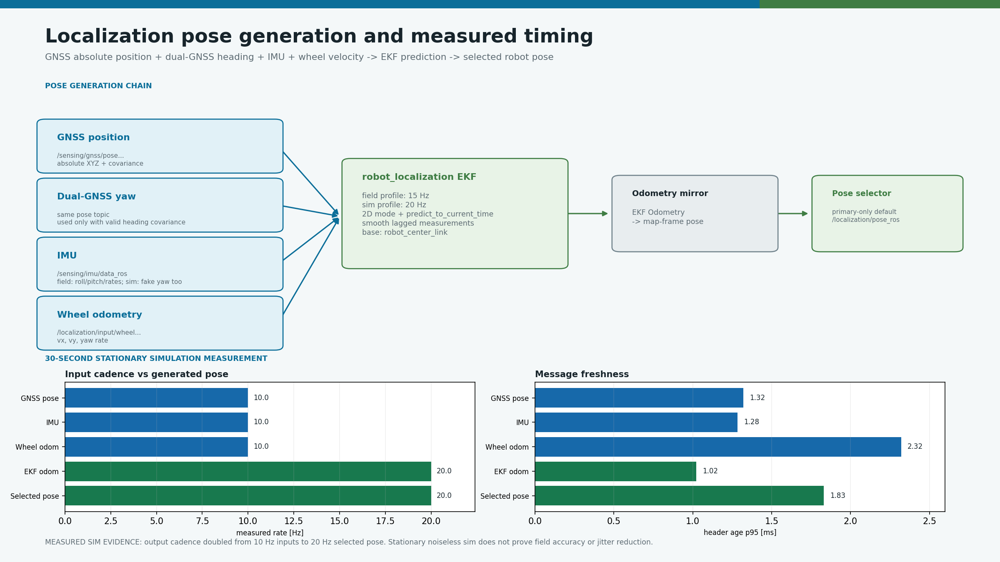
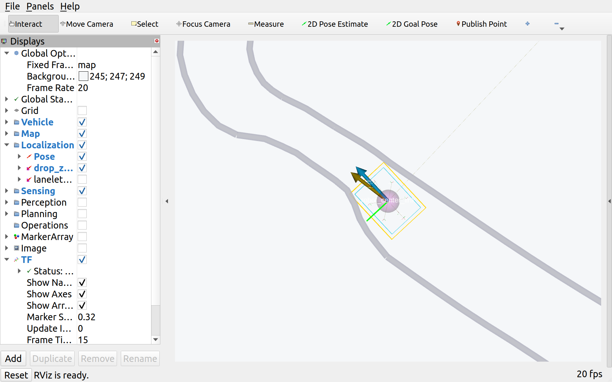

# camrod_localization

<!-- HH_260807 - Document the bounded GNSS-anchored EKF yaw-delta fallback
used only to preserve lever-arm correction through a short heading gap. -->
<!-- HH_260806 - Document the measured left-GNSS lever arm and fail-closed
heading requirement used to publish the robot-center position. -->
<!-- HH_260806 - Document IMU/wheel fusion and extend real-filter lag history for the 3 km/h profile. -->

GNSS, dual-GNSS heading, IMU, and Ranger wheel-velocity fusion for the
canonical `robot_center_link` pose and localization-health state.



## Actual Simulation Runtime



`SIM RUNTIME CAPTURE`: the running RViz graph overlays selected localization
poses, GNSS, and the `map -> odom -> robot_center_link -> robot_base_link` TF
chain. It does not measure physical GNSS accuracy.

## At A Glance

| Uses | Function | Main outputs |
|---|---|---|
| `robot_localization` EKF | Predicts a smooth 2D pose between sensor updates | `/localization/odometry`, `/localization/pose` |
| GNSS position/heading, IMU, wheel odometry | Fuses absolute and relative motion observations | EKF ROS boundary topics |
| Monitor, selector, map helper | Publishes mode, confidence, degraded state, and lanelet/drop-zone references | `/localization/mode`, `/localization/state`, `/localization/centerline_pose` |

## Profiles

| Item | Field | Simulation |
|---|---:|---:|
| EKF frequency | `20 Hz` | `20 Hz` |
| GNSS correction cadence | configured `5 Hz` | fake input `10 Hz` |
| Base frame | `robot_center_link` | `robot_center_link` |
| GNSS raw position | left antenna `(0,+0.45,0) m` | Same modeled source |
| GNSS published position | heading-corrected `robot_center_link` | Same correction path |
| Mode | 2D | 2D |
| TF | EKF publishes `odom -> robot_center_link` | Same |
| Prediction | `predict_to_current_time: true` | Same |
| Lag handling | `smooth_lagged_data: true` | Same |
| Lag history | `1.0 s` | `0.3 s` |
| Absolute yaw | Dual-GNSS heading; IMU yaw disabled | Map-consistent fake GNSS heading |

## Inputs And Outputs

| Direction | Topic | Role |
|---|---|---|
| Input | `/sensing/gnss/pose_with_covariance_ros` | Absolute map position and optional valid heading covariance |
| Input | `/sensing/imu/data_ros` | Yaw-rate prediction; 2D mode clamps roll/pitch and their rates |
| Input | `/platform/status/odometry` | Ranger wheel motion source |
| Internal | `/localization/input/wheel_odometry_ros` | EKF-ready wheel odometry |
| Output | `/localization/pose_ros` | ROS pose consumed by Nav2 and probes |
| Output | `/localization/pose` | Generated CAMROD pose contract |
| Output | `/localization/mode` | `NORMAL`, degraded/dead-reckoning, or invalid state |
| Output | `/localization/centerline_pose` | Lanelet-aligned planning reference |

### EKF Fusion Channels

| Source | Field input | Fused state |
|---|---|---|
| GNSS position | `/sensing/gnss/pose_with_covariance_ros` | Absolute `x/y`; 2D mode clamps `z` |
| Dual-GNSS heading | same normalized pose contract | Absolute yaw |
| IMU | `/sensing/imu/data_ros` | `angular.z` yaw rate; absolute IMU yaw is disabled and 2D mode clamps roll/pitch rates |
| Ranger wheel odometry | `/localization/input/wheel_odometry_ros` | Body velocity `vx/vy` and yaw rate |

The adapter prefers `/platform/status/odometry` and falls back to
`/rmp401/odom` after `0.7 s`. IMU and wheel odometry predict motion between the
physical dual-GNSS corrections. As of HH_260807 the production contract is
configured at `5 Hz`; moving-base link and open-sky acceptance remain required.
The EKF and selected pose remain `20 Hz`; prediction between 200 ms GNSS epochs
does not turn the receiver stream itself into 20 Hz data.

### EKF Parameter Review

| Parameter group | Active value | Decision |
|---|---:|---|
| Prediction/output | `20 Hz`, `sensor_timeout=0.2 s` | Matches Nav2 and local-path control timing |
| Planar model | `two_d_mode=true` | Keeps `x/y/yaw`, `vx/vy/yaw-rate`; clamps `z/roll/pitch`, `vz`, roll/pitch rates, and `az` |
| Delayed samples | smoothing on, `history_length=1.0 s` | Covers the measured `747.6 ms` stationary header age |
| GNSS XY measurement | covariance floor `0.1 m^2`, rejection `3 sigma` | Retained from prior field tuning |
| GNSS heading | floor `1 deg^2`, rejection `1000 sigma` | Startup-friendly but effectively ungated; requires moving residual data before tightening |
| Process-noise diagonal | XY `0.01`, yaw `0.1`, `vx/vy=0.05`, yaw-rate `0.1` | Unchanged; `robot_localization` scales process noise by elapsed time |

Changing the filter from 15 to 20 Hz therefore does not require multiplying or
dividing process noise. GNSS heading gain, rejection, and wheel/IMU covariance
must be tuned from the same moving rosbag; changing them from stationary or
10 Hz fake-GNSS evidence could hide the actual steering or timestamp fault.

## Measured Simulation Timing

| Stream | Measured rate | Header-age p95 |
|---|---:|---:|
| GNSS pose | `10.000 Hz` | `1.32 ms` |
| IMU | `10.000 Hz` | `1.28 ms` |
| Wheel odometry | `10.000 Hz` | `2.32 ms` |
| EKF odometry | `20.000 Hz` | `1.02 ms` |
| Selected pose | `20.000 Hz` | `1.83 ms` |

The input adapter converts NavSatFix to the left-antenna map point, selects the
fresh calibrated dual-GNSS yaw, rotates `[0.0,+0.45] m` into map axes, and
subtracts it before jump rejection and EKF publication. During a short receiver
heading gap, a time-aligned EKF yaw change may rotate that lever arm only after
a valid GNSS heading anchor and for at most `3.0 s`; it never makes GNSS yaw
valid for fusion. Without a usable fresh or bounded fallback heading, the
adapter withholds the corrected GNSS pose instead of publishing a position
known to be displaced by up to `0.45 m`. Simulation now publishes the same raw
antenna and heading contract. The earlier 30-second
timing run proves cadence only; it predates this correction and does **not**
prove moving field accuracy, multipath rejection, or oscillation reduction.

### Focused Lever-Arm Simulation

| Timestamp-matched A/B metric | Result |
|---|---:|
| Samples | `30` |
| Correction ON versus OFF | `0.450000 m` |
| Center residual, correction ON mean/max | `0.000071 / 0.000071 m` |
| Center residual, correction OFF mean | `0.449995 m` |

This isolated AMD64 ROS test verifies transform direction and simulation
projection, not physical GNSS accuracy. Exact scope and the intermediate
projection diagnosis are in the [test record](../docs/assets/test_result/gnss-lever-arm-20260806/README.md).

### 3 km/h Kinematic Smoke Test


| Metric | AMD64 result |
|---|---:|
| Final command maximum | `0.833333 m/s` (`3.000001 km/h`) |
| Selected-pose rate | `20.024 Hz` |
| Selected-pose gap p95 / max | `50.903 / 51.752 ms` |
| Header age p95 / max | `1.531 / 45.982 ms` |
| Pose step p95 / max | `4.197 / 6.485 cm` |
| Steps over `20 cm` | `0` |

This smoke test uses fake GNSS, IMU, and wheel inputs at `10 Hz` and the
simulation EKF at `20 Hz`; its fake input cadence does not reproduce the
physical `5 Hz` moving-base link, real-stack Jetson load, wheel scale, or IMU
bias. See the
[structured test record](../docs/assets/test_result/three-kph-localization-20260806/README.md).

## Reported Physical Stationary Performance


| 60-second field metric | Result |
|---|---:|
| Final selected pose | `14.99 Hz` (15 Hz target met) |
| Selected-pose header age p50/p95/max | `35.6 / 352.5 / 747.6 ms` |
| GNSS-to-final XY p95 | `0.041 m` |
| GNSS-to-final yaw p95 | `0.74 deg` |
| Stationary GNSS yaw span | `2.532 deg` |

This run occurred under CPU saturation and did not exercise driving. Raw files
are referenced by the field report but are not committed; the result does not
accept moving latency, crab yaw, lateral overshoot, or antenna lever arm.
The measured run used the former `15 Hz` field EKF. The configured real EKF is
now `20 Hz`, synchronized with the Nav2 controller, while its delayed-data
rewind history remains `1.0 s`. That rate change is not a physical moving PASS
until it meets the Jetson load and timing criteria.

## Nodes

| Node | Responsibility |
|---|---|
| `localization_input_adapter` | Converts GNSS/platform inputs and corrects left-antenna position to robot center |
| `ekf_filter` | Runs the selected `robot_localization` profile |
| `localization_output_adapter` | Converts EKF output to generated CAMROD messages |
| `pose_selector` | Publishes the selected primary pose source |
| `localization_monitor` | Evaluates freshness, innovations, confidence, and mode |
| `localization_map_helper` | Matches drop zones and publishes lanelet-aligned pose |
| `gnss_reattach` | Handles bounded recovery when GNSS returns after degradation |

## Active Health Values

| Check | Value |
|---|---:|
| GNSS timeout in monitor | `4.0 s` |
| IMU timeout | `1.0 s` |
| Wheel timeout | `1.0 s` |
| GNSS innovation WARN/FAIL | `3.0 / 6.0` |
| GNSS reattach timeout | `2.0 s` |

## Run And Validate

```bash
ros2 launch camrod_localization localization.launch.py

ros2 topic hz /localization/pose_ros
ros2 topic echo /localization/mode
ros2 topic echo /localization/state
ros2 run tf2_ros tf2_echo odom robot_center_link
```

| Config path | Purpose |
|---|---|
| `config/filter/ekf.yaml` | Field EKF profile |
| `config/filter/ekf_sim.yaml` | Simulation EKF profile |
| `config/filter/monitor.yaml` | Mode, timeout, innovation, and confidence policy |
| `config/filter/pose_selector.yaml` | Public pose selection |
| `config/reference/map_helper.yaml` | Lanelet/drop-zone matching |
| `config/source/input_adapter.yaml` | GNSS lever arm, heading validity, covariance, and input adapters |

Evidence JSON: [`pose-chain-sim-20260804.json`](../docs/evidence/module-guides/localization/pose-chain-sim-20260804.json).
