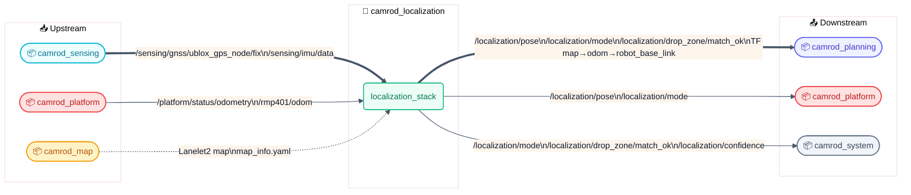
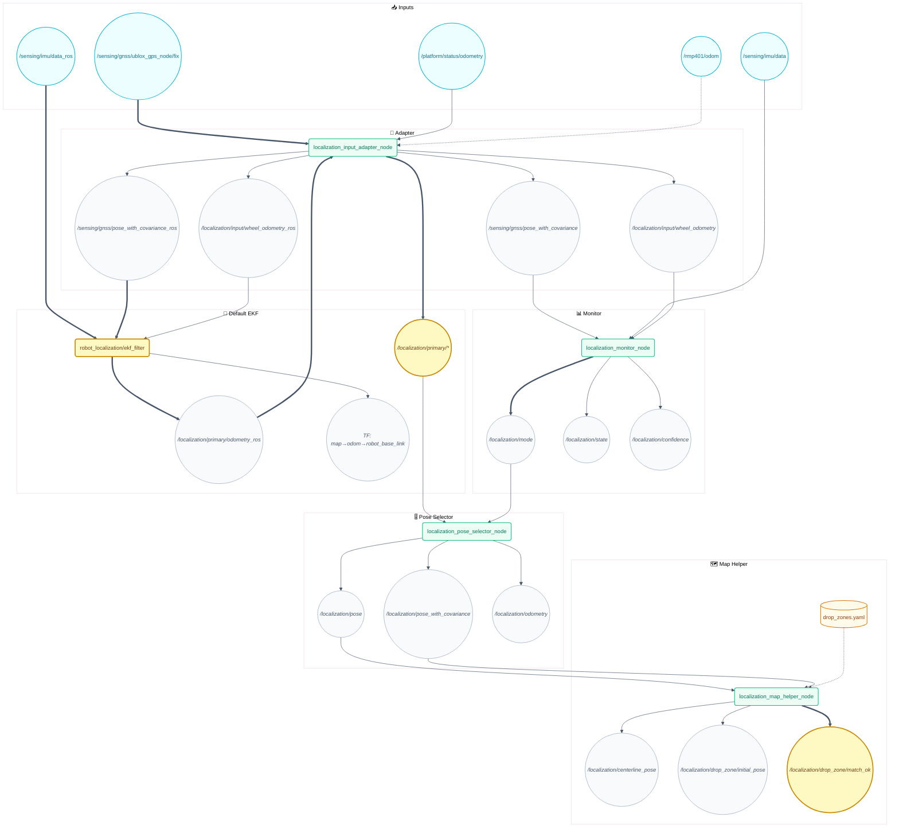
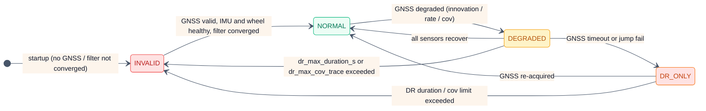
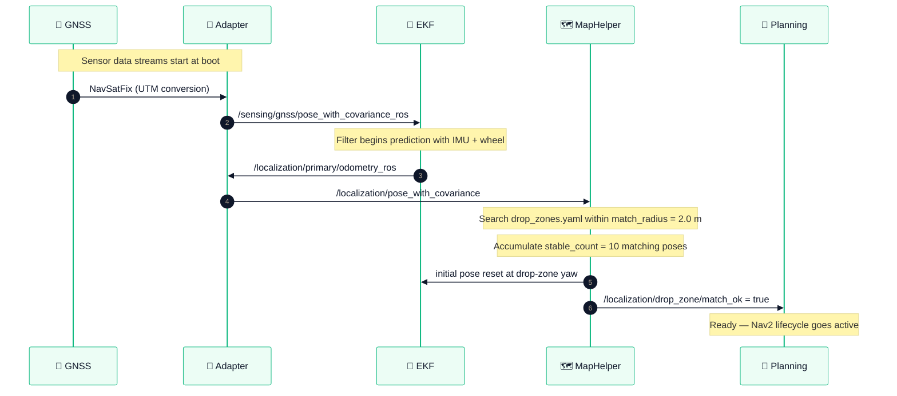

# 📍 camrod_localization — GNSS/IMU/wheel fusion (EKF default) & localization state

<!-- HH_260720 - Align documented generated topics with the current localization contracts. -->

## 1. 📋 Summary

`camrod_localization` is the state estimation pipeline for the CAMROD robot. The default runtime backend is EKF (`filter_type:=ekf`); the custom ESKF backend remains available only for explicit `filter_type:=eskf` experiments. The pipeline fuses GNSS (NavSatFix), IMU, and wheel odometry into a consistent `map`-frame pose. A map helper node snaps poses to the Lanelet2 centerline and matches the robot to a configured drop zone at startup for automatic pose initialization.

| | |
|---|---|
| **Upstream dependencies** | `camrod_sensing`, `camrod_platform`, `camrod_map` |
| **Downstream consumers** | `camrod_planning`, `camrod_platform`, `camrod_system` |

---

## 2. 🚀 Quick Start

```bash
# Full localization stack (EKF + adapter + monitor + map helper)
ros2 launch camrod_localization localization.launch.py

# With explicit EKF config override
ros2 launch camrod_localization localization.launch.py \
  filter_ekf_param_file:=/path/to/ekf.yaml

# Without map helper (no Lanelet2 map available)
ros2 launch camrod_localization localization.launch.py \
  enable_map_helper:=false

# Override Lanelet2 map path (for drop zone matching)
ros2 launch camrod_localization localization.launch.py \
  map_path:=/absolute/path/lanelet2_maps.osm

# Monitor localization mode
ros2 topic echo /localization/mode
ros2 topic echo /localization/confidence
ros2 topic echo /localization/drop_zone/match_ok
```

---

## 🧭 System Position



> **Diagram legend**
> 🧩 ROS node · 📡 Topic · ⚙️ Config · 🛠️ Hardware · 📦 External · 🔔 Service/Action
> Solid → runtime · ==> critical path · -.-> optional

*Figure 1 — camrod_localization system context: sensor inputs from upstream, the localization package, and downstream pose consumers.*

---

## 🏗️ Runtime Architecture

<!-- HH_260720 - Show the actual default EKF runtime instead of the optional ESKF branch. -->



*Figure 2 — Default runtime graph. Critical path: sensing ==> EKF ==> generated primary pose ==> `/localization/pose`; map helper publishes `/localization/drop_zone/match_ok` to unblock Nav2.*

### Node Summary

<!-- HH_260720 - Describe the EKF boundary conversion and sensor-only monitor mode. -->

| Node | Key Inputs | Key Outputs | Notable Params |
|---|---|---|---|
| `localization_input_adapter_node` | `/sensing/gnss/ublox_gps_node/fix`, `/platform/status/odometry`, `/rmp401/odom`, `/localization/primary/odometry_ros` | generated GNSS/wheel topics and `/localization/primary/*` | `gnss_covariance_floor_xy`: 1e-6 m², `wheel_primary_timeout_s`: 0.7 s, `max_position_jump_m`: 8.0 m |
| `robot_localization/ekf_filter` | `/sensing/imu/data_ros`, `/sensing/gnss/pose_with_covariance_ros`, `/localization/input/wheel_odometry_ros` | `/localization/primary/odometry_ros`, `odom→robot_base_link` TF | `frequency`: 10 Hz, `two_d_mode`: enabled, `world_frame`: odom, GNSS position/yaw enabled |
| `localization_monitor_node` | `/sensing/gnss/pose_with_covariance`, `/sensing/imu/data`, `/localization/input/wheel_odometry` | `/localization/mode`, `/localization/state`, `/localization/confidence` | `filter_status_mode`: none, `gnss_timeout_s`: 4.0, `imu_timeout_s`: 1.0, `wheel_timeout_s`: 1.0 |
| `localization_map_helper_node` | `/localization/pose`, `/localization/pose_with_covariance`, Lanelet2 map, `drop_zones.yaml` | `/localization/centerline_pose`, `/localization/drop_zone/initial_pose`, `/localization/drop_zone/match_ok` | `max_search_radius`: 30 m, `lateral_stddev`: 0.3, `match_radius`: 2.0 m, `stable_count`: 10 |
| `localization_pose_selector_node` | `/localization/primary/pose_with_covariance`, `/localization/fallback/*`, `/localization/mode` | `/localization/pose`, `/localization/pose_with_covariance`, `/localization/odometry` | `primary_timeout_s`: 0.5 s, `fallback_on_mode_at_or_above`: 3 (INVALID) |

---

## 🔌 Interface Contract

### Inputs

| Topic | Type | Required | Producer | Rate | Meaning |
|---|---|---|---|---|---|
<!-- HH_260720 - Internal inputs use generated types; `_ros` topics are explicit boundaries. -->
| `/sensing/imu/data` | `avg_msgs/AvgImu` | Yes | camrod_sensing | ~100 Hz | Generated IMU acceleration and gyroscope for CAMROD consumers |
| `/sensing/imu/data_ros` | `sensor_msgs/Imu` | EKF only | IMU driver | ~100 Hz | Raw standard boundary for robot_localization |
| `/sensing/gnss/ublox_gps_node/fix` | `sensor_msgs/NavSatFix` | Yes | camrod_sensing | ~1 Hz | Raw GNSS fix; converted to map-frame PoseWithCovarianceStamped by adapter |
| `/platform/status/odometry` | `avg_msgs/AvgOdometry` | Yes | camrod_platform | ~20 Hz | Generated primary platform odometry |
| `/rmp401/odom` | `nav_msgs/Odometry` | No | camrod_platform | ~20 Hz | Fallback wheel odometry; used when primary stream is stale for > 0.7 s |

### Outputs

<!-- HH_260720 - Drop-zone readiness is filter-independent and defaults to EKF. -->

| Topic | Type | Consumer | Rate | Meaning |
|---|---|---|---|---|
<!-- HH_260720 - Document generated internal outputs and explicit ROS mirrors. -->
| `/localization/pose` | `avg_msgs/AvgPoseStamped` | camrod_planning, camrod_platform | ~50 Hz | Selected map-frame robot pose |
| `/localization/pose_with_covariance` | `avg_msgs/AvgPoseWithCovarianceStamped` | CAMROD localization consumers | ~50 Hz | Selected pose with covariance |
| `/localization/odometry` | `avg_msgs/AvgOdometry` | camrod_planning, camrod_control | ~50 Hz | Selected odometry with velocity |
| `/localization/pose_ros`, `/localization/odometry_ros` | standard ROS geometry/nav messages | Nav2, RViz, TF tooling | ~50 Hz | Explicit ecosystem boundary mirrors |
| `/localization/mode` | `AvgLocalizationMode` | camrod_planning, camrod_system | ~5 Hz | NORMAL=0 / DEGRADED=1 / DR_ONLY=2 / INVALID=3 |
| `/localization/drop_zone/match_ok` | `avg_msgs/AvgBool` | camrod_system, camrod_planning | on change | `true` once the selected EKF pose stably matches a configured drop zone |
| `/localization/confidence` | `avg_msgs/AvgFloat32` | camrod_system | ~5 Hz | Filter confidence score [0-1] |
| `/localization/state` | `avg_msgs/AvgBool` | camrod_system | ~5 Hz | Overall localization health flag |
| `/localization/centerline_pose` | `avg_msgs/AvgPoseWithCovarianceStamped` | camrod_planning | ~20 Hz | Pose projected onto nearest Lanelet2 centerline |
| `/localization/drop_zone/initial_pose` | `avg_msgs/AvgPoseWithCovarianceStamped` | CAMROD consumers | once | Drop-zone-matched generated initial pose |
| TF `map→odom→robot_base_link` | `tf2_msgs/TFMessage` | all packages | configured filter rate | `map→odom` static transform plus authoritative EKF `odom→robot_base_link` transform |

---

## ⚙️ Localization Modes

### 6.1 Mode State Diagram



*Figure 3 — Localization mode FSM. Green = fully healthy, yellow = degraded, orange = dead-reckoning, red = invalid.*

| Mode | Value | Description |
|---|---|---|
| `NORMAL` | 0 | GNSS + IMU + wheel all healthy; filter converged |
| `DEGRADED` | 1 | One or more sensors degraded but filter still tracking |
| `DR_ONLY` | 2 | GNSS fails any health gate (freshness, covariance, jump, rate, or filter acceptance) while wheel remains healthy; dead-reckoning on IMU + wheel |
| `INVALID` | 3 | Insufficient data or filter diverged; pose unreliable |

### 6.2 Default EKF Inputs

<!-- HH_260720 - Document the enabled robot_localization EKF variables, not optional ESKF gates. -->

| Source | Fused Variables | Gating |
|---|---|---|
| GNSS pose mirror | x, y, z and yaw | Position rejection threshold 3.0; yaw threshold 1000.0 |
| Wheel odometry mirror | vx, vy and yaw rate | No additional rejection threshold configured |
| IMU mirror | roll, pitch and angular velocity | Gravity removed; absolute IMU yaw disabled |
| Lanelet centerline pose | none | Input remains configured but every variable is disabled |

---

## 🔑 Key Behaviors

### 7.1 GNSS Loss

**Trigger:** GNSS pose/covariance is older than `gnss_timeout_s` (4.0 s), XY covariance trace exceeds `gnss_cov_trace_fail` (1.0), rate falls below `gnss_min_hz` (0.8 Hz), a per-sample jump exceeds `gnss_jump_fail_m` (1.0 m), or an enabled filter-status stream rejects the GNSS update.

<!-- HH_260720 - Explain GNSS loss using the active EKF and control gate ownership. -->
**Internal logic:** The monitor transitions mode from NORMAL → DEGRADED → DR_ONLY while the EKF predicts from IMU and wheel odometry. If DR continues beyond `dr_max_duration_s` (30 s), the mode becomes INVALID. The command gate in `camrod_control` holds motion for 2 s when GNSS recovers from DR_ONLY to NORMAL.

> ⚠️ **Warning** `/localization/mode` changes to `DR_ONLY`; the `camrod_control` command gate blocks motion for 2 s on re-acquisition.

**Operator-visible symptom:** Pose drifts slowly; no immediate stop unless DR timeout triggers INVALID. After recovery, brief 2 s pause.

> 🔧 **Debug hint** Related params: `gnss_timeout_s`, `dr_max_duration_s`, `gnss_cov_trace_fail`, `max_position_jump_m`, `pose0_rejection_threshold`

**Related topics:** `/localization/mode`, `/sensing/gnss/pose_with_covariance`, `/localization/primary/odometry_ros`

> HH_260716 - A live `/fix` topic is only transport evidence. `DR_ONLY` can still be correct when `covariance[0] + covariance[7] > 1.0`; check the covariance topic and monitor parameters before changing the map origin or declaring GNSS lost.

---

### 7.2 IMU Stream Loss

**Trigger:** `/sensing/imu/data` stops arriving for longer than `imu_timeout_s` (default 1.0 s).

<!-- HH_260720 - Describe loss behavior for robot_localization EKF. -->
**Internal logic:** The EKF loses its angular-velocity input. The monitor transitions to DEGRADED or INVALID depending on remaining sensor health; wheel odometry can still provide translational velocity and yaw rate.

> ⚠️ **Warning** `/localization/mode` transitions to DEGRADED; TF output may become stale.

**Operator-visible symptom:** Pose update rate drops; Nav2 may log TF extrapolation warnings.

> 🔧 **Debug hint** Related params: `imu_timeout_s`, EKF `sensor_timeout`, `imu0_config`, `imu0_queue_size`

**Related topics:** `/sensing/imu/data`, `/localization/mode`, TF `map→odom→robot_base_link`

---

### 7.3 Wheel Odometry Loss

**Trigger:** `/platform/status/odometry` stops arriving for longer than `wheel_primary_timeout_s` (default 0.7 s).

<!-- HH_260720 - Keep wheel fallback behavior aligned with the EKF input adapter. -->
**Internal logic:** The adapter switches to the fallback source `/rmp401/odom`. If the fallback also times out, the EKF continues with GNSS and IMU but loses wheel velocity and yaw-rate correction. The monitor transitions to DEGRADED.

> ⚠️ **Warning** `/localization/mode` may move to DEGRADED; wheel-speed and yaw-rate updates cease.

**Operator-visible symptom:** Heading drift increases, especially in DR_ONLY mode where wheel yaw-rate is the primary heading reference.

> 🔧 **Debug hint** Related params: `wheel_primary_timeout_s`, `wheel_fallback_input_topic`, EKF `odom0_config`, `odom0_queue_size`

**Related topics:** `/platform/status/odometry`, `/rmp401/odom`, `/localization/input/wheel_odometry`, `/localization/mode`

---

### 7.4 Drop Zone Match Failure

**Trigger:** `localization_map_helper_node` cannot find any drop zone entry from `drop_zones.yaml` within `match_radius` (default 2.0 m) of the robot's initial GNSS pose.

**Internal logic:** The node waits for `stable_count` (10) consecutive poses within `match_radius` before publishing the initial pose. If no match is found, `/localization/drop_zone/match_ok` remains `false`. Planning waits for this signal if `require_localization_ready: true` is set.

> ⚠️ **Warning** `/localization/drop_zone/match_ok` stays `false`; Nav2 does not auto-start if `require_localization_ready` is active.

**Operator-visible symptom:** Robot does not start navigating; `ros2 topic echo /localization/drop_zone/match_ok` returns `false`. Nav2 lifecycle stays in `inactive` if `require_localization_ready` is set.

> 🔧 **Debug hint** Related params: `match_radius`, `stable_count`, `drop_zone_yaw_source`, `drop_zone_center_mode`, `publish_once`

**Related topics:** `/localization/drop_zone/match_ok`, `/localization/drop_zone/initial_pose`, `/localization/drop_zone/match_id`, `/localization/drop_zone/match_distance`

---

## 🗓️ Drop Zone Initialization Sequence



*Figure 4 — Default EKF drop-zone initialization sequence before Nav2 is unblocked.*

---

## 🚀 Launch

```bash
# Full localization stack
ros2 launch camrod_localization localization.launch.py

# HH_260720 - ESKF is opt-in and must be selected explicitly.
ros2 launch camrod_localization localization.launch.py \
  filter_type:=eskf \
  filter_eskf_param_file:=/path/to/eskf.yaml

# Without map helper (no Lanelet2 map available)
ros2 launch camrod_localization localization.launch.py \
  enable_map_helper:=false

# Override Lanelet2 map and drop zone file
ros2 launch camrod_localization localization.launch.py \
  map_path:=/absolute/path/lanelet2_maps.osm \
  drop_zones_yaml:=/absolute/path/drop_zones.yaml
```

Key launch arguments:

<!-- HH_260720 - Keep the optional ESKF file visibly separate from the EKF default. -->

| Argument | Default | Description |
|---|---|---|
| `enable_adapter` | `true` | GNSS/wheel input adapter |
| `enable_filter` | `true` | Localization state estimator (EKF/ESKF) |
| `enable_monitor` | `true` | Sensor health and mode monitor |
| `enable_map_helper` | `true` | Lanelet centerline snapper + drop zone matcher |
| `filter_type` | `ekf` | Explicit filter selector: `ekf` or `eskf` |
| `wheel_input_topic` | `/platform/status/odometry` | Primary wheel odometry topic |
| `wheel_fallback_input_topic` | `/rmp401/odom` | Fallback wheel odometry topic |
| `wheel_primary_timeout_s` | `0.7` | Timeout before fallback switch [s] |
| `map_path` | `""` (resolved from `map_info.yaml`) | Lanelet2 `.osm` path for map helper |
| `drop_zones_yaml` | `config/drop_zones.yaml` | Drop zone definitions for initialization |
| `filter_eskf_param_file` | `config/filter/eskf.yaml` | ESKF noise and gate parameters |
| `monitor_param_file` | `config/filter/monitor.yaml` | Sensor timeout and mode decision thresholds |

---

## 🛠️ Config

<!-- HH_260720 - List the runtime default before the experimental alternative. -->

| File | Purpose |
|---|---|
| `config/source/input_adapter.yaml` | GNSS NavSatFix → PoseWithCovariance conversion, wheel topic bridging, covariance floors (`gnss_covariance_floor_xy`: 1e-6 m²), position jump rejection (`max_position_jump_m`: 8.0 m) |
| `config/filter/ekf.yaml` | Default robot_localization EKF parameters. The node log level is WARN in `filter.launch.py` |
| `config/filter/eskf.yaml` | Optional ESKF experiment parameters; unused unless `filter_type:=eskf` is explicitly set |
| `config/filter/monitor.yaml` | Sensor timeouts (`gnss_timeout_s`: 4.0, `imu_timeout_s`: 1.0, `wheel_timeout_s`: 1.0), GNSS health gates (`gnss_cov_trace_fail`: 1.0, `gnss_jump_fail_m`: 1.0, `gnss_min_hz`: 0.8), recovery debounce (1.5 s), and DR timeout (`dr_max_duration_s`: 30.0) |
| `config/filter/pose_selector.yaml` | Primary/fallback source topology, `fallback_on_mode_at_or_above`: 3 (INVALID), `primary_timeout_s`: 0.5 s |
| `config/reference/map_helper.yaml` | Centerline snapper covariance (`lateral_stddev`: 0.3), drop zone match radius 2.0 m, `stable_count`: 10, `drop_zone_yaw_source`: zone |
| `config/drop_zones.yaml` | Drop zone definitions (id, x, y, z, yaw_deg in map frame) used for initial pose matching |

---

## ✅ Validation

```bash
# Monitor localization mode (should reach NORMAL quickly after GNSS lock)
ros2 topic echo /localization/mode

# HH_260720 - Verify the selected pose stream (20 Hz in the current sim profile).
ros2 topic hz /localization/pose

# Check initial match state
ros2 topic echo /localization/drop_zone/match_ok

# HH_260720 - Inspect the active EKF output and selected generated pose source.
ros2 topic echo /localization/primary/odometry_ros
ros2 topic echo /localization/pose_source

# Check confidence score
ros2 topic echo /localization/confidence

# Verify TF tree is complete
ros2 run tf2_tools view_frames
```

---

## 🚑 Troubleshooting

### Pose drifts after GNSS recovery

<!-- HH_260720 - Troubleshoot the active EKF instead of optional ESKF profile controls. -->
1. Check if the GNSS recovery hold in `camrod_control` has expired: `ros2 topic echo /localization/mode` — if mode is NORMAL, the hold should clear within 2 s.
2. Compare `/sensing/gnss/pose_with_covariance_ros` with `/localization/primary/odometry_ros` to see whether the EKF accepts the recovered position.
3. Check `pose0_rejection_threshold` and the GNSS covariance before changing either value.
4. Inspect `/localization/pose_source`; it must remain `primary_filter` during normal EKF operation.

---

### Robot starts in wrong drop zone

1. Verify `config/drop_zones.yaml` coordinates match the actual deployment map origin.
2. Check `match_radius` (default 2.0 m) — if GNSS error at startup exceeds 2 m, the match will fail; increase `match_radius` temporarily.
3. Check `stable_count` (default 10) — if GNSS fix is unstable, the stable sequence may match a wrong zone transiently; increasing `stable_count` reduces false matches.
4. Monitor `/localization/drop_zone/match_id` and `/localization/drop_zone/match_distance` to see which zone was matched and at what distance.

---

### Mode stuck at INVALID

<!-- HH_260720 - Remove ESKF-only restart and covariance instructions from the EKF path. -->
1. Check all three sensor streams: `ros2 topic hz /sensing/imu/data`, `ros2 topic hz /sensing/gnss/ublox_gps_node/fix`, `ros2 topic hz /platform/status/odometry`.
2. Verify GNSS NavSatFix has a valid fix (status ≥ 0): `ros2 topic echo /sensing/gnss/ublox_gps_node/fix --field status.status`.
3. Check whether `dr_max_duration_s` (30 s) was exceeded and whether the monitor has received fresh generated GNSS, IMU, and wheel messages.
4. Check `/localization/primary/odometry_ros` and `/localization/pose_source`; a missing primary stream keeps the selector stale.

---

### Pose jumps

<!-- HH_260720 - Use the EKF's active GNSS rejection settings. -->
1. Check `max_position_jump_m` (default 8.0 m) in `config/source/input_adapter.yaml` — the adapter rejects single-frame GNSS jumps above this threshold.
2. Check `pose0_rejection_threshold` in `config/filter/ekf.yaml`; it gates GNSS position innovation.
3. Check for RTK fix-to-float transitions in `/sensing/gnss/pose_with_covariance`; covariance should increase as quality degrades.
4. Compare the standard EKF output with the generated selected pose to distinguish fusion jumps from selector or conversion issues.

---

## 🔗 Related Docs

- [../README.md](../README.md) — CAMROD monorepo overview
- [../camrod_sensing/README.md](../camrod_sensing/README.md) — GNSS, IMU, and sensor pipeline
- [../camrod_map/README.md](../camrod_map/README.md) — Lanelet2 map, drop zone coordinates source
- [../camrod_planning/README.md](../camrod_planning/README.md) — Planning stack, GNSS recovery hold, `require_localization_ready`
- [../PARAMETER_NAMING_STANDARD.md](../PARAMETER_NAMING_STANDARD.md) — Canonical param naming conventions

## 2026-06-17 Runtime Update

> HH_260617: EKF remains the default localization backend for both real and sim bringup.

`bringup.launch.py` forwards `filter_type:=ekf` by default. Planning and parking consume `/localization/pose`; parking controllers do not perform localization fusion themselves. Drop-zone reverse parking depends on fresh `PoseStamped` data and will refuse to start if `pose_timeout_s` is exceeded.

## 2026-07-02 Runtime Update

> HH_260702: Localization health is diagnostic evidence, while planning stop authority stays in planning/platform gates.

The default operator flow keeps `/localization/pose`, `/localization/mode`, and `/localization/drop_zone/match_ok` as the shared pose/mode contract for planning, control, system diagnostics, and UI. Drop-zone matching is still useful for return-to-drop-zone missions, but manual-goal field tests may disable or downgrade that checker through the diagnostics profile instead of adding an arbitrary GNSS yaw/pose offset in code.

When debugging outdoor heading or lane alignment, verify these topics together before changing offsets:

```bash
ros2 topic echo /localization/pose --once
ros2 topic echo /localization/mode --once
ros2 topic echo /localization/drop_zone/match_ok --once
ros2 topic hz /sensing/gnss/ublox_gps_node/fix
ros2 topic hz /sensing/imu/data
```

For the v1.16 field baseline, bringup and package configs are expected to stay synchronized through `camrod_bringup/config/localization/*` and `camrod_localization/config/*`; update both sides when changing thresholds that affect system diagnostics or parking start conditions.
