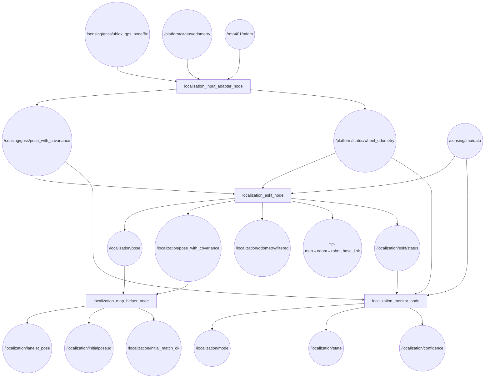
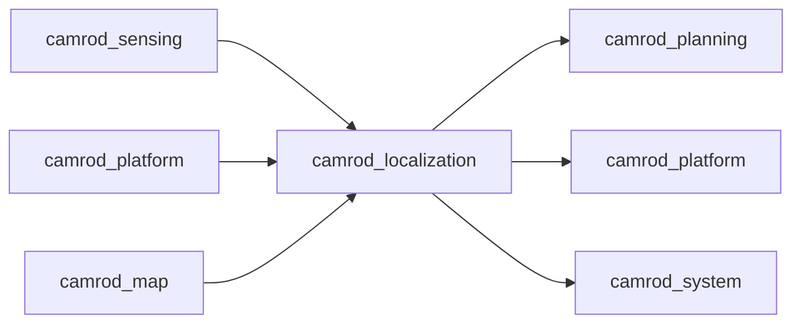

# camrod_localization

## Role
State estimation pipeline: fuses GNSS, IMU, and wheel odometry into a consistent `map`-frame pose. An ESKF (Extended Schmidt–Kalman Filter) handles IMU prediction with GNSS position updates and wheel velocity/yaw-rate corrections; NHC and ZUPT provide additional robustness. A map helper snaps poses to the Lanelet2 centerline and matches the robot to drop zones for automatic pose initialization.

## Package Diagram


Diagram legend: `[node]`, `((topic))`.

## Node Data Flow

| Node | Inputs | Outputs | Key Params |
|---|---|---|---|
| `localization_input_adapter_node` | `/sensing/gnss/ublox_gps_node/fix`, `/platform/status/odometry`, `/rmp401/odom` (fallback) | `/sensing/gnss/pose_with_covariance`, `/platform/status/wheel_odometry` | gnss_covariance_floor_xy: 0.25 m², wheel_primary_timeout_s: 0.7 s, max_position_jump_m: 8.0 m |
| `localization_eskf_node` | `/sensing/imu/data`, `/sensing/gnss/pose_with_covariance`, `/platform/status/wheel_odometry` | `/localization/pose`, `/localization/pose_with_covariance`, `/localization/odometry/filtered`, TF | use_nhc: true, use_zupt: true, gnss_gate_mahalanobis: 9.0, gyro_noise: 0.015 rad/s, gnss_position_noise: 1.5 m |
| `localization_monitor_node` | `/sensing/gnss/pose`, `/sensing/imu/data`, `/platform/status/wheel_odometry`, `/localization/eskf/status` | `/localization/mode`, `/localization/state`, `/localization/confidence` | gnss_timeout_s: 1.0, imu_timeout_s: 0.5, gnss_innovation_fail: 6.0 |
| `localization_map_helper_node` | `/localization/pose`, `/localization/pose_with_covariance`, Lanelet2 map | `/localization/lanelet_pose`, `/localization/initialpose3d`, `/localization/initial_match_ok` | max_search_radius: 30 m, lateral_stddev: 0.3, match_radius: 2.0 m, stable_count: 10 |
| `localization_pose_selector_node` | `/localization/primary/*`, `/localization/fallback/*`, `/localization/mode` | `/localization/pose`, `/localization/pose_with_covariance`, `/localization/odometry/filtered` | primary_timeout_s: 0.5 s, fallback_on_mode_at_or_above: INVALID |

### Localization Modes (`/localization/mode`)

| Mode | Description |
|---|---|
| `NORMAL` | GNSS + IMU + wheel all healthy |
| `DEGRADED` | One or more sensors degraded but filter still converged |
| `DR_ONLY` | Dead-reckoning only (GNSS lost; IMU + wheel only) |
| `INVALID` | Insufficient data — filter output unreliable |

### ESKF Update Sources

| Source | Update Type | Gating |
|---|---|---|
| GNSS pose | Position (x, y) | Mahalanobis 9.0 |
| Wheel odometry | Speed + yaw-rate | Mahalanobis 9.0 |
| NHC | Lateral velocity = 0 | Mahalanobis 9.0 |
| ZUPT | Zero velocity (when stopped) | Mahalanobis 9.0 |

## Inter-Package Connections


## Topic Summary

### Inputs (from other packages)
| Topic | Type | Source |
|---|---|---|
| `/sensing/gnss/ublox_gps_node/fix` | NavSatFix | camrod_sensing |
| `/sensing/imu/data` | Imu | camrod_sensing |
| `/platform/status/odometry` | Odometry | camrod_platform (ranger driver) |
| `/rmp401/odom` | Odometry | camrod_platform (ranger driver, fallback) |

### Outputs (consumed by other packages)
| Topic | Type | Consumers |
|---|---|---|
| `/localization/pose` | PoseStamped | camrod_planning, camrod_platform, camrod_map |
| `/localization/pose_with_covariance` | PoseWithCovarianceStamped | camrod_planning (Nav2 costmap), camrod_sensing (ESKF input via adapter) |
| `/localization/odometry/filtered` | Odometry | camrod_planning (cmd_vel_gate pose source) |
| `/localization/lanelet_pose` | PoseStamped | camrod_planning (centerline_snapper, path_cost_grids) |
| `/localization/initial_match_ok` | Bool | camrod_system (readiness check), camrod_planning (lifecycle_retry) |
| `/localization/mode` | AvgLocalizationMode | camrod_system, camrod_planning |
| `/localization/state` | Bool | camrod_system (diagnostic) |
| `/localization/confidence` | Float32 | camrod_system (diagnostic) |
| `/sensing/gnss/pose` | PoseStamped | camrod_platform (visualization fallback) |
| `/sensing/gnss/pose_with_covariance` | PoseWithCovarianceStamped | camrod_localization (ESKF input) |
| `/platform/status/wheel_odometry` | Odometry | camrod_localization (ESKF wheel input) |
| TF `map→odom→robot_base_link` | TransformStamped | all packages |

## Launch

```bash
# Full localization stack (ESKF + adapter + monitor + map helper)
ros2 launch camrod_localization localization.launch.py

# With explicit ESKF config override
ros2 launch camrod_localization localization.launch.py \
  filter_eskf_param_file:=/path/to/eskf.yaml

# Without map helper (no lanelet map available)
ros2 launch camrod_localization localization.launch.py \
  enable_map_helper:=false

# Override map path (for drop zone matching)
ros2 launch camrod_localization localization.launch.py \
  map_path:=/absolute/path/lanelet2_maps.osm
```

Key launch arguments:

| Argument | Default | Description |
|---|---|---|
| `enable_adapter` | `true` | GNSS/wheel input adapter |
| `enable_filter` | `true` | ESKF state estimator |
| `enable_monitor` | `true` | Sensor health monitor |
| `enable_map_helper` | `true` | Lanelet centerline snapper + drop zone matcher |
| `use_eskf` | `true` | Use ESKF (false = robot_localization EKF) |
| `wheel_input_topic` | `/platform/status/odometry` | Primary wheel odometry topic |
| `wheel_fallback_input_topic` | `/rmp401/odom` | Fallback wheel odometry topic |
| `wheel_primary_timeout_s` | `0.7` | Timeout before fallback switch [s] |
| `map_path` | (from map_info.yaml) | Lanelet2 .osm path for map helper |
| `drop_zones_yaml` | `config/drop_zones.yaml` | Drop zone definitions for initialization |

## Config Files

| File | Purpose |
|---|---|
| `config/source/input_adapter.yaml` | GNSS/wheel topic mapping, covariance floors, position jump rejection |
| `config/filter/eskf.yaml` | ESKF noise parameters, gate thresholds, NHC/ZUPT, IMU sign corrections, GNSS profile switching |
| `config/filter/ekf.yaml` | robot_localization EKF parameters (legacy/fallback when use_eskf=false) |
| `config/filter/monitor.yaml` | Sensor timeout thresholds, GNSS innovation limits, mode decision parameters |
| `config/filter/pose_selector.yaml` | Primary/fallback timeout, mode threshold for source switching |
| `config/reference/map_helper.yaml` | Centerline snapper covariance (lateral_stddev: 0.3), drop zone match radius: 2.0 m, stable_count: 10 |
| `config/drop_zones.yaml` | Drop zone definitions used for initial pose matching |
