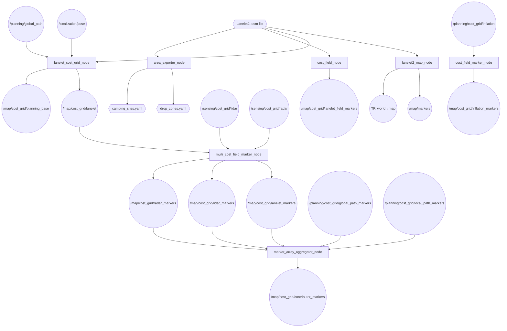
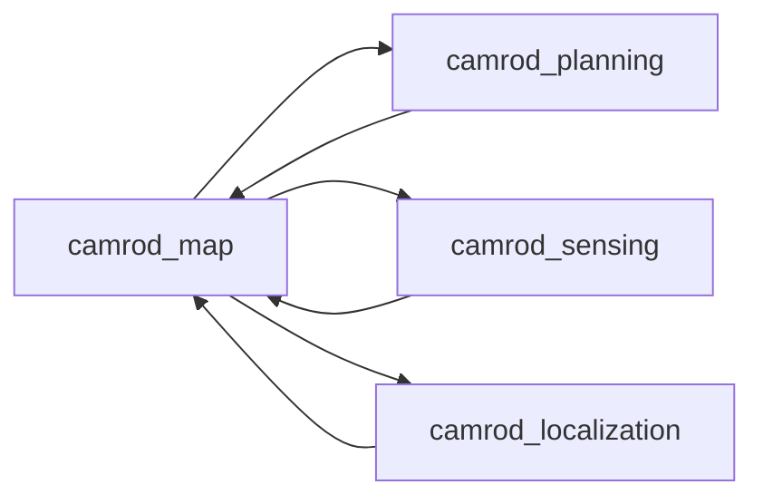

# camrod_map

## Role
Lanelet2 map loading, cost-grid generation, and visualization. Parses the `.osm` map file, projects it into the `map` frame, and serves a traversability cost grid (`/map/cost_grid/lanelet`) consumed by planning and sensing. Also exports semantic areas (drop zones, camping sites) to YAML and provides multi-source MarkerArray visualization for RViz.

## Package Diagram


Diagram legend: `[node]`, `((topic))`, `{{file/hardware}}`.

## Node Data Flow

| Node | Inputs | Outputs | Key Params |
|---|---|---|---|
| `lanelet2_map_node` | Lanelet2 .osm file | `/map/markers`, TF `world→map` | map_path, offset_lat/lon/alt, world_frame_id, map_frame_id |
| `lanelet_cost_grid_node` | `/localization/pose`, `/planning/global_path`, Lanelet2 .osm | `/map/cost_grid/lanelet`, `/map/cost_grid/planning_base` | resolution: 0.5 m, 400×400 window, cost_mode: centerline, centerline_half_width: 1.5 m |
| `cost_field_marker_node` | `/planning/cost_grid/inflation` | `/map/cost_grid/inflation_markers` | palette: safety, marker_scale: 0.2 m, alpha: 0.35 |
| `multi_cost_field_marker_node` | `/map/cost_grid/lanelet`, `/sensing/cost_grid/lidar`, `/sensing/cost_grid/radar` | `/map/cost_grid/{lanelet,lidar,radar}_markers` | per-stream scale/palette/z_offset |
| `marker_array_aggregator_node` | All cost marker topics | `/map/cost_grid/contributor_markers` | stale_timeout_s, republish_period_s |
| `cost_field_node` | Lanelet2 .osm file | `/map/cost_grid/lanelet_field_markers` | weights: distance/curvature/lane_preference, percentile_clip: 0.95 |
| `area_exporter_node` | Lanelet2 .osm file | `drop_zones.yaml`, `camping_sites.yaml` (files) | dropzone_types, camping_site_prefixes, default_yaw_deg |

### Cost Grid Modes (`lanelet_cost_grid_node`)

| Mode | Description |
|---|---|
| `centerline` | Low cost along centerline corridor; lethal outside `centerline_half_width` |
| `bounds` | Low cost inside lane bounds; gradient toward boundaries |
| `lanelet` | Low cost inside any lanelet region |
| `path` | Cost derived from proximity to global path |

## Inter-Package Connections


## Topic Summary

### Inputs (from other packages)
| Topic | Type | Source |
|---|---|---|
| `/localization/pose` | PoseStamped | camrod_localization |
| `/planning/global_path` | Path | camrod_planning |
| `/planning/cost_grid/inflation` | OccupancyGrid | camrod_sensing (inflation_cost_grid_node) |
| `/sensing/cost_grid/lidar` | OccupancyGrid | camrod_sensing |
| `/sensing/cost_grid/radar` | OccupancyGrid | camrod_sensing |
| `/planning/cost_grid/global_path_markers` | MarkerArray | camrod_planning |
| `/planning/cost_grid/local_path_markers` | MarkerArray | camrod_planning |

### Outputs (consumed by other packages)
| Topic | Type | Consumers |
|---|---|---|
| `/map/cost_grid/lanelet` | OccupancyGrid | camrod_sensing (inflation_cost_grid_node), camrod_planning (Nav2 costmap) |
| `/map/cost_grid/planning_base` | OccupancyGrid | camrod_planning (Nav2 costmap, secondary) |
| `/map/markers` | MarkerArray | camrod_platform (ground Z estimation), RViz |
| `/map/cost_grid/contributor_markers` | MarkerArray | RViz |
| TF `world→map` | TransformStamped | all packages |

### Generated Files
| File | Consumer |
|---|---|
| `drop_zones.yaml` | camrod_localization (drop zone matcher), camrod_planning (state machine) |
| `camping_sites.yaml` | camrod_planning (state machine goal targets) |

## Launch

```bash
# Full map stack
ros2 launch camrod_map map.launch.py

# Sub-stacks
ros2 launch camrod_map lanelet2_map.launch.py
ros2 launch camrod_map cost_grid.launch.py
ros2 launch camrod_map visualization.launch.py

# Utility: export semantic areas to YAML
ros2 launch camrod_map area_export.launch.py \
  output_yaml_path:=/tmp/drop_zones.yaml \
  camping_sites_output_yaml_path:=/tmp/camping_sites.yaml

# Map path override
ros2 launch camrod_map map.launch.py map_path:=/absolute/path/lanelet2_maps.osm
```

Key launch arguments:

| Argument | Default | Description |
|---|---|---|
| `map_path` | (from map_info.yaml) | Path to Lanelet2 .osm file |
| `origin_lat` | (from map_info.yaml) | WGS84 reference latitude |
| `origin_lon` | (from map_info.yaml) | WGS84 reference longitude |
| `origin_alt` | (from map_info.yaml) | WGS84 reference altitude |
| `enable_cost_grids` | `true` | Enable lanelet_cost_grid_node |
| `enable_map_cost_markers` | `true` | Enable multi-stream marker visualization |
| `enable_cost_field` | `false` | Enable cost field line markers |
| `enable_inflation_markers` | `false` | Enable inflation grid debug markers |
| `module_namespace` | `map` | ROS2 node namespace |

## Config Files

| File | Purpose |
|---|---|
| `config/map_info.yaml` | Single source of truth: map_path, WGS84 origin (offset_lat/lon/alt), frame IDs, visualization periods |
| `config/lanelet_cost_grid.yaml` | Grid geometry (resolution, window size), cost mode, corridor width, penalties, gradient range, rebuild triggers |
| `config/map_visualization.yaml` | Multi-marker and cost-field visualization parameters (palette, scale, alpha, z_offset, stale timeouts) |
| `config/drop_zones.yaml` | Exported drop zone list (id, x/y/z, yaw_deg, corners) — generated by area_exporter_node |
| `config/nav2_params_costlayer_example.yaml` | Example Nav2 costmap layer config for reference |
