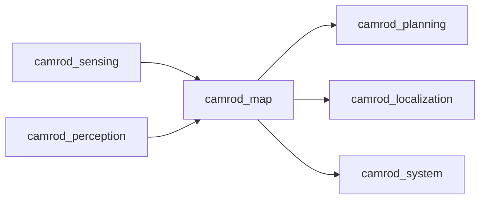

# camrod_map

## Role
`camrod_map` loads Lanelet2 map data, generates map/planning cost grids, and publishes map/cost visualization markers.

## Package Diagram
```mermaid
graph TD
  A[lanelet2_map_node] --> B[/map/markers]
  A --> C[/map/status]
  D[lanelet_cost_grid_node] --> E[/map/cost_grid/lanelet]
  D --> F[/map/cost_grid/planning_base]
  G[multi_cost_field_marker_node] --> H[/map/cost_grid/*_markers]
  I[marker_array_aggregator_node] --> J[/map/cost_grid/inflation_markers]
  K[cost_field_node optional] --> L[/map/cost_grid/lanelet_field_markers]
```

## Node Data Flow
| Node | Main Inputs | Main Outputs |
|---|---|---|
| `lanelet2_map_node` | `map_info.yaml`, `map_path`, origin params | `/map/markers`, `/map/status` |
| `lanelet_cost_grid_node` (single integrated node) | `/localization/pose`, `/planning/global_path` (and optional fallback/goal), map/origin params | `/map/cost_grid/lanelet`, `/map/cost_grid/planning_base`, `/map/status` |
| `multi_cost_field_marker_node` | configured grid topics (`OccupancyGrid`) | marker topics such as `/map/cost_grid/lanelet_markers`, `/map/cost_grid/lidar_markers`, `/map/cost_grid/radar_markers` |
| `marker_array_aggregator_node` | multiple marker array contributors | `/map/cost_grid/inflation_markers` |
| `cost_field_marker_node` | one occupancy grid (default `/planning/global_costmap/costmap`) | one marker array topic (debug/visualization) |
| `cost_field_node` (optional) | map+origin+viz params | `/map/cost_grid/lanelet_field_markers` |
| `area_exporter_node` (utility launch) | lanelet map file | exported area YAML (drop zones / camping sites) |

## Inter-Package Connections


## Topic Summary
| Direction | Topic | Purpose |
|---|---|---|
| In | `/localization/pose` | center pose for dynamic lanelet grid focus |
| In | `/planning/global_path` | path-aware cost shaping |
| Out | `/map/cost_grid/lanelet` | base lanelet occupancy/cost grid |
| Out | `/map/cost_grid/planning_base` | planning-oriented secondary grid |
| Out | `/map/cost_grid/inflation_markers` | merged visualization markers |
| Out | `/map/status` | module status payload |

## Practical Usage
```bash
ros2 launch camrod_map map.launch.py
```

Sub-launches:
```bash
ros2 launch camrod_map lanelet2_map.launch.py
ros2 launch camrod_map cost_grid.launch.py
ros2 launch camrod_map visualization.launch.py
ros2 launch camrod_map area_export.launch.py
```

Map override example:
```bash
ros2 launch camrod_map map.launch.py map_path:=/absolute/path/lanelet2_maps.osm
```

## Config Files
- `config/map_info.yaml` (shared source-of-truth for map path/origin/frame reference)
- `config/lanelet_cost_grid.yaml`
- `config/map_visualization.yaml`
- `config/drop_zones.yaml`
- `config/nav2_params_costlayer_example.yaml` (example)

## Path Handling Rule
- Default map/origin values are read from `config/map_info.yaml`.
- Launch arguments (`map_path`, `origin_lat/lon/alt`) override YAML values.
- bringup can pass the same `map_path` into map/localization/planning for unified runtime behavior.
