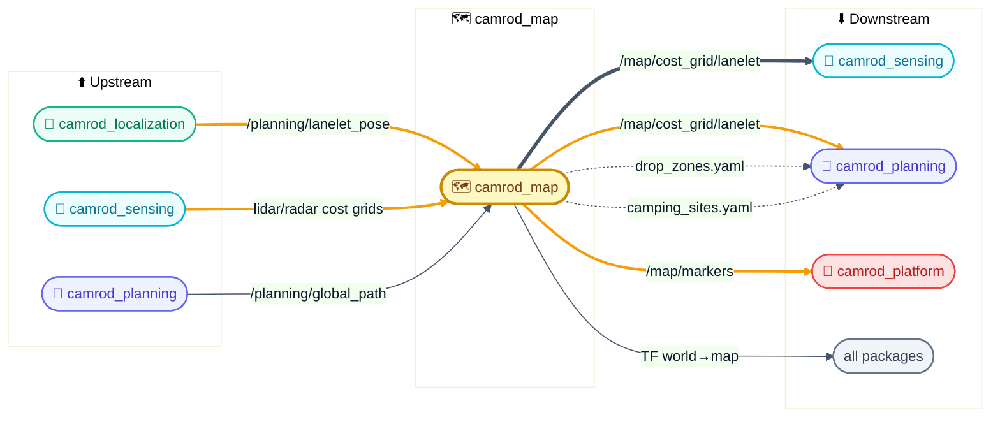
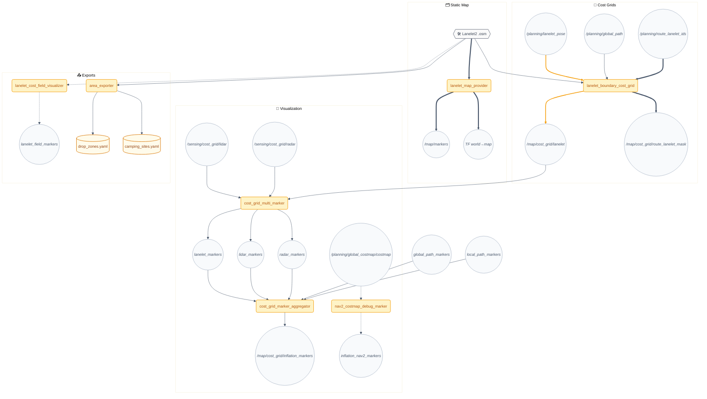
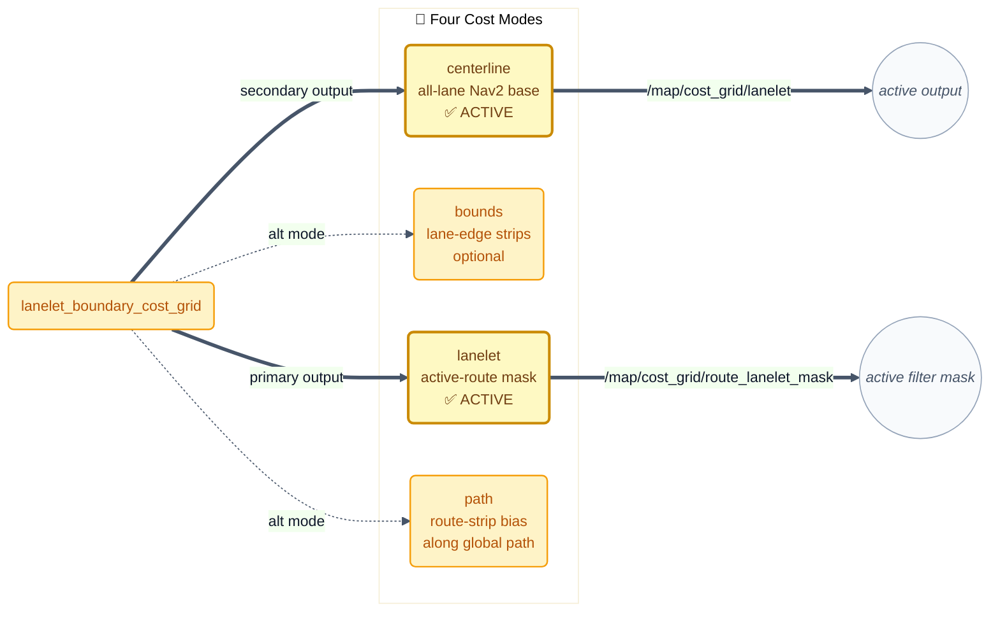

# 🗺️ camrod_map — Lanelet2 map, cost grids & semantic areas

## 1. 📋 Summary

`camrod_map` is the map layer of the CAMROD stack. It loads a Lanelet2 `.osm` file, projects all primitives into the `map` frame using a `local_cartesian` projector, and serves a traversability cost grid (`/map/cost_grid/lanelet`) that drives every planning and sensing cost layer downstream. It also publishes the authoritative TF `world→map` static transform, exports semantic areas (drop zones, camping sites) to YAML, and provides multi-source MarkerArray visualization for RViz.

> 📌 **Single source of truth:** `config/map_info.yaml` — all other packages read their `map_path`, `offset_lat/lon/alt`, and frame IDs from this file via launch argument forwarding.

> HH_260804 - Costmap footprints and examples are expressed from
> `robot_center_link`, the axle midpoint. The physical body, 0.10 m safety
> margin, cost 98 soft edge, and cost 100 off-lane stop threshold are unchanged.
> Simulation identified lanelets 754/2751/2720 as too narrow for the active
> 1.69160 x 1.27000 m planning rectangle. Automatic crab/reverse correctly
> stops again there; the map corridor or allowed route must be corrected rather
> than shrinking the measured footprint.
> See the [simulation contact sheet](../docs/assets/v2.1.3/boundary-recovery/automatic-owner-route-retry-contact-sheet.png)
> and [measured report](../docs/V2_1_3_BOUNDARY_RECOVERY_VALIDATION.md).

---

## 2. 🚀 Quick Start

```bash
# 1. Set the map path and WGS84 origin in config/map_info.yaml (once per deployment).

# 2. Launch the full map stack:
ros2 launch camrod_map map.launch.py

# 3. Override map at runtime:
ros2 launch camrod_map map.launch.py \
  map_path:=/abs/path/to/lanelet2_maps.osm \
  origin_lat:=36.7292921 \
  origin_lon:=127.4429577 \
  origin_alt:=84.0

# 4. Export semantic areas to YAML (run once after map edit):
ros2 launch camrod_map area_export.launch.py \
  output_yaml_path:=/home/hong/camrod_ws/src/camrod_map/config/drop_zones.yaml \
  camping_sites_output_yaml_path:=/home/hong/camrod_ws/src/camrod_planning/config/camping_sites.yaml
```

> 💡 Verify in RViz: add topics `/map/markers` (MarkerArray) and `/map/cost_grid/lanelet` (OccupancyGrid). HH_260702 - full marker/cost-grid rebuilds can take several seconds on the Jetson under all-on load; the local-first marker path should show the GNSS/localization neighborhood first, then cached full-map markers recover late RViz subscriptions. HH_260707 - RViz-only marker conversion is throttled to 0.50 s per marker source so keeping RViz open does not force high-rate MarkerArray rebuilds.

### Map Profile Selection

> HH_260730 - The active config uses an empty profile with the stable runtime
> entrypoint `lanelet2_maps.osm`, currently identical to the audit snapshot
> `lanelet2_maps_(copy_park_v1.0.3).osm` (embedded map version 12). The default
> semantic YAML files are byte-identical to the former `copy_park_moved`
> variants. Its WGS84 origin is `36.8435737, 128.0925646`, with EPSG:32652
> metadata `419093.912713, 4077903.915218`.

`config/map_info.yaml` carries both the Lanelet2 OSM path and the WGS84/UTM origin. Bringup/planning launch files infer a normalized `map_profile` from either `map_profile` or the OSM filename suffix in parentheses. Profile-specific semantic YAML files are then selected automatically when present:

| Profile input | OSM example | Semantic files selected |
|---|---|---|
| empty (active) | `lanelet2_maps.osm` (versioned snapshot: `copy_park_v1.0.3`) | `drop_zones.yaml`, `camping_sites.yaml` |
| `map_profile: copy_park_moved` (legacy explicit profile) | explicitly supplied versioned Park OSM | `drop_zones (copy_park_moved).yaml`, `camping_sites (copy_park_moved).yaml` |
| `map_profile: copy_park` | `lanelet2_maps_(copy_park).osm` | `drop_zones (copy_park).yaml`, `camping_sites (copy_park).yaml` |
| `map_profile: copy_c_track` | `lanelet2_maps_(copy_c_track).osm` | `drop_zones (copy_c_track).yaml`, `camping_sites (copy_c_track).yaml` |
| unknown profile with no matching OSM | fallback `lanelet2_maps.osm` | profile-specific YAML when present, otherwise default YAML |

This keeps the mechanism independent of the specific `.osm` file. A new map only needs a correct `map_info.yaml` origin and, if its site/drop-zone semantics differ, matching profile YAML files.

> HH_260702 - `camrod_map/config/map_info.yaml` and `camrod_bringup/config/map/map_info.yaml` are kept synchronized. Change the active map/profile in those config files together so standalone `camrod_map` and full `camrod_bringup` launch paths show the same C-track/Park map.

---

## 3. 🗺️ System Position



> **Diagram legend** 🧩 ROS node · 📡 Topic · ⚙️ Config · 🛠️ Hardware · 📦 External · ==> critical path · -.-> optional

*Figure 1 — camrod_map is the only package that publishes the static `world→map` TF and the canonical lanelet cost grid; all navigation decisions are ultimately shaped by these outputs.*

---

## 4. 🏗️ Runtime Architecture



> **Diagram legend** 🧩 ROS node · 📡 Topic · ⚙️ Config · 🛠️ Hardware · ==> critical path · -.-> optional (debug/disabled)

*Figure 2 — Full runtime node graph. Dashed edges indicate nodes/topics disabled by default or used only for debug.*

### Node summary

<!-- HH_260720 - Separate the active-route mask from the all-lane planning base. -->

| Node (executable) | Inputs | Outputs | Key params |
|---|---|---|---|
| `lanelet2_map_node` (`lanelet_map_provider`) | Lanelet2 .osm | `/map/markers`, TF `world→map` | `map_path`, `offset_lat/lon/alt`, `world_frame_id`, `map_frame_id` |
| `lanelet_cost_grid_node` (`lanelet_boundary_cost_grid`) | .osm, pose, global path, `/planning/route_lanelet_ids` | `/map/cost_grid/route_lanelet_mask` (primary, active-route lanelet); `/map/cost_grid/lanelet` (secondary, all-lane centerline) | `route_lanelet_filter_enable`, `route_lanelet_filter_wait_for_route`, `secondary.route_lanelet_filter_enable`, geometry and raster parameters |
| `multi_cost_field_marker_node` (`cost_grid_multi_marker`) | `/map/cost_grid/lanelet`, `/sensing/cost_grid/lidar`, `/sensing/cost_grid/radar` | `/map/cost_grid/lanelet_markers`, `lidar_markers`, `radar_markers` | `palettes`, `alphas`, `marker_scales`, `z_offsets` |
| `cost_field_marker_node` (`nav2_costmap_debug_marker`) | `/planning/global_costmap/costmap` | `/map/cost_grid/inflation_nav2_markers` | `palette`, `alpha`, `marker_scale` (off by default) |
| `marker_array_aggregator_node` (`cost_grid_marker_aggregator`) | All cost marker topics | `/map/cost_grid/inflation_markers` | `stale_timeout_s`, `republish_period_s` (off by default) |
| `cost_field_node` (`lanelet_cost_field_visualizer`) | .osm | `/map/cost_grid/lanelet_field_markers` | `weights.distance/curvature`, `percentile_clip` (off by default) |
| `area_exporter_node` (`area_exporter`) | .osm | `drop_zones.yaml`, `camping_sites.yaml` | `output_yaml_path`, `camping_sites_output_yaml_path`, `default_yaw_deg` |

---

## 5. 🧮 Cost Grid Modes



> **Diagram legend** 🧩 ROS node · 📡 Topic · ==> active path · -.-> disabled/optional

<!-- HH_260720 - Document both active profiles and their separate ownership. -->
*Figure 3 — The secondary centerline profile is the all-lane Nav2 base; the primary lanelet profile is the active-route dynamic-obstacle mask.*

---

## 6. 🔌 Interface Contract

### Inputs

<!-- HH_260720 - Use generated grid and typed route contracts. -->

| Topic | Type | Required | Producer | Rate | Meaning |
|---|---|---|---|---|---|
<!-- HH_260720 - Correct the lanelet-pose contract to the generated CAMROD message type. -->
| `/planning/lanelet_pose` | `avg_msgs/msg/AvgPoseStamped` | No | camrod_planning | ~10 Hz | Robot pose used to center the rolling cost-grid window |
| `/planning/global_path` | `nav_msgs/Path` | No | camrod_planning | On replan | Global path used for path-mode cost layer |
| `/sensing/cost_grid/lidar` | `avg_msgs/AvgOccupancyGrid` | No | camrod_sensing | 10 Hz | LiDAR obstacle grid forwarded to multi-marker visualizer |
| `/sensing/cost_grid/radar` | `avg_msgs/AvgOccupancyGrid` | No | camrod_sensing | 10 Hz | Radar obstacle grid forwarded to multi-marker visualizer |
| `/planning/route_lanelet_ids` | `avg_msgs/RouteLaneletIds` | No | camrod_planning | On new LaneletRoute plan | Exact ordered lanelet IDs used to build the active-route mask |
| `/planning/cost_grid/global_path_markers` | `visualization_msgs/MarkerArray` | No | camrod_planning | ~5 Hz | Global path marker stream aggregated for RViz |
| `/planning/cost_grid/local_path_markers` | `visualization_msgs/MarkerArray` | No | camrod_planning | ~5 Hz | Local path marker stream aggregated for RViz |
| `/planning/path_markers` | `visualization_msgs/MarkerArray` | No | camrod_planning | On path update + 5 Hz cache | HH_260618 - thick blue global path and orange local path overlays with direction arrows |

### Outputs

<!-- HH_260720 - Both map grids publish generated CAMROD occupancy contracts. -->

| Topic | Type | Consumer | Rate | Meaning |
|---|---|---|---|---|
| `/map/markers` | `visualization_msgs/MarkerArray` | camrod_platform, RViz | Once (transient_local) | Lanelet geometry: centerlines, boundaries, lane-direction arrows |
| TF `world→map` | `tf2_msgs/TFMessage` | All packages | Static | Fixed transform anchoring the metric map frame to WGS84 world |
| `/map/cost_grid/route_lanelet_mask` | `avg_msgs/AvgOccupancyGrid` | camrod_sensing | Route update + 1 Hz | Binary active-route mask: route lanelets 0, outside 100; unknown before the first route |
| `/map/cost_grid/lanelet` | `avg_msgs/AvgOccupancyGrid` | camrod_sensing, camrod_planning, camrod_control | Startup + 1 Hz | All-lane centerline planning base: center 0, in-lane 70, boundary 98, off-lane 100 |
| `/map/cost_grid/lanelet_markers` | `visualization_msgs/MarkerArray` | RViz | ~5 Hz | Colored cubes for lanelet cost visualization |
| `/map/cost_grid/lidar_markers` | `visualization_msgs/MarkerArray` | RViz | ~8 Hz | Colored cubes for LiDAR cost visualization |
| `/map/cost_grid/radar_markers` | `visualization_msgs/MarkerArray` | RViz | ~8 Hz | Colored cubes for radar cost visualization |
| `/map/cost_grid/inflation_markers` | `visualization_msgs/MarkerArray` | RViz | ~20 Hz | Merged contributor markers (requires `enable_inflation_markers:=true`) |
| `/map/cost_grid/lanelet_field_markers` | `visualization_msgs/MarkerArray` | RViz | Once | Line markers showing weighted lanelet cost field (requires `enable_cost_field:=true`) |

### Generated files

| File | Consumer | Content |
|---|---|---|
| `config/drop_zones.yaml` | camrod_localization (drop-zone matcher), camrod_planning (state machine) | id, x/y/z (map frame), yaw_deg, corner polygon |
| `config/camping_sites.yaml` | camrod_planning (state machine goal targets) | id, x/y/z (map frame), yaw_deg |

---

## 7. ⚙️ Key Behaviors

### Map loading

| Field | Detail |
|---|---|
| Trigger | Node startup |
| Internal logic | `lanelet_map_provider` opens the `.osm` file and projects all Lanelet2 primitives into the `map` frame using a `local_cartesian` projector anchored at `offset_lat/lon/alt`. Lane centerlines, boundaries, and regulatory elements are converted to MarkerArray for RViz. |
| Output effect | `/map/markers` published once with `transient_local` QoS; TF `world→map` published as a static transform. |
| Operator-visible symptom | No markers in RViz within 5 s of launch usually means the `.osm` file path is wrong or the projector origin is far from the robot start position. |
| Related params | `map_path`, `offset_lat`, `offset_lon`, `offset_alt`, `world_frame_id`, `map_frame_id` |
| Related topics | `/map/markers`, TF `world→map` |

### Cost grid generation

| Field | Detail |
|---|---|
| Trigger | Node startup, active route update, and `/planning/global_path` update; the node still does **not** rebuild on each pose update (`rebuild_on_pose: false`, `rebuild_on_path: true`). |
| Internal logic | HH_260720 - `lanelet_boundary_cost_grid` runs two active profiles. The 600×600 primary profile fills only lanelets named by `/planning/route_lanelet_ids` and publishes `/map/cost_grid/route_lanelet_mask`; before a route it publishes an unknown placeholder so sensor filtering fails open. The 960×960 secondary centerline profile keeps all local lanelets available to Nav2, avoiding a planner → route IDs → base grid circular dependency. HH_260727 - Route-ID updates rebuild only the dependent primary mask, not the independent 960×960 base. If an explicitly selected grid planner has no route IDs, its first global path supplies the fallback lanelet set and triggers the primary mask build. |
| Output effect | Both grids are published with `transient_local` QoS so late-joining Nav2 costmap layers receive them immediately on subscribe. |
| Operator-visible symptom | Before route generation the route mask is unknown and LiDAR/radar report fail-open pass-through. After route generation only selected lanelet polygons are free in the mask. |
| Related params | `cost_mode`, `route_lanelet_filter_enable`, `route_lanelet_filter_wait_for_route`, `resolution`, `width`, `height`, `secondary.cost_mode`, `secondary.route_lanelet_filter_enable`, `secondary.outside_value` |
| Related topics | `/map/cost_grid/route_lanelet_mask`; `/map/cost_grid/lanelet`; `/planning/route_lanelet_ids`; `/planning/global_path` |

### TF publishing

| Field | Detail |
|---|---|
| Trigger | Node startup |
| Internal logic | `lanelet_map_provider` computes the `world→map` static transform by inverting the `local_cartesian` projection of the WGS84 origin. This is a fixed transform; it does **not** update at runtime. |
| Output effect | All packages can look up `world→map` immediately after map launch. |
| Operator-visible symptom | If `world_frame_id` or `map_frame_id` in `map_info.yaml` differs from what other packages declare (e.g., in URDF or localization config), TF lookups will fail across the stack. |
| Related params | `world_frame_id` (default: `world`), `map_frame_id` (default: `map`), `offset_lat`, `offset_lon`, `offset_alt` |
| Related topics | TF `world→map` |

---

## 8. 🚀 Launch

```bash
# Full map stack (recommended)
ros2 launch camrod_map map.launch.py

# Sub-stacks
ros2 launch camrod_map lanelet2_map.launch.py        # map loader + TF only
ros2 launch camrod_map cost_grid.launch.py           # cost grid nodes only
ros2 launch camrod_map visualization.launch.py       # marker visualization only

# Export semantic areas (run after each map edit)
ros2 launch camrod_map area_export.launch.py \
  output_yaml_path:=/path/to/drop_zones.yaml \
  camping_sites_output_yaml_path:=/path/to/camping_sites.yaml
```

### Launch arguments for `map.launch.py`

| Argument | Default | Description |
|---|---|---|
| `map_path` | (from `map_info.yaml`) | Absolute path to Lanelet2 `.osm` file; empty = auto-discover |
| `origin_lat` | (from `map_info.yaml`) | WGS84 reference latitude override |
| `origin_lon` | (from `map_info.yaml`) | WGS84 reference longitude override |
| `origin_alt` | (from `map_info.yaml`) | WGS84 reference altitude override |
| `enable_cost_grids` | `true` | Enable `lanelet_boundary_cost_grid` node |
| `enable_map_cost_markers` | `true` | Enable `cost_grid_multi_marker` node |
| `enable_cost_field` | `false` | Enable `lanelet_cost_field_visualizer` (slow, debug only) |
| `enable_inflation_markers` | `false` | Enable `cost_grid_marker_aggregator` node |
| `enable_nav2_inflation_debug_marker` | `false` | Enable Nav2 global costmap debug marker |
| `module_namespace` | `map` | ROS 2 namespace for all map nodes |
| `system_namespace` | `system` | Namespace for system-level diagnostics |

---

## 9. 🔧 Config

### `config/map_info.yaml` — field reference

> 📌 This file is the **single source of truth** for map path and WGS84 origin. Edit it once per deployment; all launch files read it automatically.

<details><summary>Full field reference (click to expand)</summary>

| Field | Unit | Required | Default | Meaning | Used by |
|---|---|---|---|---|---|
| `map_path` | — | No | `""` | Absolute path to Lanelet2 `.osm` file. Empty = auto-discover via workspace search. | `lanelet_map_provider`, `lanelet_boundary_cost_grid` |
| `offset_lat` | degrees (WGS84) | Yes | `36.7292921` | Reference latitude for `local_cartesian` projector | All map nodes, camrod_localization, camrod_planning |
| `offset_lon` | degrees (WGS84) | Yes | `127.4429577` | Reference longitude for `local_cartesian` projector | All map nodes, camrod_localization, camrod_planning |
| `offset_alt` | m (WGS84 ellipsoidal) | Yes | `84.0` | Reference altitude for `local_cartesian` projector | All map nodes, camrod_localization, camrod_planning |
| `offset_utm_easting` | m | No | `360965.99` | Informational UTM easting of origin (not used by projector) | External tools |
| `offset_utm_northing` | m | No | `4065972.49` | Informational UTM northing of origin (not used by projector) | External tools |
| `offset_utm_alt` | m | No | `84.0` | Informational UTM altitude of origin | External tools |
| `yaw_offset_deg` | degrees | No | `0.0` | Optional rotation applied to the lat/lon → x/y projection | `lanelet_map_provider` |
| `rotate_latlon_xy_by_yaw_offset` | bool | No | `true` | Enable/disable the yaw rotation above | `lanelet_map_provider` |
| `world_frame_id` | — | Yes | `world` | TF frame name for the WGS84 world frame | All packages |
| `map_frame_id` | — | Yes | `map` | TF frame name for the projected metric map frame | All packages |
| `align_z_to_ground` | bool | No | `true` | HH_260623 - Flatten Lanelet2 visualization markers to the 2D planning ground plane so RViz overlays align with robot/path data | `lanelet_map_provider` |
| `dir_body_scale` | m | No | `0.55` | Arrow body scale for lane-direction markers (RViz only) | `lanelet_map_provider` |
| `dir_head_scale` | m | No | `0.35` | Arrow head scale for lane-direction markers (RViz only) | `lanelet_map_provider` |
| `dir_width_scale` | m | No | `0.18` | Arrow width scale for lane-direction markers (RViz only) | `lanelet_map_provider` |
| `dir_stride` | — | No | `30` | Number of centerline points skipped between direction arrows | `lanelet_map_provider` |
| `visualization_republish_period_s` | s | No | `0.0` | Periodic republish interval for map markers (0 = once, transient_local only) | `lanelet_map_provider` |

</details>

### `config/lanelet_cost_grid.yaml` — key params

<!-- HH_260720 - Match the active primary route-mask profile. -->

| Param | Value | Meaning |
|---|---|---|
| `primary_enable` | `true` | Publish the active-route mask |
| `output_topic` | `/map/cost_grid/route_lanelet_mask` | Sensor-filter mask topic |
| `cost_mode` | `lanelet` | Fill complete active-route lanelet polygons |
| `resolution` | `0.20` m | Grid cell size |
| `width` / `height` | `600` cells | 120 m square window centred on pose |
| `outside_value` | `100` | Cells outside active-route lanelets are blocked in the mask |
| `route_lanelet_filter_enable` | `true` | Select exact IDs from `/planning/route_lanelet_ids` |
| `route_lanelet_filter_wait_for_route` | `true` | Publish unknown data until the first route exists |
| `secondary.cost_mode` | `centerline` | Secondary profile → `/map/cost_grid/lanelet` |
| `secondary.resolution` | `0.25` m | HH_260619 - Finer route grid for curved lane centerlines |
| `secondary.width` / `secondary.height` | `960` cells | 240 m square route window |
| `secondary.centerline_half_width` | `0.55` m | Tight centerline corridor |
| `secondary.outside_value` | `100` | Off-lane cells are lethal for Nav2/global planning |
| `secondary.centerline_lanelet_fill_value` | `70` | In-route-lane but off-centerline cost |
| `secondary.lanelet_boundary_value` | `98` | High route-boundary margin, still below lethal |
| `secondary.route_lanelet_filter_enable` | `false` | Keep every local lanelet available to Nav2 |
| `secondary.route_boundary_clearance_enable` | `true` | HH_260619 - Clear the active global-path corridor through merge/branch boundary cells |
| `secondary.route_boundary_clearance_half_width_m` | `0.80` m | Corridor half-width used when clearing active-route boundary blockers |

### `config/map_visualization.yaml` — key params

| Param | Value | Meaning |
|---|---|---|
| `palettes` | `[pastel_blue_red, pastel_green_red, pastel_orange_red]` | Per-stream color palettes (lanelet, lidar, radar) |
| `alphas` | `[0.12, 0.40, 0.42]` | Per-stream marker transparency |
| `marker_scales` | `[0.08, 0.08, 0.10]` m | Per-stream cube size |
| `z_offsets` | `[0.02, 0.035, 0.04]` m | Vertical offsets to avoid z-fighting |
| `republish_periods_s` | `[0.20, 0.12, 0.12]` s | Per-stream periodic re-emit intervals |

### Other config files

| File | Purpose |
|---|---|
| `config/map_info.yaml` | Map path, WGS84 origin, frame IDs, visualization periods — single source of truth |
| `config/lanelet_cost_grid.yaml` | Grid geometry, cost mode, corridor widths, penalty weights, rebuild triggers |
| `config/map_visualization.yaml` | Multi-marker and debug visualization parameters |
| `config/drop_zones.yaml` | Generated drop-zone list (id, x/y/z, yaw_deg, corners) |
| `config/nav2_params_costlayer_example.yaml` | Reference Nav2 costmap layer config showing `LaneletCostLayer` params including `start_current` |

---

## 10. ✅ Validation

```bash
# Confirm TF world→map is published
ros2 run tf2_ros tf2_echo world map

# Confirm lanelet markers are available (transient_local, non-empty)
ros2 topic echo /map/markers --once | grep -c "markers"

# HH_260720 - Confirm both the all-lane planning base and active-route mask.
ros2 topic echo /map/cost_grid/lanelet --once | head -20

# Send a navigation route first, then confirm the route-lanelet mask is published
ros2 topic echo /map/cost_grid/route_lanelet_mask --once | head -20

# After area_export launch: confirm drop_zones.yaml is non-empty
python3 -c "import yaml; d=yaml.safe_load(open('/home/hong/camrod_ws/src/camrod_map/config/drop_zones.yaml')); print(len(d['drop_zones']), 'drop zones')"
```

> 💡 **Expected healthy state:** TF echo returns a valid transform, `/map/markers` has > 0 markers, `/map/cost_grid/lanelet` shows a 960×960 all-lane grid, and `/map/cost_grid/route_lanelet_mask` shows a 600×600 mask after a route is created.

---

## 11. 🔍 Troubleshooting

### Map rotated or offset in RViz

The robot position appears to float off the displayed lane geometry.

> ⚠️ Even a 1 arcsecond error in `offset_lat/lon` causes a ~30 m position offset.

1. Confirm `offset_lat/lon/alt` in `map_info.yaml` exactly matches the reference origin used when the `.osm` file was generated.
2. Check `yaw_offset_deg`. If non-zero, the entire map is rotated. Set to `0.0` unless the `.osm` was generated with a deliberate heading correction.
3. Verify all consumers (camrod_localization, camrod_planning) are reading the same `map_info.yaml` — mismatched origins produce consistent-looking maps that are shifted relative to sensor data.

### Cost grid is empty

`/map/cost_grid/lanelet` is received but every cell is −1 or 99.

1. Check that the `.osm` file path in `map_info.yaml` points to an existing file. Verify:
   ```bash
   ls -lh $(python3 -c "import yaml; p=yaml.safe_load(open('/home/hong/camrod_ws/src/camrod_map/config/map_info.yaml')); print(p['/**']['ros__parameters']['map_path'])")
   ```
2. If the file path is empty, the launch auto-discover search walks up from `~/camrod_ws/src`; place `lanelet2_maps.osm` there or set `map_path` explicitly.
3. If the grid is all 99 (off-lane fill), the `offset_lat/lon/alt` places the map far from the lanelet geometry. Re-check the origin against the OSM file.

### Markers don't appear in RViz

1. Confirm `lanelet_map_provider` is running: `ros2 node list | grep map`.
2. `/map/markers` uses `transient_local` QoS. Subscribe with a matching QoS in RViz (set "Durability Policy" to "Transient Local").
3. If RViz shows "transform not available for Header frame `map`", the TF `world→map` has not been published yet. Check that `lanelet_map_provider` started without error.

### `drop_zones.yaml` has no entries

The `area_exporter` node runs once at launch and exits. If the output file is empty:

1. Confirm the `.osm` file contains areas tagged as drop zones (the exporter searches for OSM area tags matching `dropzone_types`).
2. Verify `output_yaml_path` points to a writable location. The launch file defaults to `camrod_map/config/drop_zones.yaml` in the workspace source tree.
3. Re-run: `ros2 launch camrod_map area_export.launch.py` and observe stdout for "Exported N drop zones".

---

## 12. 📚 Related Docs

- [../README.md](../README.md) — monorepo overview and inter-package data flow
- [../camrod_localization/README.md](../camrod_localization/README.md) — consumes `world→map` TF, `/sensing/gnss/pose_with_covariance`, produces `/localization/pose`
- [../camrod_planning/README.md](../camrod_planning/README.md) — consumes `/map/cost_grid/lanelet`, produces `/planning/global_path`
- [../camrod_sensing/README.md](../camrod_sensing/README.md) — consumes `/map/cost_grid/lanelet` for inflation grid, produces `/sensing/cost_grid/lidar` and `/sensing/cost_grid/radar`
- [../PARAMETER_NAMING_STANDARD.md](../PARAMETER_NAMING_STANDARD.md) — canonical parameter naming conventions used across the stack

## 2026-06-17 Runtime Update

> HH_260617: Map semantic YAML is now used by planning and parking.

<!-- HH_260720 - Drop-zone geometry is consumed by control maneuver and parking controllers. -->
`map/drop_zones.yaml` provides the station pose used by
`drop_zone_maneuver_controller` and `reverse_parking_controller` in
`camrod_control`. `planning/camping_sites.yaml` provides campsite center goals
for UI and mission-key dispatch. Keep `yaw_deg` as the reverse travel axis so
the maneuver controller can derive the required body yaw before parking.

<!-- HH_260721 - Describe the active-map coordinate export and alternate service-pose schema. -->
The `copy_park_moved` semantic YAML was regenerated from the active OSM with
the same LocalCartesian projector used at runtime. The active drop-zone is
`(-13.5777, 40.7413, -82.2127 deg)`. B12 and B13 retain their physical area
centroids/corners, while these OSM tags define their operational stop:

```yaml
service_mode: roadside_stop
service_x: 12.7921
service_y: 22.52
service_yaw_deg: -74.495
```

The exporter copies `service_*` tags into campsite YAML. UI, planning, control,
and simulation prefer them when present and fall back to the physical area
pose otherwise. The roadside pose is map-derived and still requires physical
clearance confirmation before unattended B12/B13 operation.

> HH_260622: `area_exporter` now uses the polygon centroid, not a simple vertex average, and exports normalized `corners` for both drop zones and camping sites. This keeps UI/planning targets closer to the true semantic-area center and provides polygon data for campsite-occupancy checks such as tent detection.

> HH_260624: `copy_park` drop zones are authored as explicit OSM area ways `2048` and `2054`; `area_exporter` preserves `yaw_deg` when present so planning and rule-based parking use the same station pose/yaw after every export.
