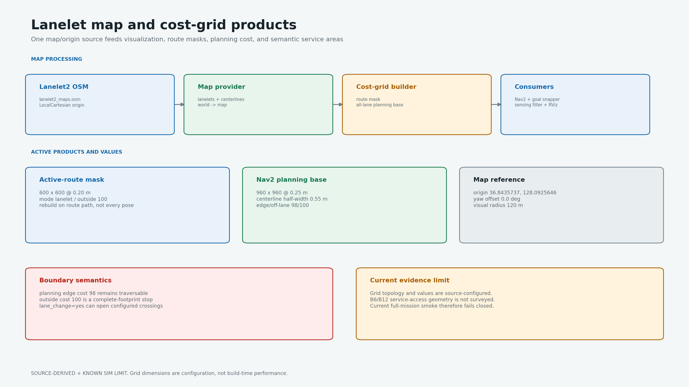

# camrod_map

<!-- HH_260805 - Record the current-site map fingerprint while separating
older hash-bound recovery evidence from the active deployment geometry. -->
<!-- HH_260806 - Explain how the unchanged cost-100 raster is consumed by the
independent body hard-stop and recoverable planning-margin polygons. -->

Lanelet2 map loading, WGS84 projection, semantic-area export, route masks,
planning cost grids, and RViz visualization.



## Actual Simulation Runtime


`SIM RUNTIME CAPTURE`: the actual `/map/markers` lanelet geometry and live robot
pose in RViz. The source-derived diagram below remains the numerical grid
reference.

## At A Glance

| Uses | Function | Main outputs |
|---|---|---|
| Lanelet2 OSM + LocalCartesian projector | Loads road geometry and directional lanelets | `/map/markers`, map metadata |
| Active route lanelet IDs | Builds a binary route mask for obstacle filtering | `/map/cost_grid/route_lanelet_mask` |
| All lanelets + centerline costs | Builds the Nav2 planning base | `/map/cost_grid/lanelet` |
| OSM semantic Areas | Exports drop zones and service metadata | `drop_zones.yaml` and related generated YAML |

## Active Map Reference

| Item | Value |
|---|---|
| Runtime map | `/home/nvidia/camrod_ws/src/lanelet2_maps.osm` |
| Active source revision | `map_version=15` (user-provided geometry revision) |
| Active SHA-256 | `d7b7307eb66175f8963aa638af6b48cf6007169db6f35a89ac21a8c79bab213f` |
| Loaded primitives | 55 lanelets, 14 areas, 1,658 nodes, 236 ways |
| Projector | `local_cartesian` |
| WGS84 origin | `36.8435737, 128.0925646, 0.0` |
| Map yaw offset | `0.0 deg` |
| Frames | `world -> map` |
| Immediate visualization radius | `120 m` |

The absolute map path is a Jetson deployment path. Workstation testing may
override it, but must not rewrite the production path solely for local use.
`lanelet2_maps_(copy_park_v1.0.5).osm` is byte-identical to the active file.
This pair remains unchanged at the current site; a different field requires a
new survey and map revision.

The SHA value is a file fingerprint, not a read-only lock and not a map edit.
The regression test fails when geometry changes unexpectedly. After an
intentional survey/edit, synchronize the two OSM files and update the expected
revision, primitive counts, and SHA in the same reviewed change.

## Cost Grids

| Product | Geometry | Mode | Key costs |
|---|---|---|---|
| Active-route mask | `600 x 600 @ 0.20 m` (`120 m`) | full route lanelets | inside `0`, outside `100` |
| Nav2 planning base | `960 x 960 @ 0.25 m` (`240 m`) | centerline gradient | center `0`, fill `70`, edge `98`, outside `100` |

| Rule | Current behavior |
|---|---|
| Physical-body boundary | Cost `100` or unknown hard-stops with no automatic recovery |
| Planning-margin boundary | Ordinary command stops; only a projected bounded escape may run while the body remains clear |
| Soft mapped edge | Cost `98` biases planning but remains traversable |
| Lane change | `lane_change=yes` can clear configured crossing cells |
| Grid placement | Robot-centered window |
| Rebuild | Route/path change and pose-exits-grid; not every pose update |
| Republish | Static grid every `1.0 s` for late lifecycle consumers |

## Boundary Evidence


The historical map-v14 B6 run contacted the mapped boundary at approximately
`(4.3688, 45.0583)`. Existing campsite Areas do not provide surveyed
road-to-service `service_access` geometry. This is a map-data limitation; the
active planning envelope uses a `0.05 m` margin on every body side, and the
hard footprint threshold remains unchanged.
The repeatable three-case run is bound to OSM SHA-256
`2f69deed24ae47e6762a7653e29e5574438a1ec4b9144b8a3b0a01165f404dbe`.
It is retained as v14 evidence and is not presented as a map-v15 rerun.
The v2.1.4 map-v15 recovery media are likewise bound to release SHA
`e0b50f09c61fbd5429e528c2b3d8d2799a0dab9f83bb79b06dd0da0403efe36d`.
They demonstrate the staged controller on that release map, not a run on the
current active SHA shown above.

On the current SHA, a fresh controlled route traveled `10.0403 m` with no
route hold. A `+0.19 m` placement touched only the planning margin and admitted
bounded `CRAB_RIGHT`; a `+0.27 m` physical-body placement retained a no-motion
hold. The map raster and threshold did not change for this test. Only the
provisional polygons and control interpretation changed, and their real-world
dimensions remain field-pending.

## Nodes And Products

| Node/tool | Responsibility |
|---|---|
| `lanelet_map_provider` | Loads OSM, publishes map markers and projection context |
| `lanelet_boundary_cost_grid` | Publishes route mask and all-lane planning grid |
| `cost_grid_multi_marker` | Converts map/LiDAR/radar grids to throttled RViz markers |
| `lanelet_cost_field_visualizer` | Displays distance/curvature cost structure |
| `area_exporter` | Converts semantic OSM Areas into deployment YAML |

## Run And Validate

```bash
ros2 launch camrod_map map.launch.py
ros2 launch camrod_map area_export.launch.py

ros2 topic echo --once /map/markers
ros2 topic echo --once /map/cost_grid/lanelet
ros2 topic echo --once /map/cost_grid/route_lanelet_mask
ros2 run tf2_ros tf2_echo world map
```

| Config | Purpose |
|---|---|
| `config/map_info.yaml` | Single map path, origin, frames, and visualization source |
| `config/lanelet_cost_grid.yaml` | Route mask and planning-grid geometry/costs |
| `config/map_visualization.yaml` | RViz marker palettes, rates, and sampling |
| `config/drop_zones.yaml` | Generated semantic drop-zone geometry |

Grid dimensions and thresholds are source configuration, not measured map-build
latency. Field route coverage remains pending where service-access geometry is
missing.
