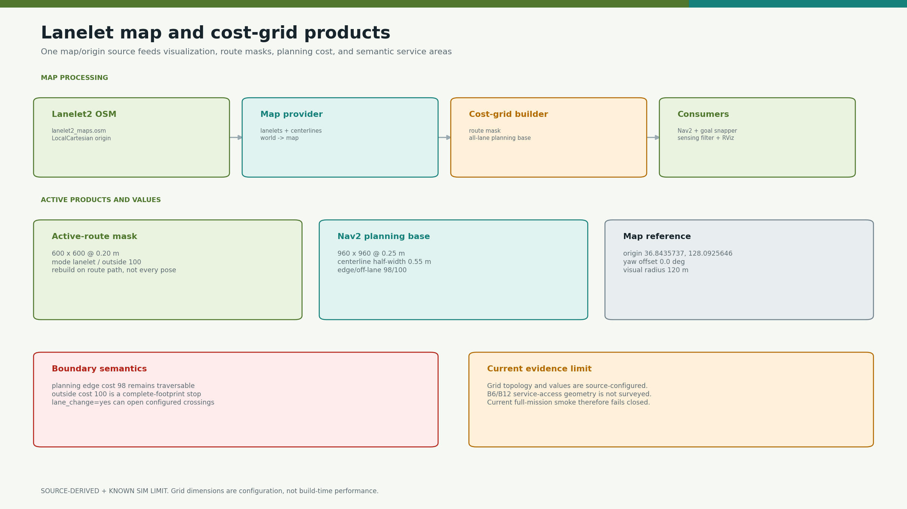
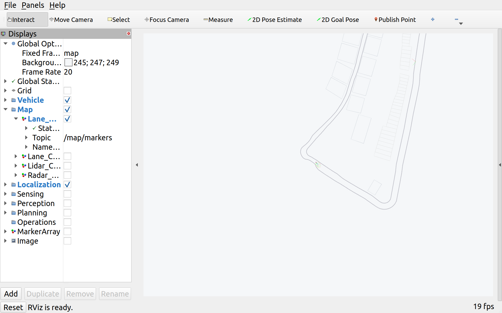

# camrod_map

<!-- HH_260805 - Record the current-site map fingerprint while separating
older hash-bound recovery evidence from the active deployment geometry. -->
<!-- HH_260806 - Record map-v16 and separate road lanelet safety from explicit
off-lane campsite service-area motion. -->
<!-- HH_260806 - Add a bounded high-resolution lanelet raster dedicated to the final command gate. -->
<!-- HH_260807 - Record the synchronized user-authored map-v17 deployment pair. -->
<!-- HH_260810 - Rebind runtime coordinates and map identity to the current
user-authored map file without rewriting independent snapshot copies. -->
<!-- HH_260818 - Refresh only the current map identity after the worak-test
map-v22 edit; semantic operating coordinates remain unchanged. -->
<!-- HH_260819 - Link the current-map B1-B13 full Return evidence without
modifying the user-maintained OSM geometry. -->
<!-- HH_260907 - Export map-v23 geometry and preserve explicit operating yaw,
site-service policy, and the relocated shared parking/docking area. -->

Lanelet2 map loading, WGS84 projection, semantic-area export, route masks,
planning cost grids, and RViz visualization.



## Actual Simulation Runtime



`SIM RUNTIME CAPTURE`: the actual `/map/markers` lanelet geometry and live robot
pose in RViz. The source-derived diagram below remains the numerical grid
reference.


`SIM BROWSER CAPTURE`: the browser receives bounded `/map/markers` geometry and
runtime lanelet/radar/inflation layers through the leased telemetry API. It does
not replace the surveyed-width acceptance required for the user-authored map.

## At A Glance

| Uses | Function | Main outputs |
|---|---|---|
| Lanelet2 OSM + LocalCartesian projector | Loads road geometry and directional lanelets | `/map/markers`, map metadata |
| Active route lanelet IDs | Builds a binary route mask for obstacle filtering | `/map/cost_grid/route_lanelet_mask` |
| All lanelets + centerline costs | Builds the Nav2 planning base | `/map/cost_grid/lanelet` |
| Local all-lanelet occupancy | Builds the final command safety base | `/map/cost_grid/lanelet_safety` |
| OSM semantic Areas | Exports drop zones and service metadata | `drop_zones.yaml` and related generated YAML |

## Active Map Reference

| Item | Value |
|---|---|
| Runtime map | `/home/nvidia/camrod_ws/src/lanelet2_maps.osm` |
| Active source revision | `map_version=23` (user geometry plus explicit operating metadata) |
| Active SHA-256 | `2c96514fa788e46ab5061a0ebc130a732557045d0baa3b67bb9f9dbcb132fef7` |
| Source XML primitives | 55 lanelet relations, 14 areas, 1,662 nodes, 237 ways |
| Projector | `local_cartesian` |
| WGS84 origin | `36.8435737, 128.0925646, 0.0` |
| Map yaw offset | `0.0 deg` |
| Frames | `world -> map` |
| Immediate visualization radius | `120 m` |

The absolute map path is a Jetson deployment path. Workstation testing may
override it, but must not rewrite the production path solely for local use.
Named `lanelet2_maps_(copy_park_*.osm)` files are user-owned snapshots, not
runtime mirrors. They are intentionally not overwritten or required to be
byte-identical to the active file. A different field requires a new survey and
an explicit runtime map revision.

The SHA value is a file fingerprint, not a read-only lock and not a map edit.
The regression test fails when geometry changes unexpectedly. After an
intentional survey/edit, re-export runtime coordinates and update the expected
revision, primitive counts, and SHA in the same reviewed change. Snapshot-copy
maintenance remains a separate user decision.

## Current Park Operating Coordinates


The current map-v23 coordinates come from `area_export.launch.py` and its
existing `area_exporter_node`, using the shared `LocalCartesianProjector`.
OSM `local_x`/`local_y` are not substituted for this lat/lon/alt projection.

| Runtime area | Relation | Center x/y (m) | Yaw | `parking_method` |
|---|---|---|---|---|
| Shared parking and docking | `7019` | `-11.3585, 40.0901` | `-82.2127°` | `auto` |

Former drop-zone relation `2320` is removed: that space is used for vehicle
entry and must not remain a parking/return target. Its underlying way `2316`
and nodes are retained. Both reverse parking and AprilTag docking use the
single new area `7019`; the battery/parking policy selects the method, not a
different map location.

B1-B13 centers and corners are re-exported on z=0. Existing B1-B10
`turnaround`, B11-B13 `roadside_stop`, and all 13 operating yaws are preserved
as explicit relation metadata in the active OSM. Narrower site polygons would
otherwise switch the longest-edge inferred heading by about 90 degrees at
B1/B5/B7/B9/B11; no such unrequested operating-heading change is applied.
Only these metadata tags and the explicitly retired relation `2320` differ
from the user-authored map; all way/node coordinates and the named v1.0.13
snapshot remain untouched. The exporter preserves optional `parking_method`
metadata, with `auto` allowing either method at the shared area. Active drop-zone
YAML is synchronized across map/localization/bringup, and campsite YAML across
planning/bringup. Both `drop_zone` and `garage` keypoints use the new `7019`
center. There is no separate reverse-parking location or alias.

The [archived coordinate record and image](../docs/assets/module-guides/map/test-results/park-operating-points-20260810/README.md)
remain bound to map v22 (the former drop zone), not the current map-v23 geometry.
The old single-zone visualization renderer is historical and must not be used
to overwrite that evidence with current inputs. Neither this offline export
nor the archived image establishes a physical-road PASS for map v23.

## Cost Grids

| Product | Geometry | Mode | Key costs |
|---|---|---|---|
| Active-route mask | `600 x 600 @ 0.20 m` (`120 m`) | full route lanelets | inside `0`, outside `100` |
| Nav2 planning base | `960 x 960 @ 0.25 m` (`240 m`) | centerline gradient | center `0`, fill `70`, edge `98`, outside `100` |
| Command safety base | `600 x 600 @ 0.05 m` (`30 m`) | lanelet occupancy | inside `0`, edge `98`, outside `100` |

| Rule | Current behavior |
|---|---|
| Physical-body boundary | Cost `100` or unknown stops ordinary motion; only monotonic-overlap-reducing, swept-body-clear escape is eligible |
| Planning-margin boundary | Ordinary command stops; projected escape also requires endpoint planning clearance |
| Soft mapped edge | Cost `98` biases planning but remains traversable |
| Lane change | `lane_change=yes` can clear configured crossing cells |
| Grid placement | Both are robot-centered; the safety grid recenters only near its local-window edge |
| Rebuild | Route/path change and pose-exits-grid; not every pose update |
| Republish | Static grid every `1.0 s` for late lifecycle consumers |

## Boundary Evidence


The historical map-v14 B6 run contacted the mapped boundary at approximately
`(4.3688, 45.0583)`. Campsite Areas remain semantic service geometry outside
road lanelets. The control gate now permits static-lanelet crossing only while
the explicit campsite state machine owns motion; dynamic obstacle checks remain
active. Ordinary navigation still uses the complete physical/planning boundary.
The repeatable three-case run is bound to OSM SHA-256
`2f69deed24ae47e6762a7653e29e5574438a1ec4b9144b8a3b0a01165f404dbe`.
It is retained as v14 evidence and is not presented as a map-v15 rerun.
The v2.1.4 map-v15 recovery media are likewise bound to release SHA
`e0b50f09c61fbd5429e528c2b3d8d2799a0dab9f83bb79b06dd0da0403efe36d`.
They demonstrate the staged controller on that release map, not a run on the
historical map-v17 SHA `8cd05c...5e021`, nor the active map-v23 SHA above.

On the prior map-v15 SHA `d7b730...213f`, a controlled route traveled `10.0403 m` with no
route hold. A `+0.19 m` placement touched only the planning margin and admitted
bounded `CRAB_RIGHT`; a `+0.27 m` physical-body placement retained a no-motion
hold. The map raster and threshold did not change for this test. Only the
reduced candidate polygons and control interpretation changed; this evidence
is historical. Map-v16 B1-B10 site maneuvers (10/10) and B11-B13 arrival-only
checks remain historical policy evidence. The map-v17 B1/B2/B3 continuous
service and B2 recovery 3/3 also remain historical after the active map edit;
the historical map-v22 AMD64 rerun covers B1-B10 turnaround exits and B11-B13
roadside exits 13/13. One B11 service also completed the source-selected
forward loop, parking, and simulated charging. Physical road-width and
clearance acceptance still require the field survey.

## Nodes And Products

| Node/tool | Responsibility |
|---|---|
| `lanelet_map_provider` | Loads OSM, publishes map markers and projection context |
| `lanelet_boundary_cost_grid` | Publishes route mask and all-lane planning grid |
| `cost_grid_multi_marker` | Converts map/LiDAR/radar grids to throttled RViz markers |
| `lanelet_cost_field_visualizer` | Displays distance/curvature cost structure |
| `area_exporter` | Converts semantic OSM Areas into deployment YAML |

## Run And Validate

```bash
ros2 launch camrod_map map.launch.py
ros2 launch camrod_map area_export.launch.py

ros2 topic echo --once /map/markers
ros2 topic echo --once /map/cost_grid/lanelet
ros2 topic echo --once /map/cost_grid/route_lanelet_mask
ros2 run tf2_ros tf2_echo world map
```

| Config | Purpose |
|---|---|
| `config/map_info.yaml` | Single map path, origin, frames, and visualization source |
| `config/lanelet_cost_grid.yaml` | Route mask and planning-grid geometry/costs |
| `config/map_visualization.yaml` | RViz marker palettes, rates, and sampling |
| `config/drop_zones.yaml` | Generated shared parking/docking geometry and optional parking method |

Grid dimensions and thresholds are source configuration, not measured map-build
latency. Field route coverage remains pending where service-access geometry is
missing.
