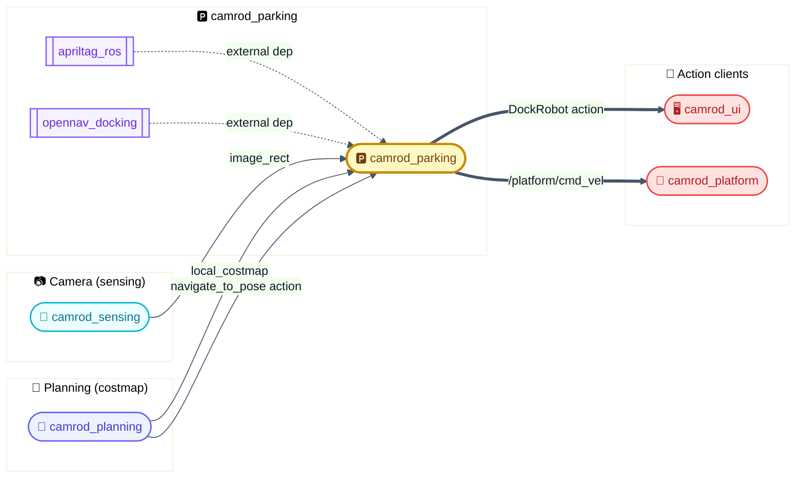
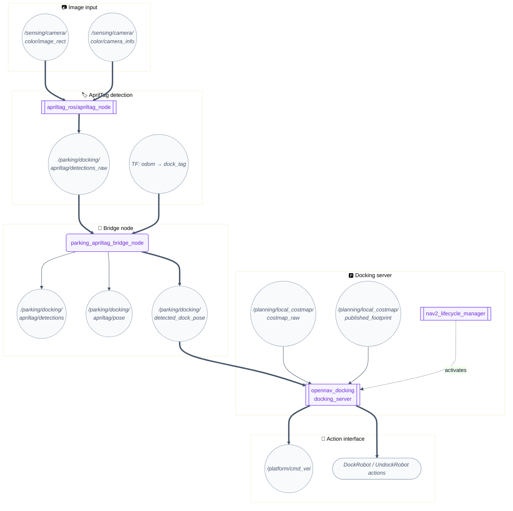
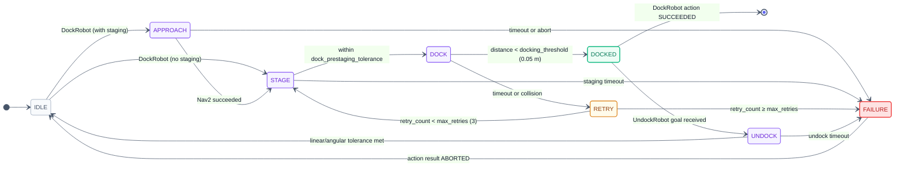
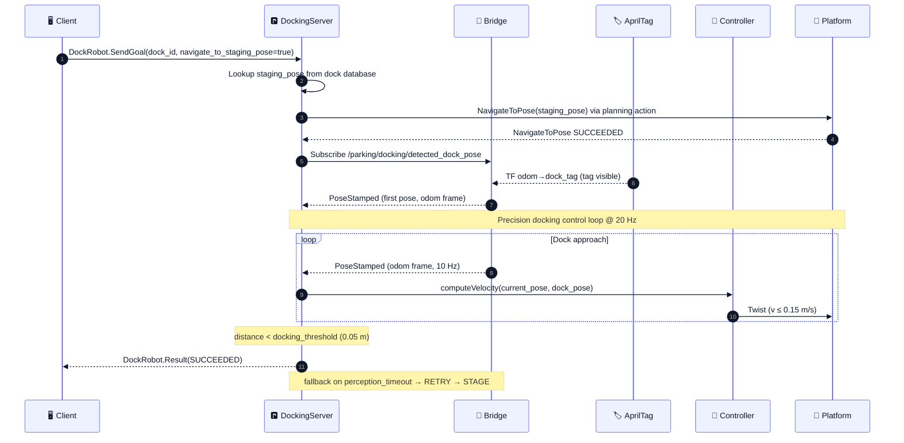

# 🅿️ camrod_parking — AprilTag dock detection & autonomous docking

> 📌 **NEW in v1.10** — Camera sensing refactor aligned `camrod_sensing` topic names; `parking_apriltag_bridge` updated to consume the new rectified image and camera_info namespaces. No external interface changes.

---

## 1. 📋 Summary

`camrod_parking` provides AprilTag-based dock detection and autonomous docking for CAMROD. It bundles three cooperating subsystems inside a single ROS 2 package:

| Subsystem | Executable / Package | Role |
|---|---|---|
| AprilTag detector | `apriltag_ros/apriltag_node` (external) | Detects tag family `36h11` in the camera stream and publishes raw detections |
| AprilTag bridge | `camrod_parking/parking_apriltag_bridge` | Converts raw `apriltag_msgs` detections to `avg_msgs` format; extracts `geometry_msgs/PoseStamped` dock pose from TF at a configurable publish rate |
| Docking server | `opennav_docking/opennav_docking` (external) | Lifecycle-managed action server that executes staged approach + precision docking using the detected dock pose and Nav2 local costmap collision checking |

**Non-goals:** perception for general obstacles (see `camrod_perception`), fleet scheduling, charging management.

---

## 2. 🗺️ System Position



`camrod_parking` is a **terminal consumer** of sensing and planning output. It does not republish to other perception or planning packages.

---

## 3. ⚙️ Runtime Architecture



> 💡 **Legend** — `[🧩 node]` = ROS node &nbsp;|&nbsp; `((topic))` = ROS topic &nbsp;|&nbsp; `==>` critical data path &nbsp;|&nbsp; `-.->` lifecycle / optional

---

## 4. 🔄 Docking Lifecycle



> ⚠️ **Fallback** — when `perception_timeout` fires inside `DOCK`, the server retries up to `max_retries=3` times before returning `ABORTED`. Increase `initial_perception_timeout` (default `5.0 s`) if tag detection is slow to converge.

---

## 5. 🔀 Docking Mission Sequence



---

## 6. 📡 Interface Contract

### Inputs

| Topic | Type | Required | Producer | Rate | Meaning |
|---|---|---|---|---|---|
| `/sensing/camera/color/image_rect` | `sensor_msgs/Image` | Yes | camrod_sensing | 10 Hz | Rectified colour image for AprilTag detection |
| `/sensing/camera/color/camera_info` | `sensor_msgs/CameraInfo` | Yes | camrod_sensing | 10 Hz | Intrinsics for AprilTag pose estimation |
| `/planning/local_costmap/costmap_raw` | `nav2_msgs/Costmap` | Yes | camrod_planning | ~5 Hz | Occupancy grid for docking collision checking |
| `/planning/local_costmap/published_footprint` | `geometry_msgs/PolygonStamped` | Yes | camrod_planning | ~5 Hz | Robot footprint for collision checking |
| TF `odom → dock_tag` | TF2 | Yes | apriltag_ros (via TF broadcaster) | on detect | Tag pose in odom frame; bridge polls at `publish_rate_hz` |

### Outputs

| Topic | Type | Consumer | Rate | Meaning |
|---|---|---|---|---|
| `/parking/docking/apriltag/detections_raw` | `apriltag_msgs/AprilTagDetectionArray` | bridge node | 10 Hz | Raw apriltag_ros detections (internal bridge input) |
| `/parking/docking/apriltag/detections` | `avg_msgs/AvgAprilTagDetectionArray` | RViz, diagnostics | 10 Hz | Converted detections in avg_msgs format |
| `/parking/docking/apriltag/pose` | `avg_msgs/AvgAprilTagPose` | RViz | `publish_rate_hz` | Tag pose with family/ID metadata |
| `/parking/docking/detected_dock_pose` | `geometry_msgs/PoseStamped` | opennav_docking | `publish_rate_hz` | Dock pose in odom frame, consumed by docking server |
| `DockRobot` action server | `opennav_docking_msgs/DockRobot` | UI / BT | on demand | Executes full dock approach + precision docking |
| `UndockRobot` action server | `opennav_docking_msgs/UndockRobot` | UI / BT | on demand | Backs robot away from dock to IDLE |

---

## 7. 🔑 Key Behaviors

### 🏷️ AprilTag Detection

| Field | Detail |
|---|---|
| Trigger | New image frame on `/sensing/camera/color/image_rect` |
| Internal logic | `apriltag_ros/apriltag_node` runs tag family `36h11` detector with `decimate=2.0`, `threads=2`; publishes TF `camera_optical_frame → dock_tag` if tag ID 0 is found |
| Output effect | TF `dock_tag` becomes available; bridge picks it up on next timer tick |
| Operator-visible symptom | `/parking/docking/apriltag/detections_raw` has non-empty `detections` array in RViz/topic echo |
| Related params | `family: 36h11`, `size: 0.120`, `tag.ids: [0]`, `tag.frames: ["dock_tag"]` |
| Related topics | `/sensing/camera/color/image_rect`, `/parking/docking/apriltag/detections_raw` |

### 🌉 Bridge: Pose Extraction from TF

| Field | Detail |
|---|---|
| Trigger | Wall timer fires at `publish_rate_hz` (default 10 Hz) |
| Internal logic | `parking_apriltag_bridge_node` calls `tf_buffer_.lookupTransform(fixed_frame_, tag_frame_, TimePointZero)`; on success, packs translation+rotation into `PoseStamped` and publishes |
| Output effect | `/parking/docking/detected_dock_pose` receives a fresh PoseStamped every 100 ms while tag is visible |
| Operator-visible symptom | `ros2 topic hz /parking/docking/detected_dock_pose` shows ~10 Hz; zero Hz means TF lookup failing (tag not visible or calibration error) |
| Related params | `fixed_frame: odom`, `tag_frame: dock_tag`, `target_tag_id: 0`, `publish_rate_hz: 10.0` |
| Related topics | `/parking/docking/detected_dock_pose`, `/parking/docking/apriltag/pose` |

### 🅿️ Docking Server: Staged Approach + Precision Docking

| Field | Detail |
|---|---|
| Trigger | `DockRobot` action goal received |
| Internal logic | (1) If `navigate_to_staging_pose=true`, sends `NavigateToPose` to `/planning/navigate_to_pose` using `navigator_bt_xml`; (2) transitions to precision docking loop at 20 Hz using `SimpleChargingDock` plugin; (3) controller applies `k_phi=3.0`, `k_delta=2.0` control law; checks collision using local costmap; (4) succeeds when distance < `docking_threshold=0.05 m` |
| Output effect | Robot moves to dock; action returns SUCCEEDED; docking server stays in DOCKED state |
| Operator-visible symptom | Robot approaches dock; `/platform/cmd_vel` shows velocity; action feedback publishes `num_retries` counter |
| Related params | `controller_frequency: 20.0`, `initial_perception_timeout: 5.0`, `dock_approach_timeout: 30.0`, `max_retries: 3`, `staging_x_offset: -0.70`, `docking_threshold: 0.05`, `v_linear_min: 0.05`, `v_linear_max: 0.15` |
| Related topics | `/parking/docking/detected_dock_pose`, `/planning/local_costmap/costmap_raw`, `/platform/cmd_vel` |

---

## 8. 🏷️ AprilTag Calibration and Setup

### Tag Physical Requirements

| Property | Value |
|---|---|
| Family | `36h11` |
| Tag ID | `0` |
| Side length (black square border to border) | `0.120 m` |
| Mounting surface | Flat, perpendicular to robot approach axis |

### Required TF Chain

```
odom
  └── base_link
        └── ... (robot URDF kinematic chain)
              └── camera_optical_frame
                    └── dock_tag   ← published by apriltag_ros when tag is detected
```

The bridge node reads `odom → dock_tag` from the TF tree. If this transform is unavailable, `/parking/docking/detected_dock_pose` will not publish and docking will abort on `initial_perception_timeout`.

### `camera_info` Requirement

`apriltag_ros` requires a valid `sensor_msgs/CameraInfo` message on `/sensing/camera/color/camera_info` at the same frame rate as the image. The `K` matrix (intrinsics) must be calibrated; the default `camrod_sensing` camera calibration is used automatically when the sensing pipeline is active.

---

## 9. 🗄️ Dock Database

The dock database is a YAML file referenced at launch via `docks_file`. It defines named dock locations used by the `DockRobot` action.

<details>
<summary>📋 docks.yaml schema</summary>

### Schema

```yaml
docks:
  <dock_id>:
    type: <dock_plugin_name>   # must match dock_plugins list in docking_server.yaml
    frame: <frame_id>          # coordinate frame for the pose (typically "map")
    pose: [x, y, yaw]          # 2D pose: x [m], y [m], yaw [rad]
```

### Example (`config/docks.yaml`)

```yaml
docks:
  home_dock:
    type: apriltag_dock
    frame: map
    pose: [10.0, 5.0, 3.14159]
```

Add additional docks as sibling keys under `docks:`. The dock ID used in `DockRobot` goals must match a key in this file exactly.

</details>

> 📌 The dock ID in `DockRobot` action goals must exactly match a key under `docks:`. A mismatch causes the docking server to fail activation with `Charging dock plugins not given!`.

---

## 10. 🚀 Quick Start

```bash
# Full docking pipeline — AprilTag detector + bridge + docking server
ros2 launch camrod_parking docking.launch.py

# Same pipeline via the parking wrapper
ros2 launch camrod_parking parking.launch.py

# Override dock database at runtime
ros2 launch camrod_parking docking.launch.py \
  docks_file:=/path/to/docks.yaml

# Send a dock goal (replace dock_id with a key from docks.yaml)
ros2 action send_goal /parking/docking/docking_server/dock_robot \
  opennav_docking_msgs/action/DockRobot \
  "{dock_id: 'home_dock', navigate_to_staging_pose: true}"
```

**Prerequisites:**
- `camrod_sensing` camera pipeline must be running (`/sensing/camera/color/image_rect`, `/sensing/camera/color/camera_info`)
- `camrod_planning` Nav2 local costmap must be active (`/planning/local_costmap/costmap_raw`, `/planning/local_costmap/published_footprint`)
- TF chain `odom → base_link → ... → camera_optical_frame` must be publishing
- Physical AprilTag (family `36h11`, ID 0, 0.120 m side) must be mounted at the dock

---

## 11. 🛠️ Launch

### Launch Files

| File | Purpose |
|---|---|
| `launch/docking.launch.py` | Primary launch: AprilTag node + bridge + docking server + lifecycle manager |
| `launch/parking.launch.py` | Thin wrapper that includes `docking.launch.py`; intended entry point for `camrod_bringup` |

### Launch Arguments

| Argument | Default | Description |
|---|---|---|
| `parking_ns` | `parking` | Top-level ROS namespace for all parking nodes |
| `docking_ns` | `docking` | Sub-namespace under `parking_ns` for docking nodes |
| `docking_param_file` | `config/docking_server.yaml` | Parameter file for `opennav_docking` server |
| `docks_file` | `config/docks.yaml` | Dock location database YAML |
| `navigator_bt_xml` | `camrod_planning/config/bt/navigate_to_pose_w_planner_selector_grid.xml` | BT XML used by docking server during staging navigation |
| `controller_costmap_topic` | `/planning/local_costmap/costmap_raw` | Costmap topic for collision checking |
| `controller_footprint_topic` | `/planning/local_costmap/published_footprint` | Footprint topic for collision checking |

Nodes run under the composed namespace `/<parking_ns>/<docking_ns>/`. The `navigate_to_pose` action is remapped to `/planning/navigate_to_pose` at launch.

---

## 12. ⚙️ Config

| File | Purpose |
|---|---|
| `config/apriltag.yaml` | `apriltag_ros` parameters: family `36h11`, size `0.120 m`, tag IDs `[0]`, frames `["dock_tag"]`, decimate `2.0`, threads `2`, sharpening `0.25` |
| `config/docking_server.yaml` | `opennav_docking` parameters: approach/perception timeouts, staging offset, controller gains (`k_phi=3.0`, `k_delta=2.0`), velocity limits, collision detection topics |
| `config/docks.yaml` | Dock database: named docks with pose and plugin type |

### Key Parameters Reference

| Parameter | File | Default | Description |
|---|---|---|---|
| `initial_perception_timeout` | `docking_server.yaml` | `5.0` s | Max wait for first dock pose before aborting |
| `dock_approach_timeout` | `docking_server.yaml` | `30.0` s | Max total docking time |
| `max_retries` | `docking_server.yaml` | `3` | Retry count before ABORTED result |
| `staging_x_offset` | `docking_server.yaml` | `-0.70` m | Pre-dock staging distance in front of dock |
| `docking_threshold` | `docking_server.yaml` | `0.05` m | Distance at which docking is considered successful |
| `v_linear_min` / `v_linear_max` | `docking_server.yaml` | `0.05` / `0.15` m/s | Docking velocity limits |
| `controller_frequency` | `docking_server.yaml` | `20.0` Hz | Docking control loop rate |
| `filter_coef` | `docking_server.yaml` | `0.1` | EMA filter coefficient for dock pose smoothing |
| `publish_rate_hz` | bridge node param | `10.0` Hz | Rate at which bridge polls TF and publishes dock pose |
| `target_tag_id` | bridge node param | `0` | AprilTag ID that the bridge forwards; others are ignored |

---

## 13. ✅ Validation

```bash
# 1. Confirm apriltag detector is running
ros2 node list | grep apriltag

# 2. Check raw detections are arriving (hold a tag in front of camera)
ros2 topic echo /parking/docking/apriltag/detections_raw --once

# 3. Check bridge is forwarding detections and pose
ros2 topic hz /parking/docking/detected_dock_pose

# 4. Confirm docking server lifecycle is active
ros2 lifecycle get /parking/docking/docking_server

# 5. Inspect dock database loaded by server
ros2 param get /parking/docking/docking_server dock_database

# 6. Send a test dock goal (dry run — ensure robot is near staging pose first)
ros2 action send_goal /parking/docking/docking_server/dock_robot \
  opennav_docking_msgs/action/DockRobot \
  "{dock_id: 'home_dock', navigate_to_staging_pose: false}"
```

---

## 14. 🔧 Troubleshooting

### AprilTag not detected

> ⚠️ **Symptoms** — `/parking/docking/apriltag/detections_raw` is empty; no `dock_tag` in TF tree.

1. Verify camera images are arriving: `ros2 topic hz /sensing/camera/color/image_rect`
2. Check lighting: tag requires a minimum of ~50 lux at the tag surface
3. Confirm `config/apriltag.yaml` specifies the correct `family: 36h11` and `tag.ids: [0]`
4. The physical tag side length must match `size: 0.120` in `apriltag.yaml` — a mismatch causes pose errors but usually not detection failure

---

### Detection present but no dock pose

> ⚠️ **Symptoms** — `detections_raw` has entries, but `/parking/docking/detected_dock_pose` is silent or `ros2 topic hz` shows 0 Hz.

1. `ros2 run tf2_tools view_frames` — confirm `dock_tag` frame appears in the TF tree
2. Check bridge logs for TF lookup warnings:
   ```
   [parking_apriltag_bridge]: Failed to lookup TF odom -> dock_tag: ...
   ```
3. Verify `fixed_frame` param (`odom`) is consistent with the localization output frame
4. Ensure `tag_frame` param (`dock_tag`) matches the frame published by `apriltag_ros` (set by `tag.frames` in `apriltag.yaml`)

---

### Docking aborts on perception_timeout

> ⚠️ **Symptoms** — `DockRobot` action returns ABORTED after ~5 s with reason `Timed out waiting for dock pose`.

1. Confirm `/parking/docking/detected_dock_pose` is publishing before sending the goal
2. Tag must be within camera FoV at the staging pose — adjust `staging_x_offset` if the tag is not visible from the staging position
3. Increase `initial_perception_timeout` in `docking_server.yaml` if tag detection is slow to converge
4. Check `external_detection_timeout` (default `1.0` s) in `apriltag_dock` section — reduce if tag detection rate drops

---

### Robot collides during approach

> ⚠️ **Symptoms** — Docking action aborts with collision warning; robot stops before reaching dock.

1. Confirm Nav2 local costmap is running: `ros2 topic hz /planning/local_costmap/costmap_raw`
2. Verify `controller.costmap_topic` and `controller.footprint_topic` params match the active Nav2 topics
3. Increase `dock_collision_threshold` (default `0.3` m) only if the dock structure itself is inflating the costmap — never disable collision checking in production
4. Check the dock area for transient obstacles (people, objects) in the LiDAR/camera field of view

---

### Wrong tag accepted

> ⚠️ **Symptoms** — Robot docks at an unintended location; `/parking/docking/apriltag/detections` shows a tag ID other than 0.

1. `config/apriltag.yaml` `tag.ids: [0]` — the detector only broadcasts this ID into TF; confirm no additional IDs have been added
2. Bridge param `target_tag_id: 0` — the bridge only publishes dock pose for the matching ID; confirm it has not been changed

---

### Docking server lifecycle not active

> ⚠️ **Symptoms** — `ros2 action list` does not show `dock_robot` / `undock_robot`; logs show `Not activating …`.

1. `ros2 lifecycle get /parking/docking/docking_server` — expected state `active`
2. `nav2_lifecycle_manager` (`lifecycle_manager_docking`) starts with `autostart: true`; check its logs for activation errors
3. If `dock_database` param is empty or path does not exist, docking server fails to activate with `Charging dock plugins not given!`. Verify `docks_file` argument resolves to a readable YAML file
4. Restart sequence: `ros2 lifecycle set /parking/docking/docking_server configure` then `activate`

---

## 15. 📚 Related Docs

| Document | Notes |
|---|---|
| [../README.md](../README.md) | Monorepo overview, workspace build instructions |
| [../camrod_sensing/README.md](../camrod_sensing/README.md) | Camera preprocessing, image_rect and camera_info topics |
| [../camrod_planning/README.md](../camrod_planning/README.md) | Nav2 local costmap, NavigateToPose action, BT XML |
| [../camrod_platform/README.md](../camrod_platform/README.md) | `/platform/cmd_vel` velocity interface |
| [../camrod_ui/README.md](../camrod_ui/README.md) | UI action client for DockRobot / UndockRobot |
| [../PARAMETER_NAMING_STANDARD.md](../PARAMETER_NAMING_STANDARD.md) | Parameter naming conventions (`*_s`, `*_hz`) |
