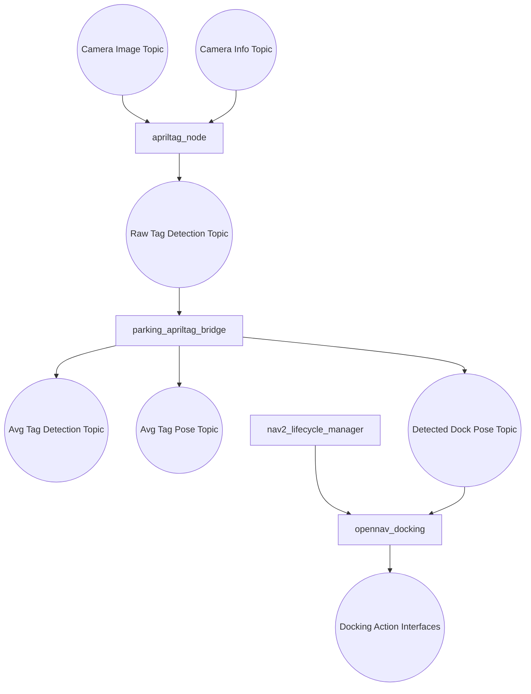
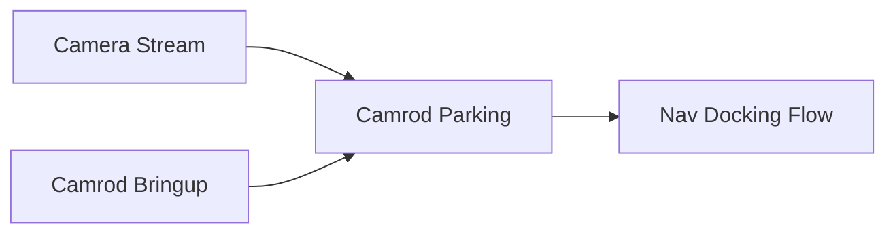

# camrod_parking

## Role
`camrod_parking` provides docking-related runtime flow based on AprilTag detection and docking server orchestration.

## Package Diagram


Diagram legend: `[node/process]`, `((topic stream))`, `[(config or interface)]`, `[[external package or launch]]`.

## Node Data Flow
| Node | Main Inputs | Main Outputs |
|---|---|---|
| `apriltag_ros/apriltag_node` | `/camera/color/image_rect`, `/camera/color/camera_info` | `/parking/docking/apriltag/detections_raw` |
| `parking_apriltag_bridge` | `/parking/docking/apriltag/detections_raw` | `/parking/docking/apriltag/detections`, `/parking/docking/apriltag/pose`, `/parking/docking/detected_dock_pose` |
| `opennav_docking` | docking target/config | docking control interfaces |
| `nav2_lifecycle_manager` | lifecycle config | activates `docking_server` |

## Inter-Package Connections


## Topic Summary
### Input Topics
| Input Topic | Purpose |
|---|---|
| `/camera/color/image_rect` | AprilTag image input |
| `/camera/color/camera_info` | AprilTag camera model input |
| `/parking/docking/apriltag/detections_raw` | Bridge conversion input |

### Output Topics
| Output Topic | Purpose |
|---|---|
| `/parking/docking/apriltag/detections` | avg_msgs-style detection output |
| `/parking/docking/apriltag/pose` | Tag pose output |
| `/parking/docking/detected_dock_pose` | Docking target pose output |

## Practical Usage
```bash
ros2 launch camrod_parking parking.launch.py
```

Or docking-only:
```bash
ros2 launch camrod_parking docking.launch.py
```

## Config Files
- `config/apriltag.yaml`
- `config/docking_server.yaml`
- `config/docks.yaml`
