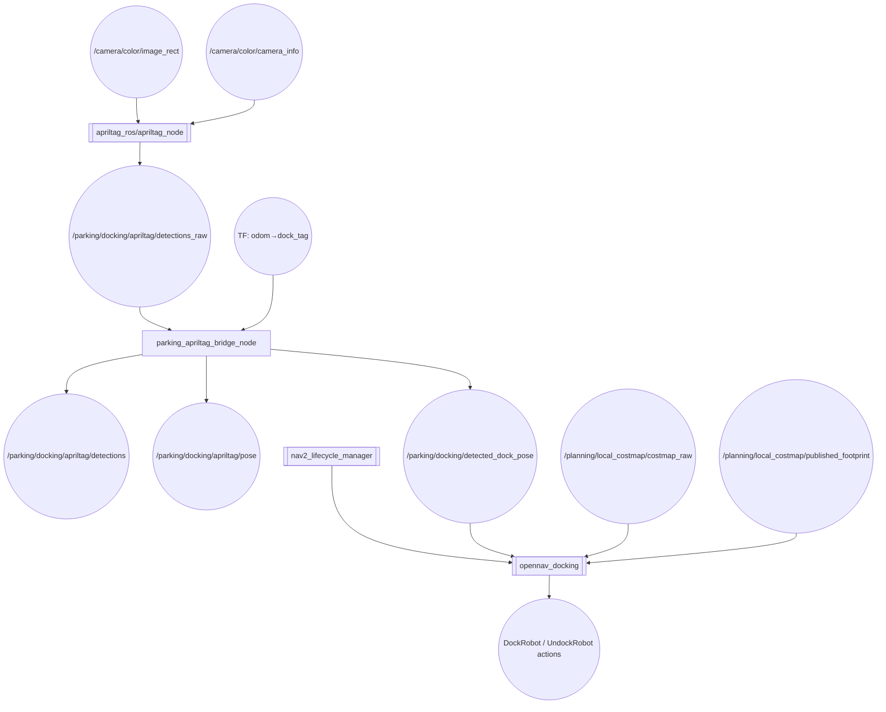
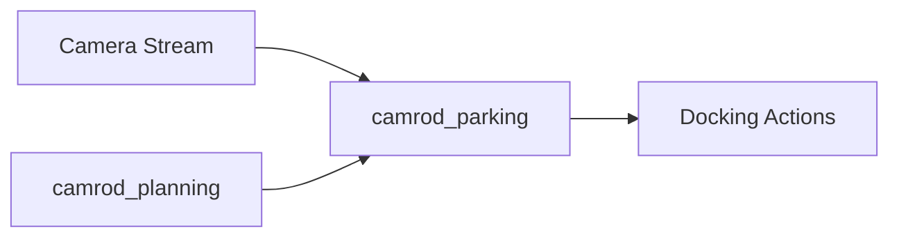

# camrod_parking

## Role
AprilTag-based dock detection and autonomous docking execution. `parking_apriltag_bridge_node` converts raw `apriltag_ros` detections to `avg_msgs` format and extracts the dock pose from TF. `opennav_docking` (external) uses the detected dock pose to execute the docking maneuver with collision checking against the Nav2 local costmap.

## Package Diagram


Diagram legend: `[node]`, `((topic))`, `[[external stack]]`.

## Node Data Flow

| Node | Inputs | Outputs | Key Params |
|---|---|---|---|
| `apriltag_ros/apriltag_node` | `/camera/color/image_rect`, `/camera/color/camera_info` | `/parking/docking/apriltag/detections_raw` | family: 36h11, tag size: 0.120 m, tag IDs: [0] |
| `parking_apriltag_bridge_node` | `/parking/docking/apriltag/detections_raw`, TF `odom→dock_tag` | `/parking/docking/apriltag/detections`, `/parking/docking/apriltag/pose`, `/parking/docking/detected_dock_pose` | fixed_frame: odom, tag_frame: dock_tag, target_tag_id: 0, publish_rate_hz: 10 |
| `opennav_docking` | `/parking/docking/detected_dock_pose`, `/planning/local_costmap/*` | DockRobot / UndockRobot action servers | staging_offset_x: -0.70 m, docking_threshold: 0.05 m, controller: k_phi 3.0 / k_delta 2.0 |
| `nav2_lifecycle_manager` | — | lifecycle activation for `docking_server` | autostart: true |

### Docking Controller Parameters

| Parameter | Value | Description |
|---|---|---|
| `controller_frequency` | 20.0 Hz | Docking control loop rate |
| `dock_approach_timeout` | 30.0 s | Max time to complete docking |
| `perception_timeout` | 5.0 s | Timeout if dock not detected |
| `max_retries` | 3 | Retry attempts before failure |
| `staging_offset_x` | -0.70 m | Pre-dock staging distance |
| `linear_vel_min/max` | 0.05 / 0.15 m/s | Docking velocity limits |
| `docking_threshold` | 0.05 m | Success distance to dock |

## Inter-Package Connections


## Topic Summary

### Inputs (from other packages)
| Topic | Type | Source |
|---|---|---|
| `/camera/color/image_rect` | Image | Camera driver |
| `/camera/color/camera_info` | CameraInfo | Camera driver |
| `/planning/local_costmap/costmap_raw` | OccupancyGrid | camrod_planning (Nav2) |
| `/planning/local_costmap/published_footprint` | PolygonStamped | camrod_planning (Nav2) |

### Outputs (consumed by other packages)
| Topic | Type | Consumers |
|---|---|---|
| `/parking/docking/detected_dock_pose` | PoseStamped | opennav_docking |
| `/parking/docking/apriltag/detections` | AvgAprilTagDetectionArray | RViz, diagnostics |
| `/parking/docking/apriltag/pose` | AvgAprilTagPose | RViz |

## Launch

```bash
# Full docking pipeline (AprilTag + bridge + docking server)
ros2 launch camrod_parking docking.launch.py

# Or via parking wrapper
ros2 launch camrod_parking parking.launch.py

# Custom dock database
ros2 launch camrod_parking docking.launch.py \
  docks_file:=/path/to/docks.yaml
```

Key launch arguments:

| Argument | Default | Description |
|---|---|---|
| `parking_ns` | `parking` | Parking module namespace |
| `docking_ns` | `docking` | Docking sub-namespace |
| `docking_param_file` | `config/docking_server.yaml` | opennav_docking parameters |
| `docks_file` | `config/docks.yaml` | Dock location database |
| `navigator_bt_xml` | (planning BT XML) | BT used during dock approach navigation |
| `controller_costmap_topic` | `/planning/local_costmap/costmap_raw` | Costmap topic for collision checking during docking |
| `controller_footprint_topic` | `/planning/local_costmap/published_footprint` | Footprint topic for collision checking during docking |

## Config Files

| File | Purpose |
|---|---|
| `config/apriltag.yaml` | AprilTag detector: family 36h11, tag size 0.120 m, tag IDs [0], decimate 2.0 |
| `config/docking_server.yaml` | opennav_docking: approach timeout, staging offset, controller gains, collision checking |
| `config/docks.yaml` | Dock database: named docks with pose (x, y, frame_id) and dock plugin type |
