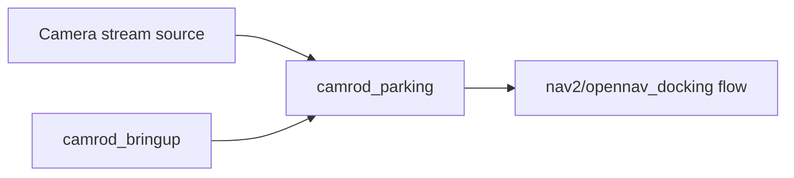

# camrod_parking

## Role
`camrod_parking` provides docking-related runtime flow based on AprilTag detection and docking server orchestration.

## Package Diagram
```mermaid
graph TD
  A[apriltag_ros/apriltag_node] --> B[/parking/docking/apriltag/detections_raw]
  C[parking_apriltag_bridge] <-- B
  C --> D[/parking/docking/apriltag/detections]
  C --> E[/parking/docking/apriltag/pose]
  C --> F[/parking/docking/detected_dock_pose]
  G[opennav_docking] --> H[docking actions/services]
  I[nav2_lifecycle_manager] --> G
```

## Node Data Flow
| Node | Main Inputs | Main Outputs |
|---|---|---|
| `apriltag_ros/apriltag_node` | `/camera/color/image_rect`, `/camera/color/camera_info` | `/parking/docking/apriltag/detections_raw` |
| `parking_apriltag_bridge` | `/parking/docking/apriltag/detections_raw` | `/parking/docking/apriltag/detections`, `/parking/docking/apriltag/pose`, `/parking/docking/detected_dock_pose` |
| `opennav_docking` | docking target/config | docking control interfaces |
| `nav2_lifecycle_manager` | lifecycle config | activates `docking_server` |

## Inter-Package Connections


## Topic Summary
| Direction | Topic | Purpose |
|---|---|---|
| In | `/camera/color/image_rect`, `/camera/color/camera_info` | AprilTag detection input |
| In | `/parking/docking/apriltag/detections_raw` | bridge conversion input |
| Out | `/parking/docking/apriltag/detections` | avg_msgs-style detection output |
| Out | `/parking/docking/apriltag/pose` | tag pose output |
| Out | `/parking/docking/detected_dock_pose` | docking target pose output |

## Practical Usage
```bash
ros2 launch camrod_parking parking.launch.py
```

Or docking-only:
```bash
ros2 launch camrod_parking docking.launch.py
```

## Config Files
- `config/apriltag.yaml`
- `config/docking_server.yaml`
- `config/docks.yaml`
