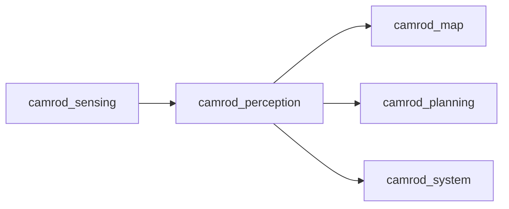

# camrod_perception

## Role
`camrod_perception` generates obstacle outputs from LiDAR-only and camera+LiDAR fused paths.

## Package Diagram
```mermaid
graph TD
  A[/sensing/lidar/points_filtered] --> B[obstacle_fusion_node]
  C[/perception/camera/detections_2d] --> B
  D[/sensing/camera/processed/camera_info] --> B
  B --> E[/perception/obstacles]
  A --> F[obstacle_lidar_node]
  F --> G[/perception/lidar/bboxes]
```

## Node Data Flow
| Node | Main Inputs | Main Outputs |
|---|---|---|
| `obstacle_fusion_node` | `/sensing/lidar/points_filtered`, `/perception/camera/detections_2d`, `/sensing/camera/processed/camera_info`, TF (`camera_link`) | `/perception/obstacles` |
| `obstacle_lidar_node` | LiDAR cloud (`input_topic` from params; default `/sensing/lidar/points`) | `/perception/lidar/bboxes` |

## Inter-Package Connections


## Topic Summary
| Direction | Topic | Purpose |
|---|---|---|
| In | `/sensing/lidar/points_filtered` | base obstacle cloud input |
| In | `/perception/camera/detections_2d` | 2D detection gates for fusion |
| In | `/sensing/camera/processed/camera_info` | camera model for projection |
| Out | `/perception/obstacles` | fused obstacle cloud |
| Out | `/perception/lidar/bboxes` | LiDAR cluster boxes |

## Practical Usage
```bash
ros2 launch camrod_perception perception.launch.py
```

Optional:
```bash
ros2 launch camrod_perception perception.launch.py enable_lidar_obstacle:=false
```

## Config Files
- `config/perception_params.yaml`
