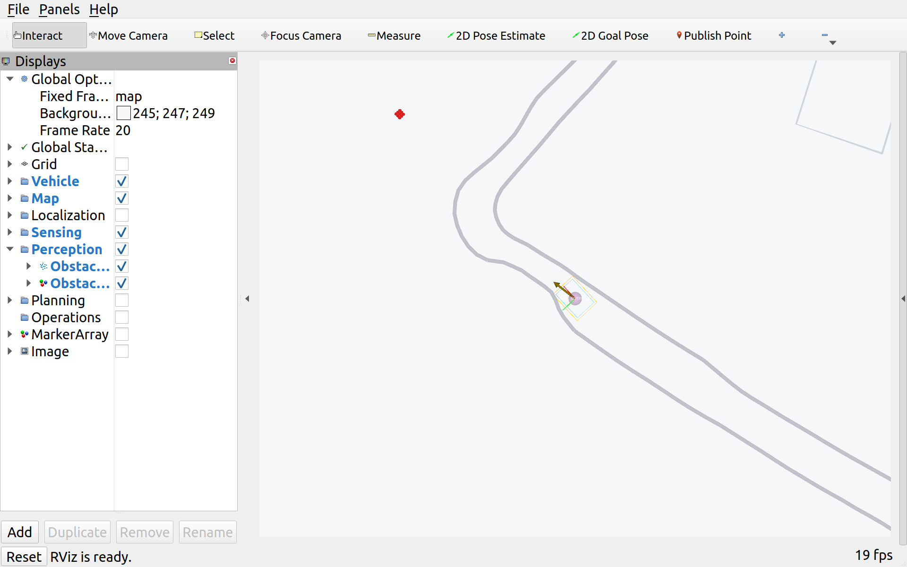

# camrod_perception

<!-- HH_260805 - Keep perception ownership and component boundaries explicit,
including the physical rear-camera parking chain. -->
<!-- HH_260818 - Make the class-only safety cloud immutable and distinguish it
from LiDAR-only diagnostic clustering. -->

LiDAR obstacle clustering, front-camera TensorRT YOLO fusion, campsite
occupancy, and rear-camera AprilTag parking perception.


## Actual Simulation Runtime



`SIM RUNTIME CAPTURE`: fake semantic obstacle points plus Euclidean bounding
boxes over the filtered LiDAR stream. Simulation exercises topic consumers; it
does not claim physical YOLO, camera-LiDAR calibration, or AprilTag accuracy.


`SIM BROWSER CAPTURE`: obstacle points/boxes and available cost layers are
displayed from live ROS topics. The active simulation is LiDAR-only; no YOLO or
AprilTag field accuracy is inferred from this screen.

## At A Glance

| Pipeline | Uses | Main output |
|---|---|---|
| LiDAR obstacles | Filtered nonground cloud + Euclidean clustering | `/perception/lidar/bboxes` visualization evidence |
| Camera-LiDAR fusion | Front image, CameraInfo, YOLO 2D boxes, LiDAR points | Class-associated `/perception/obstacles`, 3D detections, optional debug image |
| Campsite occupancy | Confirmed tent-class 3D detections + semantic site map | `/perception/camping_sites/occupancy` |
| Parking tag | Rear rectified image + CameraInfo + AprilTag | Tag pose/TF and debug image |

## Active Values

| Item | Value | Meaning |
|---|---:|---|
| Filtered LiDAR input | target `10 Hz` | Required projection source for class-associated fusion; direct raw-LiDAR cost is OFF |
| LiDAR cluster tolerance | `0.25 m` | Neighbor distance for cluster growth |
| Cluster size | `12..8000 points` | Accepted cluster point count |
| LiDAR ROI | `x 0..5 m`, `y -3..3 m` | Local obstacle search region |
| YOLO backend | TensorRT device `0` | Jetson inference path |
| YOLO throttle | `5 fps` | CPU/GPU headroom target, not measured throughput |
| Confidence / IoU | `0.50 / 0.50` | Detection thresholds |
| Fusion association | camera bbox + semantic class | Retains only current LiDAR points associated with a classified image detection |
| Safety class policy | nonempty class, not `?`/`unknown` | Euclidean-only and malformed detections cannot create the early stop |
| Detection freshness | `<= 0.50 s` | Stale cached camera boxes publish no safety obstacle points |
| Classified stop consumer | active path front `2.0 m` | Final command gate checks the semantic raster directly |
| Occupancy confirmation | `3 hits / 2 s` | Tent observation required before occupied state |
| Occupied hold | `3600 s` | Retains confirmed state for optional UI/control consumers |
| Occupancy consumer guard | default `false` | Detection still publishes; one bringup toggle enables UI/control pre-entry blocking |
| Parking tag | `tag36h11`, ID `3`, `0.16 m` | Rear docking target |

## Runtime Profiles

| Profile | Active path | Evidence status |
|---|---|---|
| Simulation | LiDAR-only clustering | Interface and obstacle publications can be tested |
| Field front camera + YOLO | TensorRT model lifetime path | 300-second field report passed transport/inference lifetime |
| Field fusion + occupancy | Camera-LiDAR alignment and semantic site mapping | Accuracy/alignment capture required |
| AprilTag parking | Rear camera + detector, only for `parking_method:=apriltag` | Physical tag alignment required |

The 2026-07-31 physical report measured 2,750 frames at `9.167 Hz`, decoded
`2750/2750`, observed detections at about `3.275 Hz`, and saw zero crash/restart
for 300 seconds. Its raw log remains external to the repository, and this does
not prove detection accuracy, fusion alignment, occupancy correctness, or
AprilTag parking.


## Runtime Composition

| Pipeline | Production ownership | Debug fallback |
|---|---|---|
| Front camera + YOLO | Existing intra-process camera/YOLO container | Separate package launches |
| Rear AprilTag parking | Rear capture, `image_proc` rectification, and `apriltag_parking_detector` share a bringup-owned container | `use_rear_camera_apriltag_container:=false` |
| LiDAR clustering/fusion | Perception processes consume the filtered cloud over the normal RMW boundary | Individual package launches |

The rear container is active only for physical `parking_method:=apriltag` runs.
Node names, image topics, tag pose, and TF outputs match the standalone path, so
parking control does not depend on process topology. ARM64 camera throughput and
physical tag-pose equivalence remain explicit Jetson checks in `TODOLIST.txt`.

## Nodes

| Node | Responsibility |
|---|---|
| `obstacle_lidar` | ROI filter, clustering, and diagnostic axis-aligned box markers; no safety cloud |
| `yolov9mit` | TensorRT inference and `Detection2DArray` output |
| `obstacle_fusion` | Projects LiDAR into the camera and creates fused 3D results |
| `campsite_occupancy` | Maps confirmed tent detections to campsite mission keys |
| `apriltag_parking_detector` | Detects and tracks the configured rear parking tag |

## Interfaces

| Direction | Topic | Type/purpose |
|---|---|---|
| Input | `/sensing/lidar/points_filtered` | Nonground point cloud |
| Input | `/sensing/camera/econ_front/image_rect/compressed` | Front camera transport |
| Input | `/sensing/camera/econ_front/camera_info` | Projection calibration |
| Output | `/perception/camera/detections_2d` | YOLO detections |
| Output | `/perception/camera_lidar/detections_3d` | Fused 3D detections |
| Output | `/perception/obstacles` | Current class-associated camera-LiDAR safety point cloud |
| Output | `/perception/camping_sites/occupancy` | Site availability contract |

## Run And Validate

```bash
ros2 launch camrod_perception perception.launch.py
ros2 launch camrod_perception perception.launch.py enable_yolo:=false
ros2 launch camrod_perception apriltag_parking_detector.launch.py
ros2 launch camrod_bringup rear_camera_apriltag_container.launch.py enable_container:=true

ros2 topic hz /perception/lidar/bboxes
ros2 topic echo /perception/camera/detections_2d
ros2 topic echo /perception/camping_sites/occupancy
```

On the Jetson, capture physical payload and inference continuity before claiming
field performance:

```bash
ros2 run camrod_bringup camera_payload_probe.py --duration 300 --min-rate-hz 5
```

| Config | Purpose |
|---|---|
| `config/perception_params.yaml` | LiDAR, YOLO, fusion, and occupancy policy |
| `config/apriltag_parking_detector.yaml` | Rear tag family, ID, size, ROI, and outputs |
