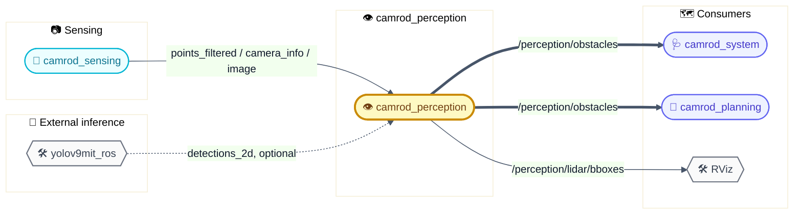
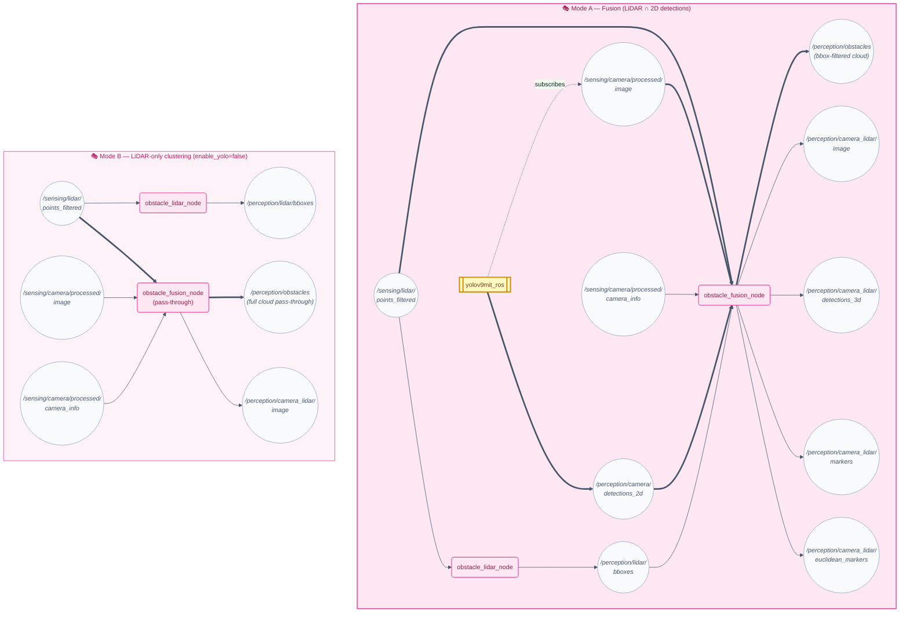
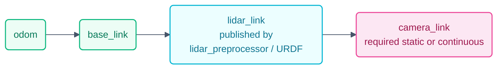

# 👁️ camrod_perception — LiDAR obstacles & camera-LiDAR fusion

---

## 1. 📋 Summary

`camrod_perception` converts raw sensor streams from `camrod_sensing` into obstacle representations consumed by `camrod_planning` and `camrod_system`. It contains two independent nodes and optionally integrates an external YOLOv9 camera detector.

| Node | Role |
|---|---|
| `obstacle_fusion_node` | Projects filtered LiDAR points into the camera image; retains only points falling inside YOLO 2D bounding boxes; publishes the filtered cloud as `/perception/obstacles` for Nav2 costmap inflation |
| `obstacle_lidar_node` | Runs Euclidean cluster extraction (PCL) on the same filtered cloud after an axis-aligned ROI filter; publishes AABB markers for RViz visualization |
| `yolov9mit_ros` (external) | YOLOv9 TensorRT inference node providing 2D bounding boxes; started by `yolo.launch.py`; can be disabled with `enable_yolo:=false` |

**Non-goals:** Object tracking with persistent IDs across restarts, semantic mapping.

> 📌 **Note** — AprilTag detection lives in `camrod_docking`, NOT here. This package handles only LiDAR obstacles and camera-LiDAR fusion for general obstacle detection.

---

## 2. 🗺️ System Position



> 📌 **External dependency** — `/perception/camera/detections_2d` must be provided by a separate detector (e.g. YOLO). This package does **NOT** run detection itself. If this topic is absent or `enable_yolo:=false`, `obstacle_fusion_node` falls back to **pass-through mode** and publishes the full LiDAR cloud to `/perception/obstacles` without camera filtering.

---

## 3. ⚙️ Runtime Architecture



> 💡 **Legend** — `[🧩 node]` = ROS node &nbsp;|&nbsp; `((topic))` = ROS topic &nbsp;|&nbsp; `==>` critical data path &nbsp;|&nbsp; `-.->` optional

In **Mode B**, `obstacle_fusion_node` receives no `detections_2d` and publishes the full forward-projected LiDAR cloud to `/perception/obstacles` without camera-based filtering. `obstacle_lidar_node` operates identically in both modes.

---

## 4. 🔗 Frame and Calibration



> 📌 `obstacle_fusion_node` does **not** call `tf_buffer_.lookupTransform` at runtime. It uses the fixed extrinsic rotation matrix for the Vanjee 750C mounting (CCW-90° around Z) plus the `extrinsic_z` offset. The TF tree is still required by downstream consumers (RViz, Nav2 costmap) to correctly place the obstacle cloud in the map frame.

### Required TF Chain

```
odom
  └── base_link
        └── lidar_link          ← published by lidar_preprocessor / URDF
              └── camera_link   ← required for projection; must be static or published continuously
```

### Vanjee 750C Axis Convention

| Frame | X | Y | Z |
|---|---|---|---|
| Vanjee 750 raw (sensor native) | forward | left | up |
| Effective frame (after CCW-90° around Z) | right | forward | up |
| Camera frame (optical) | right | down | forward |

Extrinsic rotation (effective → camera) is hardcoded as:

```
R = [[1,  0,  0],
     [0,  0, -1],
     [0,  1,  0]]
t = -R * [extrinsic_x, extrinsic_y, extrinsic_z]
```

Default `extrinsic_z = -0.075` (camera is 7.5 cm below LiDAR). Adjust in `perception_params.yaml` if the physical mounting changes.

### `camera_info` Requirement

`obstacle_fusion_node` subscribes to `/sensing/camera/processed/camera_info` and extracts the `P` matrix (3×3 projection) from the first message. Fusion is **blocked** until this message arrives. If `camera_info` never arrives, a throttled warning is logged:

```
[obstacle_fusion]: Waiting for camera_info on /sensing/camera/processed/camera_info…
```

---

## 5. 📡 Interface Contract

### Inputs

| Topic | Type | Required | Producer | Rate | Meaning |
|---|---|---|---|---|---|
| `/sensing/lidar/points_filtered` | `avg_msgs/PointCloud2` | Yes | camrod_sensing `lidar_preprocessor_node` | ~10 Hz | Preprocessed LiDAR cloud (downsampled, NaN-filtered) |
| `/sensing/camera/processed/camera_info` | `avg_msgs/CameraInfo` | Yes (fusion) | camrod_sensing `camera_preprocessor_node` | 10 Hz | Rectified intrinsics used to project LiDAR into image plane |
| `/sensing/camera/processed/image` | `sensor_msgs/Image` | Yes (fusion) | camrod_sensing | 10 Hz | Rectified colour image; used for image-space point overlay and fusion |
| `/perception/camera/detections_2d` | `avg_msgs/Detection2DArray` | No | `yolov9mit_ros` (external) | ~10 Hz | 2D bounding boxes from YOLOv9; absence triggers pass-through mode |
| `/perception/lidar/bboxes` | `avg_msgs/MarkerArray` | No | `obstacle_lidar_node` (self) | ~10 Hz | Euclidean cluster AABB markers used for cluster-centroid fusion |
| TF `lidar_link → camera_link` | TF2 | Yes (fusion) | robot URDF / static TF | static | Extrinsic transform for projection; supplemented by `extrinsic_z` param |

### Outputs

| Topic | Type | Consumer | Rate | Meaning |
|---|---|---|---|---|
| `/perception/obstacles` | `avg_msgs/PointCloud2` | camrod_planning (costmap), camrod_system | ~10 Hz | Camera-bbox-filtered (Mode A) or full pass-through (Mode B) LiDAR cloud; used by Nav2 costmap inflation |
| `/perception/lidar/bboxes` | `avg_msgs/MarkerArray` | RViz, `obstacle_fusion_node` | ~10 Hz | AABB cube + text markers per Euclidean cluster |
| `/perception/camera_lidar/image` | `sensor_msgs/Image` | RViz | ~10 Hz | Annotated image with projected LiDAR points and detection boxes |
| `/perception/camera_lidar/detections_3d` | `vision_msgs/Detection3DArray` | optional consumers | ~10 Hz | 3D detections with EMA-smoothed LiDAR-derived positions |
| `/perception/camera_lidar/markers` | `visualization_msgs/MarkerArray` | RViz | ~10 Hz | Sphere + text markers at fused detection positions |
| `/perception/camera_lidar/euclidean_markers` | `visualization_msgs/MarkerArray` | RViz | ~10 Hz | Euclidean cluster centroids with YOLO label overlay |
| `/perception/camera/yolo_image` | `sensor_msgs/Image` | RViz | ~10 Hz | YOLOv9 annotated image (published by `yolov9mit_ros`) |

---

## 6. 🔑 Key Behaviors

### 📦 LiDAR Clustering (`obstacle_lidar_node`)

| Field | Detail |
|---|---|
| Trigger | New `PointCloud2` message on `/sensing/lidar/points_filtered` |
| Internal logic | (1) Apply axis-aligned ROI box filter (`x: 0–5 m`, `y: ±3 m`, `z: -3–5 m`); (2) build PCL KD-tree over filtered points; (3) run `EuclideanClusterExtraction` with `cluster_tolerance=0.25 m`, `min_cluster_size=12`, `max_cluster_size=8000`; (4) compute AABB centroid and extents per cluster; (5) emit CUBE marker + TEXT marker (id, point count, min radial distance) per cluster; publish `DELETEALL` if no clusters found |
| Output effect | `/perception/lidar/bboxes` receives fresh `MarkerArray` per scan; stale markers expire after `marker_lifetime_s=0.15` s |
| Operator-visible symptom | RViz shows coloured bounding boxes around obstacles; empty scene shows no markers |
| Related params | `cluster_tolerance`, `min_cluster_size`, `max_cluster_size`, `x_min/x_max`, `y_min/y_max`, `z_min/z_max`, `marker_lifetime_s`, `draw_text` |
| Related topics | `/sensing/lidar/points_filtered` → `/perception/lidar/bboxes` |

### 🔀 Camera-LiDAR Fusion (`obstacle_fusion_node`)

| Field | Detail |
|---|---|
| Trigger | `ApproximateTime` sync of `/sensing/lidar/points_filtered` + `/sensing/camera/processed/image` (queue depth 30); fires when both arrive within sync window |
| Internal logic | (1) Wait for `camera_info` to initialise intrinsic matrix `P`; (2) apply CCW-90° axis rotation to convert Vanjee 750 raw axes to effective frame (`eff_X = -raw_Y`, `eff_Y = raw_X`, `eff_Z = raw_Z`); (3) project effective-frame points into image using `cv::projectPoints` with fixed extrinsic `R` and `t = -R * [ex, ey, ez]`; (4) for each YOLO 2D bbox, collect projected points inside the box; (5) publish those raw-sensor-frame points as `/perception/obstacles`; (6) additionally run EMA tracking per label and publish 3D detections + markers; (7) if `detections_2d` is absent, publish full projected cloud |
| Output effect | `/perception/obstacles` contains only LiDAR points geometrically associated with camera detections; costmap inflates around those points |
| Operator-visible symptom | `/perception/camera_lidar/image` shows coloured LiDAR overlay with green boxes around matched detections; unmatched bbox drawn in orange |
| Related params | `extrinsic_x`, `extrinsic_y`, `extrinsic_z` (camera offset from LiDAR in effective frame), `n_closest`, `min_pts_in_bbox`, `ema_alpha`, `assoc_dist`, `max_miss` |
| Related topics | `/sensing/lidar/points_filtered`, `/perception/camera/detections_2d`, `/sensing/camera/processed/camera_info` → `/perception/obstacles`, `/perception/camera_lidar/image` |

---

## 7. 🚀 Quick Start

```bash
# Full stack: fusion + lidar clustering + YOLO detector
ros2 launch camrod_perception perception.launch.py

# Fusion + clustering only (no YOLO)
ros2 launch camrod_perception perception.launch.py enable_yolo:=false

# Fusion only (no clustering, no YOLO)
ros2 launch camrod_perception perception.launch.py \
  enable_yolo:=false enable_lidar_obstacle:=false

# Override parameter file
ros2 launch camrod_perception perception.launch.py \
  perception_param_file:=/path/to/custom_params.yaml
```

**Prerequisites:**
- `camrod_sensing` lidar pipeline must be publishing `/sensing/lidar/points_filtered`
- For camera fusion: `camrod_sensing` camera pipeline must publish `/sensing/camera/processed/image` and `/sensing/camera/processed/camera_info`
- TF `lidar_link → camera_optical_frame` must be broadcasting

---

## 8. 🛠️ Launch

### Launch Files

| File | Purpose |
|---|---|
| `launch/perception.launch.py` | Top-level entry point; includes all three sub-launches; exposes `enable_yolo` and `enable_lidar_obstacle` flags |
| `launch/obstacle_fusion.launch.py` | Starts `obstacle_fusion_node` only |
| `launch/obstacle_lidar.launch.py` | Starts `obstacle_lidar_node` (conditioned on `enable_lidar_obstacle`) |
| `launch/yolo.launch.py` | Starts `yolov9mit_ros` node (conditioned on `enable_yolo`); resolves model and label paths from `yolov9mit_ros` package share |

### Launch Arguments

| Argument | Default | Description |
|---|---|---|
| `module_namespace` | `perception` | ROS namespace for all perception nodes |
| `perception_param_file` | `config/perception_params.yaml` | Shared parameter file for all three nodes |
| `enable_lidar_obstacle` | `true` | Enable `obstacle_lidar_node` |
| `enable_yolo` | `true` | Enable `yolov9mit_ros` node |
| `yolo_model_path` | resolved from `yolov9mit_ros` share | Path to TensorRT `.engine` file |
| `yolo_labels_path` | resolved from `yolov9mit_ros` share | Path to COCO class label text file |

---

## 9. ⚙️ Config

### `config/perception_params.yaml`

All three nodes share this file. Sections are keyed by full node namespace:

| Section | Node | Notable Params |
|---|---|---|
| `/perception/obstacle_lidar` | `obstacle_lidar_node` | `cluster_tolerance: 0.25`, `min_cluster_size: 12`, `max_cluster_size: 8000`, ROI bounds, `marker_lifetime_s: 0.15` |
| `/perception/obstacle_fusion` | `obstacle_fusion_node` | `extrinsic_z: -0.075`, `n_closest: 5`, `min_pts_in_bbox: 3`, `ema_alpha: 0.4`, `assoc_dist: 1.0`, `max_miss: 5` |
| `/perception/yolov9mit` | `yolov9mit_ros` | `model_type: tensorrt`, `min_confidence: 0.5`, `min_iou: 0.5`, `input_image_topic`, `output_boundingbox_topic` |

### Key Parameters Reference

| Parameter | Node | Default | Description |
|---|---|---|---|
| `cluster_tolerance` | `obstacle_lidar_node` | `0.25` m | Max point-to-point distance within a cluster |
| `min_cluster_size` | `obstacle_lidar_node` | `12` | Minimum points to form a valid cluster |
| `max_cluster_size` | `obstacle_lidar_node` | `8000` | Maximum points per cluster |
| `x_min` / `x_max` | `obstacle_lidar_node` | `0.0` / `5.0` m | ROI forward extent (LiDAR raw frame) |
| `y_min` / `y_max` | `obstacle_lidar_node` | `-3.0` / `3.0` m | ROI lateral extent |
| `marker_lifetime_s` | `obstacle_lidar_node` | `0.15` s | RViz marker TTL before auto-delete |
| `extrinsic_z` | `obstacle_fusion_node` | `-0.075` m | Camera Z offset from LiDAR effective frame origin |
| `n_closest` | `obstacle_fusion_node` | `5` | Number of closest projected points averaged per detection for 3D position |
| `min_pts_in_bbox` | `obstacle_fusion_node` | `3` | Minimum LiDAR points inside a 2D bbox to emit a 3D detection |
| `ema_alpha` | `obstacle_fusion_node` | `0.4` | EMA smoothing factor for tracked detection positions |
| `assoc_dist` | `obstacle_fusion_node` | `1.0` m | Max 3D distance for track-to-detection association |
| `max_miss` | `obstacle_fusion_node` | `5` | Frames without match before track is removed |
| `min_confidence` | `yolov9mit_ros` | `0.5` | Minimum detection confidence threshold |

---

## 10. ✅ Validation

```bash
# 1. Confirm all three nodes are running
ros2 node list | grep -E "obstacle_fusion|obstacle_lidar|yolov9mit"

# 2. Check that filtered LiDAR cloud is arriving
ros2 topic hz /sensing/lidar/points_filtered

# 3. Check that camera_info is arriving (required before fusion starts)
ros2 topic hz /sensing/camera/processed/camera_info

# 4. Check YOLO detections are arriving (Mode A)
ros2 topic hz /perception/camera/detections_2d

# 5. Check obstacle output is publishing
ros2 topic hz /perception/obstacles

# 6. Check LiDAR cluster bboxes
ros2 topic hz /perception/lidar/bboxes

# 7. Visualize in RViz
#    Add: PointCloud2 → /perception/obstacles
#    Add: MarkerArray → /perception/lidar/bboxes
#    Add: Image      → /perception/camera_lidar/image
```

---

## 11. 🔧 Troubleshooting

### /perception/obstacles is empty

> ⚠️ **Symptoms** — `ros2 topic hz /perception/obstacles` shows 0 Hz or topic not found.

1. Verify `obstacle_fusion_node` is running: `ros2 node list | grep obstacle_fusion`
2. Check that `/sensing/lidar/points_filtered` is publishing: `ros2 topic hz /sensing/lidar/points_filtered`
3. Check logs for camera_info wait message — fusion node does not process until camera_info arrives
4. If YOLO is enabled, verify ApproximateTime sync is triggering: the node logs no warning if synced; check for `Waiting for camera_info` in logs

---

### Detections present but no fused output

> ⚠️ **Symptoms** — `/perception/camera/detections_2d` is publishing, but `/perception/obstacles` has very few or no points.

1. Confirm `min_pts_in_bbox` is not too high relative to lidar density at the target distance; default is `3`
2. Check the camera-LiDAR extrinsic: view `/perception/camera_lidar/image` in RViz and confirm LiDAR points overlay on real objects (not shifted off-screen)
3. If projected points are misaligned, verify `extrinsic_z` in `perception_params.yaml` matches the physical camera-LiDAR vertical offset
4. Confirm `input_cloud_topic` and `image_topic` message stamps are close enough for `ApproximateTime` sync (window defaults to 30 frames)

---

### Cluster bboxes shifted

> ⚠️ **Symptoms** — `/perception/lidar/bboxes` markers appear correct in count but are laterally or longitudinally offset from real obstacles in RViz.

1. The ROI filter uses the raw Vanjee 750 sensor frame (X forward, Y left). Confirm the LiDAR is physically mounted with the sensor X-axis pointing forward
2. Check the static TF between `lidar_link` and `base_link` in the URDF/static TF publisher — an incorrect mount orientation shifts all clusters
3. If only the Z height is wrong, adjust `z_min` / `z_max` to exclude ground reflections

---

### Camera info missing — fusion disabled

> ⚠️ **Symptoms** — Log repeatedly shows: `[obstacle_fusion]: Waiting for camera_info on /sensing/camera/processed/camera_info…`

1. `ros2 topic hz /sensing/camera/processed/camera_info` — if 0 Hz, the camrod_sensing camera pipeline is not running
2. Verify `camera_info_topic` param in `perception_params.yaml` matches the actual topic name published by `camrod_sensing`
3. If running in lidar-only mode intentionally, consider setting `enable_yolo:=false` and relying on pass-through mode — camera_info is still required by `obstacle_fusion_node` before it will process any cloud messages

---

## 12. 📚 Related Docs

| Document | Notes |
|---|---|
| [../README.md](../README.md) | Monorepo overview, workspace build instructions |
| [../camrod_sensing/README.md](../camrod_sensing/README.md) | LiDAR preprocessor, camera preprocessor, topic names |
| [../camrod_planning/README.md](../camrod_planning/README.md) | Nav2 costmap that consumes `/perception/obstacles` |
| [../camrod_docking/README.md](../camrod_docking/README.md) | AprilTag docking — separate perception pipeline, not this package |
| [../camrod_system/README.md](../camrod_system/README.md) | `perception_obstacle_checker` that subscribes to `/perception/obstacles` |
| [../PARAMETER_NAMING_STANDARD.md](../PARAMETER_NAMING_STANDARD.md) | Parameter naming conventions (`*_s`, `*_hz`) |

## 2026-06-17 Runtime Update

> HH_260617: Perception feeds planning cost checks; parking still routes through the planning/platform gates.

Obstacle/cost outputs are consumed by planning safety checks before `/planning/cmd_vel` is released. Because parking publishes to `/planning/cmd_vel_raw`, the same cost-stop and platform interlock path can block parking motion if the configured side/rear corridors detect unsafe occupancy.
