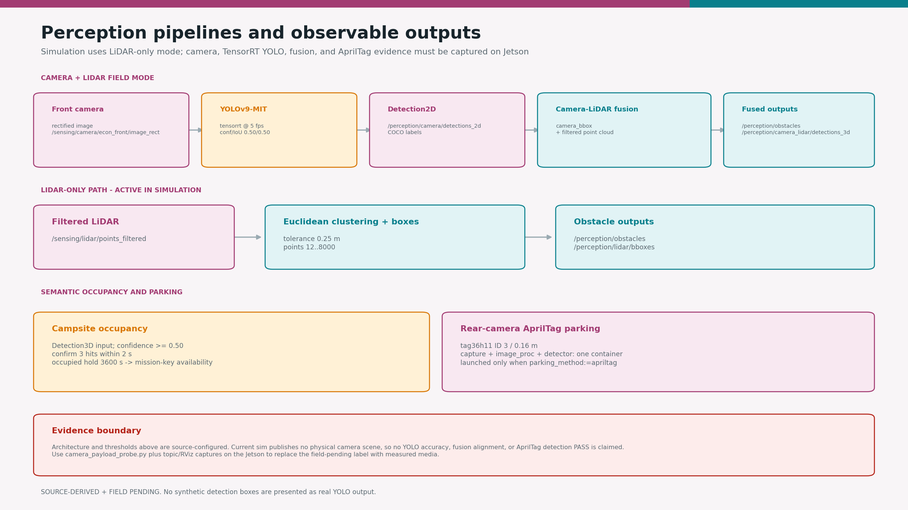

# camrod_perception

<!-- HH_260804 - Separate configured pipelines from measured evidence and
replace repeated architecture/troubleshooting prose with compact tables. -->

LiDAR obstacle clustering, front-camera TensorRT YOLO fusion, campsite
occupancy, and rear-camera AprilTag parking perception.



## At A Glance

| Pipeline | Uses | Main output |
|---|---|---|
| LiDAR obstacles | Filtered nonground cloud + Euclidean clustering | `/perception/lidar/bboxes`, `/perception/obstacles` |
| Camera-LiDAR fusion | Front image, CameraInfo, YOLO 2D boxes, LiDAR points | 3D detections, fused cloud, optional debug image |
| Campsite occupancy | Confirmed tent-class 3D detections + semantic site map | `/perception/camping_sites/occupancy` |
| Parking tag | Rear rectified image + CameraInfo + AprilTag | Tag pose/TF and debug image |

## Active Values

| Item | Value | Meaning |
|---|---:|---|
| LiDAR cluster tolerance | `0.25 m` | Neighbor distance for cluster growth |
| Cluster size | `12..8000 points` | Accepted cluster point count |
| LiDAR ROI | `x 0..5 m`, `y -3..3 m` | Local obstacle search region |
| YOLO backend | TensorRT device `0` | Jetson inference path |
| YOLO throttle | `5 fps` | CPU/GPU headroom target, not measured throughput |
| Confidence / IoU | `0.50 / 0.50` | Detection thresholds |
| Fusion mode | `camera_bbox` | Retains points associated with image detections |
| Occupancy confirmation | `3 hits / 2 s` | Tent observation required before occupied state |
| Occupied hold | `3600 s` | Keeps confirmed site unavailable for the field session |
| Parking tag | `tag36h11`, ID `3`, `0.16 m` | Rear docking target |

## Runtime Profiles

| Profile | Active path | Evidence status |
|---|---|---|
| Simulation | LiDAR-only clustering | Interface and obstacle publications can be tested |
| Field front camera + YOLO | TensorRT model lifetime path | 300-second field report passed transport/inference lifetime |
| Field fusion + occupancy | Camera-LiDAR alignment and semantic site mapping | Accuracy/alignment capture required |
| AprilTag parking | Rear camera + detector, only for `parking_method:=apriltag` | Physical tag alignment required |

The 2026-07-31 physical report measured 2,750 frames at `9.167 Hz`, decoded
`2750/2750`, observed detections at about `3.275 Hz`, and saw zero crash/restart
for 300 seconds. Its raw log remains external to the repository, and this does
not prove detection accuracy, fusion alignment, occupancy correctness, or
AprilTag parking.


## Nodes

| Node | Responsibility |
|---|---|
| `obstacle_lidar` | ROI filter, clustering, axis-aligned boxes, and obstacle cloud |
| `yolov9mit` | TensorRT inference and `Detection2DArray` output |
| `obstacle_fusion` | Projects LiDAR into the camera and creates fused 3D results |
| `campsite_occupancy` | Maps confirmed tent detections to campsite mission keys |
| `apriltag_parking_detector` | Detects and tracks the configured rear parking tag |

## Interfaces

| Direction | Topic | Type/purpose |
|---|---|---|
| Input | `/sensing/lidar/points_filtered` | Nonground point cloud |
| Input | `/sensing/camera/econ_front/image_rect/compressed` | Front camera transport |
| Input | `/sensing/camera/econ_front/camera_info` | Projection calibration |
| Output | `/perception/camera/detections_2d` | YOLO detections |
| Output | `/perception/camera_lidar/detections_3d` | Fused 3D detections |
| Output | `/perception/obstacles` | Obstacle point cloud |
| Output | `/perception/camping_sites/occupancy` | Site availability contract |

## Run And Validate

```bash
ros2 launch camrod_perception perception.launch.py
ros2 launch camrod_perception perception.launch.py enable_yolo:=false
ros2 launch camrod_perception apriltag_parking_detector.launch.py

ros2 topic hz /perception/lidar/bboxes
ros2 topic echo /perception/camera/detections_2d
ros2 topic echo /perception/camping_sites/occupancy
```

On the Jetson, capture physical payload and inference continuity before claiming
field performance:

```bash
ros2 run camrod_bringup camera_payload_probe.py --duration 300 --min-rate-hz 5
```

| Config | Purpose |
|---|---|
| `config/perception_params.yaml` | LiDAR, YOLO, fusion, and occupancy policy |
| `config/apriltag_parking_detector.yaml` | Rear tag family, ID, size, ROI, and outputs |
