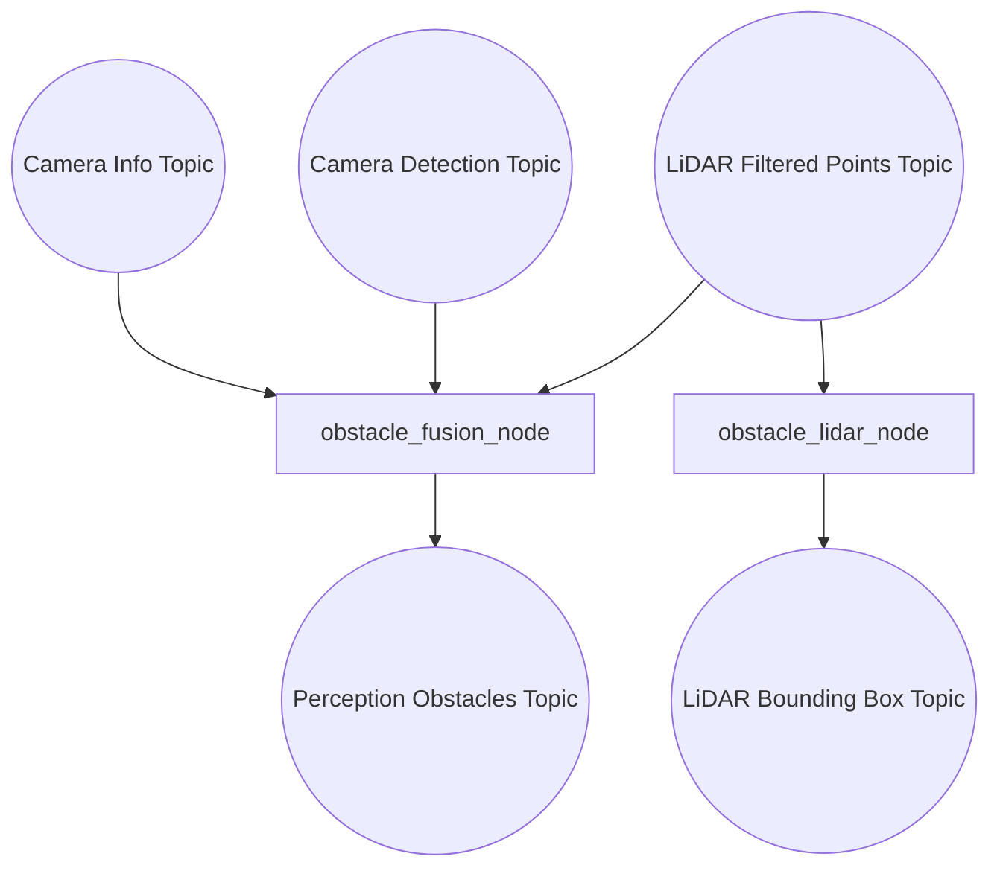
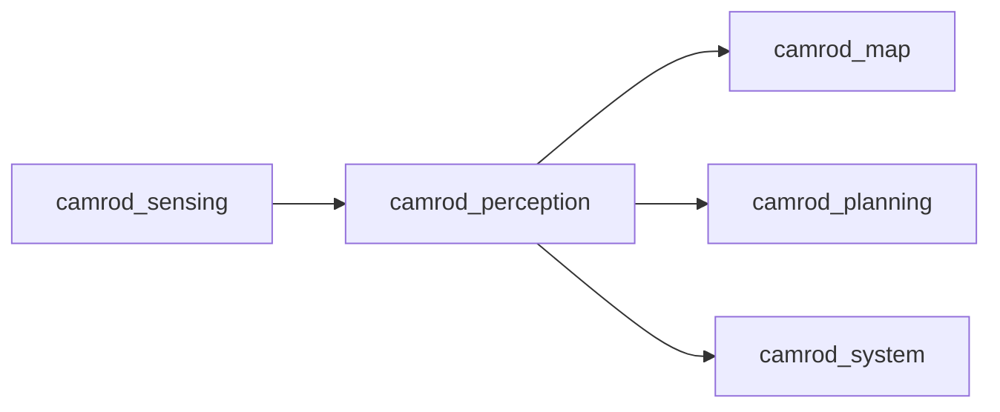

# camrod_perception

## Role
`camrod_perception` generates obstacle outputs from LiDAR-only and camera+LiDAR fused paths.

## Package Diagram


Diagram legend: `[node/process]`, `((topic stream))`, `[(config or interface)]`, `[[external package or launch]]`.

## Node Data Flow
| Node | Main Inputs | Main Outputs |
|---|---|---|
| `obstacle_fusion_node` | `/sensing/lidar/points_filtered`, `/perception/camera/detections_2d`, `/sensing/camera/processed/camera_info`, TF (`camera_link`) | `/perception/obstacles` |
| `obstacle_lidar_node` | LiDAR cloud (`input_topic` from params; default `/sensing/lidar/points`) | `/perception/lidar/bboxes` |

## Inter-Package Connections


## Topic Summary
### Input Topics
| Input Topic | Purpose |
|---|---|
| `/sensing/lidar/points_filtered` | Base obstacle cloud input |
| `/perception/camera/detections_2d` | 2D detection gates for fusion |
| `/sensing/camera/processed/camera_info` | Camera model for projection |

### Output Topics
| Output Topic | Purpose |
|---|---|
| `/perception/obstacles` | Fused obstacle cloud |
| `/perception/lidar/bboxes` | LiDAR cluster boxes |

## Practical Usage
```bash
ros2 launch camrod_perception perception.launch.py
```

Optional:
```bash
ros2 launch camrod_perception perception.launch.py enable_lidar_obstacle:=false
```

## Config Files
- `config/perception_params.yaml`
