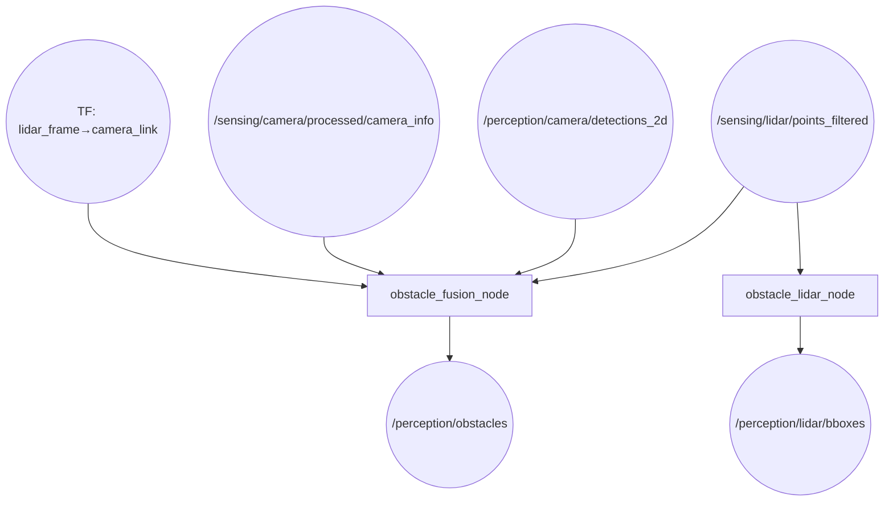
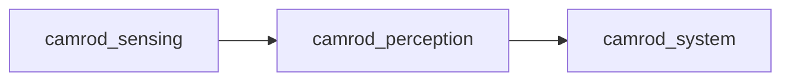

# camrod_perception

## Role
LiDAR-based obstacle detection with optional camera fusion. `obstacle_fusion_node` projects LiDAR points into the camera image and retains only points falling inside 2D detection bounding boxes (YOLO-style). `obstacle_lidar_node` independently clusters the same filtered LiDAR cloud and publishes axis-aligned bounding boxes for RViz visualization.

## Package Diagram


Diagram legend: `[node]`, `((topic))`.

## Node Data Flow

| Node | Inputs | Outputs | Key Params |
|---|---|---|---|
| `obstacle_fusion_node` | `/sensing/lidar/points_filtered`, `/perception/camera/detections_2d`, `/sensing/camera/processed/camera_info`, TF | `/perception/obstacles` | use_camera_filter: true, keep_lidar_when_no_detections: true, camera_frame: camera_link |
| `obstacle_lidar_node` | `/sensing/lidar/points_filtered` | `/perception/lidar/bboxes` | cluster_tolerance: 0.25 m, min_cluster_size: 12, max_cluster_size: 8000, ROI: x 0–5 m, y ±3 m |

### obstacle_fusion_node Algorithm

1. Receives LiDAR point cloud and camera detections
2. Looks up TF from LiDAR frame to `camera_link`
3. Projects each LiDAR point into image coordinates using camera intrinsics
4. Retains points whose projections fall inside any detection bounding box
5. Publishes filtered point cloud as `/perception/obstacles`
6. If `keep_lidar_when_no_detections=true` and no detections are active, passes full cloud through

### obstacle_lidar_node Algorithm

1. Applies axis-aligned ROI filter (x: 0–5 m, y: ±3 m, z: ±3 m configurable)
2. Builds KD-tree over filtered points
3. Runs Euclidean cluster extraction (PCL)
4. Computes AABB for each cluster
5. Publishes CUBE + TEXT markers per cluster (id, point count, distance)

## Inter-Package Connections


## Topic Summary

### Inputs (from other packages)
| Topic | Type | Source |
|---|---|---|
| `/sensing/lidar/points_filtered` | PointCloud2 | camrod_sensing (lidar_preprocessor_node) |
| `/sensing/camera/processed/camera_info` | CameraInfo | camrod_sensing (camera_preprocessor_node) |
| `/perception/camera/detections_2d` | Detection2DArray | external camera detection (e.g., YOLO) |

### Outputs (consumed by other packages)
| Topic | Type | Consumers |
|---|---|---|
| `/perception/obstacles` | PointCloud2 | camrod_system (perception_obstacle_checker) |
| `/perception/lidar/bboxes` | MarkerArray | RViz visualization |

## Launch

```bash
# Full perception stack
ros2 launch camrod_perception perception.launch.py

# LiDAR clustering only (no fusion)
ros2 launch camrod_perception perception.launch.py \
  enable_lidar_obstacle:=true

# Disable LiDAR clustering
ros2 launch camrod_perception perception.launch.py \
  enable_lidar_obstacle:=false
```

Key launch arguments:

| Argument | Default | Description |
|---|---|---|
| `enable_lidar_obstacle` | `true` | Enable obstacle_lidar_node |
| `module_namespace` | `perception` | ROS2 node namespace |
| `perception_param_file` | `config/perception_params.yaml` | Parameter file |

## Config Files

| File | Purpose |
|---|---|
| `config/perception_params.yaml` | Both nodes: input/output topics, clustering params (cluster_tolerance, min/max size), ROI bounds, camera TF frame, filter flags |
