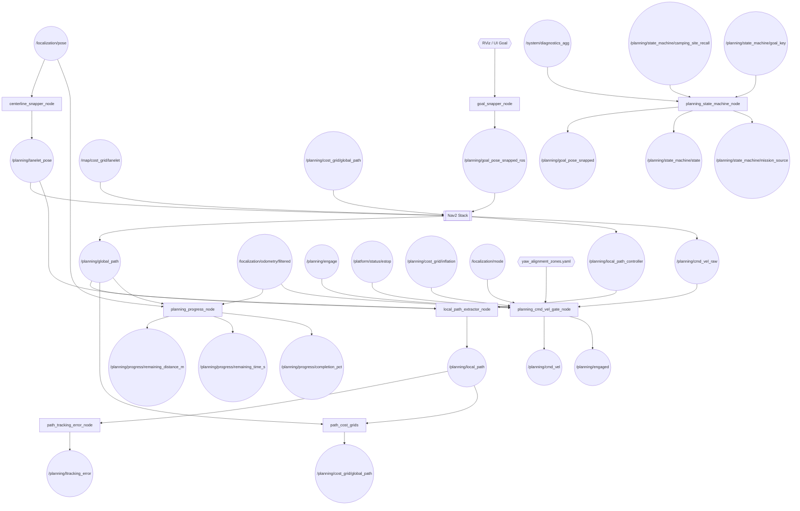
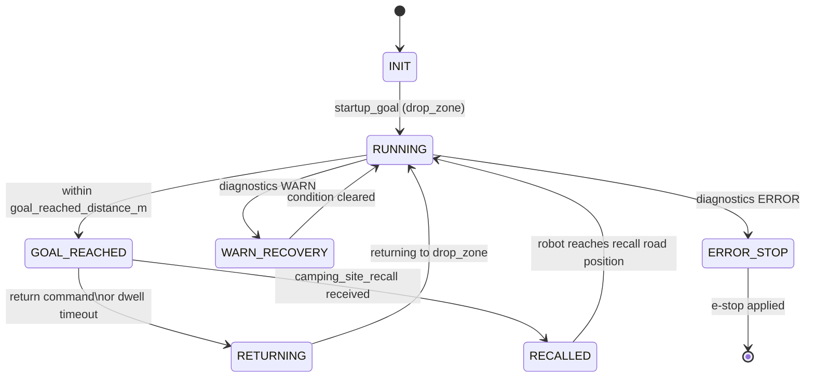
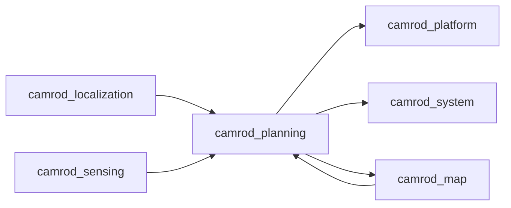

# camrod_planning

## Role
Nav2-based autonomous path planning and velocity control. Snaps RViz goals to Lanelet2 centerlines, runs the Nav2 planner/controller stack, extracts a robot-centred local path, and gates the final velocity command behind an explicit engage signal, e-stop, cost-grid obstacle check, and GNSS recovery hold. Optionally manages mission goals through a state machine with named keypoints and a camping-site recall scenario.

## Package Diagram


Diagram legend: `[node]`, `((topic))`, `[[external stack]]`, `{{source}}`.

## Node Data Flow

| Node | Inputs | Outputs | Key Params |
|---|---|---|---|
| `goal_snapper_node` | `/goal_pose` (RViz / UI), Lanelet2 map | `/planning/goal_pose_snapped_ros` | max_search_radius: 120 m, require_lanelet_containment, fallback_uncontained |
| `centerline_snapper_node` | `/localization/pose` | `/planning/lanelet_pose` | max_search_radius: 120 m, lateral_stddev: 0.3, min_update_period_s: 0.05 |
| `local_path_extractor_node` | `/planning/global_path`, `/planning/lanelet_pose`, `/planning/local_path_controller` | `/planning/local_path` | local_path_source: controller_then_slice, lookahead: 30 m, lookbehind: 3 m, publish_rate_hz: 15 |
| `path_tracking_error_node` | `/planning/local_path`, `/planning/global_path`, `/planning/lanelet_pose` | `/planning/ltracking_error` | prefer_local_path: true, publish_rate_hz: 15, pose_timeout_s: 1.0 |
| `goal_replanner_node` | `/planning/goal_pose`, `/planning/lanelet_pose`, Nav2 action | replanning triggers | min_request_interval_s, retry_after_failure_s, navigate_inactive_grace_s |
| `planning_progress_node` | `/planning/global_path`, `/localization/pose`, `/localization/odometry/filtered` | `/planning/progress/remaining_distance_m`, `/planning/progress/remaining_time_s`, `/planning/progress/completion_pct` | publish_rate_hz: 2.0, speed_ema_alpha: 0.2, speed_floor_mps: 0.1 |
| `planning_cmd_vel_gate_node` | `/planning/cmd_vel_raw`, `/planning/engage`, `/platform/status/estop`, `/planning/cost_grid/inflation`, `/localization/mode`, `/localization/fallback/odometry` | `/planning/cmd_vel`, `/planning/engaged` | see Cost-Stop, GNSS Recovery Hold, and Yaw Alignment Zone sections below |
| `planning_state_machine_node` | `/system/diagnostics_agg`, `/planning/lanelet_pose`, `/planning/state_machine/camping_site_recall`, `/planning/state_machine/goal_key` | `/planning/goal_pose_snapped`, `/planning/state_machine/state`, `/planning/state_machine/mission_source` | keypoints_yaml, camping_sites_yaml, startup_goal_key, goal_reached_dwell_s, enable_auto_return_on_site_goal |
| Nav2 `planner_server` | `/planning/goal_pose_snapped_ros`, costmaps | `/planning/global_path` | SmacPlanner |
| Nav2 `controller_server` | `/planning/global_path`, costmaps | `/planning/cmd_vel_raw`, `/planning/local_path_controller` | RegulatedPurePursuit, xy_goal_tolerance: 0.15 m |

### planning_progress_node

Finds the closest point on the current global path to the robot pose, then sums segment lengths from that index to the goal to compute remaining path distance. Speed is tracked with an EMA (α=0.2) with a floor of 0.1 m/s so that time estimates remain finite even when the robot is stationary.

| Topic | Type | Description |
|---|---|---|
| `/planning/progress/remaining_distance_m` | Float32 | Path length from robot's closest point to goal [m] |
| `/planning/progress/remaining_time_s` | Float32 | Estimated travel time at current EMA speed [s] |
| `/planning/progress/completion_pct` | Float32 | Fraction of total path already traversed [0–100 %] |

### cmd_vel_gate: Cost-Stop Zones

| Zone | Cost Threshold | Lookahead | Corridor Width |
|---|---|---|---|
| Front (speed-dependent) | 85 | v²/(2μg) + t_react·v + margin, clamped [0.4, 3.0] m | 1.0 m |
| Side (left + right) | 85 | 1.2 m (fixed) | 0.6 m |
| Rear | 85 | 0.8 m (fixed) | 0.9 m |
| Unavoidable cluster | 90 (lethal floor) | front corridor only | ≥ 25 cells covering ≥ 25 % of corridor |

Front lookahead physics: μ = 0.4 (wet-road friction), t_react = 0.15 s, margin = 0.3 m.

The corridor scan uses integer-counted steps (`ix * resolution`) and `round()` for grid-cell index
calculation to avoid floating-point accumulation that would otherwise cause systematic cell misses
in the BFS cluster check.

### cmd_vel_gate: GNSS Recovery Hold

When `/localization/mode` transitions from `DR_ONLY (2)` → `NORMAL (0)`, the gate blocks
`/planning/cmd_vel` for `gnss_recovery_hold_s` (default 2.0 s) to let Nav2 and the costmap
settle on the recovered pose before resuming motion.

| Parameter | Default | Description |
|---|---|---|
| `enable_gnss_recovery_hold` | `true` | Enable the hold mechanism |
| `gnss_recovery_hold_s` | `2.0 s` | Block duration after DR_ONLY → NORMAL |
| `gnss_recovery_source_mode_min` | `2` (DR_ONLY) | Minimum previous mode to trigger hold |
| `gnss_recovery_target_mode` | `0` (NORMAL) | Target mode that triggers hold |

### cmd_vel_gate: Yaw Alignment Zone

When approaching a named map zone (e.g. a gateway or narrow passage), the robot must align its
heading to the configured target yaw before full `cmd_vel` passthrough resumes. The feature is
**disabled by default** — it activates only when `enable_yaw_alignment_zone: true` and
`yaw_alignment_zones_file` points to a valid YAML.

**Gate pipeline order:** `e-stop → cost-stop → effective_enabled → yaw alignment → passthrough`

**3-layer safety system:**

| Layer | Radius | Behavior |
|---|---|---|
| Layer 1: Activation ring | `activation_radius_m` (default **1.2 m**) | Zone tracking begins; cmd_vel unchanged |
| Layer 2: Lock ring | `lock_radius_m` (default **0.72 m** = 60% of activation) | Nav2 cmd_vel overridden with alignment command |
| Layer 3: Adaptive tolerance | `yaw_tolerance_deg + yaw_tolerance_per_meter_deg × pos_error_m` | Tolerance widens farther from zone center |

While inside the lock ring the node injects an override `Twist`:

- **`angular.z`** — `kp × gain_scale × yaw_error_rad`, clamped to ±`max_angular_z`
  - `gain_scale = 1.0 + min(1.0, pos_error_m)` — higher gain when farther from center
- **`linear.x`** — suppressed by `yaw_scale = max(0, 1 − yaw_error_deg / (yaw_tolerance_deg × 2.5))`;
  zeroed completely once within `position_tolerance_m` (0.10 m) of zone center
- **Unlock** — robot must hold `yaw_ok AND pos_ok` for `hold_s` (default 0.5 s);
  full passthrough resumes until robot exits `activation_radius + exit_margin_m` (1.2 + 0.3 = **1.5 m**)

**Node parameters (set at launch):**

| Parameter | Default | Description |
|---|---|---|
| `enable_yaw_alignment_zone` | `false` | Enable the feature globally |
| `yaw_alignment_zones_file` | `""` | Path to manual zone YAML |
| `yaw_alignment_frame_id` | `"map"` | TF frame for zone coordinates |
| `yaw_alignment_exit_margin_m` | `0.3 m` | Hysteresis beyond activation ring |

**Per-zone parameters (YAML defaults when using manual zone file):**

| Parameter | Default | Description |
|---|---|---|
| `activation_radius_m` | `1.2 m` | Zone detection radius |
| `lock_radius_m` | `0.72 m` | Enforcement inner radius |
| `position_tolerance_m` | `0.10 m` | "At center" threshold (linear.x = 0) |
| `yaw_tolerance_deg` | `8.0°` | Base yaw tolerance at zone center |
| `yaw_tolerance_per_meter_deg` | `4.0°/m` | Adaptive tolerance per meter from center |
| `hold_s` | `0.5 s` | Alignment hold duration before unlock |
| `angular_kp` | `1.8` | P-gain for yaw correction |
| `max_angular_z` | `0.8 rad/s` | Angular velocity cap |
| `max_approach_linear_x` | `0.25 m/s` | Forward speed cap during alignment |

**Manual zone YAML format** (supports `yaw_deg` or `next_x/next_y` tangent-style):

```yaml
yaw_alignment_zones:
  frame_id: "map"
  zones:
    - id: "gate_entrance"
      x: 10.5
      y: -3.2
      yaw_deg: -90.0          # or: next_x/next_y to derive yaw from path tangent
      activation_radius_m: 1.2
      lock_radius_m: 0.20
      position_tolerance_m: 0.10
      yaw_tolerance_deg: 8.0
      yaw_tolerance_per_meter_deg: 4.0
      hold_s: 0.5
      angular_kp: 1.8
      max_angular_z: 0.8
      max_approach_linear_x: 0.25
```

### State Machine: Mission States



### State Machine: Camping Site Recall and Road Snap

`camping_sites.yaml` supports an optional `recall_x/y/z/yaw_deg` entry per site. When present,
`_merge_camping_sites` registers a second keypoint `"camping_site_N_road"` pointing to the nearest
drivable lanelet centerline position. On recall, the state machine navigates to the road position
instead of the area centroid, since the camping area may be blocked by cargo.

Sites that are physically inaccessible (e.g. `camping_site_13`) use the road snap of the nearest
accessible site as their primary `x/y` coordinates. Both normal navigation and recall for such
sites use the same road position.

```yaml
# camping_sites.yaml example
camping_sites:
  - id: "dz_area_1233"
    type: "camping_site_12"
    source: "area"
    x: 18.4901          # area centroid — used for drop_zone→site navigation
    y: -24.5589
    z: -298.913
    yaw_deg: -69.3089
    recall_x: 22.8171   # nearest lanelet road snap — used when robot is recalled from site
    recall_y: -23.7892
    recall_z: -299.2243
    recall_yaw_deg: -79.9136
```

### State Machine: Mission Source Topic

`/planning/state_machine/mission_source` (String) is published whenever the state machine sends a
new goal. It identifies why the goal was sent, which lets external nodes (e.g. UI, logging) trace
the current mission context:

| Value | Trigger |
|---|---|
| `"startup"` | Initial goal at boot (startup_goal_key) |
| `"return_request"` | Operator pressed return button |
| `"recall:camping_site_N"` | Camping site requested recall |
| `"auto_return"` | Dwell timeout expired at camping site |
| `"key_topic:camping_site_N"` | Goal key received on goal_key_topic |

### State Machine: Full Camping-Site Recall Scenario

1. Robot starts at `drop_zone` (startup_goal).
2. Operator selects `camping_site_3` via UI → robot navigates to area centroid.
3. Robot arrives; waits `goal_reached_dwell_s` (default 600 s for bringup) or until return button.
4. **Recall path**: `camping_site_3` node publishes to `/planning/state_machine/camping_site_recall`.
   - State transitions `GOAL_REACHED → RECALLED`.
   - If `camping_site_3_road` keypoint exists (from `recall_x/y` in YAML), robot navigates there.
   - Otherwise falls back to area centroid (`camping_site_3`).
5. Robot arrives at road snap position; waits `goal_reached_dwell_s` for cargo loading.
6. `enable_auto_return_on_site_goal: true` → auto-returns to `drop_zone` (`source: auto_return`).

### Nav2 Costmap Layers

| Layer | Source Topic | Costmap |
|---|---|---|
| `combined_cost_layer` | `/planning/cost_grid/inflation` | local |
| `combined_cost_layer` | `/map/cost_grid/lanelet` + `/planning/cost_grid/global_path` | global |

## Inter-Package Connections


## Topic Summary

### Inputs (from other packages)
| Topic | Type | Source |
|---|---|---|
| `/localization/pose` | PoseStamped | camrod_localization |
| `/localization/pose_with_covariance` | PoseWithCovarianceStamped | camrod_localization |
| `/localization/fallback/odometry` | Odometry | camrod_localization |
| `/localization/odometry/filtered` | Odometry | camrod_localization |
| `/localization/mode` | AvgLocalizationMode | camrod_localization |
| `/map/cost_grid/lanelet` | OccupancyGrid | camrod_map |
| `/planning/cost_grid/inflation` | OccupancyGrid | camrod_sensing (inflation_cost_grid_node) |
| `/platform/status/estop` | Bool | camrod_platform (ranger driver) |
| `/system/diagnostics_agg` | DiagnosticArray | camrod_system (aggregator) |

### Outputs (consumed by other packages)
| Topic | Type | Consumers |
|---|---|---|
| `/planning/cmd_vel` | Twist | camrod_platform |
| `/planning/engaged` | Bool | camrod_system, camrod_platform |
| `/planning/global_path` | Path | camrod_map (lanelet_cost_grid), camrod_sensing (inflation_cost_grid_node) |
| `/planning/local_path` | Path | camrod_system (diagnostic), RViz |
| `/planning/cost_grid/global_path` | OccupancyGrid | camrod_map, camrod_sensing, Nav2 |
| `/planning/ltracking_error` | AvgTrackingError | camrod_system (diagnostic) |
| `/planning/state_machine/state` | String | camrod_system, UI |
| `/planning/state_machine/mission_source` | String | logging, UI context |
| `/planning/progress/remaining_distance_m` | Float32 | UI, logging |
| `/planning/progress/remaining_time_s` | Float32 | UI, logging |
| `/planning/progress/completion_pct` | Float32 | UI, logging |

## Launch

```bash
# Full planning stack (Nav2 + cmd_vel_gate + lanelet tools)
ros2 launch camrod_planning planning.launch.py \
  map_path:=/path/to/map.osm

# Enable mission state machine
ros2 launch camrod_planning planning.launch.py \
  enable_state_machine:=true

# Enable path progress publisher
ros2 launch camrod_planning planning.launch.py \
  enable_progress:=true

# Request a goal by keypoint name
ros2 topic pub /planning/state_machine/goal_key std_msgs/msg/String \
  "{data: camping_site_3}" -1

# Trigger camping-site recall (robot navigates to road snap position)
ros2 topic pub /planning/state_machine/camping_site_recall std_msgs/msg/String \
  "{data: camping_site_3}" -1
```

Key launch arguments:

| Argument | Default | Description |
|---|---|---|
| `map_path` | (from map_info.yaml) | Lanelet2 .osm file |
| `enable_path_cost_grids` | `true` | Global/local path cost grids |
| `enable_goal_replanner` | `false` | Automatic goal replanning |
| `enable_state_machine` | `false` | Mission state machine |
| `enable_tracking_error` | `true` | Path tracking error publisher |
| `enable_progress` | `true` | Remaining distance/time/completion publisher |
| `enable_nav2_lifecycle_retry` | `false` | Nav2 lifecycle startup retry |
| `require_localization_ready` | `false` | Wait for initial_match_ok before Nav2 start |
| `cmd_vel_gate_enable` | `true` | Velocity gate node |
| `cmd_vel_gate_cost_stop_enable` | `true` | Cost-based obstacle stop |
| `cmd_vel_gate_speed_dependent_lookahead` | `true` | Physics-based braking distance |
| `local_path_source` | `controller_then_slice` | Local path: controller output or global slice |

## Config Files

| File | Purpose |
|---|---|
| `config/nav2_base.yaml` | Nav2 planner (SmacPlanner), controller (RegulatedPurePursuit), costmap base config; xy_goal_tolerance: 0.15 m |
| `config/nav2_vehicle.yaml` | Robot footprint, max velocity/acceleration, turning constraints; approach_velocity_scaling_dist: 1.0 m |
| `config/nav2_lanelet_overlay.yaml` | Lanelet-specific cost weights and regulatory element handling |
| `config/nav2_behavior.yaml` | Recovery behaviors, BT timeouts, transform tolerance |
| `config/goal_snapper.yaml` | Goal snap search radius, containment check, Z handling |
| `config/centerline_snapper.yaml` | Pose projection covariance, update throttle period |
| `config/local_path_extractor.yaml` | Lookahead/lookbehind distances, jump guard (3 m), publish rate 15 Hz |
| `config/path_cost_grids.yaml` | Global/local path grid geometry, cost weights, rebuild triggers |
| `config/goal_replanner.yaml` | Replan intervals, timeout, failure retry backoff |
| `config/planning_state_machine.yaml` | State machine topics, startup/warn goal keys, dwell time, recall config |
| `config/planning_state_machine_keypoints.yaml` | Named keypoint coordinates (drop_zone, etc.) |
| `config/camping_sites.yaml` | Named camping-site goal positions; `recall_x/y/z/yaw_deg` for road snap on recall |
| `config/bt/*.xml` | Nav2 behavior tree XML files for navigate_to_pose |

## Tests

```bash
# Standalone gate logic unit test (no ROS2 needed, 29 assertions)
python3 camrod_planning/test/test_cmd_vel_gate_logic.py
```

Covers: front/side/rear cost-stop, unavoidable cluster, GNSS recovery hold trigger and expiry,
e-stop, engage gate, cost-stop hold, speed-dependent lookahead calculation.

Yaw alignment zone integration tests are not yet included in the standalone suite; the feature
requires a live ROS2 node with TF and pose topics for end-to-end validation.
