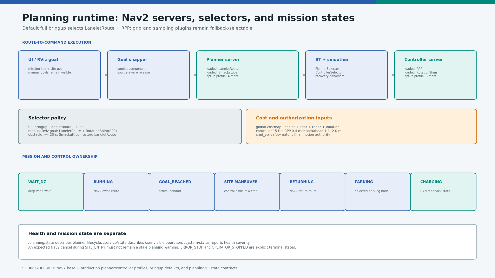
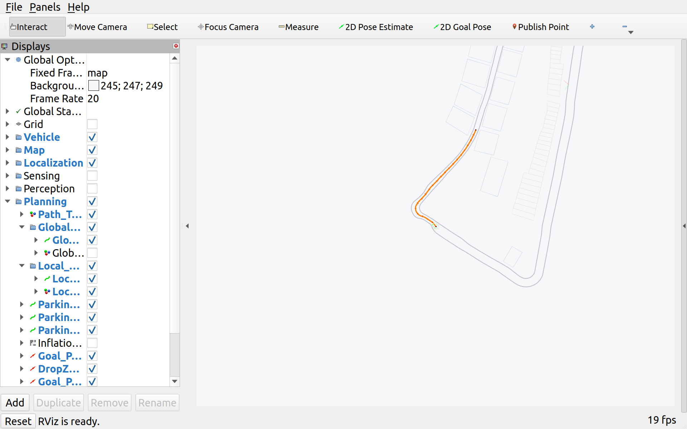
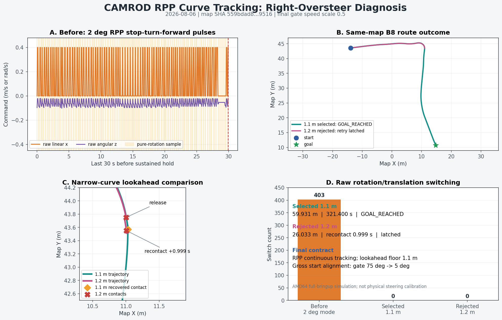
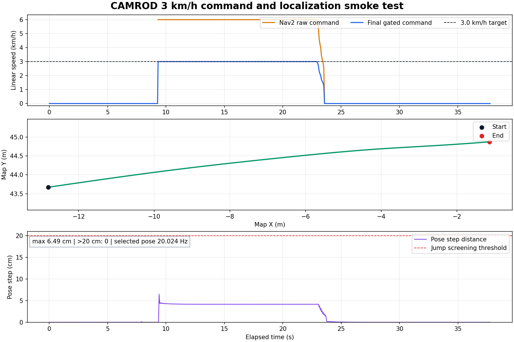
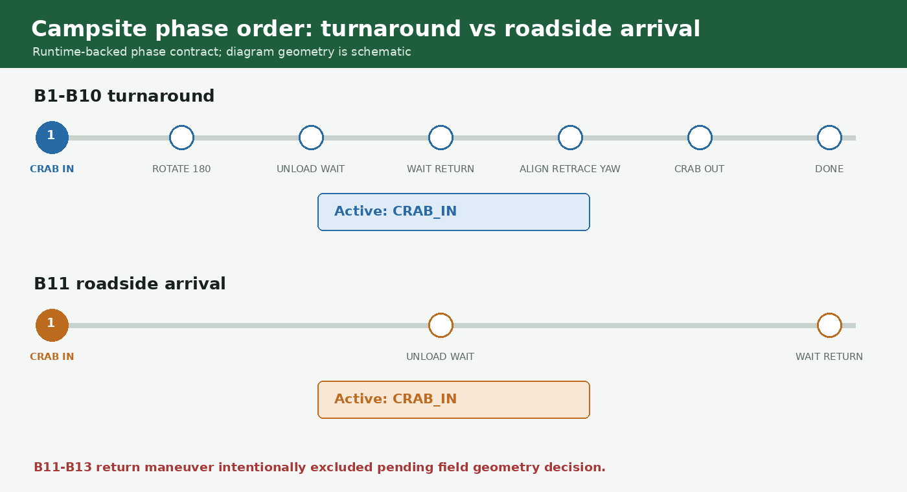

# camrod_planning

<!-- HH_260805 - Record the scoped Nav2 planner/controller production topology
and retain standalone field-isolation fallbacks. -->
<!-- HH_260806 - Synchronize the fabrication-inclusive planning polygon and
the B1-B10 turnaround / B11-B13 roadside service policy. -->
<!-- HH_260806 - Separate gross start alignment from continuous RPP curve tracking. -->
<!-- HH_260806 - Scale the active linear-speed profile from a 3 km/h cruise reference. -->
<!-- HH_260807 - Preflight persistent-obstacle paths before Nav2 mission preemption. -->
<!-- HH_260807 - Fix the 3 km/h RPP preview at the selected 1.1 m A/B result. -->
<!-- HH_260807 - Reduce the active cruise to 2 km/h without changing controller geometry. -->

Nav2 lifecycle servers, Lanelet routing, goal snapping, local paths, fallback
planners/controllers, and semantic mission state.



## Actual Simulation Runtime



`SIM RUNTIME CAPTURE`: historical 2026-08-04 B6 goal, LaneletRoute global path,
local path, and robot pose. Historical map-v16 campsite sequencing and current
map-v17 continuous-service evidence are shown separately below.

## At A Glance

| Uses | Function | Main outputs |
|---|---|---|
| Nav2 planner/controller/BT/smoother servers | Plans and follows map-constrained routes | `/planning/global_path`, `/control/nav2_cmd_vel_ros` |
| Lanelet2 route graph and goal snapper | Converts UI/RViz goals to reachable lanelet routes | Route lanelet IDs and snapped goals |
| Planning state machine | Coordinates Nav2, local maneuvers, return, and parking | `/planning/state`, `/service/state` handoffs |

## Active Selection

| Item | Value |
|---|---|
| Full-bringup planner | `LaneletRoute` |
| Full-bringup controller | `RPP` |
| Production planner plugins loaded | `LaneletRoute`, `SmacLattice` |
| Implemented but dormant planners | `Smac2D`, `NavFn`, `ThetaStar`, `SmacHybrid` |
| Production controller plugins loaded | `RPP`, `RotationShim` |
| Implemented but dormant controllers | `DWB`, `MPPI`, `Graceful` |
| Controller frequency | `20 Hz` |
| Local-path / tracking heartbeat | `20 Hz`; pose callbacks also refresh immediately |
| RPP desired speed | raw `1.111111 m/s`; final gate `0.5`; platform `2.000 km/h` |
| RPP curve / final-approach floor | `50% / 25%` of cruise (`1.000 / 0.500 km/h`) |
| UI mission RPP lookahead | fixed `1.1 m`; velocity scaling disabled |
| Manual RotationShim child lookahead | fixed `2.0 m`; longer field anti-oscillation preview |
| RPP reverse / rotate-to-heading | disabled / disabled during continuous tracking |
| Gross start alignment | final gate `75 deg` enter / `5 deg` release; zero linear speed |
| Physical body boundary | `1.39160 x 1.07000 m` extents; `0.12 m` tapered front, `R0.05 m` corners |
| Nav2 planning footprint | `1.59160 x 1.27000 m` extents; exact `0.10 m` contour offset, `R0.15 m` corners |
| Obstacle fallback | Width gate, then `ComputePathToPose(SmacLattice)`; preempt only when a safe path exists |

Normal missions construct only policy-reachable planner/controller instances.
Definitions for every implementation remain in `nav2_base.yaml`; the
development-only `nav2_{planner,controller}_profiles/all.yaml` files load every
option when comparison work is needed.


<!-- HH_260810 - Link the generated contour only after its six-decimal points
match both local and global Nav2 footprints. -->
This [source-derived record](../docs/assets/test_result/tapered-rounded-boundary-20260810/README.md)
shows the exact 30-point local/global costmap polygon. The motion is a rigid
transform explanation, not proof that a route or recovery candidate is clear.


<!-- HH_260810 - Document one current-map Nav2 route with measured ROS poses,
while leaving physical road clearance as field-pending. -->
The [road-simulation record](../docs/assets/test_result/tapered-rounded-boundary-road-sim-20260810/README.md)
shows lanelets `2751 -> 2720 -> 2744 -> 2690`. A planning-only contact paused
the route, bounded reverse-yaw created clearance, and the same retained route
reached its goal without a second hold.

## Nav2 Process Boundary

`use_nav2_container:=true` is the production default. The vendored planner and
controller share `scoped_component_container_mt`; smoother, behavior, BT
navigator, and lifecycle manager remain standalone because their Humble vendor
binaries own private default-context executors. Transient-local Nav2 publishers
use DDS rather than unsupported Humble intra-process transport.

The scoped path reached all managed nodes active, used `robot_center_link`,
reached `[SYSTEM] OK`, and cleanly stopped the Nav2 plus five system containers
in 3/3 final amd64 runs. `use_nav2_container:=false` remains the field-isolation
fallback. Jetson still requires ten mission/cancel/restart cycles and resource
measurement; amd64 lifecycle success is not a physical navigation claim.

## Route Flow

```text
UI mission key + site goal
  -> goal snapper
  -> LaneletRoute planner
  -> BT/smoother/controller selectors
  -> RPP
  -> /control/nav2_cmd_vel_ros
  -> camrod_control safety gate
```

| Cost source | Role |
|---|---|
| `/map/cost_grid/lanelet` | Lane-centered global planning base |
| `/sensing/cost_grid/lidar` | Dynamic LiDAR obstacles |
| `/sensing/cost_grid/radar` | Near-field radar obstacles |
| `/planning/cost_grid/inflation` | Merged planning/safety cost |

## Dynamic Obstacle Replanning

| Requirement | Active value |
|---|---:|
| Dynamic blockage persistence before replan | `>= 20.0 s` |
| Lanelet grid freshness | `<= 2.5 s` |
| Contiguous lane width | `>= 2.50 m` |
| Clearance from path reference | `>= 0.60 m` on each side |
| Fallback / restore | `SmacLattice / LaneletRoute` |

LiDAR/radar blockage still reports status and reaches the control safety gate
immediately on every lane. After 20 seconds, fresh geometry and width checks
must pass before `ComputePathToPose` probes SmacLattice. The active
LaneletRoute mission is replaced only when that probe returns at least two path
poses. Missing/stale/narrow geometry publishes `BLOCKED_REPLAN_DENIED`; a valid
width with no feasible footprint path publishes `BLOCKED_REPLAN_FAILED_HOLD`
once and keeps the original mission. Removing the obstacle clears the latch so
the original route resumes. The width test is eligibility only; footprint,
inflation, lanelet cost, and the final gate remain authoritative.

## State Surfaces

| Surface | Meaning | Example |
|---|---|---|
| `/planning/state` | Planner lifecycle | running, goal reached, recovery, error |
| `/service/state` | User-visible operation | moving to site, entering, waiting, returning, charging |
| gate status | Final motion authorization | enabled, route safety hold, battery stop |
| `/system/status` | Health only | OK, WARN, ERROR |

An expected Nav2 cancel during `SITE_ENTRY` is a handoff to
`camrod_control`, not a persistent health warning. A planning abort while
`MOVING_TO_SITE` remains a real warning/error condition. Operator cancel ends
in explicit `OPERATOR_STOPPED` state.

## Ownership Handoffs

| Phase | Motion owner |
|---|---|
| Drop-zone wait | none |
| Route to campsite | Nav2/RPP |
| B1-B10 site entry, zero-turn, unload wait, site exit | campsite maneuver controller |
| B11-B13 roadside arrival and wait | campsite maneuver controller; return geometry field-pending |
| Return route | Nav2/RPP |
| Drop-zone alignment and station exit | drop-zone maneuver controller |
| Final parking | selected reverse or AprilTag controller |
| Boundary contact recovery | bounded recovery controller after gate proof |

## Current Evidence

| Check | Result |
|---|---|
| Current tapered/rounded map-v17 road run | 511 ROS poses in `29.700 s`; planning-only contact, `REVERSE_YAW_RIGHT`, hold release, same-route completion; field pending |
| Nav2 server/plugin topology | Source-derived and test-covered |
| RPP center-frame route A/B | Common segment cross-track RMS improved `0.0588 -> 0.0549 m` |
| Oscillation in compared run | `0` yaw-step sign reversals in both A/B runs |
| Historical map-v14 B6 route | Stops at boundary near `(4.3688, 45.0583)` and latches after one rapid retry |
| Active map-v17 source | Synchronized SHA `8cd05c...5e021`; 55 lanelets/14 areas/1652 nodes; LaneletRoute contracts pass |
| Persistent centered obstacle at mapped 3.00 m road | Immediate stop; one Smac no-path preflight; no selector/ABORT loop; original mission resumed `0.242 m` after clear |
| Continuous service route ownership | B1/B2/B3 completed site, explicit RETURN, drop-zone, parking, charge, and next departure without bringup restart |
| Reduced-boundary route evidence | Historical `1.29160 x 0.87000 m` run: `10.0403 m`, goal error `0.2932 m`, bounded margin recovery, physical hard stop |
| B1-B10 site maneuver round trip | `CRAB_IN -> ROTATE_180 -> ... -> CRAB_OUT -> DONE`; all 10/10 PASS |
| B11-B13 roadside arrival | `CRAB_IN -> UNLOAD_WAIT -> WAIT_RETURN`; all PASS with no zero-turn and no RETURN command |
| B11-B13 return | Physical-body lanelet stop observed during the prior on-lane alignment; field geometry decision pending |
| B8 continuous RPP route | `59.931 m`, `GOAL_REACHED`; raw rotation/translation switches `403 -> 0` |
| Rejected B8 `1.2 m` lookahead | Margin release followed by recontact in `0.999 s`; route not completed |
| 3 km/h preview A/B | Velocity-scaled preview reached about `1.5 m` and recontacted in `0.850 s`; fixed `1.1 m` completed B1/B2 service `2/2` with no restart |
| B1-B10 service endurance | `10/10` in `2210.611 s`; restart `0`; cycles 2-10 completed full charger departure and outbound route |
| 3 km/h command smoke | AMD64 `11.74 m` displacement; final command `3.000001 km/h`; pose max step `6.485 cm`, jumps over `20 cm`: `0` |

The A/B run supports the current `1.1 m` RPP lookahead and center-frame choice
for the compared route. It does not prove every lane width or physical vehicle
behavior.



The [curve-tracking test record](../docs/assets/test_result/rpp-curve-tracking-20260806/README.md)
shows why the former 2-degree RPP rotate mode appeared as right oversteer and
stop-turn-forward motion. Gross initial yaw is now completed once by the gate;
ordinary curves retain simultaneous linear and angular commands. A same-map
`1.2 m` lookahead comparison was worse, so the selected floor remains `1.1 m`.


The [service A/B record](../docs/assets/test_result/rpp-lookahead-service-ab-20260807/README.md)
tested the then-active `3.0 km/h` profile rather than only a controller unit path.
The rejected velocity-scaled run recreated the same margin contact `0.850 s`
after release. The fixed `1.1 m` source profile completed B1 and B2 through
explicit RETURN, drop-zone parking, charging, and next departure. This is an
AMD64 deterministic-simulation selection, not a physical-road claim.


The [ten-cycle report](../docs/assets/test_result/b1-b10-service-endurance-20260807/README.md)
records nine full charger-departure routes after the seeded B1 handoff, ten
explicit RETURN paths, and zero post-start planning/path fault. The B5 obstacle
case proves stop, clear, and same-mission resume. A successful detour is not
claimed because the active map has no surveyed lane wide enough for it.



The [3 km/h test record](../docs/assets/test_result/three-kph-localization-20260806/README.md)
lists every active linear-speed ratio. It is an AMD64 kinematic command/path
check; physical 5 Hz moving-base GNSS and 20 Hz Jetson localization remain pending.





The active map has no surveyed road lanelet wide enough to claim a successful
centered-obstacle bypass with the current `1.27 m` planning footprint and inflation.
That positive avoidance case remains field-pending; the release result proves
safe no-path handling and recovery after obstacle removal.

<!-- HH_260809 - Document the synchronized non-rectangular Nav2 and safety-gate
footprints without changing the physical-vs-margin stop policy. -->
Nav2 uses the larger tapered, rounded planning polygon for both local and global
footprint checks. `camrod_control` independently samples the matching physical
body first: body contact cannot be reclassified as a recoverable planning-margin
contact. The former rectangular front-corner regions are no longer occupied,
while the configured front, rear, left, and right extrema remain unchanged.


The highlighted samples are planning-footprint failures on the current map.
Control recovery can release an individual contact, but it cannot make an
undersized mapped corridor mission-capable.

## Run And Validate

```bash
ros2 launch camrod_planning planning.launch.py
ros2 launch camrod_planning planning.launch.py use_nav2_container:=true  # bench only

ros2 topic echo /planning/state
ros2 topic echo /planning/route_lanelet_ids
ros2 topic hz /planning/global_path
ros2 action info /planning/navigate_to_pose
```

| Config | Purpose |
|---|---|
| `config/nav2_base.yaml` | Servers, plugins, costmaps, RPP, and fallback controllers |
| `config/nav2_planner_profiles/production.yaml` | Loads only normal and reachable fallback planners |
| `config/nav2_planner_profiles/all.yaml` | Opt-in six-planner development profile |
| `config/nav2_controller_profiles/production.yaml` | Loads mission `RPP` and manual-goal `RotationShim` only |
| `config/nav2_controller_profiles/all.yaml` | Opt-in five-controller development profile |
| `config/obstacle_replan_monitor.yaml` | Dynamic blockage and wide-lane preemption policy |
| `config/camping_sites.yaml` | Site mission keys, service modes, and goal poses |
| `config/planning_state_machine.yaml` | Mission and ownership transitions |
| `config/goal_snapper.yaml` | Lanelet-aware goal release policy |
