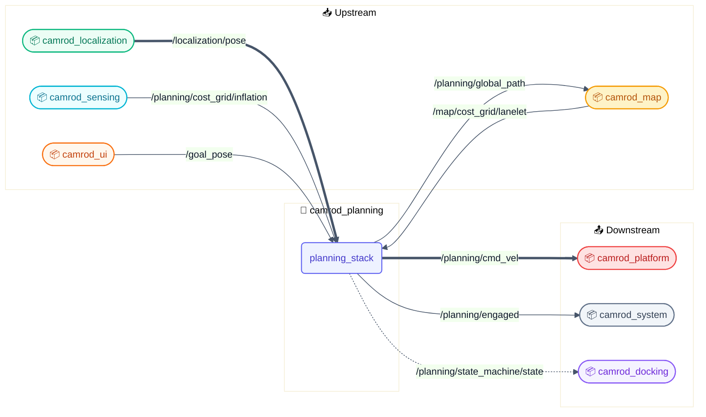
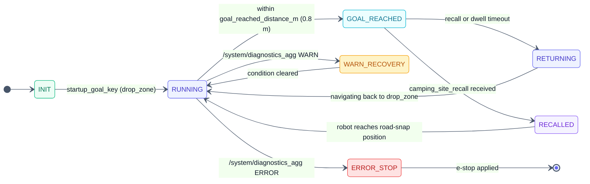
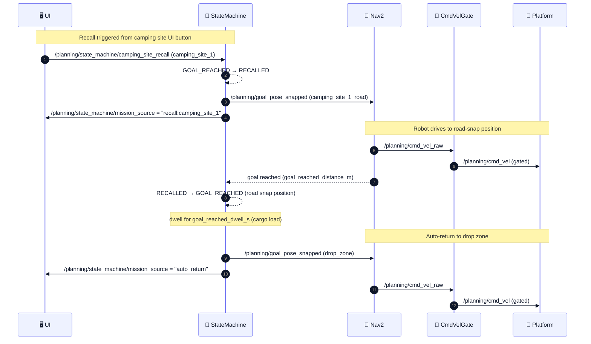

# 🧭 camrod_planning — Nav2 runtime, cmd_vel gating & mission state machine

## 1. 📋 Summary

`camrod_planning` is the Nav2-based autonomous path planning and velocity control package. It snaps operator or UI goals to the nearest Lanelet2 centerline, runs the Nav2 planner/controller stack to produce a global path and raw velocity command, extracts a robot-centred local path for diagnostics, and gates the final velocity command behind an explicit engage signal, e-stop, cost-grid obstacle check, and GNSS recovery hold. An optional mission state machine manages named keypoint goals and the camping-site recall scenario.

| | |
|---|---|
| **Upstream dependencies** | `camrod_localization`, `camrod_map`, `camrod_sensing`, `camrod_ui` |
| **Downstream consumers** | `camrod_platform`, `camrod_system`, `camrod_docking` |

---

## 2. 🚀 Quick Start

```bash
# Minimal: Nav2 + cmd_vel_gate + lanelet tools
ros2 launch camrod_planning planning.launch.py \
  map_path:=/path/to/lanelet2_maps.osm

# With mission state machine
ros2 launch camrod_planning planning.launch.py \
  map_path:=/path/to/lanelet2_maps.osm \
  enable_state_machine:=true

# Send a goal by keypoint name (state machine must be enabled)
ros2 topic pub /planning/state_machine/goal_key std_msgs/msg/String \
  "{data: camping_site_1}" -1

# Trigger camping-site recall (navigate robot to road-snap position)
ros2 topic pub /planning/state_machine/camping_site_recall std_msgs/msg/String \
  "{data: camping_site_1}" -1

# Standalone gate logic unit test (no ROS 2 runtime needed, 29 assertions)
python3 camrod_planning/test/test_cmd_vel_gate_logic.py
```

---

## 🧭 System Position



> **Diagram legend**
> 🧩 ROS node · 📡 Topic · ⚙️ Config · 🛠️ Hardware · 📦 External · 🔔 Service/Action
> Solid → runtime · ==> critical path · -.-> optional

*Figure 1 — camrod_planning system context: upstream providers, the planning package, and downstream consumers.*

---

## 🏗️ Runtime Architecture

```mermaid
%%{init: {'theme': 'base', 'themeVariables': {'fontFamily': 'ui-sans-serif, system-ui, sans-serif', 'fontSize': '14px', 'primaryColor': '#EEF2FF', 'primaryTextColor': '#0F172A', 'primaryBorderColor': '#6366F1', 'lineColor': '#475569'}, 'flowchart': {'curve': 'basis', 'htmlLabels': true, 'padding': 12}}}%%
graph TD
  classDef sensing      fill:#ECFEFF,stroke:#06B6D4,stroke-width:1.5px,color:#0E7490;
  classDef localization fill:#ECFDF5,stroke:#10B981,stroke-width:1.5px,color:#047857;
  classDef mapping      fill:#FEF3C7,stroke:#F59E0B,stroke-width:1.5px,color:#B45309;
  classDef planning     fill:#EEF2FF,stroke:#6366F1,stroke-width:1.5px,color:#4338CA;
  classDef platform     fill:#FEE2E2,stroke:#EF4444,stroke-width:1.5px,color:#B91C1C;
  classDef system       fill:#F1F5F9,stroke:#64748B,stroke-width:1.5px,color:#334155;
  classDef ui           fill:#FFF7ED,stroke:#F97316,stroke-width:1.5px,color:#C2410C;
  classDef topic        fill:#F8FAFC,stroke:#94A3B8,stroke-width:1px,color:#475569,font-style:italic;
  classDef config       fill:#FFFBEB,stroke:#D97706,stroke-width:1.5px,color:#92400E;
  classDef highlight    fill:#FEF9C3,stroke:#CA8A04,stroke-width:2.5px,color:#713F12;

  subgraph INP ["🛂 Inputs"]
    direction LR
    RVIZ{{🛠️ RViz / UI Goal}}
    LOCPOSE((/localization/pose))
    LCOST((/map/cost_grid/lanelet))
    GCOST((/planning/cost_grid/global_path))
    ENGAGE((/planning/engage))
    ESTOP((/platform/status/estop))
    INFCOST((/planning/cost_grid/inflation))
    LOCMODE((/localization/mode))
    LOCODO((/localization/odometry/filtered))
    YAMLZONES[(yaw_alignment_zones.yaml)]
  end

  subgraph NAV2_BT ["🧠 Nav2 BT + Controllers"]
    direction TB
    GSNAP(goal_snapper_node)
    CSNAP(centerline_snapper_node)
    GSNAPPED((/planning/goal_pose_snapped_ros))
    LANEPOSE((/planning/lanelet_pose))
    NAV2[[Nav2 Stack]]
    GPATH((/planning/global_path))
    CTRLPATH((/planning/local_path_controller))
    CMDRAW((/planning/cmd_vel_raw))
    LPATH(local_path_extractor_node)
    LOCALPATH((/planning/local_path))
    TERR(path_tracking_error_node)
    TERROR((/planning/ltracking_error))
    PCOST(path_cost_grids_node)
    PROG(planning_progress_node)
  end

  subgraph GATE_SG ["🚦 cmd_vel gate"]
    direction TB
    GATE(planning_cmd_vel_gate_node)
  end

  subgraph OUT_SG ["📤 Outputs"]
    direction TB
    CMDOUT((/planning/cmd_vel))
    ENGAGED((/planning/engaged))
    RDIST((/planning/progress/remaining_distance_m))
    RTIME((/planning/progress/remaining_time_s))
    RPCT((/planning/progress/completion_pct))
    SMSTATE((/planning/state_machine/state))
    SMSOURCE((/planning/state_machine/mission_source))
  end

  RVIZ --> GSNAP
  GSNAP --> GSNAPPED
  LOCPOSE --> CSNAP
  CSNAP --> LANEPOSE

  GSNAPPED --> NAV2
  LANEPOSE --> NAV2
  LCOST --> NAV2
  GCOST --> NAV2
  NAV2 --> GPATH
  NAV2 --> CTRLPATH
  NAV2 ==> CMDRAW

  LANEPOSE --> LPATH
  GPATH --> LPATH
  CTRLPATH --> LPATH
  LPATH --> LOCALPATH

  LOCALPATH --> TERR
  TERR --> TERROR

  GPATH --> PCOST
  LOCALPATH --> PCOST
  PCOST --> GCOST

  GPATH --> PROG
  LOCPOSE --> PROG
  LOCODO --> PROG
  PROG --> RDIST
  PROG --> RTIME
  PROG --> RPCT

  CMDRAW ==> GATE
  ENGAGE --> GATE
  ESTOP --> GATE
  INFCOST --> GATE
  LOCMODE --> GATE
  LOCODO --> GATE
  YAMLZONES -.-> GATE
  GATE ==> CMDOUT
  GATE --> ENGAGED

  DIAGAGG((/system/diagnostics_agg)) --> SM(planning_state_machine_node)
  RECALL((/planning/state_machine/camping_site_recall)) --> SM
  GOALKEY((/planning/state_machine/goal_key)) --> SM
  SM --> SMGOAL((/planning/goal_pose_snapped))
  SM --> SMSTATE
  SM --> SMSOURCE

  class LOCPOSE,LANEPOSE,GSNAPPED,CMDRAW,GPATH,CTRLPATH,LOCALPATH,TERROR,GCOST,RDIST,RTIME,RPCT,ENGAGE,ESTOP,INFCOST,LOCMODE,LOCODO,DIAGAGG,RECALL,GOALKEY,SMGOAL,SMSTATE,SMSOURCE,CMDOUT,ENGAGED,LCOST topic
  class GSNAP,CSNAP,LPATH,TERR,PCOST,PROG,GATE,SM planning
  class NAV2 system
  class RVIZ ui
  class YAMLZONES config
  class CMDRAW,GATE,CMDOUT highlight
  linkStyle 10,26,33 stroke:#6366F1,stroke-width:2.5px;
```



*Figure 2 — Runtime node graph. Critical path: `/planning/cmd_vel_raw` ==> gate ==> `/planning/cmd_vel`.*

### Node Summary

| Node | Key Inputs | Key Outputs | Notable Params |
|---|---|---|---|
| `goal_snapper_node` | `/goal_pose`, Lanelet2 map | `/planning/goal_pose_snapped_ros` | `max_search_radius`: 120 m, `require_lanelet_containment`, `fallback_uncontained` |
| `centerline_snapper_node` | `/localization/pose` | `/planning/lanelet_pose` | `max_search_radius`: 120 m, `lateral_stddev`: 0.3, `min_update_period_s`: 0.05 |
| `local_path_extractor_node` | `/planning/global_path`, `/planning/lanelet_pose`, `/planning/local_path_controller` | `/planning/local_path` | `local_path_source`: `controller_then_slice`, lookahead 30 m, lookbehind 3 m, 15 Hz |
| `path_tracking_error_node` | `/planning/local_path`, `/planning/lanelet_pose` | `/planning/ltracking_error` | `prefer_local_path`: true, `publish_rate_hz`: 15, `pose_timeout_s`: 1.0 |
| `goal_replanner_node` | `/planning/goal_pose`, `/planning/lanelet_pose`, Nav2 action | replanning triggers | `min_request_interval_s`, `retry_after_failure_s`, `navigate_inactive_grace_s` |
| `planning_progress_node` | `/planning/global_path`, `/localization/pose`, `/localization/odometry/filtered` | `/planning/progress/*` | `publish_rate_hz`: 2.0, `speed_ema_alpha`: 0.2, `speed_floor_mps`: 0.1 |
| `planning_cmd_vel_gate_node` | `/planning/cmd_vel_raw`, `/planning/engage`, `/platform/status/estop`, `/planning/cost_grid/inflation`, `/localization/mode`, `/localization/fallback/odometry` | `/planning/cmd_vel`, `/planning/engaged` | see §Key Behaviors |
| `planning_state_machine_node` | `/system/diagnostics_agg`, `/planning/lanelet_pose`, `/planning/state_machine/camping_site_recall`, `/planning/state_machine/goal_key` | `/planning/goal_pose_snapped`, `/planning/state_machine/state`, `/planning/state_machine/mission_source` | `keypoints_yaml`, `camping_sites_yaml`, `startup_goal_key`, `goal_reached_dwell_s` |
| Nav2 `planner_server` | `/planning/goal_pose_snapped_ros`, costmaps | `/planning/global_path` | SmacHybrid / Smac2D / NavFn / ThetaStar / SmacLattice |
| Nav2 `controller_server` | `/planning/global_path`, costmaps | `/planning/cmd_vel_raw`, `/planning/local_path_controller` | RPP / DWB / MPPI / Graceful / RotationShim; `xy_goal_tolerance`: 0.15 m |

---

## 🔌 Interface Contract

### Inputs

| Topic | Type | Required | Producer | Rate | Meaning |
|---|---|---|---|---|---|
| `/localization/pose` | `geometry_msgs/PoseStamped` | Yes | camrod_localization | ~50 Hz | Map-frame robot pose used by centerline snapper and progress |
| `/localization/pose_with_covariance` | `geometry_msgs/PoseWithCovarianceStamped` | Yes | camrod_localization | ~50 Hz | Covariance-bearing pose for Nav2 costmap initialization |
| `/localization/odometry/filtered` | `nav_msgs/Odometry` | Yes | camrod_localization | ~50 Hz | Filtered odometry for Nav2 and cmd_vel_gate corridor heading |
| `/localization/fallback/odometry` | `nav_msgs/Odometry` | No | camrod_localization | ~50 Hz | Fallback odometry for cost-stop corridor heading when VIO is unavailable |
| `/localization/mode` | `AvgLocalizationMode` | Yes | camrod_localization | ~5 Hz | NORMAL / DEGRADED / DR_ONLY / INVALID; triggers GNSS recovery hold |
| `/map/cost_grid/lanelet` | `nav_msgs/OccupancyGrid` | Yes | camrod_map | ~1 Hz | Lanelet drivable-space constraints for global costmap |
| `/planning/cost_grid/inflation` | `nav_msgs/OccupancyGrid` | Yes | camrod_sensing | ~10 Hz | Inflation-layer obstacle grid for local costmap and cmd_vel_gate cost-stop |
| `/goal_pose` | `geometry_msgs/PoseStamped` | Yes | RViz / camrod_ui | on demand | Operator navigation goal; snapped to nearest lanelet centerline |
| `/planning/state_machine/goal_key` | `std_msgs/String` | No | camrod_ui | on demand | Named keypoint goal (e.g. `camping_site_1`) sent to state machine |
| `/planning/state_machine/camping_site_recall` | `std_msgs/String` | No | camrod_ui / external | on demand | Recall request; `data` = camping site name; triggers road-snap navigation |
| `/planning/engage` | `std_msgs/Bool` | Yes | camrod_system / operator | on demand | Gate open (`true`) / closed (`false`) for velocity passthrough |
| `/platform/status/estop` | `std_msgs/Bool` | Yes | camrod_platform | ~10 Hz | Hardware e-stop; immediately zeroes cmd_vel when `true` |
| `/system/diagnostics_agg` | `diagnostic_msgs/DiagnosticArray` | No | camrod_system | ~1 Hz | System-level health; drives WARN_RECOVERY / ERROR_STOP state transitions |

### Outputs

| Topic | Type | Consumer | Rate | Meaning |
|---|---|---|---|---|
| `/planning/global_path` | `nav_msgs/Path` | camrod_map, camrod_sensing, RViz | on replan | Full global path from current position to goal |
| `/planning/local_path` | `nav_msgs/Path` | camrod_system (diagnostic), RViz | 15 Hz | Robot-centred local path window (lookahead 30 m, lookbehind 3 m) |
| `/planning/cmd_vel_raw` | `geometry_msgs/Twist` | planning_cmd_vel_gate_node | 30 Hz | Raw controller velocity before gating |
| `/planning/cmd_vel` | `geometry_msgs/Twist` | camrod_platform | 30 Hz | Gated velocity command; zeroed on e-stop, cost-stop, disengaged, or hold |
| `/planning/engaged` | `std_msgs/Bool` | camrod_system, camrod_platform | 30 Hz | Current gate state after all checks |
| `/planning/cost_grid/global_path` | `nav_msgs/OccupancyGrid` | camrod_map, camrod_sensing, Nav2 | ~2 Hz | Path-corridor cost layer for global planner guidance |
| `/planning/ltracking_error` | `AvgTrackingError` | camrod_system | 15 Hz | Lateral and heading tracking error against local path |
| `/planning/state_machine/state` | `std_msgs/String` | camrod_system, camrod_ui | on change | Mission FSM state: INIT / RUNNING / GOAL_REACHED / RECALLED / RETURNING / WARN_RECOVERY / ERROR_STOP |
| `/planning/state_machine/mission_source` | `std_msgs/String` | camrod_ui, logging | on new goal | Reason for current goal: `startup` / `return_request` / `recall:*` / `auto_return` / `key_topic:*` |
| `/planning/progress/remaining_distance_m` | `std_msgs/Float32` | camrod_ui, logging | 2 Hz | Path length from closest point to goal [m] |
| `/planning/progress/remaining_time_s` | `std_msgs/Float32` | camrod_ui, logging | 2 Hz | Estimated travel time at current EMA speed [s] |
| `/planning/progress/completion_pct` | `std_msgs/Float32` | camrod_ui, logging | 2 Hz | Fraction of total path already traversed [0–100] |

---

## ⚙️ Key Behaviors

### 6.1 Cost-Stop

**Trigger:** `planning_cmd_vel_gate_node` receives a `/planning/cost_grid/inflation` update while the gate is engaged.

**Internal logic:** The gate scans rectangular corridors in front, on both sides, and behind the robot using the merged inflation cost grid. The front corridor uses a speed-dependent lookahead: `d = v²/(2μg) + t_react × v + margin`, clamped to [`front_lookahead_min_m`, `front_lookahead_max_m`]. A BFS cluster check additionally detects unavoidable lethal obstacles (≥ `unavoidable_cluster_min_cells` cells with cost ≥ `unavoidable_lethal_threshold` covering ≥ `unavoidable_cluster_min_ratio` of the corridor).

| Zone | Cost Threshold | Lookahead | Corridor Half-Width |
|---|---|---|---|
| Front (speed-dependent) | 85 | `v²/(2×0.4×9.81) + 0.15v + 0.3`, clamped [0.4, 3.0] m | 0.5 m |
| Side left / right | 92 | 0.8 m | 0.225 m |
| Rear | 92 | 0.6 m | 0.3 m |
| Unavoidable cluster | 90 (lethal floor) | front corridor | ≥ 25 cells / ≥ 25% coverage |

> ⚠️ **Warning** `/planning/cmd_vel` is zeroed and `/planning/engaged` reflects `false`. The stop is held for `cmd_vel_gate_cost_hold_s` (default 1.0 s) after the obstacle clears.

**Operator-visible symptom:** Robot stops abruptly without Nav2 abort. RViz inflation grid shows high-cost cells in the stopped direction.

> 🔧 **Debug hint** Related params: `cmd_vel_gate_cost_stop_enable`, `cmd_vel_gate_cost_threshold`, `cmd_vel_gate_speed_dependent_lookahead`, `cmd_vel_gate_front_lookahead_min_m`, `cmd_vel_gate_front_lookahead_max_m`, `cmd_vel_gate_front_lookahead_friction`, `cmd_vel_gate_front_reaction_time_s`, `cmd_vel_gate_cost_hold_s`, `cmd_vel_gate_side_cost_threshold`, `cmd_vel_gate_rear_cost_threshold`, `cmd_vel_gate_unavoidable_lethal_threshold`, `cmd_vel_gate_unavoidable_cluster_min_cells`, `cmd_vel_gate_unavoidable_cluster_min_ratio`

**Related topics:** `/planning/cost_grid/inflation`, `/planning/cmd_vel`, `/planning/engaged`

---

### 6.2 GNSS Recovery Hold

**Trigger:** `/localization/mode` transitions from `DR_ONLY (2)` to `NORMAL (0)`.

**Internal logic:** The gate records the transition timestamp and blocks `/planning/cmd_vel` passthrough for `gnss_recovery_hold_s` (default 2.0 s). During the hold window, all velocity output is zeroed regardless of engage state or cost-stop state.

> 📌 **Note** `/planning/cmd_vel` is zeroed for up to 2 s after GNSS re-acquisition; robot is briefly stationary even if the engage signal is active.

**Operator-visible symptom:** Robot pauses for ~2 s each time GNSS lock is recovered after a DR_ONLY period. Nav2 costmap typically re-settles within this window.

> 🔧 **Debug hint** Related params: `cmd_vel_gate_enable_gnss_recovery_hold`, `cmd_vel_gate_gnss_recovery_hold_s`, `cmd_vel_gate_gnss_recovery_source_mode_min` (default 2), `cmd_vel_gate_gnss_recovery_target_mode` (default 0)

**Related topics:** `/localization/mode`, `/planning/cmd_vel`

---

### 6.3 Yaw Alignment Zone

**Trigger:** Robot pose enters `activation_radius_m` (default 1.2 m) of a configured zone center; feature is **disabled by default** (`cmd_vel_gate_yaw_alignment_enable: false`).

**Internal logic (gate pipeline order: e-stop → cost-stop → effective_enabled → yaw alignment → passthrough):**

| Layer | Radius | Behavior |
|---|---|---|
| 1: Activation ring | `activation_radius_m` (1.2 m) | Zone tracking begins; cmd_vel unchanged |
| 2: Lock ring | `lock_radius_m` (0.72 m, 60% of activation) | Nav2 cmd_vel overridden with alignment twist |
| 3: Adaptive tolerance | `yaw_tolerance_deg + yaw_tolerance_per_meter_deg × pos_error_m` | Tolerance widens farther from zone center |

Inside the lock ring the node injects: `angular.z = kp × gain_scale × yaw_error_rad` (clamped ±`max_angular_z`); `linear.x` is suppressed by `yaw_scale = max(0, 1 − yaw_error_deg / (yaw_tolerance_deg × 2.5))` and zeroed within `position_tolerance_m` (0.10 m) of zone center. Unlock requires holding `yaw_ok AND pos_ok` for `hold_s` (default 0.5 s).

**Output effect:** Robot rotates in place within the lock ring until heading matches zone yaw within tolerance, then resumes normal path following.

**Operator-visible symptom:** Robot appears to pause and rotate at a configured gate or passage entrance before proceeding.

> 🔧 **Debug hint** Related params: `cmd_vel_gate_yaw_alignment_enable`, `cmd_vel_gate_yaw_alignment_zones_file`, `cmd_vel_gate_yaw_alignment_frame_id`, `cmd_vel_gate_yaw_alignment_exit_margin_m`

**Related topics:** `/localization/pose`, `/planning/cmd_vel`

---

## 🗺️ Mission State Machine

### 7.1 Mission States



*Figure 3 — Mission state machine. Green = nominal, blue = transit, yellow = degraded, red = fault.*

### 7.2 Mission Source Values

| Value | Trigger |
|---|---|
| `startup` | Initial goal at boot (`startup_goal_key`) |
| `return_request` | Operator pressed return button |
| `recall:camping_site_N` | Camping site requested recall |
| `auto_return` | Dwell timeout expired at camping site |
| `key_topic:camping_site_N` | Goal key received on `goal_key_topic` |

### 7.3 Camping-Site Recall Sequence



*Figure 4 — Camping-site recall sequence. Road-snap position is used instead of area centroid to avoid cargo-blocked approach.*

> 📌 **Note** **Road-snap logic:** When `camping_sites.yaml` includes a `recall_x/y/z/yaw_deg` entry, the state machine registers a second keypoint `<site_id>_road` pointing to the road-snap position. On recall, the robot navigates to this road position rather than the area centroid (which may be blocked by cargo). Sites without `recall_x/y` fall back to the area centroid.

---

## 🚀 Launch

```bash
# Full planning stack (Nav2 + cmd_vel_gate + lanelet tools)
ros2 launch camrod_planning planning.launch.py \
  map_path:=/path/to/lanelet2_maps.osm

# Enable mission state machine
ros2 launch camrod_planning planning.launch.py \
  map_path:=/path/to/lanelet2_maps.osm \
  enable_state_machine:=true

# Enable goal replanner (automatic goal retry on Nav2 failure)
ros2 launch camrod_planning planning.launch.py \
  enable_goal_replanner:=true

# Delay Nav2 autostart until localization is ready
ros2 launch camrod_planning planning.launch.py \
  require_localization_ready:=true
```

Key launch arguments:

| Argument | Default | Description |
|---|---|---|
| `map_path` | (from `camrod_map/config/map_info.yaml`) | Lanelet2 `.osm` file path |
| `enable_path_cost_grids` | `true` | Global/local path cost grid publisher |
| `enable_goal_replanner` | `false` | Automatic goal replanning on Nav2 failure |
| `enable_state_machine` | `false` | Mission state machine |
| `enable_tracking_error` | `true` | Path tracking error publisher |
| `enable_progress` | `true` | Remaining distance / time / completion publisher |
| `enable_nav2_lifecycle_retry` | `false` | Nav2 lifecycle startup retry |
| `require_localization_ready` | `false` | Wait for `/localization/initial_match_ok` before Nav2 start |
| `cmd_vel_gate_enable` | `true` | Velocity gate node |
| `cmd_vel_gate_cost_stop_enable` | `true` | Cost-based obstacle stop |
| `cmd_vel_gate_speed_dependent_lookahead` | `true` | Physics-based braking distance for front corridor |
| `cmd_vel_gate_enable_gnss_recovery_hold` | `true` | Hold velocity for 2 s after DR_ONLY → NORMAL |
| `cmd_vel_gate_yaw_alignment_enable` | `false` | Yaw alignment zone enforcement |
| `local_path_source` | `controller_then_slice` | `controller_then_slice` or global-path slice |
| `nav2_combo_param_file` | `config/nav2_combo_profiles/disabled.yaml` | Planner+controller profile overlay |

---

## 🛠️ Config

| File | Purpose |
|---|---|
| `config/nav2_base.yaml` | Nav2 planner plugins (NavFn, Smac2D, SmacHybrid, SmacLattice, ThetaStar), controller plugins (RPP, DWB, MPPI, Graceful, RotationShim), costmap base config; `xy_goal_tolerance`: 0.15 m |
| `config/nav2_vehicle.yaml` | Vehicle specs (Ranger: wheelbase 0.89 m, track 0.56 m, mass 100 kg), footprint `[[0.59, 0.375],…]` (body+margins), RPP limits (1.4 m/s, 1.2 rad/s, lookahead 0.8 m) |
| `config/nav2_lanelet_overlay.yaml` | Lanelet-specific cost weights and regulatory element handling |
| `config/nav2_behavior.yaml` | Recovery behaviors, BT timeouts, transform tolerance |
| `config/nav2_combo_profiles/` | Planner+controller profile overlays (e.g. `smachybrid_graceful.yaml`, `smac2d_dwb.yaml`) |
| `config/goal_snapper.yaml` | Goal snap search radius, containment check, Z handling |
| `config/centerline_snapper.yaml` | Pose projection covariance, update throttle period |
| `config/local_path_extractor.yaml` | Lookahead 30 m / lookbehind 3 m, jump guard 3 m, publish rate 15 Hz |
| `config/path_cost_grids.yaml` | Global/local path grid geometry, cost weights, rebuild triggers |
| `config/goal_replanner.yaml` | Replan intervals, timeout, failure retry backoff |
| `config/planning_state_machine.yaml` | State machine topics, startup/warn goal keys, dwell time 10 s, recall config |
| `config/planning_state_machine_keypoints.yaml` | Named keypoint coordinates (drop_zone, etc.) |
| `config/camping_sites.yaml` | Named camping-site goal positions; optional `recall_x/y/z/yaw_deg` for road snap |
| `config/yaw_alignment_zones.yaml` | Manual yaw alignment zone definitions |
| `config/bt/*.xml` | Nav2 behavior tree XML files for `navigate_to_pose` |

---

## ✅ Validation

```bash
# Standalone gate logic unit test (no ROS 2 runtime needed)
python3 camrod_planning/test/test_cmd_vel_gate_logic.py
# 29 assertions covering: front/side/rear cost-stop, unavoidable cluster,
# GNSS recovery hold trigger and expiry, e-stop, engage gate,
# cost-stop hold, speed-dependent lookahead calculation.

# Verify Nav2 lifecycle is active
ros2 lifecycle get /planner_server
ros2 lifecycle get /controller_server

# Check gate output is flowing
ros2 topic hz /planning/cmd_vel

# Monitor state machine state
ros2 topic echo /planning/state_machine/state
ros2 topic echo /planning/state_machine/mission_source

# Inspect progress
ros2 topic echo /planning/progress/remaining_distance_m
```

---

## 🚑 Troubleshooting

### Engage true but no motion

1. Check `/platform/status/estop` — if `true`, e-stop is active.
2. Check `/planning/engaged` — if `false` while `/planning/engage` is `true`, the gate is blocking.
3. Check for cost-stop: `ros2 topic echo /planning/cost_grid/inflation` — look for high-cost cells near the robot footprint.
4. Check for GNSS recovery hold: `ros2 topic echo /localization/mode` — if it recently transitioned from `DR_ONLY (2)` to `NORMAL (0)`, the 2 s hold may still be active.
5. Verify Nav2 lifecycle: `ros2 lifecycle get /controller_server` — must be `active`.

---

### Robot keeps cost-stopping

1. Inspect the inflation grid for persistent high-cost cells: `ros2 topic echo /planning/cost_grid/inflation --no-arr` (check `info.width`, `data` max).
2. Reduce `cmd_vel_gate_cost_threshold` from 85 to a higher value to require denser obstacles.
3. Check `cmd_vel_gate_cost_hold_s` — default 1.0 s; if the obstacle is intermittent, shorten the hold.
4. Verify that the `combined_cost_layer` in the local costmap is receiving the correct inflation grid (check `/planning/cost_grid/inflation` topic rate).

---

### Goal reached but dwell never ends

1. Confirm `enable_auto_return_on_site_goal` is `true` in `config/planning_state_machine.yaml` or bringup override.
2. Check `goal_reached_dwell_s` — default 10.0 s (bringup may set 600 s).
3. Verify the goal keypoint matches the `site_goal_key_prefix` (`camping_site_`) prefix; non-matching keys do not start the dwell timer.
4. Check `goal_key_match_distance_m` (default 1.5 m) — robot must arrive within this distance of the keypoint coordinates for dwell to trigger.

---

### Nav2 lifecycle not active

1. Check if `require_localization_ready` is `true` — Nav2 autostart is deferred until `/localization/initial_match_ok` publishes `true`.
2. If `enable_nav2_lifecycle_retry` is `false` and lifecycle startup failed once, it will not retry.
3. Inspect Nav2 node logs: `ros2 lifecycle list` to see current states.
4. Verify `map_path` resolves to a valid `.osm` file — an invalid map path prevents the Lanelet2 costmap layers from initialising.

---

### Recall published but no transition

1. Verify `enable_state_machine` is `true` and `planning_state_machine_node` is running.
2. Check the current state: `ros2 topic echo /planning/state_machine/state` — recall is only processed in `GOAL_REACHED` state.
3. Confirm the camping site name in the recall message exactly matches an entry in `config/camping_sites.yaml`.
4. Check `camping_site_recall_topic` in `config/planning_state_machine.yaml` matches the topic being published.

---

## 🔗 Related Docs

- [../README.md](../README.md) — CAMROD monorepo overview
- [../camrod_localization/README.md](../camrod_localization/README.md) — ESKF fusion, localization modes
- [../camrod_map/README.md](../camrod_map/README.md) — Lanelet2 map, cost grid layers
- [../camrod_platform/README.md](../camrod_platform/README.md) — cmd_vel consumer, e-stop source
- [../camrod_ui/README.md](../camrod_ui/README.md) — Goal and recall command source
- [../camrod_docking/README.md](../camrod_docking/README.md) — Parking state consumer
- [../PARAMETER_NAMING_STANDARD.md](../PARAMETER_NAMING_STANDARD.md) — Canonical param naming conventions
