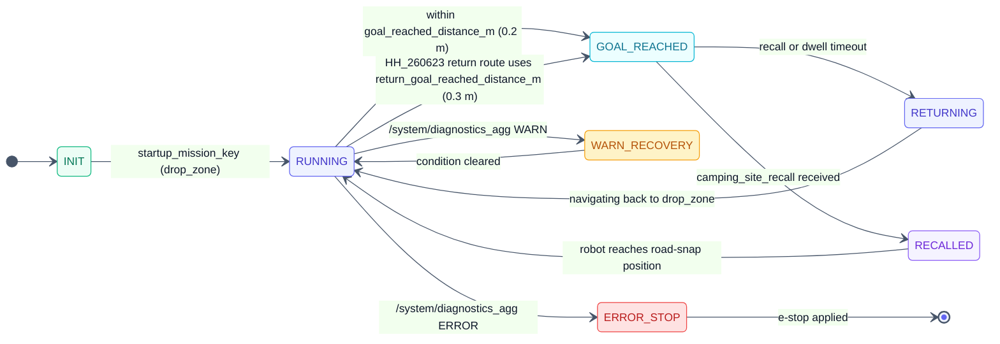
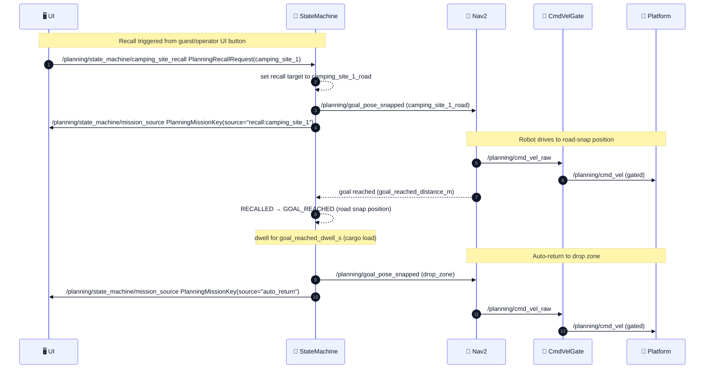

# 🧭 camrod_planning — Nav2 runtime, cmd_vel gating & mission state machine

## 1. 📋 Summary

`camrod_planning` is the Nav2-based autonomous path planning and velocity control package. It snaps operator or UI goals to the nearest Lanelet2 centerline, runs the Nav2 planner/controller stack to produce a global path and raw velocity command, extracts a robot-centred local path for diagnostics, and gates the final velocity command behind an explicit engage signal, e-stop, cost-grid obstacle check, and GNSS recovery hold. An optional mission state machine manages named keypoint goals and the camping-site recall scenario.

| | |
|---|---|
| **Upstream dependencies** | `camrod_localization`, `camrod_map`, `camrod_sensing`, `camrod_ui` |
| **Downstream consumers** | `camrod_platform`, `camrod_system`, `camrod_docking` |

---

## 2. 🚀 Quick Start

```bash
# Minimal: Nav2 + cmd_vel_gate + lanelet tools
ros2 launch camrod_planning planning.launch.py \
  map_path:=/path/to/lanelet2_maps.osm

# With mission state machine
ros2 launch camrod_planning planning.launch.py \
  map_path:=/path/to/lanelet2_maps.osm \
  enable_state_machine:=true

# Send a goal by keypoint name (state machine must be enabled)
ros2 topic pub /planning/mission_key avg_msgs/msg/PlanningMissionKey \
  "{mission_key: camping_site_1, source: cli, publish_route_goal: false}" -1

# Trigger camping-site recall (navigate robot to road-snap position)
ros2 topic pub /planning/state_machine/camping_site_recall avg_msgs/msg/PlanningRecallRequest \
  "{site_name: camping_site_1, source: cli}" -1

# Standalone gate logic unit test (no ROS 2 runtime needed, 51 assertions)
python3 camrod_planning/test/test_cmd_vel_gate_logic.py
```

---

## 🧭 System Position


> **Diagram legend**
> 🧩 ROS node · 📡 Topic · ⚙️ Config · 🛠️ Hardware · 📦 External · 🔔 Service/Action
> Solid → runtime · ==> critical path · -.-> optional

*Figure 1 — camrod_planning system context: upstream providers, the planning package, and downstream consumers.*

---

## 🏗️ Runtime Architecture

```mermaid
%%{init: {'theme': 'base', 'themeVariables': {'fontFamily': 'ui-sans-serif, system-ui, sans-serif', 'fontSize': '14px', 'primaryColor': '#EEF2FF', 'primaryTextColor': '#0F172A', 'primaryBorderColor': '#6366F1', 'lineColor': '#475569'}, 'flowchart': {'curve': 'basis', 'htmlLabels': true, 'padding': 12}}}%%
graph TD
  classDef sensing      fill:#ECFEFF,stroke:#06B6D4,stroke-width:1.5px,color:#0E7490;
  classDef localization fill:#ECFDF5,stroke:#10B981,stroke-width:1.5px,color:#047857;
  classDef mapping      fill:#FEF3C7,stroke:#F59E0B,stroke-width:1.5px,color:#B45309;
  classDef planning     fill:#EEF2FF,stroke:#6366F1,stroke-width:1.5px,color:#4338CA;
  classDef platform     fill:#FEE2E2,stroke:#EF4444,stroke-width:1.5px,color:#B91C1C;
  classDef system       fill:#F1F5F9,stroke:#64748B,stroke-width:1.5px,color:#334155;
  classDef ui           fill:#FFF7ED,stroke:#F97316,stroke-width:1.5px,color:#C2410C;
  classDef topic        fill:#F8FAFC,stroke:#94A3B8,stroke-width:1px,color:#475569,font-style:italic;
  classDef config       fill:#FFFBEB,stroke:#D97706,stroke-width:1.5px,color:#92400E;
  classDef highlight    fill:#FEF9C3,stroke:#CA8A04,stroke-width:2.5px,color:#713F12;

  subgraph INP ["🛂 Inputs"]
    direction LR
    RVIZ{{🛠️ RViz / UI Goal}}
    LOCPOSE((/localization/pose))
    LCOST((/map/cost_grid/lanelet))
    GCOST((/planning/cost_grid/global_path))
    ENGAGE((/planning/engage\nmanual))
    MISSIONENGAGE((/planning/mission_engage\nmission))
    ESTOP((/platform/status/estop))
    SOFTESTOP((/planning/state_machine/estop))
    INFCOST((/planning/cost_grid/inflation))
    LOCMODE((/localization/mode))
    LOCODO((/localization/odometry/filtered))
    YAMLZONES[(yaw_alignment_zones.yaml)]
  end

  subgraph NAV2_BT ["🧠 Nav2 BT + Controllers"]
    direction TB
    GSNAP(goal_snapper_node)
    CSNAP(centerline_snapper_node)
    GSNAPPED((/planning/goal_pose_snapped_ros))
    LANEPOSE((/planning/lanelet_pose))
    NAV2[[Nav2 Stack]]
    GPATH((/planning/global_path))
    CTRLPATH((/planning/local_path_controller))
    CMDRAW((/planning/cmd_vel_raw))
    LPATH(local_path_extractor_node)
    LOCALPATH((/planning/local_path))
    TERR(path_tracking_error_node)
    TERROR((/planning/ltracking_error))
    PCOST(path_cost_grids_node)
    PROG(planning_progress_node)
  end

  subgraph GATE_SG ["🚦 cmd_vel gate"]
    direction TB
    GATE(planning_cmd_vel_gate_node)
  end

  subgraph OUT_SG ["📤 Outputs"]
    direction TB
    CMDOUT((/planning/cmd_vel))
    ENGAGED((/planning/engaged))
    RDIST((/planning/progress/remaining_distance_m))
    RTIME((/planning/progress/remaining_time_s))
    RPCT((/planning/progress/completion_pct))
    SMSTATE((/planning/state_machine/state))
    SMSOURCE((/planning/state_machine/mission_source))
  end

  RVIZ --> GSNAP
  GSNAP --> GSNAPPED
  LOCPOSE --> CSNAP
  CSNAP --> LANEPOSE

  GSNAPPED --> NAV2
  LANEPOSE --> NAV2
  LCOST --> NAV2
  GCOST --> NAV2
  NAV2 --> GPATH
  NAV2 --> CTRLPATH
  NAV2 ==> CMDRAW

  LANEPOSE --> LPATH
  GPATH --> LPATH
  CTRLPATH --> LPATH
  LPATH --> LOCALPATH

  LOCALPATH --> TERR
  TERR --> TERROR

  GPATH --> PCOST
  LOCALPATH --> PCOST
  PCOST --> GCOST

  GPATH --> PROG
  LOCPOSE --> PROG
  LOCODO --> PROG
  PROG --> RDIST
  PROG --> RTIME
  PROG --> RPCT

  CMDRAW ==> GATE
  ENGAGE --> GATE
  ESTOP --> GATE
  SOFTESTOP --> GATE
  INFCOST --> GATE
  LOCMODE --> GATE
  LOCODO --> GATE
  YAMLZONES -.-> GATE
  GATE ==> CMDOUT
  GATE --> ENGAGED

  DIAGAGG((/system/diagnostics_agg)) --> SM(planning_state_machine_node)
  RECALL((/planning/state_machine/camping_site_recall)) --> SM
  MISSIONKEY((/planning/mission_key)) --> SM
  SM --> SMGOAL((/planning/goal_pose_snapped))
  SM --> SMSTATE
  SM --> SMSOURCE

  class LOCPOSE,LANEPOSE,GSNAPPED,CMDRAW,GPATH,CTRLPATH,LOCALPATH,TERROR,GCOST,RDIST,RTIME,RPCT,ENGAGE,ESTOP,SOFTESTOP,INFCOST,LOCMODE,LOCODO,DIAGAGG,RECALL,MISSIONKEY,SMGOAL,SMSTATE,SMSOURCE,CMDOUT,ENGAGED,LCOST topic
  class GSNAP,CSNAP,LPATH,TERR,PCOST,PROG,GATE,SM planning
  class NAV2 system
  class RVIZ ui
  class YAMLZONES config
  class CMDRAW,GATE,CMDOUT highlight
  linkStyle 10,26,33 stroke:#6366F1,stroke-width:2.5px;
```



*Figure 2 — Runtime node graph. Critical path: `/planning/cmd_vel_raw` ==> gate ==> `/planning/cmd_vel`.*

### Node Summary

**HH_260617 - terminology:** `mission_key` is the semantic site/key name on `/planning/mission_key`, `site_goal` is the raw operator/UI pose on `/goal_pose`, and `route_goal` is the lanelet-snapped Nav2 pose on `/planning/goal_pose_snapped_ros`.

| Node | Key Inputs | Key Outputs | Notable Params |
|---|---|---|---|
| `goal_snapper_node` | `site_goal` `/goal_pose`, Lanelet2 map, `/planning/lanelet_pose` | `route_goal` `/planning/goal_pose_snapped_ros` | `max_search_radius`: 120 m, `require_lanelet_containment`, `fallback_uncontained`, latest goal preempts older goals; HH_260619 - pose jumps >1.5 m reissue the active snapped goal so Nav2 rebuilds the FollowPath context; HH_260619 - uncontained global snap override prevents off-lane UI campsite centers from snapping to a stale connected component/drop-zone lanelet; HH_260622 - Nav2 terminal status marks the active goal complete even when sequential-goal release is disabled, preventing stale goal reissue after RViz pose reset |
| `centerline_snapper_node` | `/localization/pose` | `/planning/lanelet_pose` | `max_search_radius`: 120 m, `lateral_stddev`: 0.3, `min_update_period_s`: 0.05 |
| `local_path_extractor_node` | `/planning/global_path`, `/localization/pose` | `/planning/local_path` | lookahead 30 m, lookbehind 0.2 m, 15 Hz; HH_260702 - publishes the map-fixed global-route slice and clears an empty local path on invalid input or route changes so old goal markers do not persist |
| `path_tracking_error_node` | `/planning/local_path`, `/planning/lanelet_pose` | `/planning/ltracking_error` | `prefer_local_path`: true, `publish_rate_hz`: 15, `pose_timeout_s`: 1.0 |
| `path_visualizer_node` | `/planning/global_path`, `/planning/local_path` | `/planning/path_markers` | HH_260619 - high-contrast RViz markers show the same route source used by local-path and path-cost consumers; stale global markers are cleared when local path has moved to a different goal; HH_260623 - path marker Z is flattened to the 2D planning ground plane by default |
| `goal_replanner_node` | `/planning/goal_pose`, `/planning/lanelet_pose`, Nav2 action | replanning triggers | `min_request_interval_s`, `retry_after_failure_s`, `navigate_inactive_grace_s` |
| `obstacle_replan_monitor_node.py` | `/planning/local_path`, `/planning/goal_pose_snapped_ros`, `/localization/pose`, `/sensing/cost_grid/lidar`, `/sensing/cost_grid/radar` | `/planning/obstacle_replan/status`; optional `/planning/planner_selector=SmacLattice` + preempted `/planning/navigate_to_pose` only when `preempt_enabled=true` | HH_260702 - reports persistent dynamic blockage on the active local-path corridor while keeping the default `LaneletRoute` global path stable; fallback preemption is opt-in because free-space replans can cross adjacent/opposite lanes; `clear_hold_s` prevents alternating empty/test cost grids from clearing a real blockage immediately |
| `planning_progress_node` | `/planning/global_path`, `/localization/pose`, `/localization/odometry/filtered` | `/planning/progress/*` | `publish_rate_hz`: 2.0, `speed_ema_alpha`: 0.2, `speed_floor_mps`: 0.1 |
| `planning_cmd_vel_gate_node` | `/planning/cmd_vel_raw`, `/planning/engage`, `/planning/mission_engage`, `/platform/status/estop`, `/planning/state_machine/estop`, `/map/cost_grid/lanelet`, `/planning/cost_grid/inflation`, `/localization/mode`, `/localization/odometry/filtered` | `/planning/cmd_vel`, `/planning/engaged` | see §Key Behaviors; HH_260630 - site-maneuver crab/reverse bypasses static lanelet/global-path cost while still stopping on live LiDAR/Radar source cost; HH_260701 - planning soft-estop is ORed with platform e-stop before command output; HH_260703 - live cost-stop latch and stale inflation-grid fail-safe zero output before platform commands |
| `planning_state_machine_node` | `/system/diagnostics_agg`, `/planning/lanelet_pose_ros`, `/planning/state_machine/camping_site_recall`, `mission_key` `/planning/mission_key` | `/planning/goal_pose_snapped_ros`, `/planning/state_machine/state`, `/planning/state_machine/mission_source` | `keypoints_yaml`, `camping_sites_yaml`, `startup_mission_key`, `goal_reached_dwell_s`; HH_260619 - recent UI `mission_key` can override a misleading snapped-goal key match during the preserve window |
| Nav2 `planner_server` | `route_goal` `/planning/goal_pose_snapped_ros`, Lanelet2 map, costmaps | `/planning/global_path`, `/planning/route_lanelet_ids` | HH_260619 - default `LaneletRoute` publishes a fixed lanelet-centerline route and exact route lanelet IDs for route-aware map costs; `SmacLattice`, `NavFn`, `Smac2D`, `SmacHybrid`, `ThetaStar` remain selectable diagnostics/free-space fallbacks; BT uses `GoalUpdatedController`, so global path is recomputed on goal/preemption/recovery, not continuously while following |
| Nav2 `controller_server` | `/planning/global_path`, costmaps, `/planning/engaged` | `/planning/cmd_vel_raw`, `/planning/local_path_controller` | RPP / DWB / MPPI / Graceful / RotationShim; `xy_goal_tolerance`: 0.15 m; HH_260618 - `EngageAwareProgressChecker` pauses progress timeout before operator engage; HH_260622 - MPPI path critics are tuned to reduce inside-cutting on high-curvature lanelet centerlines |

---

## 🔌 Interface Contract

### Inputs

| Topic | Type | Required | Producer | Rate | Meaning |
|---|---|---|---|---|---|
| `/localization/pose` | `geometry_msgs/PoseStamped` | Yes | camrod_localization | ~50 Hz | Map-frame robot pose used by centerline snapper and progress |
| `/localization/pose_with_covariance` | `geometry_msgs/PoseWithCovarianceStamped` | Yes | camrod_localization | ~50 Hz | Covariance-bearing pose for Nav2 costmap initialization |
| `/localization/odometry/filtered` | `nav_msgs/Odometry` | Yes | camrod_localization | ~50 Hz | Filtered odometry for Nav2 and cmd_vel_gate corridor heading |
| `/localization/fallback/odometry` | `nav_msgs/Odometry` | No | camrod_localization | ~50 Hz | Fallback odometry for cost-stop corridor heading when VIO is unavailable |
| `/localization/mode` | `AvgLocalizationMode` | Yes | camrod_localization | ~5 Hz | NORMAL / DEGRADED / DR_ONLY / INVALID; triggers GNSS recovery hold |
| `/map/cost_grid/lanelet` | `nav_msgs/OccupancyGrid` | Yes | camrod_map | ~1 Hz | Lanelet drivable-space constraints for global costmap |
| `/planning/cost_grid/inflation` | `nav_msgs/OccupancyGrid` | Yes | camrod_sensing | ~6 Hz | Inflation-layer obstacle grid for local costmap and cmd_vel_gate cost-stop |
| `/goal_pose` | `geometry_msgs/PoseStamped` | Yes | RViz / camrod_ui | on demand | `site_goal`: raw operator/UI goal; snapped to nearest lanelet centerline |
| `/planning/mission_key` | `avg_msgs/PlanningMissionKey` | No | camrod_ui | on demand | `mission_key`: named semantic target (e.g. `camping_site_1`) sent to state machine |
| `/planning/state_machine/camping_site_recall` | `avg_msgs/PlanningRecallRequest` | No | camrod_ui / external | on demand | Recall request; `site_name` = camping site name; triggers road-snap navigation to `<site>_road` when configured |
| `/planning/engage` | `std_msgs/Bool` | Yes | operator / camrod_ui manual button | on demand | Manual 2D-goal motion latch only |
| `/planning/mission_engage` | `std_msgs/Bool` | Yes | camrod_ui / mission state | on demand | UI campsite/drop-zone mission motion latch |
| `/platform/status/estop` | `std_msgs/Bool` | Yes | camrod_platform | ~10 Hz | Hardware e-stop; immediately zeroes cmd_vel when `true` |
| `/planning/state_machine/estop` | `std_msgs/Bool` | Yes | planning_state_machine_node | event / ~state updates | Mission/diagnostic soft e-stop. HH_260701 - ORed with platform e-stop by `planning_cmd_vel_gate_node` |
| `/system/diagnostics_agg` | `diagnostic_msgs/DiagnosticArray` | No | camrod_system | ~1 Hz | System-level health; drives WARN_RECOVERY / ERROR_STOP state transitions |

### Outputs

| Topic | Type | Consumer | Rate | Meaning |
|---|---|---|---|---|
| `/planning/global_path` | `nav_msgs/Path` | camrod_map, camrod_sensing, RViz | on new goal / recovery | Planner-server route from current position to goal; HH_260619 - BT locks this route per accepted goal so local updates do not rewrite the global path every tick |
| `/planning/route_lanelet_ids` | `std_msgs/Int64MultiArray` | camrod_map | on new LaneletRoute plan | HH_260619 - Exact Lanelet2 IDs in the active global route; used by lanelet cost grid to ignore non-route branch/merge boundaries |
| `/planning/local_path` | `nav_msgs/Path` | camrod_system (diagnostic), RViz | 15 Hz + pose updates | Robot-centred local path window; HH_260702 - map-fixed locked-route slice by default; invalid inputs and route changes publish an empty path once to clear stale markers |
| `/planning/path_markers` | `visualization_msgs/MarkerArray` | RViz | on path update + 5 Hz cache | HH_260618 - thick global/local path line, direction arrows, and endpoint markers above cost-grid overlays |
| `/planning/cmd_vel_raw` | `geometry_msgs/Twist` | planning_cmd_vel_gate_node | 30 Hz | Raw controller velocity before gating |
| `/planning/cmd_vel` | `geometry_msgs/Twist` | camrod_platform | 30 Hz | Gated velocity command; zeroed on e-stop, cost-stop, disengaged, or hold |
| `/planning/engaged` | `std_msgs/Bool` | camrod_system, camrod_platform | 30 Hz | Effective gate state after manual/mission latch, e-stop, cost-stop, and holds |
| `/planning/cost_grid/global_path` | `nav_msgs/OccupancyGrid` | camrod_sensing, cmd_vel_gate, RViz | on path update + heartbeat | HH_260619 - path-corridor layer generated from `/planning/global_path` for local inflation/gate/visualization; not injected into global planner master to avoid circular replans |
| `/planning/obstacle_replan/status` | `std_msgs/String` | RViz/logging/system diagnostics | 5 Hz | HH_260702 - dynamic route blockage state; reports CLEAR/BLOCKED and the grid source; default policy does not preempt the global route |
| `/planning/ltracking_error` | `AvgTrackingError` | camrod_system | 15 Hz | Lateral and heading tracking error against local path |
| `/planning/state_machine/state` | `avg_msgs/PlanningState` | camrod_system, camrod_ui | on change | Mission FSM state plus scenario, mission key, source, request flags |
| `/planning/state_machine/mission_source` | `avg_msgs/PlanningMissionKey` | camrod_ui, logging | on new goal | Current mission key and source: `startup` / `return_request` / `recall:*` / `auto_return` / `mission_key:*` |
| `/planning/progress/remaining_distance_m` | `std_msgs/Float32` | camrod_ui, logging | 2 Hz | Path length from closest point to goal [m] |
| `/planning/progress/remaining_time_s` | `std_msgs/Float32` | camrod_ui, logging | 2 Hz | Estimated travel time at current EMA speed [s] |
| `/planning/progress/completion_pct` | `std_msgs/Float32` | camrod_ui, logging | 2 Hz | Fraction of total path already traversed [0–100] |

---

## ⚙️ Key Behaviors

### 6.0 Engage-Aware Nav2 Progress

**HH_260618 - Trigger:** Nav2 receives a new `route_goal` while `/planning/engaged` is still `false`.

**Internal logic:** `camrod_planning::EngageAwareProgressChecker` subscribes to `/planning/engaged`. While the planning velocity gate is disengaged, it continuously resets Nav2 progress timing and returns success to the controller server. Once `/planning/engaged` becomes `true`, it behaves like a normal distance/time progress checker using `required_movement_radius` and `movement_time_allowance`.

**Reason:** Operators and UI flows can create or revise goals before authorizing motion. Without this plugin, Nav2's default progress checker can abort `FollowPath` with “Failed to make progress” while the robot is correctly stopped by the engage gate.

**Related params:** `progress_checker.plugin: camrod_planning::EngageAwareProgressChecker`, `progress_checker.engaged_topic`, `progress_checker.default_engaged`, `progress_checker.required_movement_radius`, `progress_checker.movement_time_allowance`.

**Operator-visible behavior:** RViz/manual goal clicks create a global/local path immediately, but `/planning/cmd_vel` and `/platform/cmd_vel` remain zero until `/planning/engage=true`. Accepted UI campsite/drop-zone missions instead publish `/planning/mission_engage=true`, so they can move without the manual ENGAGE button.

---

### 6.1 Cost-Stop

**Trigger:** `planning_cmd_vel_gate_node` receives a `/planning/cost_grid/inflation` update while the gate is engaged.

**Internal logic:** The gate scans rectangular corridors in front, on both sides, and behind the robot using the merged inflation cost grid. The front corridor uses a speed-dependent lookahead: `d = v²/(2μg) + t_react × v + margin`, clamped to [`front_lookahead_min_m`, `front_lookahead_max_m`]. HH_260702 - current field defaults stop dynamic front obstacles at cost ≥85 with a 2.60 m minimum scan and 3.50 m maximum scan; side/rear dynamic stops also use cost ≥85 with a 1.20 m lookahead so crab/reverse maneuvers are protected by live LiDAR/Radar. HH_260706 - forward path-following keeps short near-body side/rear dynamic guards (`LEFT_NEAR`, `RIGHT_NEAR`, `REAR_NEAR`) so close radar hits still stop the body without forcing long side/rear corridors into normal avoidance. A BFS cluster check additionally detects unavoidable lethal obstacles (≥ `unavoidable_cluster_min_cells` cells with cost ≥ `unavoidable_lethal_threshold` covering ≥ `unavoidable_cluster_min_ratio` of the corridor).

| Zone | Cost Threshold | Lookahead | Corridor Half-Width |
|---|---|---|---|
| Front (speed-dependent) | 85 | `v²/(2×0.4×9.81) + 0.20v + 0.45`, clamped [2.60, 3.50] m | footprint corridor |
| Side left / right | 85 | 1.20 m | footprint corridor |
| Rear | 85 | 1.20 m | footprint corridor |
| Near-body side/rear | 85 | 0.75 m side / 0.55 m rear | dynamic source only |
| Unavoidable cluster | 90 (lethal floor) | front corridor | ≥ 25 cells / ≥ 25% coverage |

> ⚠️ **Warning** `/planning/cmd_vel` is zeroed and `/planning/engaged` reflects `false`. The stop is held for `cmd_vel_gate_cost_hold_s` (default 1.0 s) after the obstacle clears.

HH_260703 - Dynamic LiDAR/Radar cost stops are also latched until the sampled
travel corridor stays continuously clear for `cmd_vel_gate_cost_stop_clear_required_s`
(default 2.0 s). This is separate from the short `cost_hold`: the hold covers a
single stop event, while the latch prevents stop/go oscillation when a curb,
vehicle, or intermittent sensor return disappears for one frame and comes back.
If `/planning/cost_grid/inflation` is missing or older than
`cmd_vel_gate_cost_grid_stale_timeout_s` (default 1.0 s), the gate fails closed
and publishes zero velocity.

**Operator-visible symptom:** Robot stops abruptly without Nav2 abort. RViz inflation grid shows high-cost cells in the stopped direction.

> 🔧 **Debug hint** Related params: `cmd_vel_gate_cost_stop_enable`, `cmd_vel_gate_cost_threshold`, `cmd_vel_gate_speed_dependent_lookahead`, `cmd_vel_gate_front_lookahead_min_m`, `cmd_vel_gate_front_lookahead_max_m`, `cmd_vel_gate_front_lookahead_friction`, `cmd_vel_gate_front_reaction_time_s`, `cmd_vel_gate_cost_hold_s`, `cmd_vel_gate_cost_stop_latch_enable`, `cmd_vel_gate_cost_stop_clear_required_s`, `cmd_vel_gate_cost_grid_stale_stop_enable`, `cmd_vel_gate_cost_grid_stale_timeout_s`, `cmd_vel_gate_side_cost_threshold`, `cmd_vel_gate_rear_cost_threshold`, `cmd_vel_gate_body_near_dynamic_stop`, `cmd_vel_gate_body_near_side_lookahead_m`, `cmd_vel_gate_body_near_rear_lookahead_m`, `cmd_vel_gate_body_near_maneuver_side_lookahead_m`, `cmd_vel_gate_body_near_maneuver_rear_lookahead_m`, `cmd_vel_gate_unavoidable_lethal_threshold`, `cmd_vel_gate_unavoidable_cluster_min_cells`, `cmd_vel_gate_unavoidable_cluster_min_ratio`

**Related topics:** `/planning/cost_grid/inflation`, `/planning/cmd_vel`, `/planning/engaged`

---

### 6.1.1 Raw Lanelet Safety Stop

**Trigger:** `planning_cmd_vel_gate_node` receives a translational `/planning/cmd_vel_raw` command while `cmd_vel_gate_lanelet_safety_enable` is true.

**HH_260618 - Internal logic:** The gate samples the raw `/map/cost_grid/lanelet` grid before the merged `/planning/cost_grid/inflation` grid. This is separate because the inflation grid clears the ego footprint so Nav2 can start near occupied cells, but that same ego-clear can hide lane-boundary/off-lane cost directly under the robot.

| Direction | Default Policy | Reason |
|---|---|---|
| Forward | checked, threshold 85 | normal Nav2 driving must not leave lanelet drivable space |
| In-place yaw | static lanelet allowed, dynamic cost checked | robot must be able to rotate toward the newest route goal while still stopping for live LiDAR/Radar obstacles |
| Reverse | not checked by default | drop-zone reverse parking needs mission-specific bounds |
| Lateral crab | not checked by default | campsite crab entry/exit needs mission-specific bounds |

HH_260630 - During a recognized camping-site maneuver, explicit lateral/reverse
parking commands also bypass static front/side/rear cost-stop from lanelet or
global-path guide layers. Dynamic source grids are still evaluated afterward, so
live LiDAR/Radar obstacles in the direction of travel continue to zero
`/planning/cmd_vel`.

HH_260619 - Forward lanelet safety first samples the active `/planning/local_path`
corridor when it is close to the robot. This avoids false stops at merge points
where the raw robot-yaw rectangle touches a lanelet boundary even though the
selected local path stays on the valid route. If the local path is unavailable
or too far from the robot, the node falls back to the raw robot-yaw rectangle.

> 🔧 **Debug hint** Related params: `cmd_vel_gate_lanelet_safety_enable`, `cmd_vel_gate_lanelet_safety_grid_topic`, `cmd_vel_gate_lanelet_safety_threshold`, `cmd_vel_gate_lanelet_safety_current_threshold`, `cmd_vel_gate_lanelet_safety_lookahead_m`, `cmd_vel_gate_lanelet_safety_width_m`, `cmd_vel_gate_lanelet_safety_check_reverse`, `cmd_vel_gate_lanelet_safety_check_lateral`, `cmd_vel_gate_lanelet_safety_front_use_local_path`, `cmd_vel_gate_lanelet_safety_front_path_max_start_distance_m`.

---

### 6.1.2 Dynamic Obstacle Replan

**Trigger:** `obstacle_replan_monitor_node.py` sees fresh LiDAR/Radar cost cells above `obstacle_cost_threshold` inside the active local-path corridor for longer than `block_hold_s`.

**HH_260702 - Internal logic:** Normal driving uses `LaneletRoute`, so `/planning/global_path` stays on the selected lanelet centerline and does not oscillate every control tick. The monitor now reports persistent dynamic blockage on `/planning/obstacle_replan/status` by default and leaves the active Nav2 goal/global route untouched. If a controlled test needs free-space fallback behavior, set `preempt_enabled=true`; then the monitor temporarily publishes `SmacLattice` on `/planning/planner_selector` and resends the latest `/planning/goal_pose_snapped_ros` to `/planning/navigate_to_pose`. If no lane-bounded/free-space route exists, the cmd_vel gate still holds the robot stopped. `clear_hold_s` keeps a recently blocked sample active across short empty-grid intervals, which is required when real/test obstacle grids and empty simulator grids alternate on the same cost-grid topics.

**Important:** `/planning/local_path` is the operator-visible local route window. HH_260702 - It is a map-fixed slice of `/planning/global_path` by default; route changes and invalid input publish an empty path once to clear stale RViz markers. It is not the MPPI sampled trajectory display. Use `/planning/obstacle_replan/status`, Nav2 planner logs, and `/planning/global_path` to confirm a full-route fallback; use MPPI visualization topics/markers for controller-level obstacle avoidance.

> 🔧 **Debug hint** Related params: `enable_obstacle_replan_monitor`, `obstacle_replan_monitor_param_file`, `preempt_enabled`, `fallback_planner_id`, `restore_planner_id`, `lookahead_m`, `corridor_half_width_m`, `block_hold_s`, `clear_hold_s`, `replan_cooldown_s`.

---

### 6.2 GNSS Recovery Hold

**Trigger:** `/localization/mode` transitions from `DR_ONLY (2)` to `NORMAL (0)`.

**Internal logic:** The gate records the transition timestamp and blocks `/planning/cmd_vel` passthrough for `gnss_recovery_hold_s` (default 2.0 s). HH_260707 - The hold is applied only after the source mode has stayed in DR-only/recovery for at least `gnss_recovery_min_source_s` (default 1.5 s), and repeated holds are rate-limited by `gnss_recovery_hold_cooldown_s` (default 10.0 s). During the hold window, all velocity output is zeroed regardless of engage state or cost-stop state.

> 📌 **Note** `/planning/cmd_vel` is zeroed for up to 2 s after GNSS re-acquisition; robot is briefly stationary even if the engage signal is active.

**Operator-visible symptom:** Robot pauses for ~2 s after a sustained DR_ONLY period recovers to NORMAL. One-sample GNSS/NTRIP flaps should log as skipped instead of repeatedly blocking cmd_vel.

> 🔧 **Debug hint** Related params: `cmd_vel_gate_enable_gnss_recovery_hold`, `cmd_vel_gate_gnss_recovery_hold_s`, `cmd_vel_gate_gnss_recovery_min_source_s`, `cmd_vel_gate_gnss_recovery_hold_cooldown_s`, `cmd_vel_gate_gnss_recovery_source_mode_min` (default 2), `cmd_vel_gate_gnss_recovery_target_mode` (default 0)

**Related topics:** `/localization/mode`, `/planning/cmd_vel`

---

### 6.3 Yaw Alignment Zone

**Trigger:** Robot pose enters `activation_radius_m` (default 1.2 m) of a configured zone center; feature is **disabled by default** (`cmd_vel_gate_yaw_alignment_enable: false`).

**Internal logic (gate pipeline order: e-stop → cost-stop → effective_enabled → yaw alignment → passthrough):**

| Layer | Radius | Behavior |
|---|---|---|
| 1: Activation ring | `activation_radius_m` (1.2 m) | Zone tracking begins; cmd_vel unchanged |
| 2: Lock ring | `lock_radius_m` (0.72 m, 60% of activation) | Nav2 cmd_vel overridden with alignment twist |
| 3: Adaptive tolerance | `yaw_tolerance_deg + yaw_tolerance_per_meter_deg × pos_error_m` | Tolerance widens farther from zone center |

Inside the lock ring the node injects: `angular.z = kp × gain_scale × yaw_error_rad` (clamped ±`max_angular_z`); `linear.x` is suppressed by `yaw_scale = max(0, 1 − yaw_error_deg / (yaw_tolerance_deg × 2.5))` and zeroed within `position_tolerance_m` (0.10 m) of zone center. Unlock requires holding `yaw_ok AND pos_ok` for `hold_s` (default 0.5 s).

**Output effect:** Robot rotates in place within the lock ring until heading matches zone yaw within tolerance, then resumes normal path following.

**Operator-visible symptom:** Robot appears to pause and rotate at a configured gate or passage entrance before proceeding.

> 🔧 **Debug hint** Related params: `cmd_vel_gate_yaw_alignment_enable`, `cmd_vel_gate_yaw_alignment_zones_file`, `cmd_vel_gate_yaw_alignment_frame_id`, `cmd_vel_gate_yaw_alignment_exit_margin_m`

**Related topics:** `/localization/pose`, `/planning/cmd_vel`

---

## 🗺️ Mission State Machine

### 7.1 Mission States



*Figure 3 — Mission state machine. Green = nominal, blue = transit, yellow = degraded, red = fault.*

### 7.2 Mission Source Values

| Value | Trigger |
|---|---|
| `startup` | Initial goal at boot (`startup_mission_key`) |
| `return_request` | Operator pressed return button |
| `recall:camping_site_N` | Camping site requested recall |
| `auto_return` | Dwell timeout expired at camping site |
| `mission_key:camping_site_N` | `mission_key` received on `mission_key_topic` |

### 7.2.1 Parking Phase Mirror

> HH_260622 - `planning_state_machine` mirrors event-style parking phases from `/AMR_service_state` into `/planning/state_machine/state` and `/planning/state_machine/scenario_id`.

Parking phases are not periodic telemetry, so `parking_phase_override_timeout_s: 0.0` keeps the latest phase authoritative until a new route, mission, or return command clears it. This prevents the UI/system state from falling back to `DELIVERY_TO_SITE` while `site_maneuver` is still reversing into a campsite or waiting for return.

| Producer phase | Planning state | Scenario |
|---|---|---|
| `site_maneuver:ALIGN_ENTRY_YAW`, `REVERSE_IN`, `ROTATE_180` | `RUNNING` | `SITE_ENTRY` |
| `site_maneuver:UNLOAD_WAIT`, `WAIT_RETURN` | `GOAL_REACHED` | `UNLOAD_WAIT` |
| `site_maneuver:REVERSE_OUT`, `DONE` before return handoff | `RETURNING` | `RETURN_WITH_CARGO` |
| `drop_zone_parking:ALIGN_REAR_YAW`, `REVERSE_APPROACH` | `RUNNING` | `DROP_ZONE_PARKING` |
| `drop_zone_parking:PARKED` | `WAIT_DZ` | `WAIT_DROP_ZONE` |

### 7.3 Camping-Site Recall Sequence



*Figure 4 — Camping-site recall sequence. Road-snap position is used instead of area centroid to avoid tent/cargo-blocked campsite entry.*

> 📌 **Note** **Road-snap logic:** When `camping_sites.yaml` includes a `recall_x/y/z/yaw_deg` entry, the state machine registers a second keypoint `<site_id>_road` pointing to the road-snap position. On recall, the robot navigates to this road position rather than the area centroid (which may be blocked by cargo). Sites without `recall_x/y` fall back to the area centroid.

> HH_260621 - Operator `usage_complete` from `camrod_ui` now publishes `/planning/state_machine/return_to_drop_zone=true`. This is the required planning trigger for return-to-drop-zone; changing only `/AMR_service_state` is not enough to start a return route.

---

## 🚀 Launch

```bash
# Full planning stack (Nav2 + cmd_vel_gate + lanelet tools)
ros2 launch camrod_planning planning.launch.py \
  map_path:=/path/to/lanelet2_maps.osm

# Enable mission state machine
ros2 launch camrod_planning planning.launch.py \
  map_path:=/path/to/lanelet2_maps.osm \
  enable_state_machine:=true

# Enable goal replanner (automatic goal retry on Nav2 failure)
ros2 launch camrod_planning planning.launch.py \
  enable_goal_replanner:=true

# Delay Nav2 autostart until localization is ready
ros2 launch camrod_planning planning.launch.py \
  require_localization_ready:=true
```

Key launch arguments:

| Argument | Default | Description |
|---|---|---|
| `map_path` | (from `camrod_map/config/map_info.yaml`) | Lanelet2 `.osm` file path |
| `enable_path_cost_grids` | `true` | Global/local path cost grid publisher |
| `enable_goal_replanner` | `false` | Automatic goal replanning on Nav2 failure |
| `enable_obstacle_replan_monitor` | `false` | HH_260702 - persistent LiDAR/Radar blockage monitor; bringup enables it by default for status/gate visibility, while fallback preemption stays disabled unless explicitly enabled |
| `enable_state_machine` | `false` | Mission state machine |
| `enable_tracking_error` | `true` | Path tracking error publisher |
| `enable_progress` | `true` | Remaining distance / time / completion publisher |
| `enable_path_visualization` | `true` | High-contrast global/local RViz path marker publisher |
| `enable_nav2_lifecycle_retry` | `false` | Nav2 lifecycle startup retry |
| `require_localization_ready` | `false` | Wait for `/localization/initial_match_ok` before Nav2 start |
| `cmd_vel_gate_enable` | `true` | Velocity gate node |
| `cmd_vel_gate_cost_stop_enable` | `true` | Cost-based obstacle stop |
| `cmd_vel_gate_cost_stop_latch_enable` | `true` | HH_260703 - Keep dynamic LiDAR/Radar stops latched until a continuous clear window |
| `cmd_vel_gate_cost_stop_clear_required_s` | `2.0` | HH_260703 - Continuous clear duration required to release the latch |
| `cmd_vel_gate_cost_grid_stale_stop_enable` | `true` | HH_260703 - Zero `/planning/cmd_vel` if the merged inflation grid is stale/missing |
| `cmd_vel_gate_cost_grid_stale_timeout_s` | `1.0` | HH_260703 - Maximum accepted age of `/planning/cost_grid/inflation` |
| `cmd_vel_gate_route_heading_lookahead_m` | `2.0` | HH_260706 - Longer path tangent sample smooths startup alignment under delayed field data |
| `cmd_vel_gate_route_heading_error_exit_deg` | `35.0` | HH_260706 - Release alignment earlier to avoid yaw overshoot chatter |
| `cmd_vel_gate_route_heading_angular_kp` | `0.8` | HH_260706 - Damped angular correction for route-heading alignment |
| `cmd_vel_gate_route_heading_max_angular_z` | `0.35` | HH_260706 - Clamp route-heading rotation rate during startup alignment |
| `cmd_vel_gate_lanelet_safety_enable` | `true` | Raw lanelet-grid hard stop before inflation ego-clear |
| `cmd_vel_gate_lateral_cmd_bypass_static_cost_stop` | `true` | HH_260618 - explicit site-crab lateral cmd_vel bypasses static lanelet/global-path front/side/rear cost while keeping LiDAR/Radar source stops |
| `cmd_vel_gate_rotation_cmd_dynamic_obstacle_stop` | `true` | HH_260624 - pure in-place parking rotation bypasses static lanelet cost but still stops on live LiDAR/Radar cost near the body |
| `cmd_vel_gate_speed_dependent_lookahead` | `true` | Physics-based braking distance for front corridor |
| `cmd_vel_gate_cost_width_m` | `1.27` | HH_260623 - measured body width plus 0.10 m margin per side |
| `cmd_vel_gate_front_lookahead_min_m` | `1.30137` | HH_260623 - measured front body extent plus 0.10 m margin |
| `cmd_vel_gate_body_near_dynamic_stop` | `true` | HH_260706 - keep short side/rear dynamic guards during forward path-following |
| `cmd_vel_gate_body_near_side_lookahead_m` | `0.75` | HH_260706 - near-body side guard distance for `LEFT_NEAR`/`RIGHT_NEAR` |
| `cmd_vel_gate_body_near_rear_lookahead_m` | `0.55` | HH_260706 - near-body rear guard distance for `REAR_NEAR` |
| `cmd_vel_gate_body_near_maneuver_side_lookahead_m` | `0.55` | HH_260706 - reduced side guard for crab/reverse tight-space maneuvers |
| `cmd_vel_gate_body_near_maneuver_rear_lookahead_m` | `0.45` | HH_260706 - reduced rear guard for crab/reverse tight-space maneuvers |
| `cmd_vel_gate_side_corridor_width_m` | `1.69160` | HH_260623 - measured body length plus 0.10 m front/rear margin |
| `cmd_vel_gate_rear_corridor_width_m` | `1.27` | HH_260623 - measured body width plus 0.10 m margin per side |
| `cmd_vel_gate_enable_gnss_recovery_hold` | `true` | Hold velocity for 2 s after DR_ONLY → NORMAL |
| `cmd_vel_gate_gnss_recovery_min_source_s` | `1.5` | HH_260707 - ignore short GNSS/NTRIP mode flaps before recovery hold |
| `cmd_vel_gate_gnss_recovery_hold_cooldown_s` | `10.0` | HH_260707 - prevent repeated recovery holds during unstable GNSS |
| `cmd_vel_gate_yaw_alignment_enable` | `false` | Yaw alignment zone enforcement |
| `nav2_selected_planner` | `LaneletRoute` | HH_260619 - default lanelet-centerline route planner; `SmacLattice`/`ThetaStar` remain selectable for free-space diagnostics |
| `nav2_combo_param_file` | `config/nav2_combo_profiles/disabled.yaml` | Planner+controller profile overlay |

---

## 🛠️ Config

| File | Purpose |
|---|---|
| `config/nav2_base.yaml` | Nav2 planner plugins (LaneletRoute, NavFn, Smac2D, SmacHybrid, SmacLattice, ThetaStar), controller plugins (RPP, DWB, MPPI, Graceful, RotationShim), costmap base config; `xy_goal_tolerance`: 0.15 m; HH_260619 - `LaneletRoute.route_lanelet_ids_topic` feeds route-aware map costs and `bt_navigator.use_start_pose_override=true` only supplies snapped start XY/current yaw to Nav2; HH_260622 - MPPI `PathAlignCritic` is stronger and `PathFollowCritic.offset_from_furthest` is shorter to avoid curve-inside shortcutting |
| `config/nav2_vehicle.yaml` | Vehicle specs and Nav2 footprint; HH_260623 - footprint is measured robot_base_link-relative body extents plus 0.10 m margin: `[[1.30137,0.63505],[1.30137,-0.63495],[-0.39023,-0.63495],[-0.39023,0.63505]]` |
| `config/nav2_lanelet_overlay.yaml` | Lanelet-specific cost weights and regulatory element handling |
| `config/nav2_behavior.yaml` | Recovery behaviors, BT timeouts, transform tolerance, and `nav2_goal_updated_controller_bt_node` for goal-locked global planning; HH_260630 - BT `SmoothPath` remains enabled for every planner but disables collision checking because long lanelet routes can extend outside the rolling/global costmap window and falsely abort smoothing |

HH_260623 - Removed the old monolithic `config/nav2_lanelet.yaml`; the supported
Nav2 configuration is the split stack `nav2_base.yaml` + `nav2_vehicle.yaml` +
`nav2_lanelet_overlay.yaml` + `nav2_behavior.yaml`.
| `config/nav2_combo_profiles/` | Planner+controller profile overlays (e.g. `smachybrid_graceful.yaml`, `smac2d_dwb.yaml`) |
| `config/goal_snapper.yaml` | Goal snap search radius, containment check, Z handling, latest-goal preemption policy; HH_260619 - `reissue_active_goal_on_pose_jump` handles RViz/manual pose teleport during an active goal; HH_260619 - `uncontained_global_snap_override_enable` allows off-lane UI campsite centers to ignore stale connected-component filters when that gives a much nearer valid route snap; HH_260622 - completed goals are not reissued on later manual pose jumps |
| `config/centerline_snapper.yaml` | Pose projection covariance, update throttle period |
| `config/local_path_extractor.yaml` | Primary route `/planning/global_path`, lookahead 30 m / lookbehind 0.2 m, jump guard 3 m, publish rate 15 Hz; HH_260619 - `/planning/plan_smoothed` is not treated as a stable ROS route topic; HH_260702 - controller path reset hold is 1.0 s and invalid/route-change empty publishes clear stale local path markers |
| `config/path_cost_grids.yaml` | Global/local path grid geometry, cost weights, rebuild triggers; `primary_enable: true` required for `/planning/cost_grid/*` publishers |
| `config/goal_replanner.yaml` | Replan intervals, timeout, failure retry backoff; default planner `LaneletRoute`, fallback `Smac2D` |
| `config/obstacle_replan_monitor.yaml` | HH_260702 - dynamic obstacle corridor monitor; default `preempt_enabled=false` reports persistent LiDAR/Radar blockage without changing `/planning/global_path`; opt-in `SmacLattice` preemption remains available for controlled fallback tests |
| `config/planning_state_machine.yaml` | State machine topics, startup/warn mission keys, dwell time 10 s, recall config; HH_260619 - `pending_mission_key_preserve_s` keeps the UI mission semantic during the route-goal snap cycle |
| `config/planning_state_machine_keypoints.yaml` | Named keypoint coordinates (drop_zone, etc.) |
| `config/camping_sites.yaml` | Named camping-site goal positions; optional `recall_x/y/z/yaw_deg` for road snap |
| `config/yaw_alignment_zones.yaml` | Manual yaw alignment zone definitions |
| `config/bt/*.xml` | Nav2 behavior tree XML files for `navigate_to_pose` |

---

## ✅ Validation

```bash
# Standalone gate logic unit test (no ROS 2 runtime needed)
python3 camrod_planning/test/test_cmd_vel_gate_logic.py
# 51 assertions covering: front/side/rear cost-stop, unavoidable cluster,
# GNSS recovery hold trigger and expiry, platform + state-machine e-stop,
# engage gate, cost-stop hold, speed-dependent lookahead, route re-entry,
# crab-side and reverse-direction safety corridors, dynamic stop latch,
# and stale merged-cost-grid fail-safe.

# Verify Nav2 lifecycle is active
ros2 lifecycle get /planner_server
ros2 lifecycle get /controller_server

# Check gate output is flowing
ros2 topic hz /planning/cmd_vel

# Monitor state machine state
ros2 topic echo /planning/state_machine/state
ros2 topic echo /planning/state_machine/mission_source

# Inspect progress
ros2 topic echo /planning/progress/remaining_distance_m

# Full sim smoke checks live in camrod_bringup and exercise this package end-to-end.
ros2 run camrod_bringup sim_validation_runner.py --ros-args \
  -p run_obstacle_replan:=true \
  -p report_file:=/tmp/camrod_sim_validation_manual.json

ros2 run camrod_bringup sim_validation_runner.py --ros-args \
  -p skip_manual_goal:=true \
  -p run_camping:=true \
  -p camping_wait_drop_zone:=true \
  -p camping_timeout_s:=420.0 \
  -p report_file:=/tmp/camrod_sim_validation_camping_full.json
```

HH_260702 - Latest deterministic sim evidence: baseline rates, all seven radar
direction topics, front/left/right/rear LiDAR/Radar stop matrix, manual route
success, obstacle blockage with stable `LaneletRoute` global path, campsite
crab/rotate/unload/crab-out, return-to-drop-zone, and drop-zone `PARKED` all
passed. The default obstacle monitor reports blockage without `SmacLattice`
preemption, so a future lane-bounded avoidance planner is required for true
early detour driving rather than free-space lane crossing.

`colcon test --packages-select camrod_planning` runs ament lint in addition to
runtime/unit tests. The current package layout includes vendored Nav2 sources
under `external/`, so lint failures from `external/nav2_*` or older style
issues should be treated as lint-scope cleanup, not as proof that Nav2 planning
or the gate failed at runtime.

---

## 🚑 Troubleshooting

### Engage true but no motion

1. Check `/platform/status/estop` and `/planning/state_machine/estop` — either one blocks `/planning/cmd_vel`.
2. Check `/planning/engaged` — if `false` while `/planning/engage` or `/planning/mission_engage` is `true`, the planning gate is blocking.
3. Check for cost-stop: `ros2 topic echo /planning/cost_grid/inflation` — look for high-cost cells near the robot footprint.
4. Check for GNSS recovery hold: `ros2 topic echo /localization/mode` — if it recently transitioned from `DR_ONLY (2)` to `NORMAL (0)`, the 2 s hold may still be active.
5. Verify Nav2 lifecycle: `ros2 lifecycle get /controller_server` — must be `active`.

---

### Robot keeps cost-stopping

1. Inspect the inflation grid for persistent high-cost cells: `ros2 topic echo /planning/cost_grid/inflation --no-arr` (check `info.width`, `data` max).
2. Reduce `cmd_vel_gate_cost_threshold` from 85 to a higher value to require denser obstacles.
3. Check `cmd_vel_gate_cost_stop_latch_enable` and `cmd_vel_gate_cost_stop_clear_required_s`. With the field default latch enabled, an intermittent live obstacle keeps the robot stopped until the corridor is continuously clear for 2.0 s.
4. Verify that the `combined_cost_layer` in the local costmap is receiving the correct inflation grid (check `/planning/cost_grid/inflation` topic rate).

---

### Goal reached but dwell never ends

1. Confirm `enable_auto_return_on_site_goal` is `true` in `config/planning_state_machine.yaml` or bringup override.
2. Check `goal_reached_dwell_s` — default 10.0 s (bringup may set 600 s).
3. Verify the mission keypoint matches the `site_mission_key_prefix` (`camping_site_`) prefix; non-matching keys do not start the dwell timer.
4. Check `mission_key_match_distance_m` (default 1.5 m) — robot must arrive within this distance of the keypoint coordinates for dwell to trigger.

---

### Nav2 lifecycle not active

1. Check if `require_localization_ready` is `true` — Nav2 autostart is deferred until `/localization/initial_match_ok` publishes `true`.
2. If `enable_nav2_lifecycle_retry` is `false` and lifecycle startup failed once, it will not retry.
3. Inspect Nav2 node logs: `ros2 lifecycle list` to see current states.
4. Verify `map_path` resolves to a valid `.osm` file — an invalid map path prevents the Lanelet2 costmap layers from initialising.

---

### Recall published but no transition

1. Verify `enable_state_machine` is `true` and `planning_state_machine_node` is running.
2. Check the current state: `ros2 topic echo /planning/state_machine/state` — recall is only processed in `GOAL_REACHED` state.
3. Confirm the camping site name in the recall message exactly matches an entry in `config/camping_sites.yaml`.
4. Check `camping_site_recall_topic` in `config/planning_state_machine.yaml` matches the topic being published.

---

## 🔗 Related Docs

- [../README.md](../README.md) — CAMROD monorepo overview
- [../camrod_localization/README.md](../camrod_localization/README.md) — ESKF fusion, localization modes
- [../camrod_map/README.md](../camrod_map/README.md) — Lanelet2 map, cost grid layers
- [../camrod_platform/README.md](../camrod_platform/README.md) — cmd_vel consumer, e-stop source
- [../camrod_ui/README.md](../camrod_ui/README.md) — Goal and recall command source
- [../camrod_docking/README.md](../camrod_docking/README.md) — Parking state consumer
- [../PARAMETER_NAMING_STANDARD.md](../PARAMETER_NAMING_STANDARD.md) — Canonical param naming conventions

## 2026-06-17 Runtime Update

> HH_260617 - Planning owns lanelet route goals and Nav2 driving; parking owns non-lanelet low-speed maneuvers after route arrival.

### Goal Naming Contract

| Name | Topic | Meaning |
|---|---|---|
| `mission_key` | `/planning/mission_key` | Semantic key such as `camping_site_1` or `drop_zone` |
| `site_goal` | `/planning/goal_pose` or `/goal_pose` | Raw UI/RViz site-center pose |
| `route_goal` | `/planning/goal_pose_snapped`, `/planning/goal_pose_snapped_ros` | Lanelet-snapped Nav2 goal |

`planning_state_machine` publishes `avg_msgs/PlanningState` on `/planning/state_machine/state`. `camrod_parking/site_maneuver` watches this topic and starts only after a `camping_site_*` ROS-native route goal (`/planning/goal_pose_snapped_ros`) reaches `GOAL_REACHED`. `camrod_parking/drop_zone_parking` watches the same topic and starts after `RETURN_TO_DROP_ZONE` reaches the `drop_zone` route goal. HH_260623 - generic route arrival uses a 0.2 m center-based threshold, return handoff uses 0.3 m, and `GOAL_REACHED/RETURN_TO_DROP_ZONE` is held for `drop_zone_parking_handoff_hold_s` so parking does not miss a one-tick event. HH_260623 - auto `drop_zone` return goals are published as raw station-center poses on `/planning/auto_goal_raw`; `goal_snapper` converts them to lanelet route goals for Nav2 while preserving the semantic key for drop-zone parking. HH_260624 - return goals also publish the selected exported station pose on `/planning/drop_zone_goal_raw`, and `drop_zone_id` selects the exact `drop_zones.yaml` entry used by planning and parking.

HH_260701 - The state topic carries two layers at once:
`PlanningState.label` is the motion status (`RUNNING`, `GOAL_REACHED`,
`RETURNING`, `WAIT_DZ`, etc.), while `PlanningState.scenario_label` is the
mission phase (`DELIVERY_TO_SITE`, `SITE_ENTRY`, `UNLOAD_WAIT`,
`RETURN_WITH_CARGO`, `RETURN_TO_DROP_ZONE`, `DROP_ZONE_PARKING`, etc.).
`RETURN_WITH_CARGO` is the campsite-exit phase mirrored from
`site_maneuver`; it means the robot is leaving the campsite back to the
lanelet snap pose. The actual Nav2 road return to the drop-zone is
`RETURN_TO_DROP_ZONE`.

### Command Path

Nav2 controller output and parking controller output both target `/planning/cmd_vel_raw`. `planning_cmd_vel_gate_node` applies engage, e-stop, localization recovery hold, raw lanelet safety checks, and inflation cost checks before publishing `/planning/cmd_vel`. HH_260618 - explicit lateral site-crab/reverse commands bypass only static front/side/rear lanelet/global-path cost; dynamic LiDAR/Radar source cost still stops the robot. HH_260624 - pure in-place parking rotation also bypasses only static lanelet cost and samples a body-centered live LiDAR/Radar disk before allowing rotation. `camrod_platform` then applies the final platform gate before `/platform/cmd_vel`.
