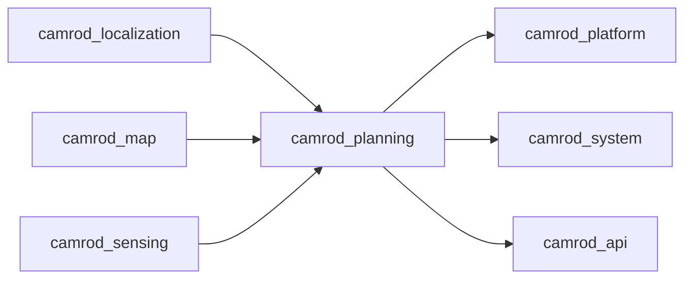

# camrod_planning

## Role
`camrod_planning` runs Nav2-based global/local planning, lanelet-aware goal/pose snapping, optional state machine logic, and cmd_vel gating.

## Package Diagram
```mermaid
graph TD
  A[/goal_pose] --> B[goal_snapper_node]
  B --> C[/planning/goal_pose_snapped_ros]
  C --> D[bt_navigator]
  D --> E[/planning/global_path]
  E --> F[local_path_extractor_node]
  F --> G[/planning/local_path]
  H[planning_cmd_vel_gate_node] <-- I[/planning/cmd_vel_raw]
  J[/planning/engage] --> H
  H --> K[/planning/cmd_vel]
```

## Node Data Flow
| Node | Main Inputs | Main Outputs |
|---|---|---|
| `goal_snapper_node` | `/goal_pose`, map/origin params | `/planning/goal_pose_snapped`, `/planning/goal_pose_snapped_ros` |
| `centerline_snapper_node` | `/localization/pose` | `/planning/lanelet_pose`, `/planning/lanelet_pose_ros` |
| `planner_server` (Nav2) | snapped goal + costmaps | `/planning/global_path` |
| `controller_server` (Nav2) | global path + pose/costmaps | `/planning/cmd_vel_raw`, `/planning/local_path_controller`, `/planning/local_path_dwb` |
| `local_path_extractor_node` | `/planning/global_path`, pose topic, controller local path | `/planning/local_path` |
| `path_tracking_error_node` | pose + local/global path | tracking error topic (default `/planning/ltracking_error`) |
| `planning_cmd_vel_gate_node.py` | `/planning/cmd_vel_raw`, `/planning/engage`, optional estop | `/planning/cmd_vel`, `/planning/engaged` |
| `planning_state_machine_node.py` (optional) | `/status_stream`, `/planning/lanelet_pose`, goal-key requests | `/planning/goal_pose`, `/planning/state_machine/state`, `/planning/state_machine/estop` |
| `goal_replanner_node` (optional) | nav action status + goal/path context | `/planning/global_path_replanner` |
| `nav2_lifecycle_startup_retry_node.py` (optional) | Nav2 lifecycle services, `/localization/initial_match_ok`, `/localization/pose_with_covariance` | lifecycle startup retries |
| `path_cost_grids.launch.py` helpers | `/planning/global_path`, `/planning/local_path`, `/planning/lanelet_pose` | `/planning/cost_grid/global_path`, `/planning/cost_grid/local_path`, marker topics |

## Inter-Package Connections


## Topic Summary
| Direction | Topic | Purpose |
|---|---|---|
| In | `/goal_pose` | external navigation goal |
| In | `/localization/pose` | current pose for snapping/local path |
| In | `/planning/state_machine/goal_key` | keypoint-based goal request (`camping_site_*`, `drop_zone`) |
| Out | `/planning/global_path` | global plan |
| Out | `/planning/local_path` | local driving path |
| Out | `/planning/cmd_vel_raw` | raw Nav2 controller velocity |
| Out | `/planning/cmd_vel` | gated velocity for platform |
| Out | `/planning/engaged` | planning gate state |

## Practical Usage
```bash
ros2 launch camrod_planning planning.launch.py
```

Common overrides:
```bash
ros2 launch camrod_planning planning.launch.py enable_state_machine:=true
ros2 launch camrod_planning planning.launch.py enable_goal_replanner:=true
ros2 launch camrod_planning planning.launch.py map_path:=/absolute/path/lanelet2_maps.osm
```

Keypoint goal request example:
```bash
ros2 topic pub /planning/state_machine/goal_key std_msgs/msg/String "{data: camping_site_3}" -1
```

## Config Files
- `config/nav2_base.yaml`
- `config/nav2_vehicle.yaml`
- `config/nav2_lanelet_overlay.yaml`
- `config/nav2_behavior.yaml`
- `config/goal_snapper.yaml`
- `config/centerline_snapper.yaml`
- `config/local_path_extractor.yaml`
- `config/path_cost_grids.yaml`
- `config/goal_replanner.yaml`
- `config/planning_state_machine.yaml`
- `config/camping_sites.yaml`
