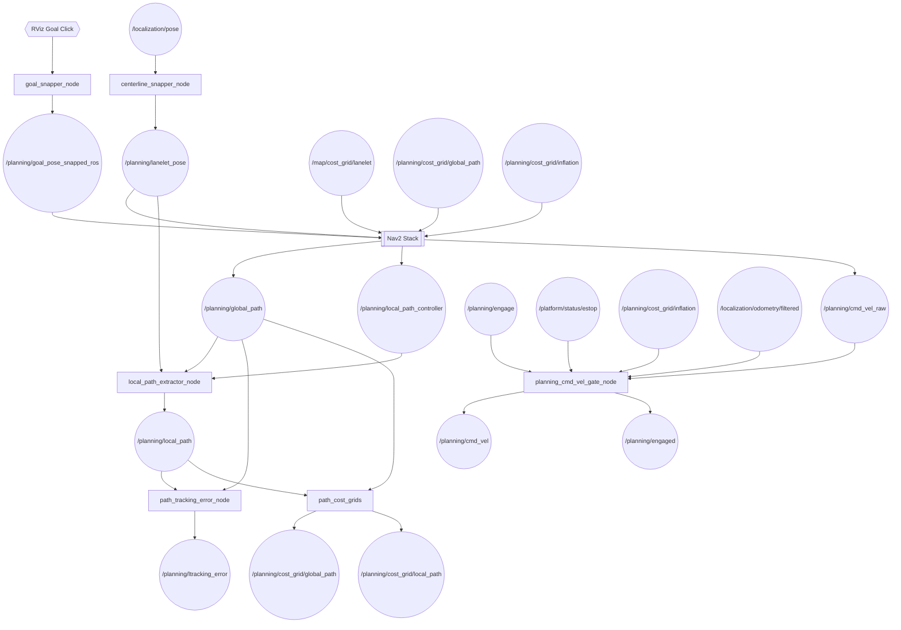
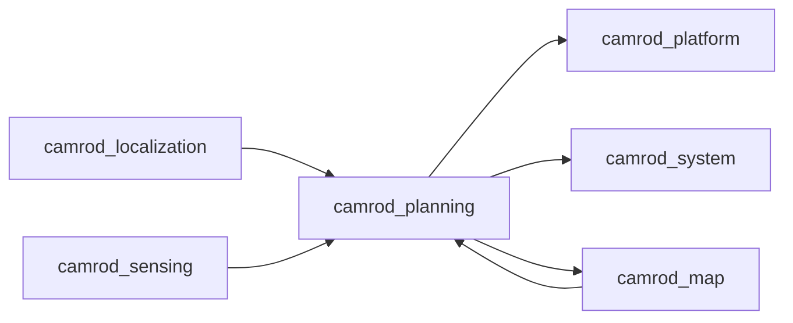

# camrod_planning

## Role
Nav2-based autonomous path planning and velocity control. Snaps RViz goals to Lanelet2 centerlines, runs the Nav2 planner/controller stack, extracts a robot-centered local path, and gates the final velocity command behind an explicit engage signal, e-stop, and cost-grid obstacle check. Optionally manages mission goals through a state machine using named keypoints.

## Package Diagram


Diagram legend: `[node]`, `((topic))`, `[[external stack]]`, `{{hardware}}`.

## Node Data Flow

| Node | Inputs | Outputs | Key Params |
|---|---|---|---|
| `goal_snapper_node` | `/goal_pose` (RViz), Lanelet2 map | `/planning/goal_pose_snapped_ros` | max_search_radius: 120 m, require_lanelet_containment, fallback_uncontained |
| `centerline_snapper_node` | `/localization/pose` | `/planning/lanelet_pose` | max_search_radius: 120 m, lateral_stddev: 0.3, min_update_period_s: 0.05 |
| `local_path_extractor_node` | `/planning/global_path`, `/planning/lanelet_pose`, `/planning/local_path_controller` | `/planning/local_path` | local_path_source: controller_then_slice, lookahead: 30 m, lookbehind: 3 m, publish_rate_hz: 15 |
| `path_tracking_error_node` | `/planning/local_path`, `/planning/global_path`, `/planning/lanelet_pose` | `/planning/ltracking_error` | prefer_local_path: true, publish_rate_hz: 15, pose_timeout_s: 1.0 |
| `goal_replanner_node` | `/planning/goal_pose`, `/planning/lanelet_pose`, Nav2 action | replanning triggers | min_request_interval_s, retry_after_failure_s, navigate_inactive_grace_s |
| `planning_cmd_vel_gate_node` | `/planning/cmd_vel_raw`, `/planning/engage`, `/platform/status/estop`, `/planning/cost_grid/inflation`, `/localization/odometry/filtered` | `/planning/cmd_vel`, `/planning/engaged` | see Cost-Stop table below |
| `planning_state_machine_node` | `/status_stream`, `/planning/lanelet_pose` | `/planning/goal_pose`, `/planning/state_machine/state` | keypoints_yaml, camping_sites_yaml, startup_goal_key |
| Nav2 `planner_server` | `/planning/goal_pose_snapped_ros`, costmaps | `/planning/global_path` | SmacPlanner |
| Nav2 `controller_server` | `/planning/global_path`, costmaps | `/planning/cmd_vel_raw`, `/planning/local_path_controller` | RegulatedPurePursuit |

### cmd_vel_gate Cost-Stop Zones

| Zone | Cost Threshold | Lookahead | Corridor Width |
|---|---|---|---|
| Front (speed-dependent) | 85 | v²/(2μg) + t_react·v + margin (min 0.4 m, max 3.0 m) | 1.0 m |
| Side | 85 | 1.2 m | 0.6 m |
| Rear | 85 | 0.8 m | 0.9 m |
| Unavoidable cluster | 90 (lethal) | — | ≥25 cells covering ≥25 % of corridor |

Front lookahead physics: μ = 0.4, t_react = 0.15 s, margin = 0.3 m.

### Nav2 Costmap Layers

| Layer | Source Topic | Costmap |
|---|---|---|
| `combined_cost_layer` | `/planning/cost_grid/inflation` | local |
| `combined_cost_layer` | `/map/cost_grid/lanelet` + `/planning/cost_grid/global_path` | global |

## Inter-Package Connections


## Topic Summary

### Inputs (from other packages)
| Topic | Type | Source |
|---|---|---|
| `/localization/pose` | PoseStamped | camrod_localization |
| `/localization/pose_with_covariance` | PoseWithCovarianceStamped | camrod_localization |
| `/localization/odometry/filtered` | Odometry | camrod_localization |
| `/map/cost_grid/lanelet` | OccupancyGrid | camrod_map |
| `/planning/cost_grid/inflation` | OccupancyGrid | camrod_sensing (inflation_cost_grid_node) |
| `/platform/status/estop` | Bool | camrod_platform (ranger driver) |

### Outputs (consumed by other packages)
| Topic | Type | Consumers |
|---|---|---|
| `/planning/cmd_vel` | Twist | camrod_platform |
| `/planning/cmd_vel_raw` | Twist | (internal — from Nav2 controller, gated by cmd_vel_gate) |
| `/planning/engaged` | Bool | camrod_system, camrod_platform |
| `/planning/global_path` | Path | camrod_map (lanelet_cost_grid), camrod_sensing (inflation_cost_grid_node) |
| `/planning/local_path` | Path | camrod_system (diagnostic), RViz |
| `/planning/cost_grid/global_path` | OccupancyGrid | camrod_map (lanelet_cost_grid), camrod_sensing (inflation_cost_grid_node), Nav2 |
| `/planning/cost_grid/local_path` | OccupancyGrid | Nav2 local costmap |
| `/planning/ltracking_error` | AvgTrackingError | camrod_system (diagnostic) |

## Launch

```bash
# Full planning stack (Nav2 + cmd_vel_gate + lanelet tools)
ros2 launch camrod_planning planning.launch.py \
  map_path:=/path/to/map.osm

# Enable mission state machine
ros2 launch camrod_planning planning.launch.py \
  enable_state_machine:=true

# Request a goal by keypoint name
ros2 topic pub /planning/state_machine/goal_key std_msgs/msg/String \
  "{data: camping_site_3}" -1

# Standalone cmd_vel gate only
ros2 launch camrod_planning cmd_vel_gate.launch.py
```

Key launch arguments:

| Argument | Default | Description |
|---|---|---|
| `map_path` | (from map_info.yaml) | Lanelet2 .osm file |
| `enable_path_cost_grids` | `true` | Global/local path cost grids |
| `enable_goal_replanner` | `false` | Automatic goal replanning |
| `enable_state_machine` | `false` | Mission state machine |
| `enable_tracking_error` | `true` | Path tracking error publisher |
| `enable_nav2_lifecycle_retry` | `false` | Nav2 lifecycle startup retry |
| `require_localization_ready` | `false` | Wait for initial_match_ok before Nav2 start |
| `cmd_vel_gate_enable` | `true` | Velocity gate node |
| `cmd_vel_gate_cost_stop_enable` | `true` | Cost-based obstacle stop |
| `cmd_vel_gate_speed_dependent_lookahead` | `true` | Physics-based braking distance |
| `local_path_source` | `controller_then_slice` | Local path: controller output or global slice |

## Config Files

| File | Purpose |
|---|---|
| `config/nav2_base.yaml` | Nav2 planner (SmacPlanner), controller (RegulatedPurePursuit), costmap base config |
| `config/nav2_vehicle.yaml` | Robot footprint, max velocity/acceleration, turning constraints |
| `config/nav2_lanelet_overlay.yaml` | Lanelet-specific cost weights and regulatory element handling |
| `config/nav2_behavior.yaml` | Recovery behaviors, BT timeouts, transform tolerance |
| `config/goal_snapper.yaml` | Goal snap search radius, containment check, Z handling |
| `config/centerline_snapper.yaml` | Pose projection covariance, update throttle period |
| `config/local_path_extractor.yaml` | Lookahead/lookbehind distances, jump guard (3 m), publish rate 15 Hz |
| `config/path_cost_grids.yaml` | Global/local path grid geometry, cost weights, rebuild triggers |
| `config/goal_replanner.yaml` | Replan intervals, timeout, failure retry backoff |
| `config/planning_state_machine.yaml` | State machine startup/warn goal keys, stale timeouts |
| `config/camping_sites.yaml` | Named goal positions (camping_site_*, drop_zone) |
