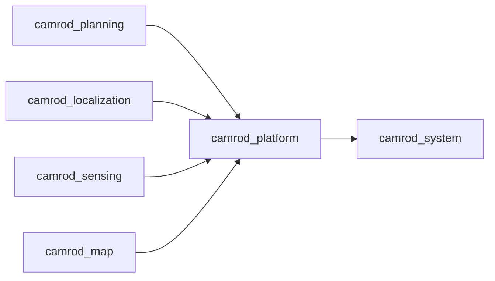

# camrod_platform

## Role
`camrod_platform` bridges planning velocity to platform command flow and publishes robot visualization overlays. It also includes `camrod_sensor_kit` launch for TF/URDF.

## Package Diagram
```mermaid
graph TD
  A[/planning/cmd_vel] --> B[cmd_vel_gate_node]
  C[/planning/engage] --> B
  D[/planning/state_machine/estop] --> B
  B --> E[/platform/cmd_vel]
  B --> F[/platform/drive_enabled]
  G[robot_visualization_node] --> H[/platform/robot/markers]
  G --> I[/platform/robot/planning_boundary]
  J[sensor_kit.launch include] --> K[/tf,/tf_static]
```

## Node Data Flow
| Node | Main Inputs | Main Outputs |
|---|---|---|
| `cmd_vel_gate_node.py` | `/planning/cmd_vel`, `/platform/drive_enable`, `/planning/engage`, optional `/planning/state_machine/estop` | `/platform/cmd_vel`, `/platform/drive_enabled` |
| `robot_visualization_node` | `/localization/pose`, `/sensing/gnss/pose`, optional `/map/markers`, `/localization/initialpose` | `/platform/robot/markers`, `/platform/robot/planning_boundary` |
| `sensor_kit.launch.py` (include) | robot params + frame args | `/tf`, `/tf_static` via `robot_state_publisher` |

## Inter-Package Connections


## Topic Summary
| Direction | Topic | Purpose |
|---|---|---|
| In | `/planning/cmd_vel` | planner velocity command |
| In | `/planning/engage` | engage trigger |
| In | `/planning/state_machine/estop` | emergency stop signal |
| Out | `/platform/cmd_vel` | final vehicle command |
| Out | `/platform/drive_enabled` | gate state |
| Out | `/platform/robot/markers` | RViz robot overlays |
| Out | `/platform/robot/planning_boundary` | planning boundary polygon |

## Practical Usage
```bash
ros2 launch camrod_platform platform.launch.py
```

Example overrides:
```bash
ros2 launch camrod_platform platform.launch.py cmd_vel_gate_enable:=true
ros2 launch camrod_platform platform.launch.py base_frame_id:=robot_base_link
```

## Config Files
- `config/robot_visualization.yaml`
- `config/vehicle_params.yaml`
- shared sensor-kit geometry: `camrod_sensor_kit/config/robot_params.yaml`
