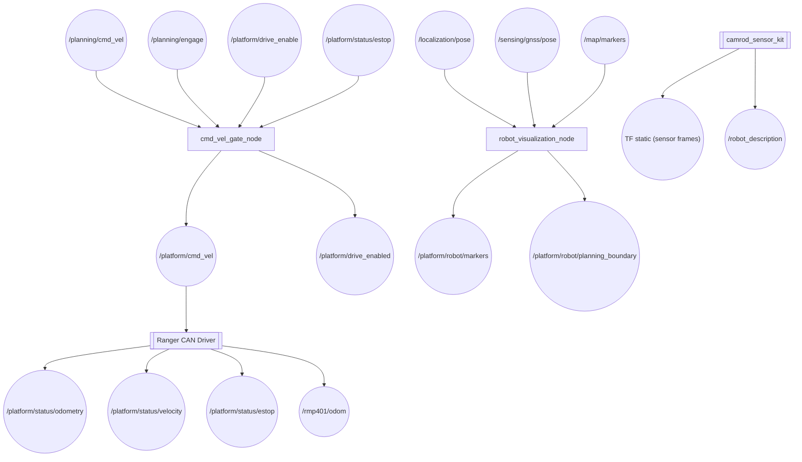
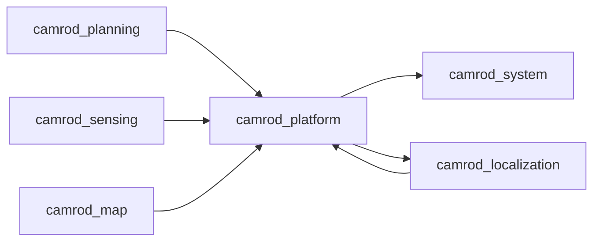

# camrod_platform

## Role
Bridges the planning velocity command to the hardware actuators and publishes robot-body visualization. The `cmd_vel_gate_node` gates `/planning/cmd_vel` behind a drive-enable / e-stop pair, producing the final `/platform/cmd_vel` sent to the Ranger CAN driver. `robot_visualization_node` renders the robot footprint, sensor poses, and planning boundary as RViz markers. The `sensor_kit_bridge` sub-launch publishes the static TF tree and URDF description from `camrod_sensor_kit`.

## Package Diagram


Diagram legend: `[node]`, `((topic))`, `[[external stack]]`.

## Node Data Flow

| Node | Inputs | Outputs | Key Params |
|---|---|---|---|
| `cmd_vel_gate_node` | `/planning/cmd_vel`, `/planning/engage`, `/platform/drive_enable`, `/platform/status/estop` | `/platform/cmd_vel`, `/platform/drive_enabled` | allow_on_start: false, publish_zero_when_blocked: true, use_estop_topic: true |
| `robot_visualization_node` | `/localization/pose`, `/sensing/gnss/pose`, `/map/markers` | `/platform/robot/markers`, `/platform/robot/planning_boundary` | publish_rate_hz: 20, localization_pose_timeout_s: 3.0, planning_boundary_margin: 0.3 m |
| Ranger driver (via `ranger_bringup`) | CAN bus (hardware) | `/rmp401/odom`, `/platform/status/{odometry,velocity,estop}` | port_name: can0, update_rate: 50 Hz |
| `sensor_kit_bridge` (from `camrod_sensor_kit`) | `robot_params.yaml` | TF static (all sensor frames), `/robot_description` | — |

### Gate Logic

```
effective_state = drive_enabled AND NOT estop

drive_enabled becomes True when:
  /platform/drive_enable publishes True  OR
  /planning/engage publishes True (when use_engage_topic=true)

estop becomes True when:
  /platform/status/estop publishes True (when use_estop_topic=true)

When blocked: publishes zero Twist on /platform/cmd_vel (publish_zero_when_blocked=true)
```

### Robot Visualization Markers

`robot_visualization_node` publishes a single MarkerArray containing:
- Robot body (CUBE sized from `robot_params.yaml`)
- Robot footprint outline at ground plane
- Planning boundary polygon (body + `planning_boundary_margin`)
- Sensor axes labels (IMU, GNSS, LiDAR, camera)
- Debug range rings (radii configurable, default: 2, 4, 6, 8 m)
- World and map origin axes

## Inter-Package Connections


## Topic Summary

### Inputs (from other packages)
| Topic | Type | Source |
|---|---|---|
| `/planning/cmd_vel` | Twist | camrod_planning |
| `/planning/engage` | Bool | camrod_planning |
| `/localization/pose` | PoseStamped | camrod_localization |
| `/sensing/gnss/pose` | PoseStamped | camrod_sensing |
| `/map/markers` | MarkerArray | camrod_map |

### Outputs (consumed by other packages)
| Topic | Type | Consumers |
|---|---|---|
| `/platform/cmd_vel` | Twist | Ranger CAN driver (hardware) |
| `/platform/drive_enabled` | Bool | camrod_system (diagnostic) |
| `/platform/robot/markers` | MarkerArray | RViz |
| `/platform/robot/planning_boundary` | PolygonStamped | RViz, camrod_planning (collision reference) |
| `/platform/status/odometry` | Odometry | camrod_localization (primary wheel source) |
| `/platform/status/velocity` | TwistStamped | camrod_sensing (platform_velocity_converter) |
| `/platform/status/estop` | Bool | camrod_planning (cmd_vel_gate), camrod_localization |
| `/rmp401/odom` | Odometry | camrod_localization (wheel fallback) |
| TF static (sensor frames) | TransformStamped | all packages |

## Launch

```bash
# Full platform stack (gate + visualization + ranger + sensor_kit)
ros2 launch camrod_platform platform.launch.py

# Without Ranger CAN driver (sim or no hardware)
ros2 launch camrod_platform platform.launch.py \
  ranger_driver_enable:=false

# Disable cmd_vel gate (direct pass-through)
ros2 launch camrod_platform platform.launch.py \
  cmd_vel_gate_enable:=false
```

Key launch arguments:

| Argument | Default | Description |
|---|---|---|
| `cmd_vel_gate_enable` | `true` | Enable velocity gate node |
| `cmd_vel_in_topic` | `/planning/cmd_vel` | Gate input topic |
| `cmd_vel_out_topic` | `/platform/cmd_vel` | Gate output topic |
| `use_planning_engage_topic` | `true` | Mirror /planning/engage to drive enable |
| `use_estop_topic` | `true` | Subscribe to e-stop topic |
| `estop_topic` | `/platform/status/estop` | E-stop source topic |
| `drive_allow_on_start` | `false` | Arm gate at startup without explicit enable |
| `ranger_driver_enable` | `true` | Launch Ranger CAN driver |
| `ranger_params_file` | `config/ranger_params.yaml` | Ranger driver parameters |
| `params_file` | `camrod_sensor_kit/config/robot_params.yaml` | Robot geometry parameters |

## Config Files

| File | Purpose |
|---|---|
| `config/robot_visualization.yaml` | Visualization node parameters: pose topics, timeout, heading offset, boundary margin, range rings, publish rate |
| `config/ranger_params.yaml` | Ranger CAN driver: port (can0), frame IDs, status topic names, update rate 50 Hz, e-stop behavior |
| `config/vehicle_params.yaml` | Vehicle kinematics reference: wheelbase, track width, tire radius, max velocity/acceleration |
