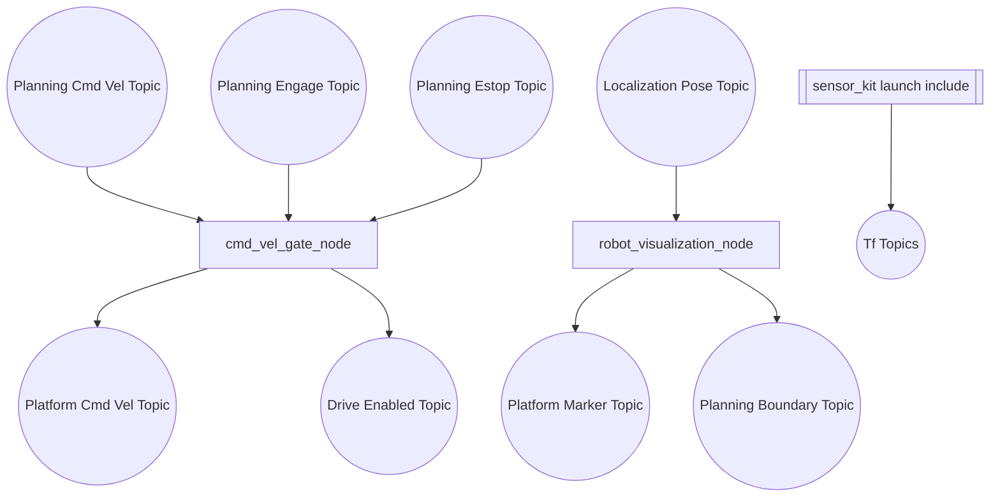
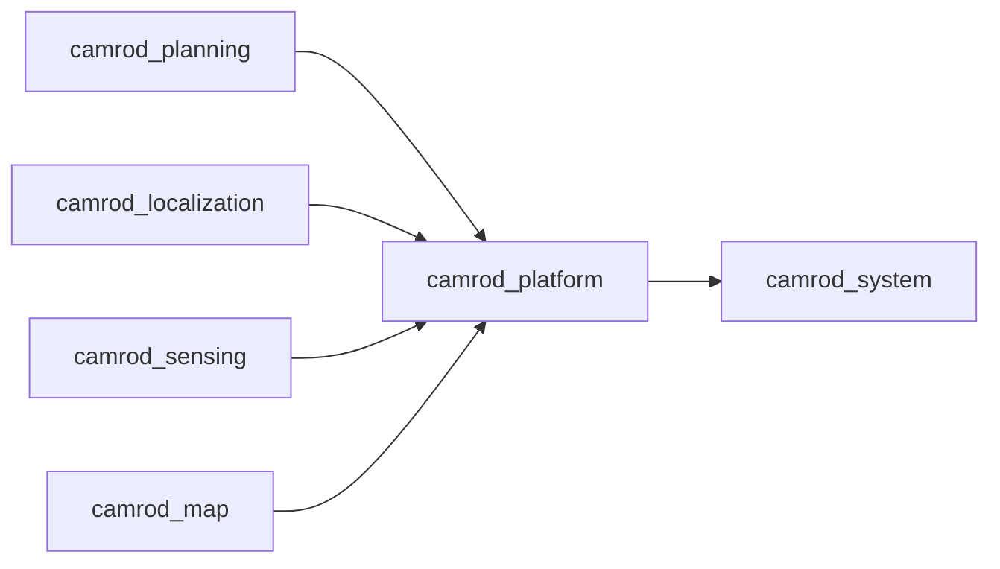

# camrod_platform

## Role
`camrod_platform` bridges planning velocity to platform command flow and publishes robot visualization overlays. It also includes `camrod_sensor_kit` launch for TF/URDF.

## Package Diagram


Diagram legend: `[node/process]`, `((topic stream))`, `[(config or interface)]`, `[[external package or launch]]`.

## Node Data Flow
| Node | Main Inputs | Main Outputs |
|---|---|---|
| `cmd_vel_gate_node.py` | `/planning/cmd_vel`, `/platform/drive_enable`, `/planning/engage`, optional `/planning/state_machine/estop` | `/platform/cmd_vel`, `/platform/drive_enabled` |
| `robot_visualization_node` | `/localization/pose`, `/sensing/gnss/pose`, optional `/map/markers`, `/localization/initialpose` | `/platform/robot/markers`, `/platform/robot/planning_boundary` |
| `sensor_kit.launch.py` (include) | robot params + frame args | `/tf`, `/tf_static` via `robot_state_publisher` |

## Inter-Package Connections


## Topic Summary
### Input Topics
| Input Topic | Purpose |
|---|---|
| `/planning/cmd_vel` | Planner velocity command |
| `/planning/engage` | Engage trigger |
| `/planning/state_machine/estop` | Emergency stop signal |

### Output Topics
| Output Topic | Purpose |
|---|---|
| `/platform/cmd_vel` | Final vehicle command |
| `/platform/drive_enabled` | Gate state |
| `/platform/robot/markers` | RViz robot overlays |
| `/platform/robot/planning_boundary` | Planning boundary polygon |

## Practical Usage
```bash
ros2 launch camrod_platform platform.launch.py
```

Example overrides:
```bash
ros2 launch camrod_platform platform.launch.py cmd_vel_gate_enable:=true
ros2 launch camrod_platform platform.launch.py base_frame_id:=robot_base_link
```

## Config Files
- `config/robot_visualization.yaml`
- `config/vehicle_params.yaml`
- shared sensor-kit geometry: `camrod_sensor_kit/config/robot_params.yaml`
