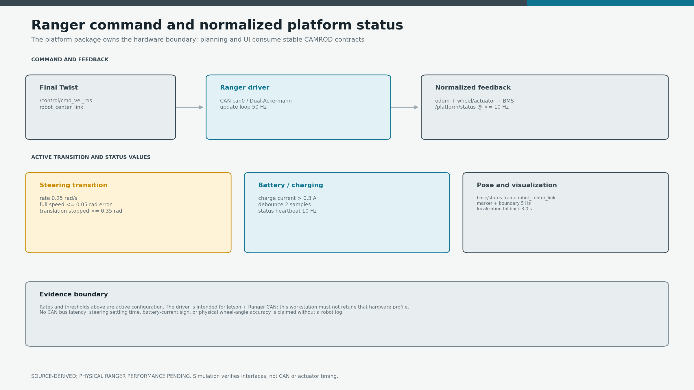
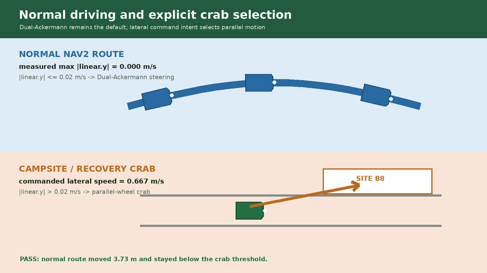
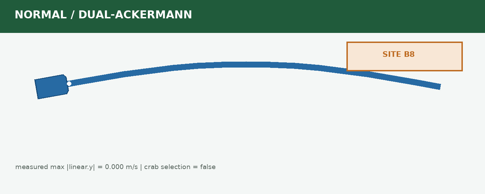

# camrod_platform

<!-- HH_260804 - Summarize the Jetson/Ranger hardware boundary, active
transition values, normalized status, and evidence limit in one page. -->
<!-- HH_260806 - Publish the fabrication-inclusive body and synchronized
planning boundary carried by the platform topic. -->
<!-- HH_260809 - Replace the displayed rectangular outlines with the shared
tapered-front, six-corner rounded body and planning contours. -->
<!-- HH_260818 - Document the deployed stationary longitudinal/parallel
steering transition used by exact campsite crab entry and exit. -->
<!-- HH_260818 - Keep normal Dual-Ackermann commands out of parallel mode with
an explicit lateral deadband and publish reproducible mode-selection evidence. -->

Ranger CAN command/feedback bridge, BMS charging interpretation, robot
visualization, planning-boundary publication, and light control.



## Actual Simulation Runtime

| Robot geometry in RViz | Normalized `/platform/status` |
|---|---|
|  |  |

`SIM RUNTIME CAPTURE`: the live marker/boundary frame and simulated raw
Ranger/BMS bridge output. CAN latency and real steering response remain field
measurements. This 2026-08-04 capture predates the tapered-front contour; current
RViz markers are generated from the sensor-kit boundary contract below.

## At A Glance

| Uses | Function | Main outputs |
|---|---|---|
| Ranger CAN driver | Converts final ROS Twist to platform motion | Ranger actuator commands and odometry |
| CAN/BMS frames | Normalizes vehicle, actuator, wheel, error, battery, and charging state | `/platform/status` and status subtopics |
| Localization + sensor-kit geometry | Publishes map markers and a robot-center-local planning polygon | `/platform/robot/markers`, `/platform/robot/planning_boundary` |

## Active Values

| Item | Value | Meaning |
|---|---:|---|
| Driver update loop | `50 Hz` | Configured Ranger loop rate |
| Platform status heartbeat | `10 Hz` | Maximum steady normalized status rate |
| Base/status frame | `robot_center_link` | Axle-midpoint platform reference |
| Steering transition rate | bringup `1.5 rad/s`; package bench `1.0 rad/s` | Deployed 0 to 90 degree command takes about `1.05 s`; package value remains an intentional A/B profile |
| Full translation | steering error `<= 0.05 rad` | Wheels nearly aligned |
| Ordinary Ackermann floor | `20%` in bringup | Retained for path tracking only; transition envelope uses stop error `0.70 rad` |
| Longitudinal <-> parallel transition | stationary until command error `<=0.05 rad` | Overrides the Ackermann floor so crab does not begin or end diagonally |
| Parallel-motion selector | `|linear.y| > 0.02 m/s` | Tiny Nav2 lateral residue stays Dual-Ackermann; explicit campsite/recovery lateral commands select crab |
| Zero-turn handoff | re-seed from CAN steering feedback | Prevents the following crab/straight command from inheriting a stale pre-turn wheel angle |
| Wheel linear/angular sigma | `0.05 m/s`, `0.10 rad/s` | Non-zero odometry covariance |
| Charging threshold | `> 0.3 A`, at least 2 distinct `0x361` frames, max `1.0 s` inter-frame gap | Cached 50 Hz driver reads and sparse/dropout-separated frames are not continuous charging evidence |
| Charging confirmation | global `10 s`; AprilTag terminal docking `1.5 s`; release `3 s` | The fast path requires a fresh healthy `FINAL_YAW_ALIGNMENT` or `WAITING_FOR_CHARGING` heartbeat; ordinary driving keeps the regenerative-current guard |
| Odom fallback timeout | `1.0 s` | Switches to configured substitute source |
| Robot marker/boundary rate | `5 Hz` | RViz/diagnostic publication |
| Physical body | `1.39160 x 1.07000 m` bounding extents | `0.12 m` tapered front and `R0.05 m` corners; fabrication-inclusive ordinary-stop/swept-recovery envelope |
| Published planning boundary | `1.59160 x 1.27000 m`, `robot_center_link` | Exact `0.10 m` contour offset with `R0.15 m` corners; TF aligns RViz without changing collision geometry |


<!-- HH_260810 - Replace the historical rectangular mental model with the
current source-derived marker/polygon contour. -->
The [visual record](../docs/assets/module-guides/sensor-kit/test-results/tapered-rounded-boundary-20260810/README.md)
shows the contour now generated for RViz and `/platform/robot/planning_boundary`.
Its GIF explains TF motion only; it does not measure Ranger steering response.





The [mode-selection record](../docs/assets/module-guides/platform/test-results/normal-crab-selection-20260819/README.md)
is generated from the deployed Ranger YAML. Unit tests cover values below,
at, and above the deadband. Physical wheel-angle settling and CAN timing remain
field acceptance.


<!-- HH_260810 - Link platform visualization to recorded ROS poses without
claiming that workstation simulation measures Ranger actuator response. -->
The [measured ROS simulation](../docs/assets/module-guides/control/test-results/tapered-rounded-boundary-road-sim-20260810/README.md)
replays the exact published 30-point contours through drive, hold, bounded
reverse-yaw, release, and completion. CAN/steering response remains field-pending.

## Command And Feedback

```text
/control/cmd_vel_ros -> ranger_base / CAN
CAN odometry + actuator + wheel + each fresh BMS 0x361 frame
  -> ranger_platform_bridge
  -> /platform/status
  -> localization, control, diagnostics, UI, voice
```

Ranger BMS current is the signed big-endian value in `0x361` data bytes 4-5
(zero-based), scaled by `0.1 A`. The bridge keeps the global 10-second rising
filter because braking regeneration has remained positive for several seconds.
Only the selected AprilTag controller's timestamped 2 Hz terminal-phase status
arms the 1.5-second path; stale, wrong-module, wrong-phase, or error status
immediately falls back to the global policy. A confirmed edge is published from
the BMS callback so the controller's charging preemption can stop remaining yaw
motion without waiting for another platform frame.

On 2026-08-19, a read-only 15-second `can0` sample contained 62 `0x361`
frames: mean interval `0.243 s`, minimum `0.200 s`, and maximum `0.401 s`.
`charging_sample_max_gap_s=1.0` therefore leaves more than twice the observed
worst-case interval while resetting global-confirm, docking-fast-confirm, and
release candidates whenever BMS evidence is interrupted longer than that.

| Status content | Source |
|---|---|
| Vehicle/control/error state | Ranger CAN state frames |
| Motion mode and wheel angle/speed | Actuator and wheel CAN frames |
| Battery voltage, SOC, current, charging | BMS frame `/battery_state` |
| Estop/drive readiness | Driver and bridge policy |

Only `ranger_platform_bridge` publishes normalized `/platform/status` in both
hardware and ordinary simulation. Simulation emulates raw Ranger/BMS boundaries
instead of adding a competing status writer.

## Runtime Nodes

| Node | Responsibility |
|---|---|
| `ranger_base` | Physical CAN transport and motion command |
| `ranger_platform_bridge` | Generated status, charging, odometry, and fallback normalization |
| `robot_visualization` | Map-frame markers and robot-center-local planning boundary |
| `light_controller` | Platform indicator/light command handling |

## Run And Validate

```bash
ros2 launch camrod_platform platform.launch.py

ros2 topic echo /platform/status
ros2 topic hz /platform/status
ros2 topic echo --once /platform/robot/planning_boundary
ros2 run tf2_ros tf2_echo odom robot_center_link
```

| Config | Purpose |
|---|---|
| `config/ranger_driver.yaml` | CAN, steering transition, BMS, status, odometry, and estop policy |
| `config/robot_visualization.yaml` | Pose source, marker, and planning-boundary publication |
| `config/lights.yaml` | Indicator MCU behavior |
| `config/vehicle_params.yaml` | Legacy/general vehicle model parameters; not the measured sensor-kit body source |

The [runtime parameter reference](../docs/RUNTIME_PARAMETER_REFERENCE.md)
lists steering-mode thresholds, speed ownership, BMS timing, launch precedence,
and the bringup mirrors that must remain synchronized.

These are configured values. CAN latency, steering settling, battery-current
sign, and actuator accuracy require logs from the Jetson/Ranger and are not
measured on this workstation. The boundary topic is synchronized and passed
fresh AMD64 policy tests, but the reduced physical dimensions must be measured
around wheels, sensors, brackets, cables, and payload before field acceptance.
