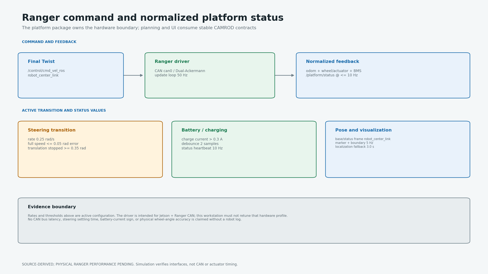
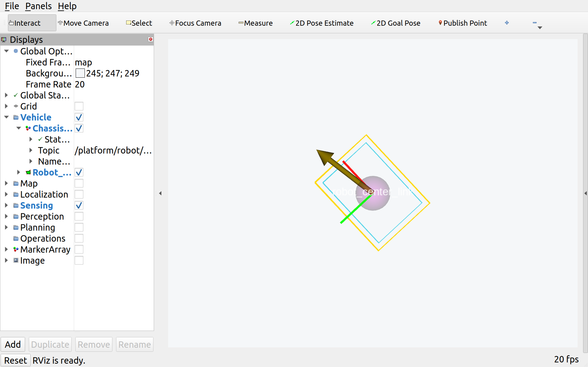
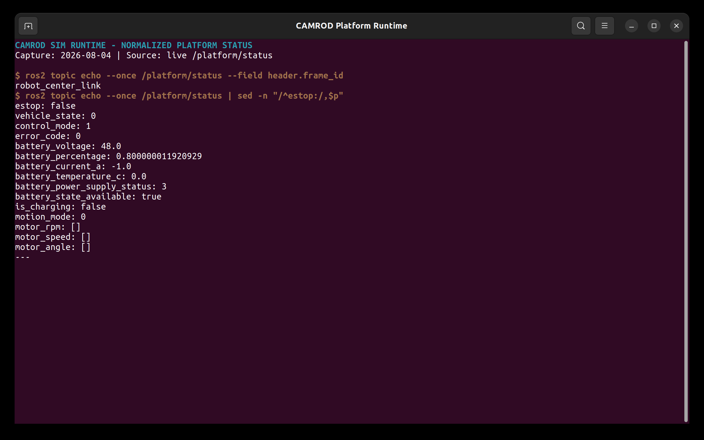

# camrod_platform

<!-- HH_260804 - Summarize the Jetson/Ranger hardware boundary, active
transition values, normalized status, and evidence limit in one page. -->

Ranger CAN command/feedback bridge, BMS charging interpretation, robot
visualization, planning-boundary publication, and light control.



## Actual Simulation Runtime

| Robot geometry in RViz | Normalized `/platform/status` |
|---|---|
|  |  |

`SIM RUNTIME CAPTURE`: the live marker/boundary frame and simulated raw
Ranger/BMS bridge output. CAN latency and real steering response remain field
measurements.

## At A Glance

| Uses | Function | Main outputs |
|---|---|---|
| Ranger CAN driver | Converts final ROS Twist to platform motion | Ranger actuator commands and odometry |
| CAN/BMS frames | Normalizes vehicle, actuator, wheel, error, battery, and charging state | `/platform/status` and status subtopics |
| Localization + sensor-kit geometry | Publishes robot markers and complete planning polygon | `/platform/robot/markers`, `/platform/robot/planning_boundary` |

## Active Values

| Item | Value | Meaning |
|---|---:|---|
| Driver update loop | `50 Hz` | Configured Ranger loop rate |
| Platform status heartbeat | `10 Hz` | Maximum steady normalized status rate |
| Base/status frame | `robot_center_link` | Axle-midpoint platform reference |
| Steering transition rate | `0.25 rad/s` | About `6.3 s` for 0 to 90 degrees |
| Full translation | steering error `<= 0.05 rad` | Wheels nearly aligned |
| Translation stop | steering error `>= 0.35 rad` | Prevents motion on stale wheel direction |
| Wheel linear/angular sigma | `0.05 m/s`, `0.10 rad/s` | Non-zero odometry covariance |
| Charging threshold | `> 0.3 A`, 2 samples | Debounced positive-current charging rule |
| Odom fallback timeout | `1.0 s` | Switches to configured substitute source |
| Robot marker/boundary rate | `5 Hz` | RViz/diagnostic publication |

## Command And Feedback

```text
/control/cmd_vel_ros -> ranger_base / CAN
CAN odometry + actuator + wheel + BMS
  -> ranger_platform_bridge
  -> /platform/status
  -> localization, control, diagnostics, UI, voice
```

| Status content | Source |
|---|---|
| Vehicle/control/error state | Ranger CAN state frames |
| Motion mode and wheel angle/speed | Actuator and wheel CAN frames |
| Battery voltage, SOC, current, charging | BMS frame `/battery_state` |
| Estop/drive readiness | Driver and bridge policy |

Only `ranger_platform_bridge` publishes normalized `/platform/status` in both
hardware and ordinary simulation. Simulation emulates raw Ranger/BMS boundaries
instead of adding a competing status writer.

## Runtime Nodes

| Node | Responsibility |
|---|---|
| `ranger_base` | Physical CAN transport and motion command |
| `ranger_platform_bridge` | Generated status, charging, odometry, and fallback normalization |
| `robot_visualization` | Map-frame markers and complete planning boundary |
| `light_controller` | Platform indicator/light command handling |

## Run And Validate

```bash
ros2 launch camrod_platform platform.launch.py

ros2 topic echo /platform/status
ros2 topic hz /platform/status
ros2 topic echo --once /platform/robot/planning_boundary
ros2 run tf2_ros tf2_echo odom robot_center_link
```

| Config | Purpose |
|---|---|
| `config/ranger_driver.yaml` | CAN, steering transition, BMS, status, odometry, and estop policy |
| `config/robot_visualization.yaml` | Pose source, marker, and planning-boundary publication |
| `config/lights.yaml` | Indicator MCU behavior |
| `config/vehicle_params.yaml` | Legacy/general vehicle model parameters; not the measured sensor-kit body source |

These are configured values. CAN latency, steering settling, battery-current
sign, and actuator accuracy require logs from the Jetson/Ranger and are not
measured on this workstation.
